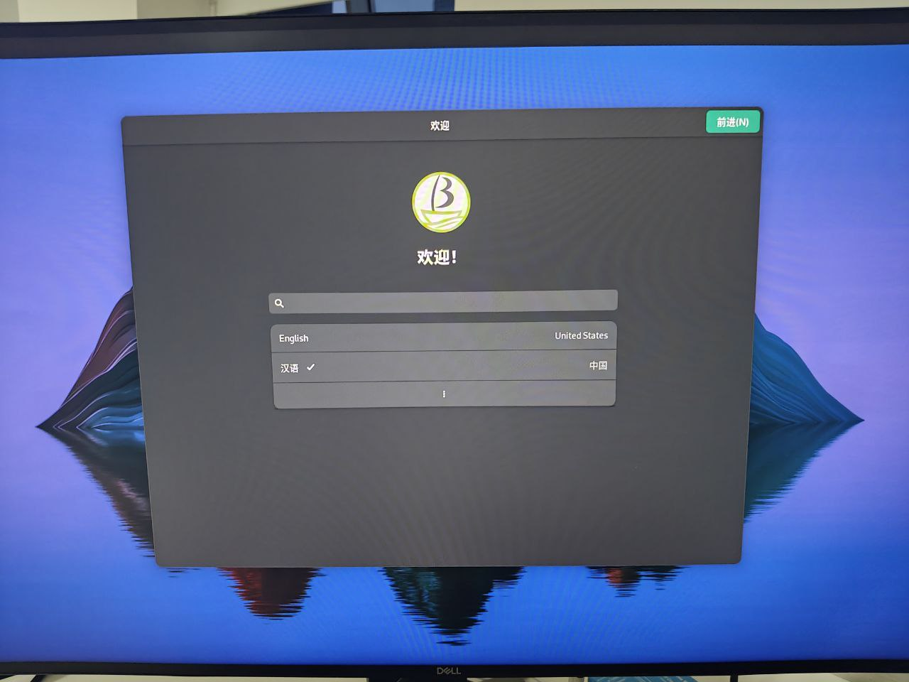
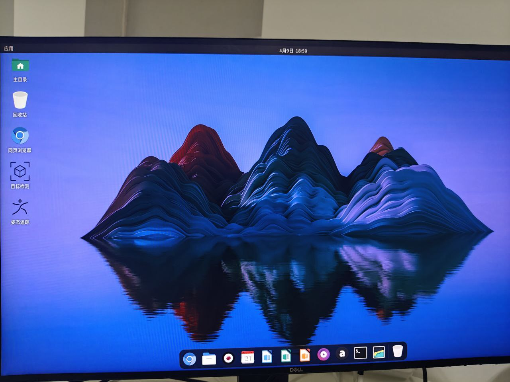

# Bianbu Banana Pi BPI-F3 Test Report

## Test Environment

### System Information

- System version: v2.1.1-desktop
- Download Links: https://archive.spacemit.com/image/k1/version/bianbu/v2.1.1/
- Reference Installation Document: https://docs.banana-pi.org/en/BPI-F3/GettingStarted_BPI-F3

### Hardware Information

- Banana Pi BPI-F3
- Power Adapter
- A microSD Card (If flash to SD card)
- A USB to UART Debugger

## Installation Steps

### Flashing the Image (SD Card)

**Please make sure to choose the file ending with `.img.zip`**
After downloading and extracting the image, use `dd` to flash the image to the microSD card.

```bash
unzip bianbu-24.04-desktop-k1-v2.1.1-release-20250305144026.img.zip
sudo dd if=/path/to/bianbu-24.04-desktop-k1-v2.1.1-release-20250305144026.img of=/dev/your-device bs=1M status=progress
```

### Flashing the Image (eMMC)

**Please make sure to choose the file ending without `img`**
After downloading and extracting the image, use `fastboot` to flash the image to the eMMC.

```bash
unzip bianbu-24.04-desktop-k1-v2.1.1-release-20250305144026.zip
```

Hold the left two butten while power on/RST, to enter the fastboot mode. You shall see the dfu-device in your system:
```log
❯ sudo fastboot devices
dfu-device       DFU download
```

```bash
sudo fastboot stage factory/FSBL.bin
sudo fastboot continue
# Wait for 1 sec
sudo fastboot stage u-boot.itb
sudo fastboot continue
# Wait for 1 sec
sudo fastboot flash gpt partition_universal.json
sudo fastboot flash bootinfo factory/bootinfo_sd.bin
sudo fastboot flash fsbl factory/FSBL.bin
sudo fastboot flash env env.bin
sudo fastboot flash opensbi fw_dynamic.itb
sudo fastboot flash uboot u-boot.itb
sudo fastboot flash bootfs bootfs.ext4
sudo fastboot flash rootfs rootfs.ext4
```


### Logging into the System

Via HDMI, you shall see a installation wizard, follow the steps to finish the installation.



Logging into the system via the serial port.

Default Username: `root`
Default Password: `bianbu`

## Expected Results

The system should boot normally and allow login via the onboard serial port.

## Actual Results

The system booted successfully and login via the onboard serial port was also successful.

### Boot Log



Screen recording (from flashing image to login):
[](https://asciinema.org/a/DccEGnEWhMhgK5Mn40goFFk2m)

```log
Welcome to Bianbu 2.1.1 (GNU/Linux 6.6.63 riscv64)

 * Documentation:  https://bianbu.spacemit.com
 * Support:        https://ticket.spacemit.com

0 updates can be applied immediately.


The list of available updates is more than a week old.
To check for new updates run: sudo apt update

The programs included with the Bianbu system are free software;
the exact distribution terms for each program are described in the
individual files in /usr/share/doc/*/copyright.

Bianbu comes with ABSOLUTELY NO WARRANTY, to the extent permitted by
applicable law.

root@k1:~# uname -a
Linux k1 6.6.63 #2.1.0.2 SMP PREEMPT Fri Jan 24 03:39:48 UTC 2025 riscv64 riscv64 riscv64 GNU/Linux
root@k1:~# cat /etc/os-release 
PRETTY_NAME="Bianbu 2.1.1"
NAME="Bianbu"
VERSION_ID="2.1.1"
VERSION="2.1.1 (Noble Numbat)"
VERSION_CODENAME=noble
ID=bianbu
ID_LIKE=debian
HOME_URL="https://bianbu.spacemit.com"
SUPPORT_URL="https://bianbu.spacemit.com"
BUG_REPORT_URL="https://ticket.spacemit.com"
PRIVACY_POLICY_URL="https://www.spacemit.com/privacy-policy"
UBUNTU_CODENAME=noble
LOGO=ubuntu-logo
root@k1:~# cat /proc/cpuinfo 
processor       : 0
hart            : 0
model name      : Spacemit(R) X60
isa             : rv64imafdcv_zicbom_zicboz_zicntr_zicond_zicsr_zifencei_zihintpause_zihpm_zfh_zfhmin_zca_zcd_zba_zbb_zbc_zbs_zkt_zve32f_zve32x_zve64d_zve64f_zve64x_zvfh_zvfhmin_zvkt_sscofpmf_sstc_svinval_svnapot_svpbmt
mmu             : sv39
uarch           : spacemit,x60
mvendorid       : 0x710
marchid         : 0x8000000058000001
mimpid          : 0x1000000049772200

processor       : 1
hart            : 1
model name      : Spacemit(R) X60
isa             : rv64imafdcv_zicbom_zicboz_zicntr_zicond_zicsr_zifencei_zihintpause_zihpm_zfh_zfhmin_zca_zcd_zba_zbb_zbc_zbs_zkt_zve32f_zve32x_zve64d_zve64f_zve64x_zvfh_zvfhmin_zvkt_sscofpmf_sstc_svinval_svnapot_svpbmt
mmu             : sv39
uarch           : spacemit,x60
mvendorid       : 0x710
marchid         : 0x8000000058000001
mimpid          : 0x1000000049772200

processor       : 2
hart            : 2
model name      : Spacemit(R) X60
isa             : rv64imafdcv_zicbom_zicboz_zicntr_zicond_zicsr_zifencei_zihintpause_zihpm_zfh_zfhmin_zca_zcd_zba_zbb_zbc_zbs_zkt_zve32f_zve32x_zve64d_zve64f_zve64x_zvfh_zvfhmin_zvkt_sscofpmf_sstc_svinval_svnapot_svpbmt
mmu             : sv39
uarch           : spacemit,x60
mvendorid       : 0x710
marchid         : 0x8000000058000001
mimpid          : 0x1000000049772200

processor       : 3
hart            : 3
model name      : Spacemit(R) X60
isa             : rv64imafdcv_zicbom_zicboz_zicntr_zicond_zicsr_zifencei_zihintpause_zihpm_zfh_zfhmin_zca_zcd_zba_zbb_zbc_zbs_zkt_zve32f_zve32x_zve64d_zve64f_zve64x_zvfh_zvfhmin_zvkt_sscofpmf_sstc_svinval_svnapot_svpbmt
mmu             : sv39
uarch           : spacemit,x60
mvendorid       : 0x710
marchid         : 0x8000000058000001
mimpid          : 0x1000000049772200

processor       : 4
hart            : 4
model name      : Spacemit(R) X60
isa             : rv64imafdcv_zicbom_zicboz_zicntr_zicond_zicsr_zifencei_zihintpause_zihpm_zfh_zfhmin_zca_zcd_zba_zbb_zbc_zbs_zkt_zve32f_zve32x_zve64d_zve64f_zve64x_zvfh_zvfhmin_zvkt_sscofpmf_sstc_svinval_svnapot_svpbmt
mmu             : sv39
uarch           : spacemit,x60
mvendorid       : 0x710
marchid         : 0x8000000058000001
mimpid          : 0x1000000049772200

processor       : 5
hart            : 5
model name      : Spacemit(R) X60
isa             : rv64imafdcv_zicbom_zicboz_zicntr_zicond_zicsr_zifencei_zihintpause_zihpm_zfh_zfhmin_zca_zcd_zba_zbb_zbc_zbs_zkt_zve32f_zve32x_zve64d_zve64f_zve64x_zvfh_zvfhmin_zvkt_sscofpmf_sstc_svinval_svnapot_svpbmt
mmu             : sv39
uarch           : spacemit,x60
mvendorid       : 0x710
marchid         : 0x8000000058000001
mimpid          : 0x1000000049772200

processor       : 6
hart            : 6
model name      : Spacemit(R) X60
isa             : rv64imafdcv_zicbom_zicboz_zicntr_zicond_zicsr_zifencei_zihintpause_zihpm_zfh_zfhmin_zca_zcd_zba_zbb_zbc_zbs_zkt_zve32f_zve32x_zve64d_zve64f_zve64x_zvfh_zvfhmin_zvkt_sscofpmf_sstc_svinval_svnapot_svpbmt
mmu             : sv39
uarch           : spacemit,x60
mvendorid       : 0x710
marchid         : 0x8000000058000001
mimpid          : 0x1000000049772200

processor       : 7
hart            : 7
model name      : Spacemit(R) X60
isa             : rv64imafdcv_zicbom_zicboz_zicntr_zicond_zicsr_zifencei_zihintpause_zihpm_zfh_zfhmin_zca_zcd_zba_zbb_zbc_zbs_zkt_zve32f_zve32x_zve64d_zve64f_zve64x_zvfh_zvfhmin_zvkt_sscofpmf_sstc_svinval_svnapot_svpbmt
mmu             : sv39
uarch           : spacemit,x60
mvendorid       : 0x710
marchid         : 0x8000000058000001
mimpid          : 0x1000000049772200

```

## Test Criteria

Successful: The actual result matches the expected result.

Failed: The actual result does not match the expected result.

## Test Conclusion

Test successful.
