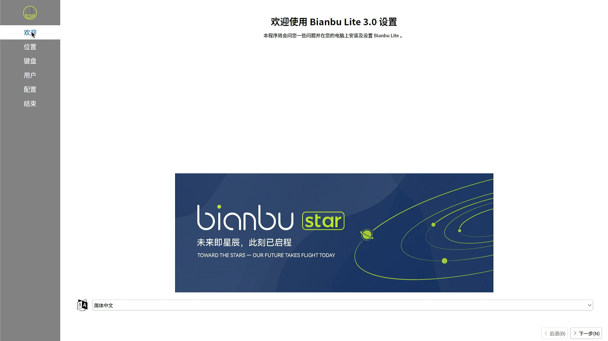

# Bianbu Banana Pi BPI-F3 Test Report

## Test Environment

### System Information

- System version: v3.0.1 Desktop
- Download Links: https://archive.spacemit.com/image/k1/version/bianbu/v3.0.1/
- Reference Installation Document: https://docs.banana-pi.org/en/BPI-F3/GettingStarted_BPI-F3

### Hardware Information

- Banana Pi BPI-F3
- Power Adapter
- A microSD Card (If flash to SD card)
- A USB to UART Debugger

## Installation Steps

### Flashing the Image (SD Card)

**Please make sure to choose the file ending with `.img.zip`**
After downloading and extracting the image, use `dd` to flash the image to the microSD card.

```bash
unzip bianbu-25.04-desktop-lite-k1-v3.0.1-release-20250815184229.img.zip
sudo dd if=/path/to/bianbu-25.04-desktop-lite-k1-v3.0.1-release-20250815184229.img of=/dev/your-device bs=1M status=progress
```

### Flashing the Image (eMMC)

**Please make sure to choose the file ending without `img`**
After downloading and extracting the image, use `fastboot` to flash the image to the eMMC.

```bash
unzip bianbu-25.04-desktop-lite-k1-v3.0.1-release-20250815184229.zip
```

Hold the left two butten while power on/RST, to enter the fastboot mode. You shall see the dfu-device in your system:
```log
❯ sudo fastboot devices
dfu-device       DFU download
```

```bash
sudo fastboot stage factory/FSBL.bin
sudo fastboot continue
# Wait for 1 sec
sudo fastboot stage u-boot.itb
sudo fastboot continue
# Wait for 1 sec
sudo fastboot flash gpt partition_universal.json
sudo fastboot flash bootinfo factory/bootinfo_sd.bin
sudo fastboot flash fsbl factory/FSBL.bin
sudo fastboot flash env env.bin
sudo fastboot flash opensbi fw_dynamic.itb
sudo fastboot flash uboot u-boot.itb
sudo fastboot flash bootfs bootfs.ext4
sudo fastboot flash rootfs rootfs.ext4
```

### Logging into the System

Logging into the system via the serial port or desktop environment. No non-root user by default. First boot desktop environment includes a setup wizard that requires setting a username and password. SSH is not enabled by default.

Default Username: `root`
Default Password: `bianbu`

## Actual Results

### Boot Log

[](https://asciinema.org/a/WLCatSP8kXYME7fxW2BblZfZ2)

### Desktop Environment




## Test Conclusion

The system booted successfully and login via the onboard serial port was also successful.
