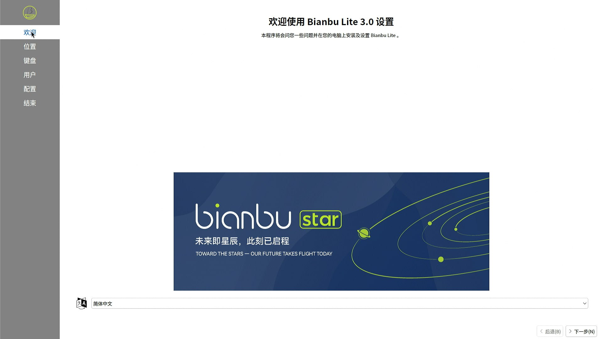
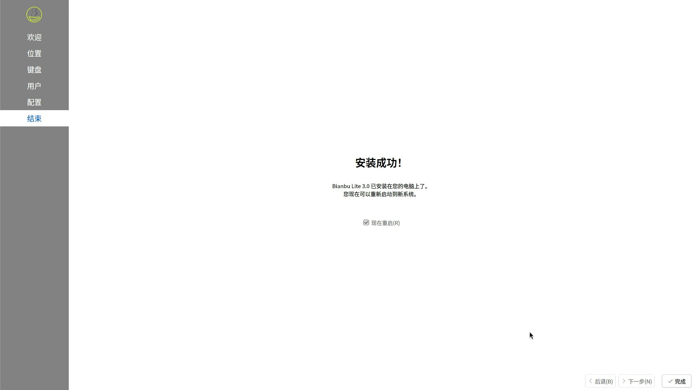

# Bianbu 香蕉派 BPI-F3 测试报告

## 测试环境

### 系统信息

- 系统版本：v2.1.1-desktop
- 下载链接：https://archive.spacemit.com/image/k1/version/bianbu/v2.1.1/
- 参考安装文档：https://docs.banana-pi.org/en/BPI-F3/GettingStarted_BPI-F3

### 硬件信息

- 香蕉派 BPI-F3
- 电源适配器
- microSD 卡一张 （如果刷写到 SD 卡）
- USB to UART 调试器一个

## 安装步骤

### 刷写镜像（sd 卡）


**请务必选择以 `.img.zip` 结尾的压缩包**
下载并解压镜像后，使用 `dd` 将镜像写入 microSD 卡。

```bash
unzip bianbu-25.04-desktop-lite-k1-v3.0.1-release-20250815184229.img.zip
sudo dd if=/path/to/bianbu-25.04-desktop-lite-k1-v3.0.1-release-20250815184229.img of=/dev/your-device bs=1M status=progress
```

### 刷写镜像（eMMC）

**请务必选择不包含 `img` 的压缩包**
下载并解压镜像后，使用 `fastboot` 将镜像刷写到 eMMC。

```bash
unzip bianbu-25.04-desktop-lite-k1-v3.0.1-release-20250815184229.zip
```

按住左侧两个按键开机/复位，进入 fastboot 模式。你可以在系统中看到 dfu-device：

```log
❯ sudo fastboot devices
dfu-device       DFU download
```

```bash
sudo fastboot stage factory/FSBL.bin
sudo fastboot continue
# 等待 1 秒
sudo fastboot stage u-boot.itb
sudo fastboot continue
# 等待 1 秒
sudo fastboot flash gpt partition_universal.json
sudo fastboot flash bootinfo factory/bootinfo_sd.bin
sudo fastboot flash fsbl factory/FSBL.bin
sudo fastboot flash env env.bin
sudo fastboot flash opensbi fw_dynamic.itb
sudo fastboot flash uboot u-boot.itb
sudo fastboot flash bootfs bootfs.ext4
sudo fastboot flash rootfs rootfs.ext4
```

### 登录系统

通过串口登录或图形界面系统,默认没有非 root 用户,图形界面初次启动有设置向导,需要设置用户名和密码,默认不启动 SSH.

默认用户名： `root`
默认密码： `bianbu`

## 实际结果

### 启动信息

[](https://asciinema.org/a/WLCatSP8kXYME7fxW2BblZfZ2)

### 桌面环境





## 测试结论

系统正常启动，成功通过串口及图形界面登录。
