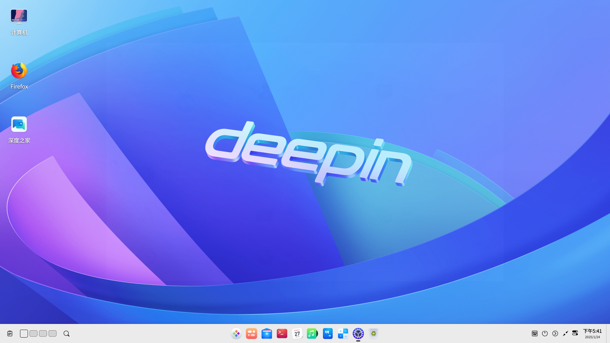
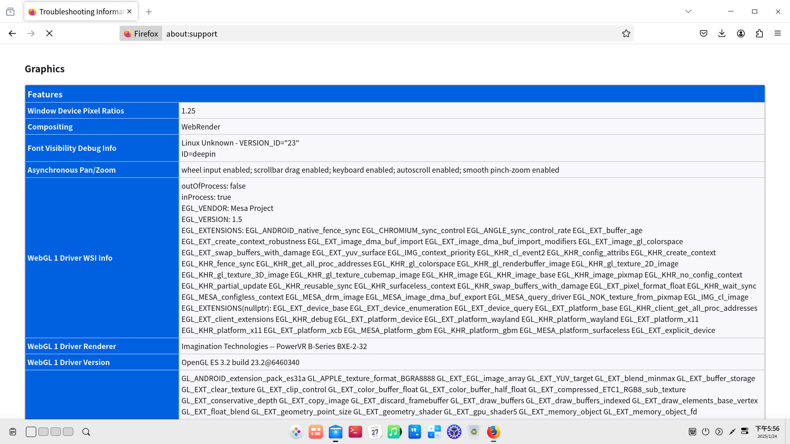
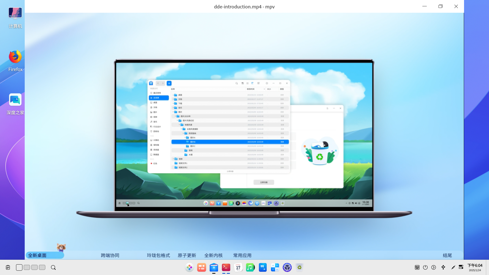

# Deepin preview BPI-F3 test report

## Test Environment

### System Information

- System Version: Deepin preview 20240913
- Download Link: https://ci.deepin.com/repo/deepin/deepin-ports/cdimage/20240913/riscv64/deepin-23-beige-preview-riscv64-k1-20240913-124401.tar.xz
- Reference Installation Document: https://cdimage.deepin.com/RISC-V/preview-20240517-riscv64/README.md
- Desktop Environment: DDE

### Hardware Information

- BPI-F3 (4G RAM + 16GB eMMC)
- Power adapter
- USB to UART debugger

## Installation Steps

### Flashing Bootloader

u-boot is not present the official zip file, so grab one from bianbu: https://archive.spacemit.com/image/k1/version/bianbu/

Decompress the installation kit and flash both u-boot and boot:

```bash
unzip https://archive.spacemit.com/image/k1/version/bianbu/v2.0.4/bianbu-24.04-minimal-k1-v2.0.4-release-20241205234138.zip
tar -xvf ./deepin-23-beige-preview-riscv64-k1-20240913-124401.tar.xz
sudo fastboot flash gpt partition_universal.json
sudo fastboot flash bootinfo factory/bootinfo_emmc.bin
sudo fastboot flash fsbl factory/FSBL.bin
sudo fastboot flash env env.bin
sudo fastboot flash opensbi fw_dynamic.itb
sudo fastboot flash uboot u-boot.itb
sudo fastboot flash boot deepin-k1-riscv64-stable-desktop-installer.boot.ext4
```

### Flashing the image

Flash the root partition into eMMC:

```bash
sudo fastboot flash root deepin-k1-riscv64-stable-desktop-installer.root.ext4
```

### Logging into the System

GUI is available after reboot.

Default Username: `root`
Default Password: `deepin`

A normal user is required for graphical login.

## Expected Results

The system should boot up normally and allow login through the onboard serial port or GUI.

## Actual Results

The system booted up normally and login through both the onboard serial port and GUI are successful.

### Boot Log

```log
deepin-PC login: root
Password:
Verification successful
Linux deepin-PC 6.6.36 #2.0~rc4.1+20240831010724 SMP PREEMPT Fri Aug 30 19:17:53 UTC 20 riscv64
Welcome to Deepin 23 GNU/Linux

    * Homepage:https://www.deepin.org/

    * Bugreport:https://bbs.deepin.org/


root@deepin-PC:~# uname -a
Linux deepin-PC 6.6.36 #2.0~rc4.1+20240831010724 SMP PREEMPT Fri Aug 30 19:17:53 UTC 20 riscv64 GNU/Linux
root@deepin-PC:~# cat /etc/
Display all 230 possibilities? (y or n)
root@deepin-PC:~# cat /etc/os
os-release  ostree/     os-version  
root@deepin-PC:~# cat /etc/os-release 
PRETTY_NAME="Deepin 23"
NAME="Deepin"
VERSION_ID="23"
VERSION="23"
ID=deepin
HOME_URL="https://www.deepin.org/"
BUG_REPORT_URL="https://bbs.deepin.org"
VERSION_CODENAME=beige
root@deepin-PC:~# cat /proc/cpuinfo 
processor       : 0
hart            : 0
model name      : Spacemit(R) X60
isa             : rv64imafdcv_zicbom_zicboz_zicntr_zicond_zicsr_zifencei_zihintpause_zihpm_zfh_zfhmin_zca_zcd_zba_zbb_zbc_zbs_zkt_zve32f_zve32x_zve64d_zve64f_zve64x_zvfh_zvfhmin_zvkt_sscofpmf_sstc_svinval_svnapot_svpbmt
mmu             : sv39
mvendorid       : 0x710
marchid         : 0x8000000058000001
mimpid          : 0x1000000049772200

processor       : 1
hart            : 1
model name      : Spacemit(R) X60
isa             : rv64imafdcv_zicbom_zicboz_zicntr_zicond_zicsr_zifencei_zihintpause_zihpm_zfh_zfhmin_zca_zcd_zba_zbb_zbc_zbs_zkt_zve32f_zve32x_zve64d_zve64f_zve64x_zvfh_zvfhmin_zvkt_sscofpmf_sstc_svinval_svnapot_svpbmt
mmu             : sv39
mvendorid       : 0x710
marchid         : 0x8000000058000001
mimpid          : 0x1000000049772200

processor       : 2
hart            : 2
model name      : Spacemit(R) X60
isa             : rv64imafdcv_zicbom_zicboz_zicntr_zicond_zicsr_zifencei_zihintpause_zihpm_zfh_zfhmin_zca_zcd_zba_zbb_zbc_zbs_zkt_zve32f_zve32x_zve64d_zve64f_zve64x_zvfh_zvfhmin_zvkt_sscofpmf_sstc_svinval_svnapot_svpbmt
mmu             : sv39
mvendorid       : 0x710
marchid         : 0x8000000058000001
mimpid          : 0x1000000049772200

processor       : 3
hart            : 3
model name      : Spacemit(R) X60
isa             : rv64imafdcv_zicbom_zicboz_zicntr_zicond_zicsr_zifencei_zihintpause_zihpm_zfh_zfhmin_zca_zcd_zba_zbb_zbc_zbs_zkt_zve32f_zve32x_zve64d_zve64f_zve64x_zvfh_zvfhmin_zvkt_sscofpmf_sstc_svinval_svnapot_svpbmt
mmu             : sv39
mvendorid       : 0x710
marchid         : 0x8000000058000001
mimpid          : 0x1000000049772200

processor       : 4
hart            : 4
model name      : Spacemit(R) X60
isa             : rv64imafdcv_zicbom_zicboz_zicntr_zicond_zicsr_zifencei_zihintpause_zihpm_zfh_zfhmin_zca_zcd_zba_zbb_zbc_zbs_zkt_zve32f_zve32x_zve64d_zve64f_zve64x_zvfh_zvfhmin_zvkt_sscofpmf_sstc_svinval_svnapot_svpbmt
mmu             : sv39
mvendorid       : 0x710
marchid         : 0x8000000058000001
mimpid          : 0x1000000049772200

processor       : 5
hart            : 5
model name      : Spacemit(R) X60
isa             : rv64imafdcv_zicbom_zicboz_zicntr_zicond_zicsr_zifencei_zihintpause_zihpm_zfh_zfhmin_zca_zcd_zba_zbb_zbc_zbs_zkt_zve32f_zve32x_zve64d_zve64f_zve64x_zvfh_zvfhmin_zvkt_sscofpmf_sstc_svinval_svnapot_svpbmt
mmu             : sv39
mvendorid       : 0x710
marchid         : 0x8000000058000001
mimpid          : 0x1000000049772200

processor       : 6
hart            : 6
model name      : Spacemit(R) X60
isa             : rv64imafdcv_zicbom_zicboz_zicntr_zicond_zicsr_zifencei_zihintpause_zihpm_zfh_zfhmin_zca_zcd_zba_zbb_zbc_zbs_zkt_zve32f_zve32x_zve64d_zve64f_zve64x_zvfh_zvfhmin_zvkt_sscofpmf_sstc_svinval_svnapot_svpbmt
mmu             : sv39
mvendorid       : 0x710
marchid         : 0x8000000058000001
mimpid          : 0x1000000049772200

processor       : 7
hart            : 7
model name      : Spacemit(R) X60
isa             : rv64imafdcv_zicbom_zicboz_zicntr_zicond_zicsr_zifencei_zihintpause_zihpm_zfh_zfhmin_zca_zcd_zba_zbb_zbc_zbs_zkt_zve32f_zve32x_zve64d_zve64f_zve64x_zvfh_zvfhmin_zvkt_sscofpmf_sstc_svinval_svnapot_svpbmt
mmu             : sv39
mvendorid       : 0x710
marchid         : 0x8000000058000001
mimpid          : 0x1000000049772200
```



### Browser test (Firefox)

- Browser startup


- Online video playback


- Benchmarks


- Web browsing


- PDF reading


- GPU accleration


### Office Suite test (LibreOffice)

- LibreOffice Writer


- LibreOffice Impress


- LibreOffice Calc

(Might stutter while editing large files)


### Video playback test (mpv)

Playback is normal (1080p videos might lag due to pure-CPU software decoding):


## Test Criteria

Successful: The actual result matches the expected result.

Failed: The actual result does not match the expected result.

## Test Conclusion

Test successful.
