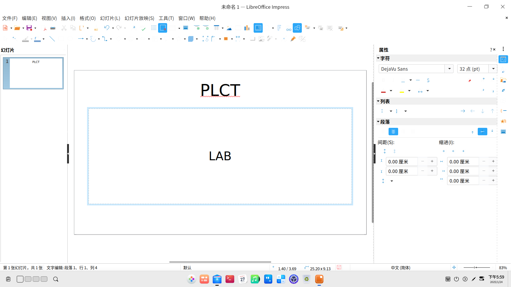
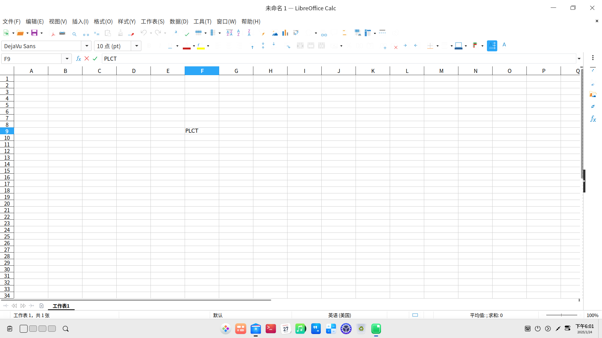

# Deepin preview BPI-F3 测试报告

## 测试环境

### 系统信息

- 系统版本：Deepin preview 20240913
- 下载链接：https://ci.deepin.com/repo/deepin/deepin-ports/cdimage/20240913/riscv64/deepin-23-beige-preview-riscv64-k1-20240913-124401.tar.xz
- 参考安装文档：https://cdimage.deepin.com/RISC-V/preview-20240517-riscv64/README.md
- 桌面环境: DDE

### 硬件信息

- BPI-F3 (4G RAM + 16GB eMMC)
- 电源适配器
- USB to UART 调试器一个

## 系统安装步骤

官方压缩包内不附带 u-boot，需要自己从 bianbu 获取，地址为：https://archive.spacemit.com/image/k1/version/bianbu/

### 刷写 bootloader

解压安装套件。
刷入 u-boot 与 boot。

```bash
unzip https://archive.spacemit.com/image/k1/version/bianbu/v2.0.4/bianbu-24.04-minimal-k1-v2.0.4-release-20241205234138.zip
tar -xvf ./deepin-23-beige-preview-riscv64-k1-20240913-124401.tar.xz
sudo fastboot flash gpt partition_universal.json
sudo fastboot flash bootinfo factory/bootinfo_emmc.bin
sudo fastboot flash fsbl factory/FSBL.bin
sudo fastboot flash env env.bin
sudo fastboot flash opensbi fw_dynamic.itb
sudo fastboot flash uboot u-boot.itb
sudo fastboot flash boot deepin-k1-riscv64-stable-desktop-installer.boot.ext4
```

### 刷写镜像

将 root 分区刷入 eMMC 中。

```bash
sudo fastboot flash root deepin-k1-riscv64-stable-desktop-installer.root.ext4
```

### 登录系统

重启系统后可见安装界面。

默认用户名：`root`
密码：`deepin`

从桌面登录需要先添加一个普通用户。

## 预期结果

系统正常启动，能够通过板载串口和图形界面登录。

## 实际结果

系统正常启动，能够通过板载串口和图形界面登录。

### 启动信息

```log
deepin-PC login: root
Password:
Verification successful
Linux deepin-PC 6.6.36 #2.0~rc4.1+20240831010724 SMP PREEMPT Fri Aug 30 19:17:53 UTC 20 riscv64
Welcome to Deepin 23 GNU/Linux

    * Homepage:https://www.deepin.org/

    * Bugreport:https://bbs.deepin.org/


root@deepin-PC:~# uname -a
Linux deepin-PC 6.6.36 #2.0~rc4.1+20240831010724 SMP PREEMPT Fri Aug 30 19:17:53 UTC 20 riscv64 GNU/Linux
root@deepin-PC:~# cat /etc/
Display all 230 possibilities? (y or n)
root@deepin-PC:~# cat /etc/os
os-release  ostree/     os-version  
root@deepin-PC:~# cat /etc/os-release 
PRETTY_NAME="Deepin 23"
NAME="Deepin"
VERSION_ID="23"
VERSION="23"
ID=deepin
HOME_URL="https://www.deepin.org/"
BUG_REPORT_URL="https://bbs.deepin.org"
VERSION_CODENAME=beige
root@deepin-PC:~# cat /proc/cpuinfo 
processor       : 0
hart            : 0
model name      : Spacemit(R) X60
isa             : rv64imafdcv_zicbom_zicboz_zicntr_zicond_zicsr_zifencei_zihintpause_zihpm_zfh_zfhmin_zca_zcd_zba_zbb_zbc_zbs_zkt_zve32f_zve32x_zve64d_zve64f_zve64x_zvfh_zvfhmin_zvkt_sscofpmf_sstc_svinval_svnapot_svpbmt
mmu             : sv39
mvendorid       : 0x710
marchid         : 0x8000000058000001
mimpid          : 0x1000000049772200

processor       : 1
hart            : 1
model name      : Spacemit(R) X60
isa             : rv64imafdcv_zicbom_zicboz_zicntr_zicond_zicsr_zifencei_zihintpause_zihpm_zfh_zfhmin_zca_zcd_zba_zbb_zbc_zbs_zkt_zve32f_zve32x_zve64d_zve64f_zve64x_zvfh_zvfhmin_zvkt_sscofpmf_sstc_svinval_svnapot_svpbmt
mmu             : sv39
mvendorid       : 0x710
marchid         : 0x8000000058000001
mimpid          : 0x1000000049772200

processor       : 2
hart            : 2
model name      : Spacemit(R) X60
isa             : rv64imafdcv_zicbom_zicboz_zicntr_zicond_zicsr_zifencei_zihintpause_zihpm_zfh_zfhmin_zca_zcd_zba_zbb_zbc_zbs_zkt_zve32f_zve32x_zve64d_zve64f_zve64x_zvfh_zvfhmin_zvkt_sscofpmf_sstc_svinval_svnapot_svpbmt
mmu             : sv39
mvendorid       : 0x710
marchid         : 0x8000000058000001
mimpid          : 0x1000000049772200

processor       : 3
hart            : 3
model name      : Spacemit(R) X60
isa             : rv64imafdcv_zicbom_zicboz_zicntr_zicond_zicsr_zifencei_zihintpause_zihpm_zfh_zfhmin_zca_zcd_zba_zbb_zbc_zbs_zkt_zve32f_zve32x_zve64d_zve64f_zve64x_zvfh_zvfhmin_zvkt_sscofpmf_sstc_svinval_svnapot_svpbmt
mmu             : sv39
mvendorid       : 0x710
marchid         : 0x8000000058000001
mimpid          : 0x1000000049772200

processor       : 4
hart            : 4
model name      : Spacemit(R) X60
isa             : rv64imafdcv_zicbom_zicboz_zicntr_zicond_zicsr_zifencei_zihintpause_zihpm_zfh_zfhmin_zca_zcd_zba_zbb_zbc_zbs_zkt_zve32f_zve32x_zve64d_zve64f_zve64x_zvfh_zvfhmin_zvkt_sscofpmf_sstc_svinval_svnapot_svpbmt
mmu             : sv39
mvendorid       : 0x710
marchid         : 0x8000000058000001
mimpid          : 0x1000000049772200

processor       : 5
hart            : 5
model name      : Spacemit(R) X60
isa             : rv64imafdcv_zicbom_zicboz_zicntr_zicond_zicsr_zifencei_zihintpause_zihpm_zfh_zfhmin_zca_zcd_zba_zbb_zbc_zbs_zkt_zve32f_zve32x_zve64d_zve64f_zve64x_zvfh_zvfhmin_zvkt_sscofpmf_sstc_svinval_svnapot_svpbmt
mmu             : sv39
mvendorid       : 0x710
marchid         : 0x8000000058000001
mimpid          : 0x1000000049772200

processor       : 6
hart            : 6
model name      : Spacemit(R) X60
isa             : rv64imafdcv_zicbom_zicboz_zicntr_zicond_zicsr_zifencei_zihintpause_zihpm_zfh_zfhmin_zca_zcd_zba_zbb_zbc_zbs_zkt_zve32f_zve32x_zve64d_zve64f_zve64x_zvfh_zvfhmin_zvkt_sscofpmf_sstc_svinval_svnapot_svpbmt
mmu             : sv39
mvendorid       : 0x710
marchid         : 0x8000000058000001
mimpid          : 0x1000000049772200

processor       : 7
hart            : 7
model name      : Spacemit(R) X60
isa             : rv64imafdcv_zicbom_zicboz_zicntr_zicond_zicsr_zifencei_zihintpause_zihpm_zfh_zfhmin_zca_zcd_zba_zbb_zbc_zbs_zkt_zve32f_zve32x_zve64d_zve64f_zve64x_zvfh_zvfhmin_zvkt_sscofpmf_sstc_svinval_svnapot_svpbmt
mmu             : sv39
mvendorid       : 0x710
marchid         : 0x8000000058000001
mimpid          : 0x1000000049772200
```


### 浏览器测试（Firefox）

- 浏览器启动


- 在线视频播放


- 浏览器性能测试


- 网页浏览


- 阅读 PDF


- GPU 加速


### 办公软件

- LibreOffice Writer


- LibreOffice Impress


- LibreOffice Calc

（在编辑大文件时可能会卡顿）



### 视频播放测试 (mpv)

正常播放，但 cpu 软解码，播放 1080p 视频时会卡顿：


## 测试判定标准

测试成功：实际结果与预期结果相符。

测试失败：实际结果与预期结果不符。

## 测试结论

测试成功。