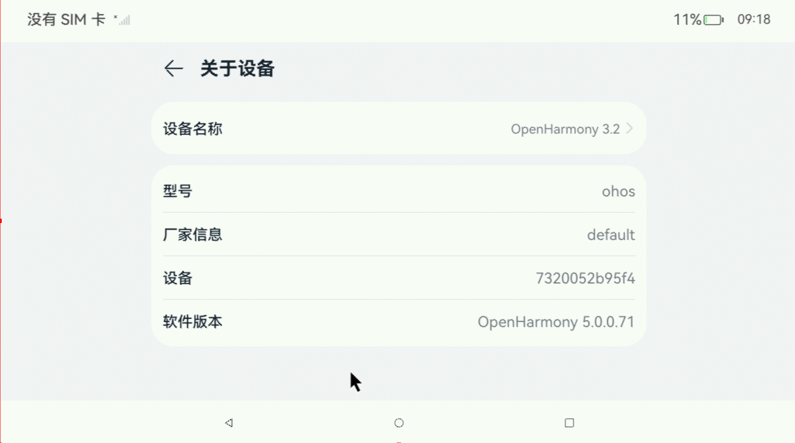

# OpenHarmony v5.0.0.71 Banana Pi BPI-F3 Test Report

## Test Environment

### System Information

- System Version: OpenHarmony v5.0.0.71
- Repo Manifest: [riscv-sig/manifest](https://gitee.com/riscv-sig/manifest)
- Flash tool: [TITANTOOLS](https://developer.spacemit.com/documentation?token=O6wlwlXcoiBZUikVNh2cczhin5d)
- Reference Installation Document: [spacemit](https://developer.spacemit.com/documentation)

### Hardware Information

- Banana Pi BPI-F3
- Power Adapter
- USB to UART Debugger
- USB Type-C Cable

## Installation Steps

### Setup development environment

Currently OpenHarmony's SDK only supports Ubuntu focal and above. If you are using a different OS, a docker image may be used.

Install the required packages:
```bash
sudo apt-get update

sudo apt-get install binutils git git-lfs gnupg gperf build-essential zip curl zlib1g-dev gcc-multilib lib32ncurses5-dev x11proto-core-dev libx11-dev lib32z1-dev libxml2-utils xsltproc unzip m4 bc gnutls-bin python3-pip ruby ccache libgl1-mesa-dev g++-multilib libc6-dev-i386 flex bison default-jdk openssl libelf-dev lz4 genext2fs libncurses5 libssl-dev u-boot-tools dosfstools mtools python2 cpio nodejs npm android-tools-adb android-tools-fastboot android-sdk-ext4-utils android-sdk-libsparse-utils mtd-utils scons
```

### Download the source code

The source code is maintained in gitee, so you need a gitee account and a ssh key pair to use the repo.

After setting up your gitee account, clone the repo:
```bash
mkdir ohos5
cd ohos5
repo init -u git@gitee.com:riscv-sig/manifest.git -b riscv/OpenHarmony-v5.0.0-Release --no-repo-verify --repo-url=https://gerrit-googlesource.lug.ustc.edu.cn/git-repo
repo sync -c
repo forall -c 'git lfs pull'
repo start OpenHarmony-v5.0.0-Release --all
```

### Install prebuilt toolchains

```bash
build/prebuilts_download.sh
```

### Build the source code

Though in official list, bpi-f3 is not supported, but it can use the save configuration as `deb1`, which has the save device tree.

Suggested using `ccache` to speed up the build process. The entire build process may take a few hours.

```bash
./build.sh --product-name deb1 --ccache
```

#### Note: Using an SD card instead of eMMC

If you want to use a microSD card instead of eMMC, you need to modify some configurations:

```bash
cd device/board/spacemit/deb1
grep -rl 'd4281000' ./ | xargs sed -i 's/d4281000/d4280000/g'
cd -
```

#### Note: Using MIPI DSI display instead of HDMI

The default display is HDMI, if you want to use MIPI DSI display, you need to modify device tree:

```diff
diff --git a/kernel/linux/spacemit_kernel-6.6/arch/riscv/boot/dts/spacemit/k1-x_deb1.dts b/kernel/linux/spacemit_kernel-6.6/arch/riscv/boot/dts/spacemit/k1-x_deb1.dts.new
index 721d351..f34775c 100644
--- a/kernel/linux/spacemit_kernel-6.6/arch/riscv/boot/dts/spacemit/k1-x_deb1.dts
+++ b/kernel/linux/spacemit_kernel-6.6/arch/riscv/boot/dts/spacemit/k1-x_deb1.dts
@@ -208,11 +208,11 @@
        spacemit-dpu-escclk = <76800000>;
        dsi_1v2-supply = <&ldo_5>;
        vin-supply-names = "dsi_1v2";
-       status = "disabled";
+       status = "okay";
 };
 
 &dsi2 {
-       status = "disabled";
+       status = "okay";
 
        panel2: panel2@0 {
                status = "ok";
@@ -228,18 +228,18 @@
 };
 
 &lcds {
-       status = "disabled";
+       status = "okay";
 };
 
 &dpu_online2_hdmi {
        memory-region = <&dpu_resv>;
-       status = "okay";
+       status = "disabled";
 };
 
 &hdmi{
        pinctrl-names = "default";
        pinctrl-0 = <&pinctrl_hdmi_0>;
-       status = "okay";
+       status = "disabled";
 };
 
 &i2c0 {
```

### Generate the image

```bash
./build/gen_zip.sh deb1
```

The generated image will be `out/deb1/packages/phone/images/openharmony-spacemit-deb1.zip`.

### Flashing the Image

To flash the image, you need to use the TITANTOOLS provided by Spacemit.

It is a GUI tool, comes as an AppImage, so you need to make it executable and run it.

```bash
chmod +x titantools_for_linux-2.0.1-Rc.AppImage
./titantools_for_linux-2.0.1-Rc.AppImage
```

#### Flashing the Image (Fastboot)

It is possible to flash the image using only fastboot, with the following commands:

```bash
sudo fastboot stage factory/FSBL.bin
sudo fastboot continue
sudo fastboot stage u-boot.itb
sudo fastboot continue
sudo fastboot flash gpt partition_universal.json
sudo fastboot flash bootinfo factory/bootinfo_sd.bin
sudo fastboot flash fsbl factory/FSBL.bin
sudo fastboot flash env env.bin
sudo fastboot flash opensbi fw_dynamic.itb
sudo fastboot flash uboot u-boot.itb
sudo fastboot flash boot boot.img
sudo fastboot flash ramdisk ramdisk.img
sudo fastboot flash updater updater.img
sudo fastboot flash sys_prod sys_prod.img
sudo fastboot flash chip_prod chip_prod.img
sudo fastboot flash system system.img
sudo fastboot flash vendor vendor.img
sudo fastboot flash userdata userdata.img
```

### Logging into the System

Logging into the system via the serial port or HDMI display. Mouse and keyboard are supported.

## Expected Results

The system should boot normally and allow login via the onboard serial port and HDMI display.

## Actual Results

The system booted successfully and login via the onboard serial port and HDMI display was also successful.

### Boot Log




Screen recording (from flashing image to login):
[](https://asciinema.org/a/TgUFTR6rbXmiBNrWaKqHkFv8b)

```log
# begetctl dump api
Begin dump syspara
=======================
DeviceType:default
Manufacture:default
Brand:default
MarketName:OpenHarmony 3.2
ProductSeries:default
ProductModel:ohos
SoftwareModel:default
HardwareModel:default
Serial:7320052b95f4
OSFullName:OpenHarmony-5.0.0.71
DisplayVersion:OpenHarmony 5.0.0.71
BootloaderVersion:bootloader
GetSecurityPatchTag:2024/09/01
AbiList:riscv64
IncrementalVersion:default
VersionId:default/default/default/default/OpenHarmony-5.0.0.71/ohos/default/12/default/default
BuildType:default
BuildUser:default
BuildHost:default
BuildTime:default
BuildRootHash:default
GetOsReleaseType:Release
GetHardwareProfile:default
FirstApiVersion:1
GetSerial:7320052b95f4
acl serial:
GetDevUdid:6A9BC9718275333E50F82F6866646BEEFDF5223893CE84B633A7C268BA7EB1A2
Acl devUdid:
Version:5.0.0.71
GetSdkApiVersion:12
GetSystemCommitId:896
=======================
End dump syspara
# uname -a
Linux localhost 6.6.36 #1 SMP PREEMPT Fri Mar 28 01:16:56 CST 2025 riscv64
# cat /proc/cpuinfo                                                            
processor       : 0
hart            : 0
model name      : Spacemit(R) X60
isa             : rv64imafdcv_zicbom_zicboz_zicntr_zicond_zicsr_zifencei_zihintpause_zihpm_zfh_zfhmin_zca_zcd_zba_zbb_zbc_zbs_zkt_zve32f_zve32x_zve64d_zve64f_zve64x_zvfh_zvfhmin_zvkt_sscofpmf_sstc_svinval_svnapot_svpbmt
mmu             : sv39
mvendorid       : 0x710
marchid         : 0x8000000058000001
mimpid          : 0x1000000049772200

processor       : 1
hart            : 1
model name      : Spacemit(R) X60
isa             : rv64imafdcv_zicbom_zicboz_zicntr_zicond_zicsr_zifencei_zihintpause_zihpm_zfh_zfhmin_zca_zcd_zba_zbb_zbc_zbs_zkt_zve32f_zve32x_zve64d_zve64f_zve64x_zvfh_zvfhmin_zvkt_sscofpmf_sstc_svinval_svnapot_svpbmt
mmu             : sv39
mvendorid       : 0x710
marchid         : 0x8000000058000001
mimpid          : 0x1000000049772200

processor       : 2
hart            : 2
model name      : Spacemit(R) X60
isa             : rv64imafdcv_zicbom_zicboz_zicntr_zicond_zicsr_zifencei_zihintpause_zihpm_zfh_zfhmin_zca_zcd_zba_zbb_zbc_zbs_zkt_zve32f_zve32x_zve64d_zve64f_zve64x_zvfh_zvfhmin_zvkt_sscofpmf_sstc_svinval_svnapot_svpbmt
mmu             : sv39
mvendorid       : 0x710
marchid         : 0x8000000058000001
mimpid          : 0x1000000049772200

processor       : 3
hart            : 3
model name      : Spacemit(R) X60
isa             : rv64imafdcv_zicbom_zicboz_zicntr_zicond_zicsr_zifencei_zihintpause_zihpm_zfh_zfhmin_zca_zcd_zba_zbb_zbc_zbs_zkt_zve32f_zve32x_zve64d_zve64f_zve64x_zvfh_zvfhmin_zvkt_sscofpmf_sstc_svinval_svnapot_svpbmt
mmu             : sv39
mvendorid       : 0x710
marchid         : 0x8000000058000001
mimpid          : 0x1000000049772200

processor       : 4
hart            : 4
model name      : Spacemit(R) X60
isa             : rv64imafdcv_zicbom_zicboz_zicntr_zicond_zicsr_zifencei_zihintpause_zihpm_zfh_zfhmin_zca_zcd_zba_zbb_zbc_zbs_zkt_zve32f_zve32x_zve64d_zve64f_zve64x_zvfh_zvfhmin_zvkt_sscofpmf_sstc_svinval_svnapot_svpbmt
mmu             : sv39
mvendorid       : 0x710
marchid         : 0x8000000058000001
mimpid          : 0x1000000049772200

processor       : 5
hart            : 5
model name      : Spacemit(R) X60
isa             : rv64imafdcv_zicbom_zicboz_zicntr_zicond_zicsr_zifencei_zihintpause_zihpm_zfh_zfhmin_zca_zcd_zba_zbb_zbc_zbs_zkt_zve32f_zve32x_zve64d_zve64f_zve64x_zvfh_zvfhmin_zvkt_sscofpmf_sstc_svinval_svnapot_svpbmt
mmu             : sv39
mvendorid       : 0x710
marchid         : 0x8000000058000001
mimpid          : 0x1000000049772200

processor       : 6
hart            : 6
model name      : Spacemit(R) X60
isa             : rv64imafdcv_zicbom_zicboz_zicntr_zicond_zicsr_zifencei_zihintpause_zihpm_zfh_zfhmin_zca_zcd_zba_zbb_zbc_zbs_zkt_zve32f_zve32x_zve64d_zve64f_zve64x_zvfh_zvfhmin_zvkt_sscofpmf_sstc_svinval_svnapot_svpbmt
mmu             : sv39
mvendorid       : 0x710
marchid         : 0x8000000058000001
mimpid          : 0x1000000049772200

processor       : 7
hart            : 7
model name      : Spacemit(R) X60
isa             : rv64imafdcv_zicbom_zicboz_zicntr_zicond_zicsr_zifencei_zihintpause_zihpm_zfh_zfhmin_zca_zcd_zba_zbb_zbc_zbs_zkt_zve32f_zve32x_zve64d_zve64f_zve64x_zvfh_zvfhmin_zvkt_sscofpmf_sstc_svinval_svnapot_svpbmt
mmu             : sv39
mvendorid       : 0x710
marchid         : 0x8000000058000001
mimpid          : 0x1000000049772200

```

### Notice

The default loader comes with the image is `ld-musl-riscv64.so.1`, you need to get your own glibc loader to run glibc based applications.
