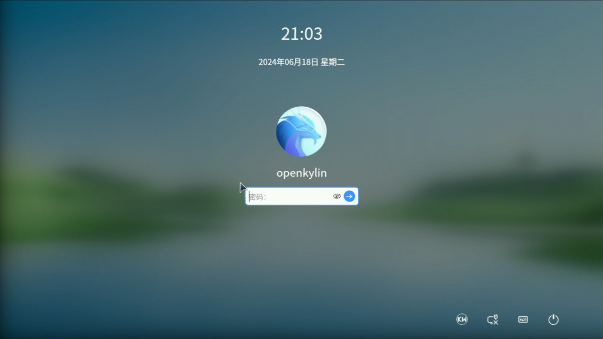

# openKylin v2.0 SP1 Banana Pi BPI-F3 Test Report

## Test Environment

### System Information

- System Version: openKylin v2.0-SP1
- Download Link: [https://www.openkylin.top/downloads/index.html](https://www.openkylin.top/downloads/index.html) **Choose k1 version**
- Reference Installation Document: [https://docs.openkylin.top/en/01_%E5%AE%89%E8%A3%85%E5%8D%87%E7%BA%A7%E6%8C%87%E5%8D%97/%E5%9C%A8riscv%E4%B8%8A%E5%AE%89%E8%A3%85/%E5%9C%A8SpacemiT_K1%E4%B8%8A%E5%AE%89%E8%A3%85openKylin](https://docs.openkylin.top/en/01_%E5%AE%89%E8%A3%85%E5%8D%87%E7%BA%A7%E6%8C%87%E5%8D%97/%E5%9C%A8riscv%E4%B8%8A%E5%AE%89%E8%A3%85/%E5%9C%A8SpacemiT_K1%E4%B8%8A%E5%AE%89%E8%A3%85openKylin)

### Hardware Information

- Banana Pi BPI-F3
- Power Adapter
- A microSD Card
- A USB to UART Debugger

## Installation Steps

### Flashing the Image (SD Card)

After downloading and extracting the image, use `dd` to flash the image to the microSD card.

```bash
xz -d openKylin-Embedded-V2.0-SP1-spacemit-k1-riscv64.img
sudo dd if=openKylin-Embedded-V2.0-SP1-spacemit-k1-riscv64.img of=/dev/your-device bs=4M status=progress
```

### Logging into the System

Logging into the system via the serial port.

Default Username: `openkylin`
Default Password: `openkylin`

## Expected Results

The system should boot normally and allow login via the onboard serial port.

## Actual Results

The system booted successfully and login via the onboard serial port was also successful.

### Boot Log

Screen recording (from flashing image to login):
[](https://asciinema.org/a/uUOdR5yUv1cCUAVaLGFl9VORs)

```log
openKylin 2.0 openkylin ttyS0

openkylin login: openkylin
密码： 
Welcome to openKylin 2.0 (GNU/Linux 6.1.15 riscv64)

 * Support:        https://openkylin.top

The programs included with the openKylin system are free software;
the exact distribution terms for each program are described in the
individual files in /usr/share/doc/*/copyright.

openKylin comes with ABSOLUTELY NO WARRANTY, to the extent permitted by
applicable law.

You do not have any new mail.
load environment: QT_ACCESSIBILITY=1
load environment: PATH=/usr/local/sbin:/usr/local/bin:/usr/sbin:/usr/bin:/sbin:/bin:/usr/games:/usr/local/games:/snap/bin
load environment: COGL_DRIVER=gles2
load environment: GDK_GL=gles
load environment: XWAYLAND_NO_GLAMOR=1
load environment: SDL_VIDEODRIVER=wayland
load environment: MESA_LOADER_DRIVER_OVERRIDE=pvr
openkylin@openkylin:~$ cat /etc/os-release 
NAME="openKylin"
FULL_NAME="openKylin"
VERSION="2.0 (nile)"
VERSION_US="2.0 (nile)"
ID=openkylin
PRETTY_NAME="openKylin 2.0"
VERSION_ID="2.0"
HOME_URL="https://www.openkylin.top/"
VERSION_CODENAME=nile
PRODUCT_FEATURES=3
openkylin@openkylin:~$ uname -a
Linux openkylin 6.1.15 #1.0.14.1 SMP PREEMPT Fri Aug 30 18:58:33 UTC 2024 riscv64 riscv64 riscv64 GNU/Linux
openkylin@openkylin:~$ cat /proc/cpuinfo 
processor       : 0
hart            : 0
model name      : Spacemit(R) X60
isa             : rv64imafdcv_sscofpmf_sstc_svpbmt_zicbom_zicboz_zicbop_zihintpause
mmu             : sv39
mvendorid       : 0x710
marchid         : 0x8000000058000001
mimpid          : 0x1000000049772200

processor       : 1
hart            : 1
model name      : Spacemit(R) X60
isa             : rv64imafdcv_sscofpmf_sstc_svpbmt_zicbom_zicboz_zicbop_zihintpause
mmu             : sv39
mvendorid       : 0x710
marchid         : 0x8000000058000001
mimpid          : 0x1000000049772200

processor       : 2
hart            : 2
model name      : Spacemit(R) X60
isa             : rv64imafdcv_sscofpmf_sstc_svpbmt_zicbom_zicboz_zicbop_zihintpause
mmu             : sv39
mvendorid       : 0x710
marchid         : 0x8000000058000001
mimpid          : 0x1000000049772200

processor       : 3
hart            : 3
model name      : Spacemit(R) X60
isa             : rv64imafdcv_sscofpmf_sstc_svpbmt_zicbom_zicboz_zicbop_zihintpause
mmu             : sv39
mvendorid       : 0x710
marchid         : 0x8000000058000001
mimpid          : 0x1000000049772200

processor       : 4
hart            : 4
model name      : Spacemit(R) X60
isa             : rv64imafdcv_sscofpmf_sstc_svpbmt_zicbom_zicboz_zicbop_zihintpause
mmu             : sv39
mvendorid       : 0x710
marchid         : 0x8000000058000001
mimpid          : 0x1000000049772200

processor       : 5
hart            : 5
model name      : Spacemit(R) X60
isa             : rv64imafdcv_sscofpmf_sstc_svpbmt_zicbom_zicboz_zicbop_zihintpause
mmu             : sv39
mvendorid       : 0x710
marchid         : 0x8000000058000001
mimpid          : 0x1000000049772200

processor       : 6
hart            : 6
model name      : Spacemit(R) X60
isa             : rv64imafdcv_sscofpmf_sstc_svpbmt_zicbom_zicboz_zicbop_zihintpause
mmu             : sv39
mvendorid       : 0x710
marchid         : 0x8000000058000001
mimpid          : 0x1000000049772200

processor       : 7
hart            : 7
model name      : Spacemit(R) X60
isa             : rv64imafdcv_sscofpmf_sstc_svpbmt_zicbom_zicboz_zicbop_zihintpause
mmu             : sv39
mvendorid       : 0x710
marchid         : 0x8000000058000001
mimpid          : 0x1000000049772200

```

login screen 

## Test Criteria

Successful: The actual result matches the expected result.

Failed: The actual result does not match the expected result.

## Test Conclusion

Test successful.
