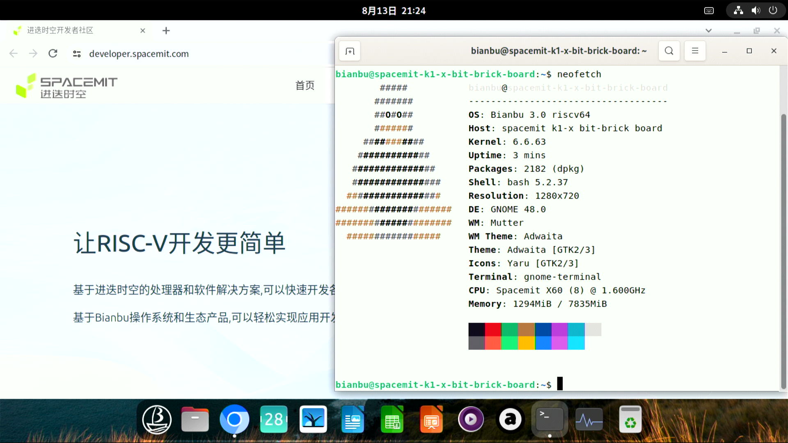

# Bianbu BIT-BRICK K1 测试报告

## 测试环境

### 系统信息

- 系统版本：v3.0
- 下载链接：https://archive.spacemit.com/image/k1/version/bianbu/v3.0/
- 参考安装文档：https://docs.bit-brick.com/docs/k1/getting-started/preparation

### 硬件信息

- BIT-BRICK K1
- 电源适配器
- microSD 卡一张
- USB to UART 调试器一个

## 安装步骤

### 刷写镜像（sd 卡）

**请务必选择以 `.img.zip` 结尾的压缩包**
下载并解压镜像后，使用 `dd` 将镜像写入 microSD 卡。

```bash
unzip bianbu-25.04-desktop-k1-v3.0-release-20250725125828.img.zip
sudo dd if=bianbu-25.04-desktop-k1-v3.0-release-20250725125828.img of=/dev/sdX bs=1M status=progress 
```

### 登录系统

通过串口登录系统。

默认用户名： `root`
默认密码： `bianbu`

## 预期结果

系统正常启动，能够通过串口或图形界面登录。

## 实际结果

系统正常启动，成功通过串口及图形界面登录。

### 启动信息

```log

Bianbu 3.0 spacemit-k1-x-bit-brick-board ttyS0
spacemit-k1-x-bit-brick-board login: root
密码： 
Welcome to Bianbu 3.0 (GNU/Linux 6.6.63 riscv64)

 * Documentation:  https://bianbu.spacemit.com
 * Support:        https://ticket.spacemit.com

0 updates can be applied immediately.


The list of available updates is more than a week old.
To check for new updates run: sudo apt update

root@spacemit-k1-x-bit-brick-board:~# uname -a
Linux spacemit-k1-x-bit-brick-board 6.6.63 #2.2.6.3 SMP PREEMPT Thu Jul 17 11:38:53 UTC 2025 riscv64 riscv64 riscv64 GNU/Linux
root@spacemit-k1-x-bit-brick-board:~# cat /etc/os-release 
PRETTY_NAME="Bianbu 3.0"
NAME="Bianbu"
VERSION_ID="3.0"
VERSION="3.0 (Plucky Puffin)"
VERSION_CODENAME=plucky
ID=bianbu
ID_LIKE=debian
HOME_URL="https://bianbu.spacemit.com"
SUPPORT_URL="https://bianbu.spacemit.com"
BUG_REPORT_URL="https://ticket.spacemit.com"
PRIVACY_POLICY_URL="https://www.spacemit.com/privacy-policy"
UBUNTU_CODENAME=plucky
LOGO=bianbu-logo
root@spacemit-k1-x-bit-brick-board:~# cat /proc/cpuinfo 
processor       : 0
hart            : 0
model name      : Spacemit(R) X60
isa             : rv64imafdcv_zicbom_zicboz_zicntr_zicond_zicsr_zifencei_zihintpause_zihpm_zfh_zfhmin_zca_zcd_zba_zbb_zbc_zbs_zkt_zve32f_zve32x_zve64d_zve64f_zve64x_zvfh_zvfhmin_zvkt_sscofpmf_sstc_svinval_svnapot_svpbmt
mmu             : sv39
uarch           : spacemit,x60
mvendorid       : 0x710
marchid         : 0x8000000058000001
mimpid          : 0x1000000049772200

processor       : 1
hart            : 1
model name      : Spacemit(R) X60
isa             : rv64imafdcv_zicbom_zicboz_zicntr_zicond_zicsr_zifencei_zihintpause_zihpm_zfh_zfhmin_zca_zcd_zba_zbb_zbc_zbs_zkt_zve32f_zve32x_zve64d_zve64f_zve64x_zvfh_zvfhmin_zvkt_sscofpmf_sstc_svinval_svnapot_svpbmt
mmu             : sv39
uarch           : spacemit,x60
mvendorid       : 0x710
marchid         : 0x8000000058000001
mimpid          : 0x1000000049772200

processor       : 2
hart            : 2
model name      : Spacemit(R) X60
isa             : rv64imafdcv_zicbom_zicboz_zicntr_zicond_zicsr_zifencei_zihintpause_zihpm_zfh_zfhmin_zca_zcd_zba_zbb_zbc_zbs_zkt_zve32f_zve32x_zve64d_zve64f_zve64x_zvfh_zvfhmin_zvkt_sscofpmf_sstc_svinval_svnapot_svpbmt
mmu             : sv39
uarch           : spacemit,x60
mvendorid       : 0x710
marchid         : 0x8000000058000001
mimpid          : 0x1000000049772200

processor       : 3
hart            : 3
model name      : Spacemit(R) X60
isa             : rv64imafdcv_zicbom_zicboz_zicntr_zicond_zicsr_zifencei_zihintpause_zihpm_zfh_zfhmin_zca_zcd_zba_zbb_zbc_zbs_zkt_zve32f_zve32x_zve64d_zve64f_zve64x_zvfh_zvfhmin_zvkt_sscofpmf_sstc_svinval_svnapot_svpbmt
mmu             : sv39
uarch           : spacemit,x60
mvendorid       : 0x710
marchid         : 0x8000000058000001
mimpid          : 0x1000000049772200

processor       : 4
hart            : 4
model name      : Spacemit(R) X60
isa             : rv64imafdcv_zicbom_zicboz_zicntr_zicond_zicsr_zifencei_zihintpause_zihpm_zfh_zfhmin_zca_zcd_zba_zbb_zbc_zbs_zkt_zve32f_zve32x_zve64d_zve64f_zve64x_zvfh_zvfhmin_zvkt_sscofpmf_sstc_svinval_svnapot_svpbmt
mmu             : sv39
uarch           : spacemit,x60
mvendorid       : 0x710
marchid         : 0x8000000058000001
mimpid          : 0x1000000049772200

processor       : 5
hart            : 5
model name      : Spacemit(R) X60
isa             : rv64imafdcv_zicbom_zicboz_zicntr_zicond_zicsr_zifencei_zihintpause_zihpm_zfh_zfhmin_zca_zcd_zba_zbb_zbc_zbs_zkt_zve32f_zve32x_zve64d_zve64f_zve64x_zvfh_zvfhmin_zvkt_sscofpmf_sstc_svinval_svnapot_svpbmt
mmu             : sv39
uarch           : spacemit,x60
mvendorid       : 0x710
marchid         : 0x8000000058000001
mimpid          : 0x1000000049772200

processor       : 6
hart            : 6
model name      : Spacemit(R) X60
isa             : rv64imafdcv_zicbom_zicboz_zicntr_zicond_zicsr_zifencei_zihintpause_zihpm_zfh_zfhmin_zca_zcd_zba_zbb_zbc_zbs_zkt_zve32f_zve32x_zve64d_zve64f_zve64x_zvfh_zvfhmin_zvkt_sscofpmf_sstc_svinval_svnapot_svpbmt
mmu             : sv39
uarch           : spacemit,x60
mvendorid       : 0x710
marchid         : 0x8000000058000001
mimpid          : 0x1000000049772200

processor       : 7
hart            : 7
model name      : Spacemit(R) X60
isa             : rv64imafdcv_zicbom_zicboz_zicntr_zicond_zicsr_zifencei_zihintpause_zihpm_zfh_zfhmin_zca_zcd_zba_zbb_zbc_zbs_zkt_zve32f_zve32x_zve64d_zve64f_zve64x_zvfh_zvfhmin_zvkt_sscofpmf_sstc_svinval_svnapot_svpbmt
mmu             : sv39
uarch           : spacemit,x60
mvendorid       : 0x710
marchid         : 0x8000000058000001
mimpid          : 0x1000000049772200

root@spacemit-k1-x-bit-brick-board:~# 
```

## 桌面环境

该镜像已预装 **Gnome** 桌面环境，连接显示器会以桌面会话自动启动。



## 测试判定标准

测试成功：实际结果与预期结果相符。

测试失败：实际结果与预期结果不符。

## 测试结论

测试成功
