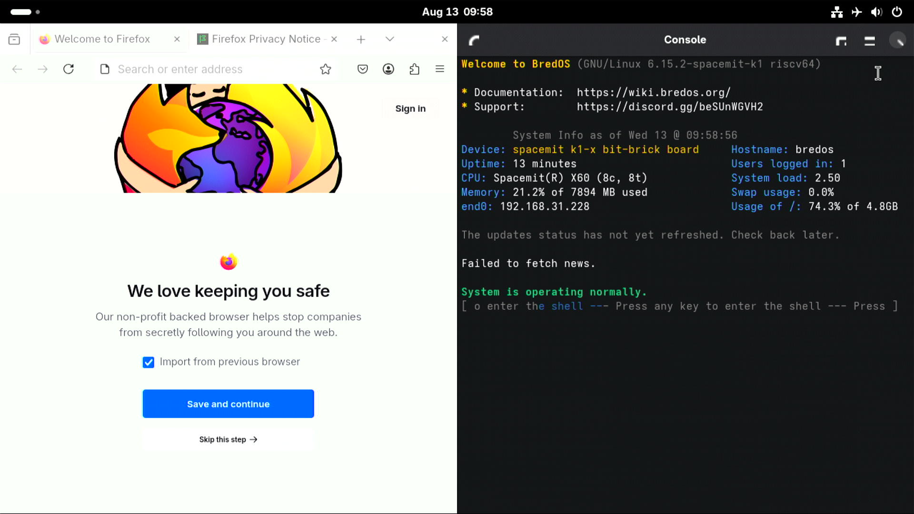

# Bredos BiT-BRICK K1 测试报告

## 测试环境

### 系统信息

- 下载链接：https://bredos.org/download.html
- 参考安装文档：https://wiki.bredos.org/en/installation

### 硬件信息

- Bit-BRICK K1
- 电源适配器
- microSD 卡一张
- USB to UART 调试器一个

## 安装步骤

### 刷写镜像（sd 卡）

下载并解压镜像后，使用 `dd` 将镜像写入 microSD 卡。

```bash
xz -d BredOS-riscv64-MILK-V-JUPITER-2025-07-16.img.xz
dd if=BredOS-riscv64-MILK-V-JUPITER-2025-07-16.img of=/dev/sdX bs=1M status=progress
```

### 添加设备树

下载 [Bianbu](https://archive.spacemit.com/image/k1/version/bianbu/) 镜像. 提取它的 `k1-x_bit-brick.dtb` 文件,并放到 `/dtb/linux-spacemit-k1/` 中

``` log
unzip bianbu-24.04-desktop-k1-v2.1.1-release-20250305144026.img.zip
sudo losetup -fP --show bianbu-24.04-desktop-k1-v2.1.1-release-20250305144026.img
sudo mount /dev/loop0p5 /mnt
sudo cp /mnt/spacemit/6.6.63/k1-x_bit-brick.dtb ./

sudo umount /mnt
sudo losetup -d /dev/loop0

sudo mount /dev/sdX2 /mnt
sudo mv ./k1-x_bit-brick.dtb /mnt/dtb/linux-spacemit-k1/
```

### 设置 extlinux.conf

修改 `/extlinux/extlinux.conf` 文件

``` log
default l0
menu title BredOS U-Boot menu
prompt 1
timeout 10


label l0
    menu label BredOS linux-spacemit-k1
    linux /vmlinuz-linux-spacemit-k1
    initrd /initramfs-linux-spacemit-k1.img
    fdt /dtb/linux-spacemit-k1/k1-x_bit-brick.dtb
    append root=UUID=24db3d60-df13-4bf2-b4f0-f795e817ff88 console=ttyS0,115200 console=tty1 rootwait rw init=/sbin/init
rootflags=subvol=@ rootfstype=btrfs
```

### 登录系统

通过串口登录系统。

默认用户名和密码为`bred`.

## 预期结果

系统正常启动，能够通过板载串口登录。

## 实际结果

系统正常启动，成功通过板载串口登录。

### 启动信息


```log
Welcome to BredOS (GNU/Linux 6.15.2-spacemit-k1 riscv64)

* Documentation:  https://wiki.bredos.org/
* Support:        https://discord.gg/beSUnWGVH2

        System Info as of Sun 22 @ 20:49:52
Device: spacemit k1-x bit-brick board     Hostname: bredos
Uptime: 3 minutes                         Users logged in: 1
CPU: Spacemit(R) X60 (8c, 8t)             System load: 0.35
Memory: 11.8% of 7894 MB used             Swap usage: 0.0%
Usage of /: 73.5% of 4.8GB

The updates status has not yet refreshed. Check back later.

Failed to fetch news.

System is operating normally.

┌─[bred@bredos]─(~)
└─[20:49]-(^_^)-[$] uname -a
Linux bredos 6.15.2-spacemit-k1 #6 SMP PREEMPT Sun Jul  6 01:25:47 EEST 2025 riscv64 GNU/Linux

┌─[bred@bredos]─(~)
└─[20:50]-(^_^)-[$] cat /etc/os-release
NAME="BredOS"
PRETTY_NAME="BredOS"
ID=bredos
ID_LIKE=arch
BUILD_ID=rolling
ANSI_COLOR="38;2;23;147;209"
HOME_URL="https://discord.gg/jwhxuyKXaa"
LOGO=bred
IMAGE_ID=BredOS
IMAGE_VERSION=2022.02.02
┌─[bred@bredos]─(~)
└─[20:50]-(^_^)-[$] cat /proc/cpuinfo
processor       : 0
hart            : 0
model name      : Spacemit(R) X60
isa             : rv64imafdcv_zicbom_zicboz_zicntr_zicond_zicsr_zifencei_zihintpause_zihpm_zaamo_zalrsc_zfh_zfhmin_zca_zcd_zba_zbb_zbc_zbs_zkt_zve32f_zve32x_zve64d_zve64f_zve64x_zvfh_zvfhmin_zvkt_sscofpmf_sstc_svinval_svnapot_svpbmt
mmu             : sv39
uarch           : spacemit,x60
mvendorid       : 0x710
marchid         : 0x8000000058000001
mimpid          : 0x1000000049772200
hart isa        : rv64imafdcv_zicbom_zicboz_zicntr_zicond_zicsr_zifencei_zihintpause_zihpm_zaamo_zalrsc_zfh_zfhmin_zca_zcd_zba_zbb_zbc_zbs_zkt_zve32f_zve32x_zve64d_zve64f_zve64x_zvfh_zvfhmin_zvkt_sscofpmf_sstc_svinval_svnapot_svpbmt

processor       : 1
hart            : 1
model name      : Spacemit(R) X60
isa             : rv64imafdcv_zicbom_zicboz_zicntr_zicond_zicsr_zifencei_zihintpause_zihpm_zaamo_zalrsc_zfh_zfhmin_zca_zcd_zba_zbb_zbc_zbs_zkt_zve32f_zve32x_zve64d_zve64f_zve64x_zvfh_zvfhmin_zvkt_sscofpmf_sstc_svinval_svnapot_svpbmt
mmu             : sv39
uarch           : spacemit,x60
mvendorid       : 0x710
marchid         : 0x8000000058000001
mimpid          : 0x1000000049772200
hart isa        : rv64imafdcv_zicbom_zicboz_zicntr_zicond_zicsr_zifencei_zihintpause_zihpm_zaamo_zalrsc_zfh_zfhmin_zca_zcd_zba_zbb_zbc_zbs_zkt_zve32f_zve32x_zve64d_zve64f_zve64x_zvfh_zvfhmin_zvkt_sscofpmf_sstc_svinval_svnapot_svpbmt

processor       : 2
hart            : 2
model name      : Spacemit(R) X60
isa             : rv64imafdcv_zicbom_zicboz_zicntr_zicond_zicsr_zifencei_zihintpause_zihpm_zaamo_zalrsc_zfh_zfhmin_zca_zcd_zba_zbb_zbc_zbs_zkt_zve32f_zve32x_zve64d_zve64f_zve64x_zvfh_zvfhmin_zvkt_sscofpmf_sstc_svinval_svnapot_svpbmt
mmu             : sv39
uarch           : spacemit,x60
mvendorid       : 0x710
marchid         : 0x8000000058000001
mimpid          : 0x1000000049772200
hart isa        : rv64imafdcv_zicbom_zicboz_zicntr_zicond_zicsr_zifencei_zihintpause_zihpm_zaamo_zalrsc_zfh_zfhmin_zca_zcd_zba_zbb_zbc_zbs_zkt_zve32f_zve32x_zve64d_zve64f_zve64x_zvfh_zvfhmin_zvkt_sscofpmf_sstc_svinval_svnapot_svpbmt

processor       : 3
hart            : 3
model name      : Spacemit(R) X60
isa             : rv64imafdcv_zicbom_zicboz_zicntr_zicond_zicsr_zifencei_zihintpause_zihpm_zaamo_zalrsc_zfh_zfhmin_zca_zcd_zba_zbb_zbc_zbs_zkt_zve32f_zve32x_zve64d_zve64f_zve64x_zvfh_zvfhmin_zvkt_sscofpmf_sstc_svinval_svnapot_svpbmt
mmu             : sv39
uarch           : spacemit,x60
mvendorid       : 0x710
marchid         : 0x8000000058000001
mimpid          : 0x1000000049772200
hart isa        : rv64imafdcv_zicbom_zicboz_zicntr_zicond_zicsr_zifencei_zihintpause_zihpm_zaamo_zalrsc_zfh_zfhmin_zca_zcd_zba_zbb_zbc_zbs_zkt_zve32f_zve32x_zve64d_zve64f_zve64x_zvfh_zvfhmin_zvkt_sscofpmf_sstc_svinval_svnapot_svpbmt

processor       : 4
hart            : 4
model name      : Spacemit(R) X60
isa             : rv64imafdcv_zicbom_zicboz_zicntr_zicond_zicsr_zifencei_zihintpause_zihpm_zaamo_zalrsc_zfh_zfhmin_zca_zcd_zba_zbb_zbc_zbs_zkt_zve32f_zve32x_zve64d_zve64f_zve64x_zvfh_zvfhmin_zvkt_sscofpmf_sstc_svinval_svnapot_svpbmt
mmu             : sv39
uarch           : spacemit,x60
mvendorid       : 0x710
marchid         : 0x8000000058000001
mimpid          : 0x1000000049772200
hart isa        : rv64imafdcv_zicbom_zicboz_zicntr_zicond_zicsr_zifencei_zihintpause_zihpm_zaamo_zalrsc_zfh_zfhmin_zca_zcd_zba_zbb_zbc_zbs_zkt_zve32f_zve32x_zve64d_zve64f_zve64x_zvfh_zvfhmin_zvkt_sscofpmf_sstc_svinval_svnapot_svpbmt

processor       : 5
hart            : 5
model name      : Spacemit(R) X60
isa             : rv64imafdcv_zicbom_zicboz_zicntr_zicond_zicsr_zifencei_zihintpause_zihpm_zaamo_zalrsc_zfh_zfhmin_zca_zcd_zba_zbb_zbc_zbs_zkt_zve32f_zve32x_zve64d_zve64f_zve64x_zvfh_zvfhmin_zvkt_sscofpmf_sstc_svinval_svnapot_svpbmt
mmu             : sv39
uarch           : spacemit,x60
mvendorid       : 0x710
marchid         : 0x8000000058000001
mimpid          : 0x1000000049772200
hart isa        : rv64imafdcv_zicbom_zicboz_zicntr_zicond_zicsr_zifencei_zihintpause_zihpm_zaamo_zalrsc_zfh_zfhmin_zca_zcd_zba_zbb_zbc_zbs_zkt_zve32f_zve32x_zve64d_zve64f_zve64x_zvfh_zvfhmin_zvkt_sscofpmf_sstc_svinval_svnapot_svpbmt

processor       : 6
hart            : 6
model name      : Spacemit(R) X60
isa             : rv64imafdcv_zicbom_zicboz_zicntr_zicond_zicsr_zifencei_zihintpause_zihpm_zaamo_zalrsc_zfh_zfhmin_zca_zcd_zba_zbb_zbc_zbs_zkt_zve32f_zve32x_zve64d_zve64f_zve64x_zvfh_zvfhmin_zvkt_sscofpmf_sstc_svinval_svnapot_svpbmt
mmu             : sv39
uarch           : spacemit,x60
mvendorid       : 0x710
marchid         : 0x8000000058000001
mimpid          : 0x1000000049772200
hart isa        : rv64imafdcv_zicbom_zicboz_zicntr_zicond_zicsr_zifencei_zihintpause_zihpm_zaamo_zalrsc_zfh_zfhmin_zca_zcd_zba_zbb_zbc_zbs_zkt_zve32f_zve32x_zve64d_zve64f_zve64x_zvfh_zvfhmin_zvkt_sscofpmf_sstc_svinval_svnapot_svpbmt

processor       : 7
hart            : 7
model name      : Spacemit(R) X60
isa             : rv64imafdcv_zicbom_zicboz_zicntr_zicond_zicsr_zifencei_zihintpause_zihpm_zaamo_zalrsc_zfh_zfhmin_zca_zcd_zba_zbb_zbc_zbs_zkt_zve32f_zve32x_zve64d_zve64f_zve64x_zvfh_zvfhmin_zvkt_sscofpmf_sstc_svinval_svnapot_svpbmt
mmu             : sv39
uarch           : spacemit,x60
mvendorid       : 0x710
marchid         : 0x8000000058000001
mimpid          : 0x1000000049772200
hart isa        : rv64imafdcv_zicbom_zicboz_zicntr_zicond_zicsr_zifencei_zihintpause_zihpm_zaamo_zalrsc_zfh_zfhmin_zca_zcd_zba_zbb_zbc_zbs_zkt_zve32f_zve32x_zve64d_zve64f_zve64x_zvfh_zvfhmin_zvkt_sscofpmf_sstc_svinval_svnapot_svpbmt
```

## 桌面环境

该镜像已预装 **GNOME** 桌面环境，连接显示器会以桌面会话自动启动。



## 测试判定标准

测试成功：实际结果与预期结果相符。

测试失败：实际结果与预期结果不符。

## 测试结论

测试成功
