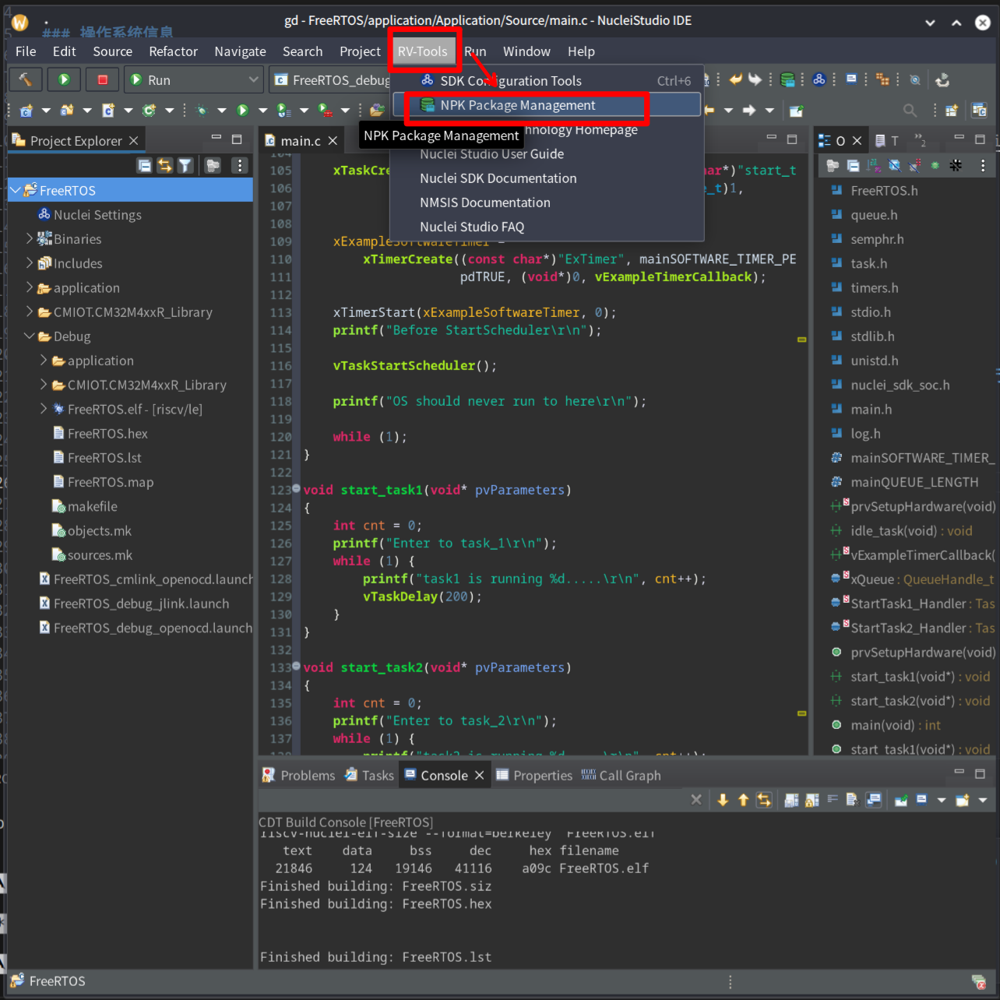
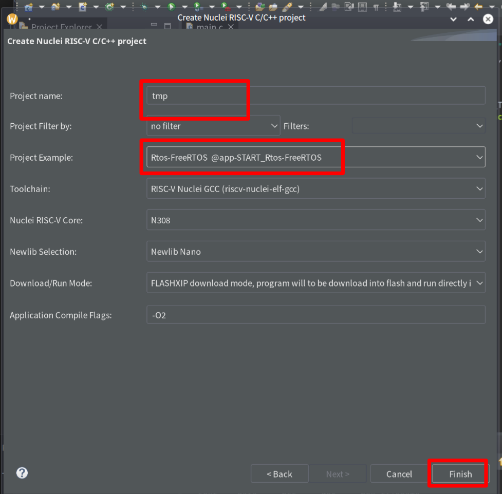

# FreeRTOS CM32M433R-START 测试报告

## 测试环境

### 操作系统信息

- 源码链接：https://github.com/CMIOT-XinShengTech/CMIOT.CM32M4xxR_Library
- 参考文档：https://www.rvmcu.com/quickstart-show-id-15.html
- 下载链接：
    - toolchain：https://download.nucleisys.com/upload/files/toolchain/gcc/nuclei_riscv_newlibc_prebuilt_linux64_2022.12.tar.bz2
    - IDE：https://download.nucleisys.com/upload/files/nucleistudio/NucleiStudio_IDE_202212-lin64.tgz
    - **请务必下载 2022/12 及以前的版本，否则会由于 Software Interface 过新导致 toolchain 不支持！**


### 硬件信息

- CM32M433R-START 开发板

## 安装步骤

**由于代码和 Makefile 由 IDE 根据 template 自动生成，至少需要用 IDE 生成一遍（或下载已经生成好的）后才可用命令行进行**

### IDE 配置

下载并打开 IDE 后，点击 `RV-Tools` -> `NPK Package Management`：


选择 1.2.2 版本后点击 `Download` 安装：


`File` -> `New` -> `New Nucei RISC-V C/C++ Project`创建工程：


选择板子并继续：


填入工程名并选择 template 为 FreeRTOS：



### 编译代码（IDE）

点击锤子图标，进行编译：


### 编译代码

下载并解压工具链，添加环境变量：
```bash
export PATH=path/to/your/toolchain/bin:$PATH
```

makefile 位于 `Debug` 目录下，执行：
```bash
make
```

即可构建。

### 烧写镜像（IDE）

连接 microusb 后，选择 cm-link_openocd 目标，点击运行。

### 烧写镜像（OpenOCD）

cfg 文件位于：`CMIOT.CM32M4xxR_Library/SoC/CM32M4xxR/Common`

### 启动系统

通过串口连接开发板。

## 预期结果

系统正常启动，能够通过板载串口查看信息。

## 实际结果

CFT

### 启动信息

屏幕录像（从编译到启动）：

```log
```

## 测试判定标准

测试成功：实际结果与预期结果相符。

测试失败：实际结果与预期结果不符。

## 测试结论

CFT