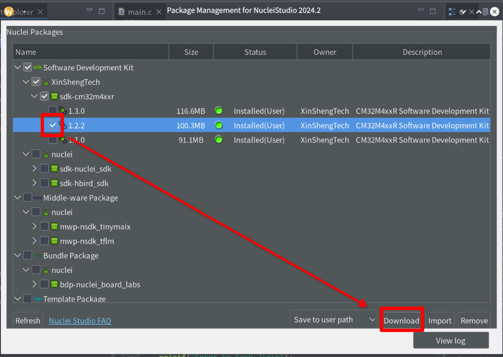
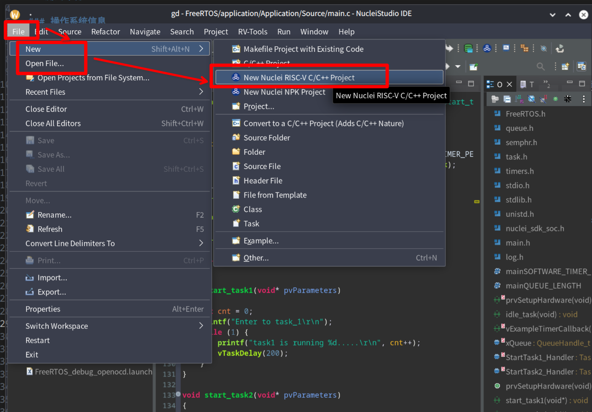
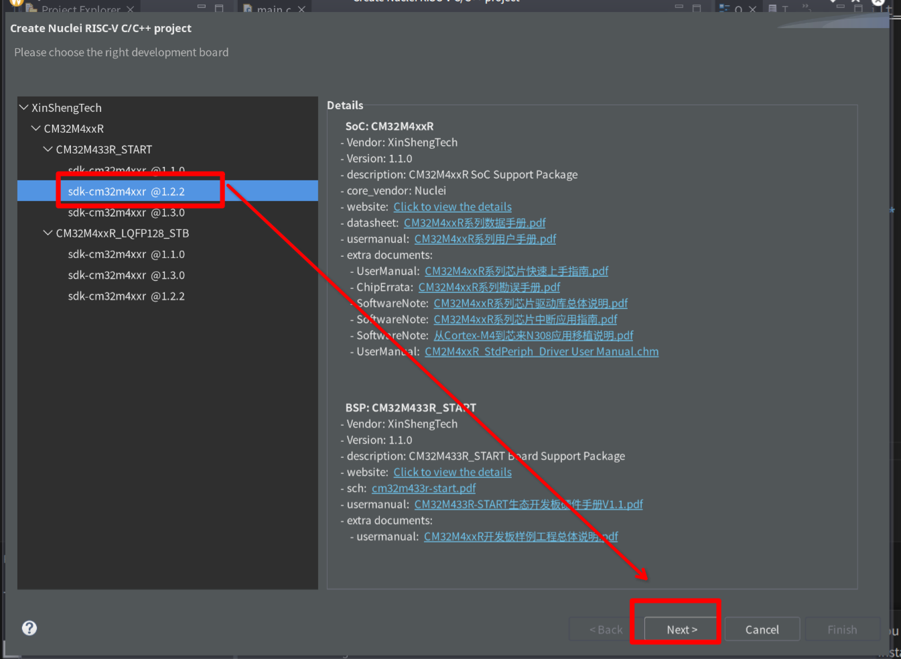
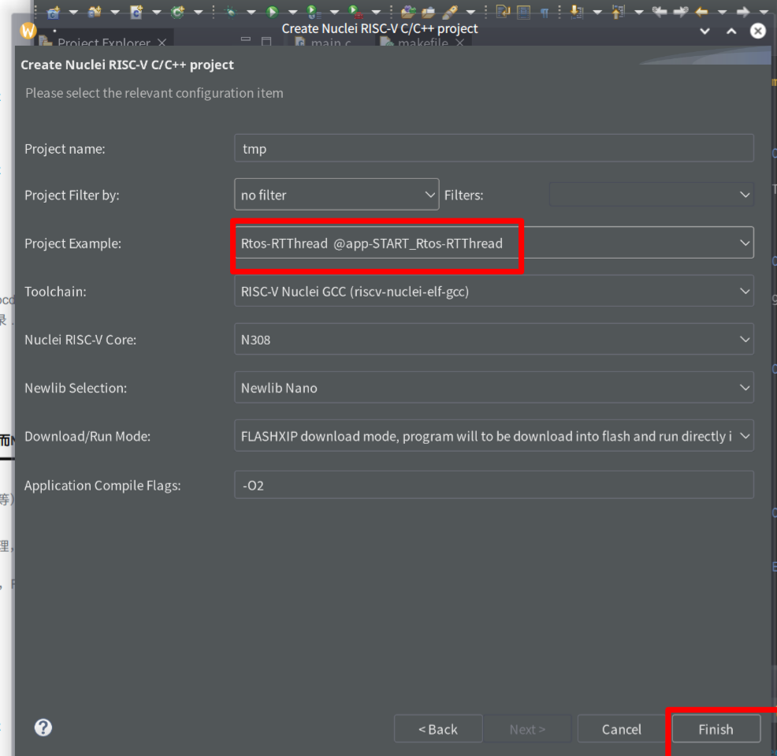
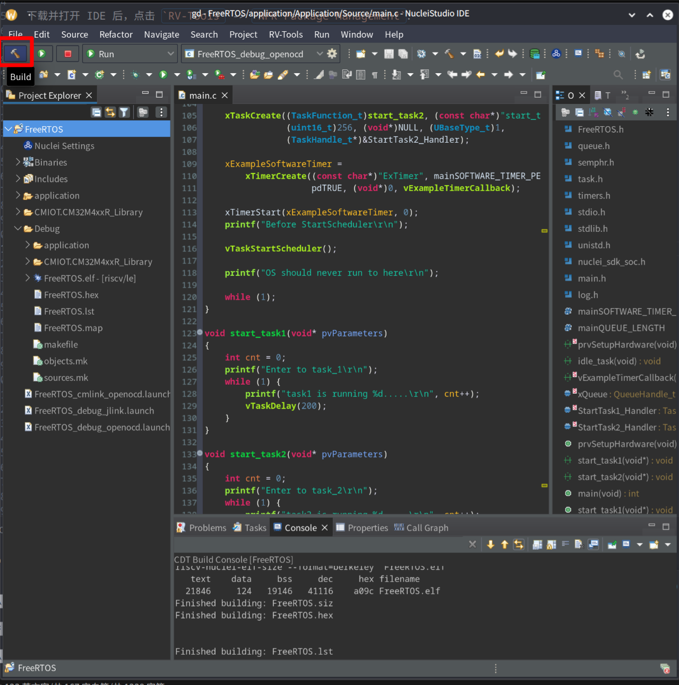

# RT-Thread CM32M433R-START Test Report

## Test Environment

### Operating System Information

- Source Code Link: https://github.com/CMIOT-XinShengTech/CMIOT.CM32M4xxR_Library
- Reference Installation Document: https://www.rvmcu.com/quickstart-show-id-15.html
- Downloads:
    - Toolchain: https://download.nucleisys.com/upload/files/toolchain/gcc/nuclei_riscv_newlibc_prebuilt_linux64_2022.12.tar.bz2
    - IDE: https://download.nucleisys.com/upload/files/nucleistudio/NucleiStudio_IDE_202212-lin64.tgz
    - **Make sure to download the version from December 2022 or earlier; otherwise, the toolchain won't support the newer Software Interface!**

### Hardware Information

- CM32M433R-START Development Board

## Installation Steps

**Since the code and Makefile are auto-generated by the IDE based on the template, you need to generate it at least once with the IDE (or download a pre-generated one) before using the command line.**

### IDE Setup

After downloading and opening the IDE, click on `RV-Tools` -> `NPK Package Management`:


Select version 1.2.2 and click `Download` to install:


Create a new project by going to `File` -> `New` -> `New Nuclei RISC-V C/C++ Project`:


Select the board and continue:


Enter the project name and choose RT-Thread as the template:


### Compiling the Code (IDE)

Click the hammer icon to compile:


### Compiling the Code

Download and extract the toolchain, then add it to the environment variables:
```bash
export PATH=path/to/your/toolchain/bin:$PATH
```

The Makefile is located in the `Debug` directory, run:
```bash
make
```

to build.

### Flashing the Image (IDE)

Connect the microUSB, select the cm-link_openocd target, and click run.

### Flashing the Image (OpenOCD)

The configuration file is located at: `CMIOT.CM32M4xxR_Library/SoC/CM32M4xxR/Common`

### Booting the System

Connect to the development board via the serial port.

## Expected Results

The system should boot normally, and information should be visible through the onboard serial port.

## Actual Results

CFT

### Boot Log

Screen recording (from compilation to boot):

```log
```

## Test Criteria

Successful: The actual result matches the expected result.

Failed: The actual result does not match the expected result.

## Test Conclusion

CFT
