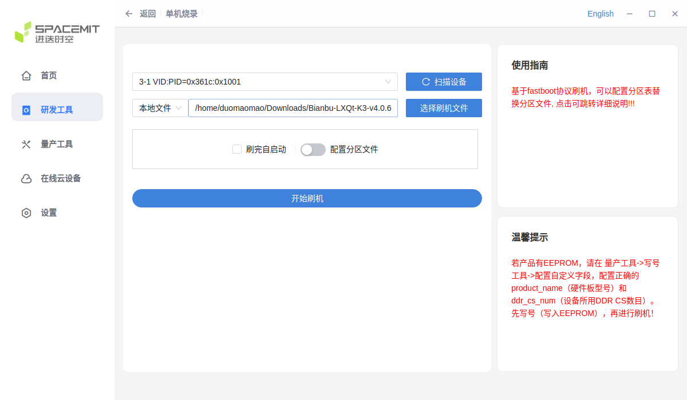
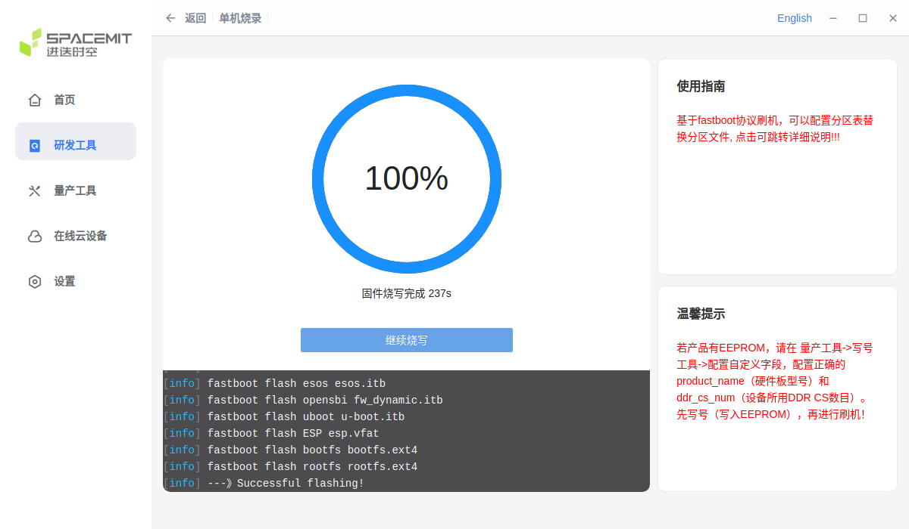
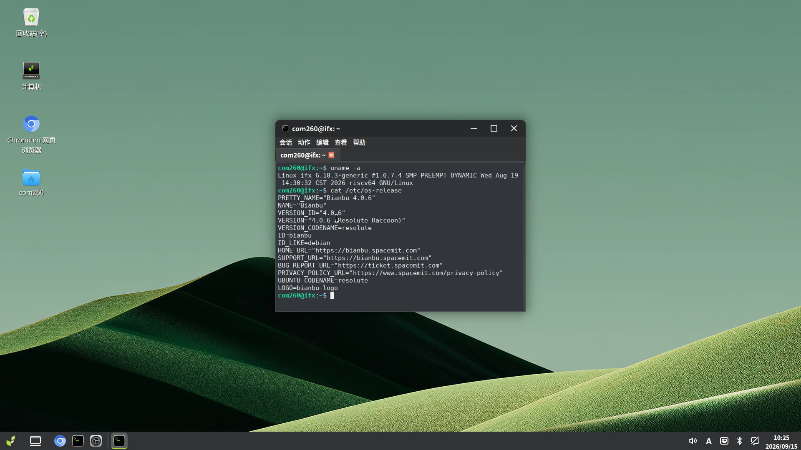

# Bianbu CoM260 Kit Test Report

## Test Environment

### System Information

- System Version: Bianbu LXQt K3 v4.0.6
- Download Link: [Here](https://archive.spacemit.com/image/k3/version/bianbu/v4.0.6/Bianbu-LXQt-K3-v4.0.6-20260819145902.tar.gz)
- Reference Installation Documentation: [Here](https://www.spacemit.com/community/document/info?lang=zh&nodepath=hardware/eco/k3_com260/com260_user_guide.md)

### Hardware Information

- CoM260 Kit, 16GB RAM / 128GB Storage
- DC Input (chassis rating): 19V / 2.37A or 12V / 5A
- USB Type-C Data Cable
- USB-to-TTL Serial Adapter and Jumper Wires
- 1 female-to-female jumper wire (for entering flashing mode)
- Network and Ethernet Cable

## Installation Steps

*The following steps use TITANTOOLS on Ubuntu (x86_64) to flash the image over USB.*

### Download the Flashing Tool

Download [TITANTOOLS FOR LINUX X64 (64-BIT) (APPIMAGE)](https://cloud.spacemit.com/prod-api/release/download/tools?token=titantools_for_linux_64BIT_APPIMAGE) as described in the [Flashing Tool User Manual](https://www.spacemit.com/community/document/info?lang=zh&nodepath=tools/user_guide/flasher_user_guide.md). In the download directory, make it executable and launch it:

```bash
chmod +x titantools_for_linux-2.2.0-Rc.AppImage
./titantools_for_linux-2.2.0-Rc.AppImage
```

### Enter Flashing Mode

Prepare 1 female-to-female jumper wire. Orient the board as shown below, with the USB and Ethernet ports at the bottom and the button header at the top. Count positions from the left end of the header toward the right in this orientation.


| Positions counted from the left | Signals to short | Purpose |
| --- | --- | --- |
| 3rd and 4th pins | `FC_REC` ↔ `GND` | Select flashing mode |

To short a pair of pins, connect one end of the same female-to-female jumper wire to each pin.

- **Device not powered**, with the board turned off:

    1. Disconnect DC power from CoM260.
    2. Disconnect the Type-C cable as well.
    3. Connect one end of the jumper wire to the 3rd pin, `FC_REC`, and the other end to the 4th pin, `GND`. Keep it connected.
    4. Connect DC power to power on CoM260.
    5. Wait 1–2 seconds.
    6. Remove the jumper wire from the header to release the short between the 3rd and 4th pins.
    7. Connect CoM260 to the Ubuntu host using a Type-C cable that supports data transfer.

### Flash the Image

1. Download the image above. In TITANTOOLS, select the single-device flashing option under the development tools.
2. Scan for devices and select the device corresponding to CoM260.
3. Select a local file, load `Bianbu-LXQt-K3-v4.0.6-20260819145902.tar.gz`, and wait for extraction to complete.

   

4. Start flashing. Wait for completion, then power-cycle the board.

   

### Logging into the System

Orient the board as shown in the pin diagram above, with the USB and Ethernet ports at the bottom and the header at the top. Count positions from the left end of the header toward the right, and connect the USB-to-TTL adapter using 3 jumper wires:

| Position counted from the left | CoM260 signal | USB-to-TTL adapter |
| --- | --- | --- |
| 6th | `GND` | `GND` |
| 9th | `UART_TXD` | `RXD` |
| 10th | `UART_RXD` | `TXD` |

Confirm that the UART signal voltage levels match before connecting. With the board powered off, connect the wires according to the adapter's pin labels. Leave the adapter's `VCC` disconnected, power the board through DC, and connect the adapter's USB end to the Mac or Linux host.

**Mac host:**

After installing [Homebrew](https://brew.sh/), install `tio` with:

```bash
brew install tio
```

Find serial devices in the Mac terminal:

```bash
find /dev -maxdepth 1 -name 'cu.*'
```

If multiple devices appear, compare the output before and after plugging in the USB-to-TTL adapter to identify the new device. The following command uses `/dev/cu.usbserial-1140` as an example serial device name; replace it with the device name found on your system:

```bash
tio -b 115200 /dev/cu.usbserial-1140
```

**Linux host:**

Install `tio` on Ubuntu / Debian:

```bash
sudo apt update
sudo apt install tio
```

For other Linux distributions, install `tio` using the appropriate package manager.

Find serial devices in the Linux terminal:

```bash
find /dev -maxdepth 1 \( -name 'ttyUSB*' -o -name 'ttyACM*' \)
```

If multiple devices appear, compare the output before and after plugging in the USB-to-TTL adapter to identify the new device. The following command uses `/dev/ttyUSB0` as an example serial device name; replace it with the device name found on your system:

```bash
sudo tio -b 115200 /dev/ttyUSB0
```

`tio` defaults to `8N1` with flow control disabled.

After connecting the serial terminal, power on the board once flashing is complete, monitor the boot output, and log in.

Default username: `root`

Default password: `bianbu`

### Common Issues

The Type-C port handles data transfer and flashing, but does not power the board. Connect the power supply through DCIN.

## Expected Results

The system boots up successfully and allows login through the serial port.

## Actual Results

The system boots up successfully and allows login through the serial port.

### Boot Log

Screen recording (from reboot to serial login and system information checks):

[](https://asciinema.org/a/cLpJ654oZL8LGIoY)

```log
root@k3:~# fastfetch
        _,met$$$$$gg.          root@k3
     ,g$$$$$$$$$$$$$$$P.       -------
   ,g$$P""       """Y$$.".     OS: Bianbu 4.0.6 riscv64
  ,$$P'              `$$$.     Host: SpacemiT K3 Com260 IFX
',$$P       ,ggs.     `$$b:    Kernel: Linux 6.18.3-generic
`d$$'     ,$P"'   .    $$$     Uptime: 10 mins
 $$P      d$'     ,    $$P     Packages: 2025 (dpkg)
 $$:      $$.   -    ,d$$'     Shell: bash 5.3.9
 $$;      Y$b._   _,d$P'       Display (VG2781-5K): 1920x1080 in 27", 60 Hz [External]
 Y$$.    `.`"Y$$$$P"'          Terminal: vt220
 `$$b      "-.__               CPU: k3-com260-ifx (16) @ 2.15 GHz
  `Y$$b                        GPU: PowerVR B-Series BXM-4-64 MC1 [Integrated]
   `Y$$.                       Memory: 592.74 MiB / 15.60 GiB (4%)
     `$$b.                     Swap: Disabled
       `Y$$b.                  Disk (/): 6.14 GiB / 116.78 GiB (5%) - ext4
         `"Y$b._               Local IP (end1): 192.168.1.88/24
             `""""             Locale: zh_CN.UTF-8

root@k3:~# uname -a
Linux k3 6.18.3-generic #1.0.7.4 SMP PREEMPT_DYNAMIC Wed Aug 19 14:30:32 CST 2026 riscv64 GNU/Linux

root@k3:~# cat /etc/os-release
PRETTY_NAME="Bianbu 4.0.6"
NAME="Bianbu"
VERSION_ID="4.0.6"
VERSION="4.0.6 (Resolute Raccoon)"
VERSION_CODENAME=resolute
ID=bianbu
ID_LIKE=debian
HOME_URL="https://bianbu.spacemit.com"
SUPPORT_URL="https://bianbu.spacemit.com"
BUG_REPORT_URL="https://ticket.spacemit.com"
PRIVACY_POLICY_URL="https://www.spacemit.com/privacy-policy"
UBUNTU_CODENAME=resolute
LOGO=bianbu-logo

root@k3:~# cat /proc/cpuinfo
processor	: 0
hart		: 0
model name	: Spacemit(R) X100
isa		: rv64imafdcvh_zicbom_zicbop_zicboz_zicntr_zicond_zicsr_zifencei_zihintntl_zihintpause_zihpm_zimop_zaamo_zalrsc_zawrs_zfa_zfbfmin_zfh_zfhmin_zca_zcb_zcd_zcmop_zba_zbb_zbc_zbs_zkt_zvbb_zvbc_zve32f_zve32x_zve64d_zve64f_zve64x_zvfbfmin_zvfbfwma_zvfh_zvfhmin_zvkb_zvkg_zvkned_zvknha_zvknhb_zvksed_zvksh_zvkt_smaia_smstateen_ssaia_sscofpmf_ssnpm_sstc_svade_svinval_svnapot_svpbmt_sdtrig
mmu		: sv39
uarch		: spacemit,x100
mvendorid	: 0x710
marchid		: 0x8000000058000002
mimpid		: 0x33d8a600
hart isa	: rv64imafdcvh_zicbom_zicbop_zicboz_zicntr_zicond_zicsr_zifencei_zihintntl_zihintpause_zihpm_zimop_zaamo_zalrsc_zawrs_zfa_zfbfmin_zfh_zfhmin_zca_zcb_zcd_zcmop_zba_zbb_zbc_zbs_zkt_zvbb_zvbc_zve32f_zve32x_zve64d_zve64f_zve64x_zvfbfmin_zvfbfwma_zvfh_zvfhmin_zvkb_zvkg_zvkned_zvknha_zvknhb_zvksed_zvksh_zvkt_smaia_smstateen_ssaia_sscofpmf_ssnpm_sstc_svade_svinval_svnapot_svpbmt_sdtrig
```

Desktop screenshot:


After completing the initial setup, log in to the system with the newly created user account:



## Test Criteria

Successful: The actual result matches the expected result.

Failed: The actual result does not match the expected result.

## Test Conclusion

Test successful.
