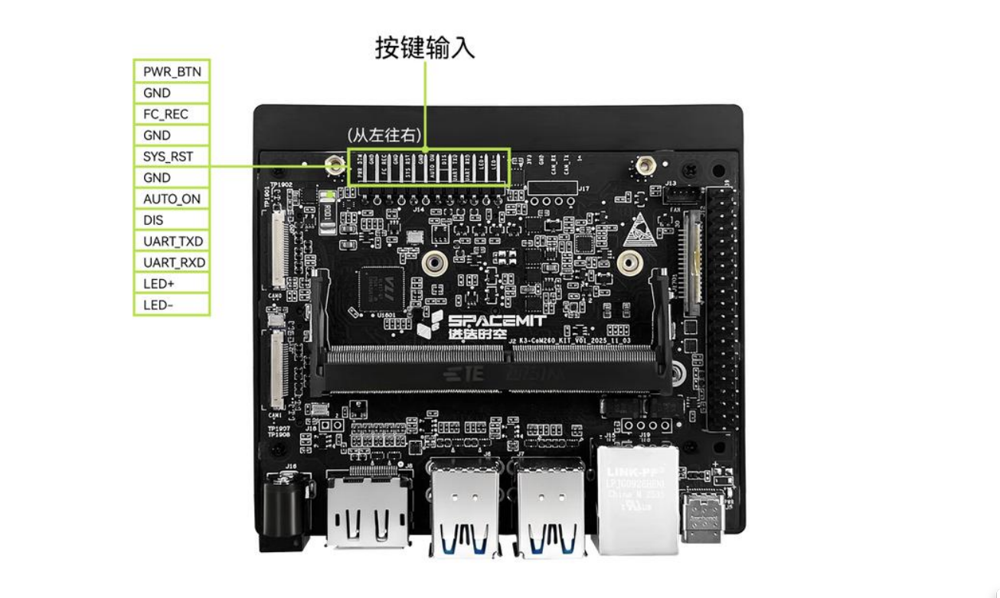
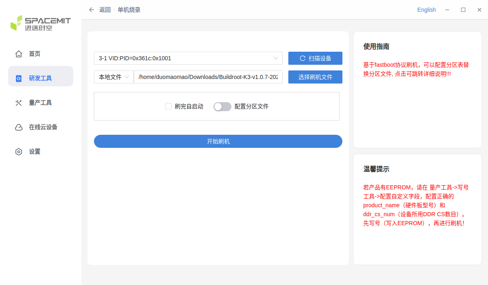
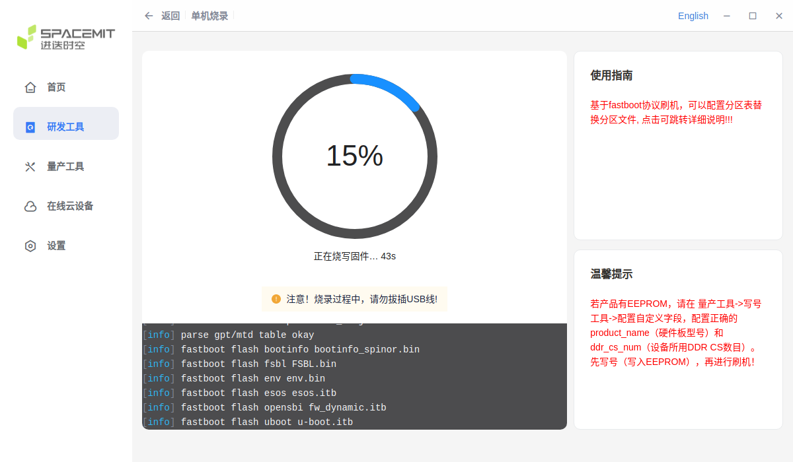
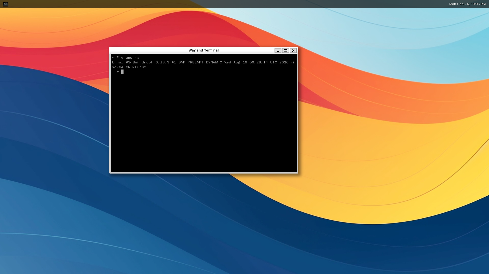

# Buildroot CoM260 Kit 版本测试报告

## 测试环境

### 操作系统信息

- 系统版本：SpacemiT Buildroot K3 v1.0.7
- 下载链接：https://archive.spacemit.com/image/k3/version/buildroot/v1.0.7/Buildroot-K3-v1.0.7-20260819142006.zip
- 参考安装文档：https://www.spacemit.com/community/document/info?lang=zh&nodepath=hardware/eco/k3_com260/com260_user_guide.md

### 硬件信息

- CoM260 Kit，16GB 内存 / 128GB 存储
- DC 供电（机身标注）：19V / 2.37A 或 12V / 5A
- USB Type-C 数据线
- USB 转 TTL 串口模块及杜邦线
- 母对母杜邦线 × 1（用于进入烧录模式）
- 网络和网线

## 安装步骤

*以下在 Ubuntu（x86_64）上使用 TITANTOOLS 通过 USB 刷写镜像。*

### 下载烧录工具

根据[刷机工具使用手册](https://www.spacemit.com/community/document/info?lang=zh&nodepath=tools/user_guide/flasher_user_guide.md)下载 [TITANTOOLS FOR LINUX X64 (64-BIT) (APPIMAGE)](https://cloud.spacemit.com/prod-api/release/download/tools?token=titantools_for_linux_64BIT_APPIMAGE)，在下载目录赋予执行权限并启动：

```bash
chmod +x titantools_for_linux-2.2.0-Rc.AppImage
./titantools_for_linux-2.2.0-Rc.AppImage
```

### 进入烧录模式

准备 1 根母对母杜邦线。按下图摆放开发板：USB 接口和网口朝下，按键排针位于上方。以下位置均从图中排针的左端向右数。



| 从左向右数的位置 | 短接信号 | 用途 |
| --- | --- | --- |
| 第 3 根与第 4 根引脚 | `FC_REC` ↔ `GND` | 选择烧录模式 |

短接时，将同一根母对母杜邦线的两端分别套在对应的 2 根引脚上。

- **设备未上电**，处于关机状态时：

    1. 拔掉 CoM260 DC 电源。
    2. Type-C 也先拔掉。
    3. 将杜邦线的一端接第 3 根引脚 `FC_REC`，另一端接第 4 根引脚 `GND`，保持连接。
    4. 插入 DC 电源，给 CoM260 上电。
    5. 等 1～2 秒。
    6. 从排针上拔掉杜邦线，解除第 3、4 根引脚之间的短接。
    7. 用支持数据传输的 Type-C 线连接 CoM260 和 Ubuntu 主机。

### 烧写镜像

1. 下载上述镜像，在 TITANTOOLS 中选择“研发工具”→“单机烧录”。
2. 点击“扫描设备”，选择 CoM260 对应的设备。
3. 选择“本地文件”，加载 `Buildroot-K3-v1.0.7-20260819142006.zip`，等待工具解压完成。

   

4. 点击“开始刷机”，等待烧录完成后，重新给开发板上电。

   

### 登录系统

按上方引脚图摆放开发板：USB 和网口朝下，排针在上方。以下位置从排针左端向右数，使用 3 根杜邦线连接 USB 转 TTL 模块：

| 从左向右数的位置 | CoM260 信号 | USB 转 TTL 模块 |
| --- | --- | --- |
| 第 6 根 | `GND` | `GND` |
| 第 9 根 | `UART_TXD` | `RXD` |
| 第 10 根 | `UART_RXD` | `TXD` |

接线前确认串口信号电平匹配，并在开发板断电时按模块针脚标注接线。模块的 `VCC` 不接，开发板通过 DC 电源供电，模块的 USB 端连接 Mac 或 Linux 主机。

**Mac 主机：**

安装 [Homebrew](https://brew.sh/) 后，使用以下命令安装 `tio`：

```bash
brew install tio
```

在 Mac 终端查找串口设备：

```bash
find /dev -maxdepth 1 -name 'cu.*'
```

若出现多个设备，可对比插入 USB 转 TTL 模块前后的输出，确定新增的设备。以下以 `/dev/cu.usbserial-1140` 为示例串口名，执行时请替换为实际查找到的设备名：

```bash
tio -b 115200 /dev/cu.usbserial-1140
```

**Linux 主机：**

在 Ubuntu / Debian 上安装 `tio`：

```bash
sudo apt update
sudo apt install tio
```

其他 Linux 发行版请使用对应的包管理器安装 `tio`。

在 Linux 终端查找串口设备：

```bash
find /dev -maxdepth 1 \( -name 'ttyUSB*' -o -name 'ttyACM*' \)
```

若出现多个设备，可对比插入 USB 转 TTL 模块前后的输出，确定新增的设备。以下以 `/dev/ttyUSB0` 为示例串口名，执行时请替换为实际查找到的设备名：

```bash
sudo tio -b 115200 /dev/ttyUSB0
```

`tio` 默认使用 `8N1`，流控关闭。

连接串口后，给已完成烧录的开发板上电，通过串口终端查看启动输出并登录系统。

默认用户名：`root`

默认密码：`bianbu`

### 常见问题

Type-C 接口用于数据传输和烧录，不为开发板供电；需通过 DCIN 接入电源。

## 预期结果

系统正常启动，能够通过串口登录系统。

## 实际结果

系统正常启动，能够通过串口登录系统。

### 启动信息

版本说明：镜像文件标注为 v1.0.7，实机 `/etc/os-release` 中的 `VERSION` 为 `k3-br-v1.0.6`。

屏幕录像（从重新上电到串口登录及系统信息检查）：

[](https://asciinema.org/a/x6K7vTDLs4InCYxb)

```log
# uname -a
Linux K3-Buildroot 6.18.3 #1 SMP PREEMPT_DYNAMIC Wed Aug 19 06:28:14 UTC 2026 riscv64 GNU/Linux
# cat /etc/os-release
NAME=Buildroot
VERSION=k3-br-v1.0.6
ID=buildroot
VERSION_ID=2025.02.6
PRETTY_NAME="Buildroot 2025.02.6"
# cat /proc/cpuinfo
processor	: 0
hart		: 0
model name	: Spacemit(R) X100
isa		: rv64imafdcvh_zicbom_zicbop_zicboz_zicntr_zicond_zicsr_zifencei_zihintntl_zihintpause_zihpm_zimop_zaamo_zalrsc_zawrs_zfa_zfbfmin_zfh_zfhmin_zca_zcb_zcd_zcmop_zba_zbb_zbc_zbs_zkt_zvbb_zvbc_zve32f_zve32x_zve64d_zve64f_zve64x_zvfbfmin_zvfbfwma_zvfh_zvfhmin_zvkb_zvkg_zvkned_zvknha_zvknhb_zvksed_zvksh_zvkt_smaia_smstateen_ssaia_sscofpmf_ssnpm_sstc_svade_svinval_svnapot_svpbmt_sdtrig
mmu		: sv39
uarch		: spacemit,x100
mvendorid	: 0x710
marchid		: 0x8000000058000002
mimpid		: 0x33d8a600
hart isa	: rv64imafdcvh_zicbom_zicbop_zicboz_zicntr_zicond_zicsr_zifencei_zihintntl_zihintpause_zihpm_zimop_zaamo_zalrsc_zawrs_zfa_zfbfmin_zfh_zfhmin_zca_zcb_zcd_zcmop_zba_zbb_zbc_zbs_zkt_zvbb_zvbc_zve32f_zve32x_zve64d_zve64f_zve64x_zvfbfmin_zvfbfwma_zvfh_zvfhmin_zvkb_zvkg_zvkned_zvknha_zvknhb_zvksed_zvksh_zvkt_smaia_smstateen_ssaia_sscofpmf_ssnpm_sstc_svade_svinval_svnapot_svpbmt_sdtrig
```

桌面截图：



若 Weston 桌面未自动启动，在开发板的串口终端执行：

```bash
/etc/init.d/S30weston-setup.sh start
```

## 测试判定标准

测试成功：实际结果与预期结果相符。

测试失败：实际结果与预期结果不符。

## 测试结论

测试成功。
