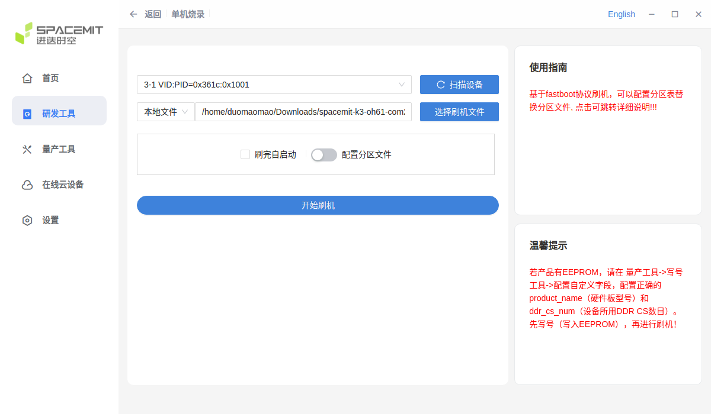
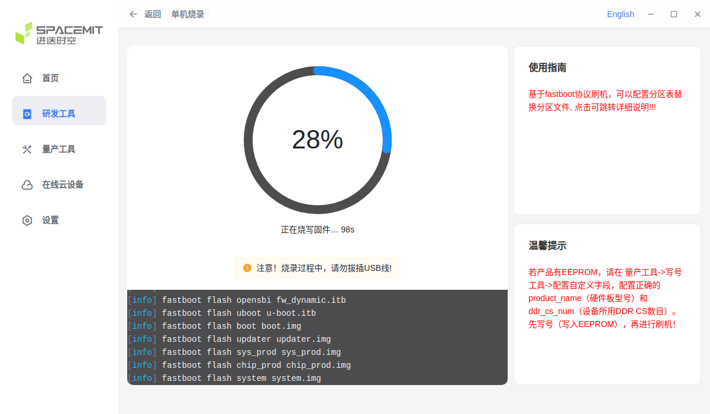

# OpenHarmony CoM260 Kit Test Report

## Test Environment

### System Information

- System Version: SpacemiT OpenHarmony 6.1 CoM260 normal V1.0
- Download Link: [Here](https://archive.spacemit.com/image/k1/version/openharmony/k3_oh6.1/com260/spacemit-k3-oh61-com260-normal-V1.0-20260515.zip)
- Reference Installation Documentation: [Here](https://www.spacemit.com/community/document/info?lang=zh&nodepath=hardware/eco/k3_com260/com260_user_guide.md)

### Hardware Information

- CoM260 Kit, 16GB RAM / 128GB Storage
- DC Input (chassis rating): 19V / 2.37A or 12V / 5A
- USB Type-C Data Cable
- USB-to-TTL Serial Adapter and Jumper Wires
- 1 female-to-female jumper wire (for entering flashing mode)
- Network and Ethernet Cable

## Installation Steps

*The following steps use TITANTOOLS on Ubuntu (x86_64) to flash the image over USB.*

### Download the Flashing Tool

Download [TITANTOOLS FOR LINUX X64 (64-BIT) (APPIMAGE)](https://cloud.spacemit.com/prod-api/release/download/tools?token=titantools_for_linux_64BIT_APPIMAGE) as described in the [Flashing Tool User Manual](https://www.spacemit.com/community/document/info?lang=zh&nodepath=tools/user_guide/flasher_user_guide.md). In the download directory, make it executable and launch it:

```bash
chmod +x titantools_for_linux-2.2.0-Rc.AppImage
./titantools_for_linux-2.2.0-Rc.AppImage
```

### Enter Flashing Mode

Prepare 1 female-to-female jumper wire. Orient the board as shown below, with the USB and Ethernet ports at the bottom and the button header at the top. Count positions from the left end of the header toward the right in this orientation.


| Positions counted from the left | Signals to short | Purpose |
| --- | --- | --- |
| 3rd and 4th pins | `FC_REC` ↔ `GND` | Select flashing mode |

To short a pair of pins, connect one end of the same female-to-female jumper wire to each pin.

- **Device not powered**, with the board turned off:

    1. Disconnect DC power from CoM260.
    2. Disconnect the Type-C cable as well.
    3. Connect one end of the jumper wire to the 3rd pin, `FC_REC`, and the other end to the 4th pin, `GND`. Keep it connected.
    4. Connect DC power to power on CoM260.
    5. Wait 1–2 seconds.
    6. Remove the jumper wire from the header to release the short between the 3rd and 4th pins.
    7. Connect CoM260 to the Ubuntu host using a Type-C cable that supports data transfer.

### Flash the Image

1. Download the image above. In TITANTOOLS, select the single-device flashing option under the development tools.
2. Scan for devices and select the device corresponding to CoM260.
3. Select a local file, load `spacemit-k3-oh61-com260-normal-V1.0-20260515.zip`, and wait for extraction to complete.

   

4. Start flashing. Wait for completion, then power-cycle the board.

   

### Logging into the System

Orient the board as shown in the pin diagram above, with the USB and Ethernet ports at the bottom and the header at the top. Count positions from the left end of the header toward the right, and connect the USB-to-TTL adapter using 3 jumper wires:

| Position counted from the left | CoM260 signal | USB-to-TTL adapter |
| --- | --- | --- |
| 6th | `GND` | `GND` |
| 9th | `UART_TXD` | `RXD` |
| 10th | `UART_RXD` | `TXD` |

Confirm that the UART signal voltage levels match before connecting. With the board powered off, connect the wires according to the adapter's pin labels. Leave the adapter's `VCC` disconnected, power the board through DC, and connect the adapter's USB end to the Mac or Linux host.

**Mac host:**

After installing [Homebrew](https://brew.sh/), install `tio` with:

```bash
brew install tio
```

Find serial devices in the Mac terminal:

```bash
find /dev -maxdepth 1 -name 'cu.*'
```

If multiple devices appear, compare the output before and after plugging in the USB-to-TTL adapter to identify the new device. The following command uses `/dev/cu.usbserial-1140` as an example serial device name; replace it with the device name found on your system:

```bash
tio -b 115200 /dev/cu.usbserial-1140
```

**Linux host:**

Install `tio` on Ubuntu / Debian:

```bash
sudo apt update
sudo apt install tio
```

For other Linux distributions, install `tio` using the appropriate package manager.

Find serial devices in the Linux terminal:

```bash
find /dev -maxdepth 1 \( -name 'ttyUSB*' -o -name 'ttyACM*' \)
```

If multiple devices appear, compare the output before and after plugging in the USB-to-TTL adapter to identify the new device. The following command uses `/dev/ttyUSB0` as an example serial device name; replace it with the device name found on your system:

```bash
sudo tio -b 115200 /dev/ttyUSB0
```

`tio` defaults to `8N1` with flow control disabled.

After connecting the serial terminal, power on the board once flashing is complete and monitor the boot output. The original image fails to boot by default. During this test, after the temporary boot procedure described under "Boot Log", pressing Enter opened a `root` shell without prompting for a username or password.

### Common Issues

The Type-C port handles data transfer and flashing, but does not power the board. Connect the power supply through DCIN.

## Expected Results

The system boots up successfully and allows login through the serial port.

## Actual Results

The system fails to boot normally, and login through the serial port is unavailable.

### Boot Log

Default boot failure with the original image (excerpt):

```log
[   4.391] Try to boot from scsi0 ...
[   4.394] product_name: k3_com260_ifx
[   4.395] match dtb by product_nameeeeeeee: /k3_com260_ifx.dtb
[   4.401] select /k3_com260_ifx.dtb to load
[   4.405] Loading kernel...
[   4.453] 33835008 bytes read in 45 ms (717.1 MiB/s)
[   4.455] Loading dtb...
[   4.458] Failed to load '/k3_com260_ifx.dtb'
[   4.462] load dtb from bootfs fail, use built-in dtb
[   4.467] Loading ramdisk ...
[   4.475] 3423793 bytes read in 6 ms (544.2 MiB/s)
No FDT memory address configured. Please configure
the FDT address via "fdt addr <address>" command.
Aborting!
[   4.486] Moving Image from 0x140000000 to 0x102200000, end=1042d5000
[   4.499]    Loading Ramdisk to 3fba2e000, end 3fbd71e31 ... OK
[   4.502] Device tree not found or missing FDT support
### ERROR ### Please RESET the board ###
```

Temporary boot verification:

During this test, repeatedly sending `s` and spaces through the serial terminal when the U-Boot startup message appeared interrupted automatic boot and opened the `=>` prompt. The following commands were then executed:

```text
ls scsi 0:1 /
load scsi 0:1 ${fdt_addr_r} /k3_com260.dtb
fdt addr ${fdt_addr_r}
fdt print / model
fdt print / compatible
setenv dtb_env 'setenv dtb_name /k3_com260.dtb'
run bootcmd
```

The device tree had been selected manually with `fdt addr` for inspection. In this session, `run bootcmd` loaded the kernel, device tree, and ramdisk, but then took the `bootm` branch and returned to the `=>` prompt with:

```log
Wrong Image Format for bootm command
ERROR: can't get kernel image!
```

The loaded images were then booted explicitly with:

```text
booti ${kernel_addr_r} ${ramdisk_combo} ${fdt_addr_r}
```

The kernel started successfully. After pressing Enter at the serial terminal, the following system information was obtained:

```log
# id
uid=0(root) gid=2000(shell) groups=2000(shell),1007(log),3009(readproc)
# uname -a
Linux localhost 6.18.3 #1 SMP PREEMPT_DYNAMIC Fri May 15 12:39:35 CST 2026 riscv64 Toybox
# param get const.ohos.fullname
OpenHarmony-6.1.0.31
```

Desktop screenshot:

The original image fails to boot by default because `/k3_com260_ifx.dtb` is missing. The screenshot below shows the OpenHarmony desktop after temporarily selecting the existing `/k3_com260.dtb` in U-Boot and booting the kernel. The U-Boot environment was not saved, and automatic boot after a restart has not been verified.


## Test Criteria

Successful: The actual result matches the expected result.

Failed: The actual result does not match the expected result.

## Test Conclusion

Test failed / CFH
