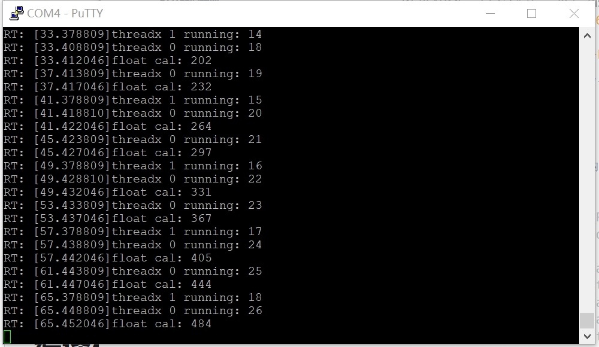

# ThreadX Milk-V Duo Test Report

## Test Environment

### Operating System Information

- Build System Version: Ubuntu 22.04 LTS x86_64
- System Version: [ThreadX-to-RISC-V64](https://github.com/saicogn/ThreadX-to-RISC-V64), commit [53010e6](https://github.com/saicogn/ThreadX-to-RISC-V64/commit/53010e6b5e5916c5e84c4faf4d1a93ad960dd566)
- Source Code Link: [ThreadX-to-RISC-V64](https://github.com/saicogn/ThreadX-to-RISC-V64)
- Reference Installation Document: [Introduction](https://github.com/saicogn/ThreadX-to-RISC-V64/blob/main/README.md)

### Hardware Information

- Milk-V Duo 64M
- One USB Power Adapter
- One USB-A to C or USB C to C Cable
- One TF Card
- One USB to UART Debugger (e.g., CH340, CH341, FT2232)
- Three Dupont Wires
- Header pins pre-soldered to the Milk-V Duo for debugging purposes

## Build Steps

### Prepare System Environment

```bash
sudo apt install -y pkg-config build-essential ninja-build automake autoconf libtool wget curl git gcc libssl-dev bc slib squashfs-tools android-sdk-libsparse-utils jq python3-distutils scons parallel tree python3-dev python3-pip device-tree-compiler ssh cpio fakeroot libncurses5 flex bison libncurses5-dev genext2fs rsync unzip dosfstools mtools tcl openssh-client cmake expect -y
```

### Download and Build

```bash
git clone https://github.com/milkv-duo/duo-buildroot-sdk.git --depth=1
cd duo-buildroot-sdk/
./build.sh milkv-duo -j${nproc}
```

This process will generate an image file `out/milkv-duo-????????-????.img`. This is the image file.

If the process is not normal, please refer to the [project introduction](https://github.com/milkv-duo/duo-buildroot-sdk/blob/develop/README-zh.md) to troubleshoot.

### Extract ThreadX-to-RISC-V64

Run in `duo-buildroot-sdk`.

```bash
git clone https://github.com/saicogn/ThreadX-to-RISC-V64.git --depth=1
```

Then modify `build/milkvsetup.sh`. Around line 455.

```text
  FREERTOS_PATH="$TOP_DIR"/freertos
```

Modify as follows:

```text
  #FREERTOS_PATH="$TOP_DIR"/freertos # 修改此项
  FREERTOS_PATH="$TOP_DIR"/ThreadX-to-RISC-V64
```

Then build.

```bash
./build.sh milkv-duo -j${nproc}
```

This process will generate an image file `out/milkv-duo-????????-????.img`. This is the image file. Write it to the SD card.

### Prepare TF Card

Write the generated `out/milkv-duo-????????-????.img` to the TF card. Rufus can be used.

### Logging into the System

Logging into the system via the serial port.

## Expected Results

The system should boot up normally and output threadx-related information.

## Actual Results

The system boots up normally and outputs threadx-related information.

### Boot Log

The serial port output after boot is as follows.

```text
[root@milkv-duo]~# RT: [9.378810]threadx 1 running: 11
RT: [9.381959]threadx 0 running: 12
RT: [9.385273]float cal: 54
RT: [13.383809]threadx 0 running: 13
RT: [13.387046]float cal: 75
RT: [17.378809]threadx 1 running: 12
RT: [17.388810]threadx 0 running: 14
RT: [17.392046]float cal: 97
RT: [21.393809]threadx 0 running: 15
RT: [21.397046]float cal: 121
RT: [25.378809]threadx 1 running: 13
RT: [25.398810]threadx 0 running: 16
RT: [25.402046]float cal: 147
RT: [29.403809]threadx 0 running: 17
RT: [29.407046]float cal: 174
RT: [33.378809]threadx 1 running: 14
RT: [33.408809]threadx 0 running: 18
RT: [33.412046]float cal: 202
RT: [37.413809]threadx 0 running: 19
RT: [37.417046]float cal: 232
```

Screenshot:



## Test Criteria

Successful: The actual result matches the expected result.

Failed: The actual result does not match the expected result.

## Test Conclusion

Test successful.
