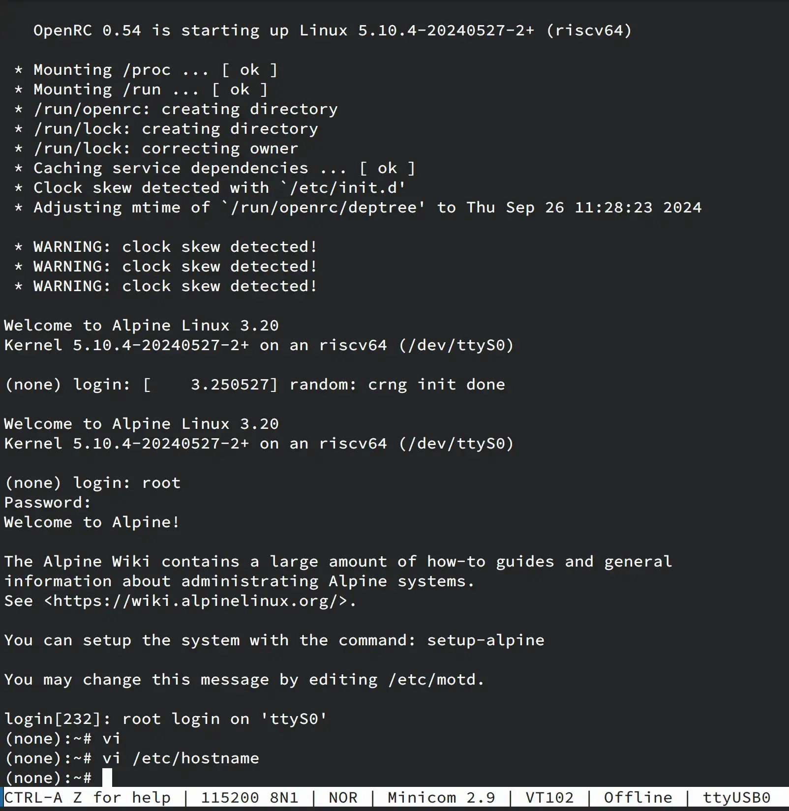

# Alpine Linux Milk-V Duo 256M Test Report

## Test Environment

### Operating System Information

- System Version: 3.20.3 riscv64
- Download Link: 
  - Alpine minirootfs: [https://alpinelinux.org/downloads/](https://dl-cdn.alpinelinux.org/alpine/v3.20/releases/riscv64/alpine-minirootfs-3.20.3-riscv64.tar.gz)
  - Latest Duo 256M Debian image (for the kernel and its modules): [https://github.com/Fishwaldo/sophgo-sg200x-debian/releases/](https://github.com/Fishwaldo/sophgo-sg200x-debian/releases/download/v1.4.0/duo256_sd.img.lz4)
- Reference Installation Document: 
  - [Alpine Wiki (Installation)](https://wiki.alpinelinux.org/wiki/Installation)
  - [Alpine Wiki (How to make a cross architecture chroot)](https://wiki.alpinelinux.org/wiki/How_to_make_a_cross_architecture_chroot)

### Hardware Information

- Milk-V Duo 256M
- A USB-A to C or USB-C to C cable
- A microSD card
- A microSD card reader
- A USB to UART debugger (e.g., CH340, CH341, FT2232, etc.)
- Optional: Milk-V Duo IOB (Baseboard)

## Installation Steps

### Download Alpine minirootfs and Debian image

We will use the kernel and kernel modules from Fishwaldo's Duo 256M Debian image.

```bash
wget https://dl-cdn.alpinelinux.org/alpine/v3.20/releases/riscv64/alpine-minirootfs-3.20.3-riscv64.tar.gz
tar -xvf alpine-minirootfs-3.20.3-riscv64.tar.gz
wget https://github.com/Fishwaldo/sophgo-sg200x-debian/releases/download/v1.4.0/duo256_sd.img.lz4
lz4 -d duo256_sd.img.lz4
```

### Prepare rootfs
Note that the obtained Alpine system is only a "minirootfs" without system packages such as OpenRC. We need to install Alpine's base packages using `apk` inside the rootfs in order to make it bootable.

#### Install Alpine's package manager `apk`
Skip this step if using Alpine-based distributions on host. Otherwise install `apk-tools` on your distribution (e.g. on Arch Linux: `sudo pacman -S apk-tools`).

run `apk --help` to verify installation.

#### Install Alpine's base package `alpine-base` inside minirootfs

(`chroot` is NOT required)

```bash
cd alpine-minirootfs-3.20.3-riscv64
sudo apk add -p . --initdb -U --arch riscv64 --allow-untrusted alpine-base
```

#### Extra setups

1. Edit `./etc/inittab` and add the following line (or uncomment) to enable serial access on `/dev/ttyS0`:
    ```
    ttyS0::respawn:/sbin/getty -L 115200 ttyS0 vt100
    ```

2. Edit `./etc/passwd`:

    Remove the `x` in `root:x:0:0:root:/root:/bin/sh`.

    (Alternatively, edit `/etc/shadow` and remove the `*` in `root:*::0:::::`). 

### Flash Debian image (to install the kernel and its modules)

```bash
cd ..
sudo dd if=duo256_sd.img of=/dev/your/device bs=4M status=progress
```

Your device should now be able to detect the `root` and `boot` partitions on the SD card.

Mount only the `root` partition. Inside the partition, backup `/lib/modules` to somewhere on host:

```bash
cd /path/to/your/mnt/root
mv lib/modules /path/to/your/backup
```

### Replace root on SD card with Alpine rootfs
```bash
rm -rf /path/to/your/mnt/root/*
cp -r /path/to/your/alpine-minirootfs-3.20.3-riscv64/* /path/to/your/mnt/root/
mv /path/to/your/backup/lib/modules /path/to/your/mnt/root/lib/
```

### Booting and Logging into the System

Insert SD card onto the board and boot.
Login into the system via serial port at `/dev/ttyUSB0`, baudrate 115200.

Default username: `root`
Default password: none

#### Optional post-installation setups
Setup the password and hostname with `passwd` and `hostname` after login. 

Setup the system time with `date -s`, then install `cronyd`:
```bash
apk add cronyd
rc-update add chronyd default
```

It is recommended to enable the following system OpenRC services (though test results show that the system will still be able to boot nevertheless):

```bash
rc-update add hostname boot # required or hostname will not be set properly
rc-update add bootmisc boot
rc-update add networking boot # make sure /etc/network/interfaces is present
rc-update add devfs sysinit
rc-update add mdev sysinit
rc-update add acpid default
rc-update add killprocs shutdown
rc-update add mount-ro shutdown
rc-update add savecache shutdown
```

## Expected Results

The system should boot normally and allow login through the onboard serial port.

## Actual Results

The system booted successfully, and login through the onboard serial port was also successful.

Example `minicom` screenshot:

### Boot Log
```log
Retrieving file: /vmlinuz-5.10.4-20240527-2+
5084068 bytes read in 227 ms (21.4 MiB/s)
append: root=/dev/root console=ttyS0,115200 earlycon=sbi root=/dev/mmcblk0p2 rootwait rw
Retrieving file: /fdt/linux-image-duo256-5.10.4-20240527-2+/cv181x_milkv_duo256m_sd.dtb
21274 bytes read in 4 ms (5.1 MiB/s)
   Uncompressing Kernel Image
   Decompressing 9347584 bytes used 209ms
## Flattened Device Tree blob at 81200000
   Booting using the fdt blob at 0x81200000
   Loading Device Tree to 000000008f274000, end 000000008f27c319 ... OK

Starting kernel ...

[    0.000000] Linux version 5.10.4-20240527-2+ (root@5f7f3a8ec75c) (riscv64-unknown-linux-musl-gcc (Xuantie-900 linux-5.10.4 musl gcc Toolc4
[    0.000000] earlycon: sbi0 at I/O port 0x0 (options '')
[    0.000000] printk: bootconsole [sbi0] enabled
[    0.000000] efi: UEFI not found.
[    0.000000] Reserved memory: created DMA memory pool at 0x000000008f530000, size 1 MiB
[    0.000000] OF: reserved mem: initialized node vdev0buffer, compatible id shared-dma-pool
[    0.000000] Reserved memory: created DMA memory pool at 0x000000008f528000, size 0 MiB
[    0.000000] OF: reserved mem: initialized node vdev0vring0, compatible id shared-dma-pool
[    0.000000] Reserved memory: created DMA memory pool at 0x000000008f52c000, size 0 MiB
[    0.000000] OF: reserved mem: initialized node vdev0vring1, compatible id shared-dma-pool
[    0.000000] Zone ranges:
[    0.000000]   DMA32    [mem 0x0000000080000000-0x000000008fdfffff]
[    0.000000]   Normal   empty
[    0.000000] Movable zone start for each node
[    0.000000] Early memory node ranges
[    0.000000]   node   0: [mem 0x0000000080000000-0x000000008f527fff]
[    0.000000]   node   0: [mem 0x000000008f630000-0x000000008fdfffff]
[    0.000000] Initmem setup node 0 [mem 0x0000000080000000-0x000000008fdfffff]
[    0.000000] SBI specification v0.3 detected
[    0.000000] SBI implementation ID=0x1 Version=0x9
[    0.000000] SBI v0.2 TIME extension detected
[    0.000000] SBI v0.2 IPI extension detected
[    0.000000] SBI v0.2 RFENCE extension detected
[    0.000000] riscv: ISA extensions acdfimsuv
[    0.000000] riscv: ELF capabilities acdfimv
[    0.000000] Built 1 zonelists, mobility grouping on.  Total pages: 63744
[    0.000000] Kernel command line: root=/dev/root console=ttyS0,115200 earlycon=sbi root=/dev/mmcblk0p2 rootwait rw
[    0.000000] Dentry cache hash table entries: 32768 (order: 6, 262144 bytes, linear)
[    0.000000] Inode-cache hash table entries: 16384 (order: 5, 131072 bytes, linear)
[    0.000000] Sorting __ex_table...
[    0.000000] mem auto-init: stack:off, heap alloc:off, heap free:off
[    0.000000] Memory: 240652K/259040K available (5745K kernel code, 727K rwdata, 2436K rodata, 160K init, 280K bss, 18388K reserved, 0K cma)
[    0.000000] SLUB: HWalign=64, Order=0-3, MinObjects=0, CPUs=1, Nodes=1
[    0.000000] NR_IRQS: 64, nr_irqs: 64, preallocated irqs: 0
[    0.000000] riscv-intc: 64 local interrupts mapped
[    0.000000] plic: interrupt-controller@70000000: mapped 101 interrupts with 1 handlers for 2 contexts.
[    0.000000] random: get_random_bytes called from start_kernel+0x256/0x33a with crng_init=0
[    0.000000] riscv_timer_init_dt: Registering clocksource cpuid [0] hartid [0]
[    0.000000] clocksource: riscv_clocksource: mask: 0xffffffffffffffff max_cycles: 0x5c40939b5, max_idle_ns: 440795202646 ns
[    0.000008] sched_clock: 64 bits at 25MHz, resolution 40ns, wraps every 4398046511100ns
[    0.008448] Console: colour dummy device 80x25
[    0.013074] Calibrating delay loop (skipped), value calculated using timer frequency.. 50.00 BogoMIPS (lpj=100000)
[    0.023769] pid_max: default: 4096 minimum: 301
[    0.028661] Mount-cache hash table entries: 512 (order: 0, 4096 bytes, linear)
[    0.036060] Mountpoint-cache hash table entries: 512 (order: 0, 4096 bytes, linear)
[    0.045577] ASID allocator initialised with 65536 entries
[    0.051743] EFI services will not be available.
[    0.056791] devtmpfs: initialized
[    0.066502] early_time_log: do_initcalls: 9065991us
[    0.072237] clocksource: jiffies: mask: 0xffffffff max_cycles: 0xffffffff, max_idle_ns: 7645041785100000 ns
[    0.082258] futex hash table entries: 16 (order: -4, 384 bytes, linear)
[    0.089273] pinctrl core: initialized pinctrl subsystem
[    0.095227] NET: Registered protocol family 16
[    0.100224] DMA: preallocated 128 KiB GFP_KERNEL pool for atomic allocations
[    0.107531] DMA: preallocated 128 KiB GFP_KERNEL|GFP_DMA32 pool for atomic allocations
[    0.116334] thermal_sys: Registered thermal governor 'fair_share'
[    0.116343] thermal_sys: Registered thermal governor 'bang_bang'
[    0.122589] thermal_sys: Registered thermal governor 'step_wise'
[    0.128839] thermal_sys: Registered thermal governor 'user_space'
[    0.148709] OF: /gpio@03020000/gpio-controller@0: could not find phandle
[    0.161994] OF: /gpio@03021000/gpio-controller@1: could not find phandle
[    0.168983] OF: /gpio@03022000/gpio-controller@2: could not find phandle
[    0.175972] OF: /gpio@03023000/gpio-controller@3: could not find phandle
[    0.182960] OF: /gpio@05021000/gpio-controller@4: could not find phandle
[    0.191714] clk reset: nr_reset=64 resource_size=8
[    0.197134] get audio clk=24576000
[    0.200657] cvitek-i2s-subsys 4108000.i2s_subsys: Set clk_sdma_aud0~3 to 24576000
[    0.218009] HugeTLB registered 1.00 GiB page size, pre-allocated 0 pages
[    0.224888] HugeTLB registered 2.00 MiB page size, pre-allocated 0 pages
[    0.237758] dw_dmac 4330000.dma: CVITEK DMA Controller, 8 channels, probe done!
[    0.245988] usbcore: registered new interface driver usbfs
[    0.251687] usbcore: registered new interface driver hub
[    0.257228] usbcore: registered new device driver usb
[    0.263753] mc: Linux media interface: v0.10
[    0.268186] videodev: Linux video capture interface: v2.00
[    0.274649] Advanced Linux Sound Architecture Driver Initialized.
[    0.281630] Bluetooth: Core ver 2.22
[    0.285354] NET: Registered protocol family 31
[    0.289926] Bluetooth: HCI device and connection manager initialized
[    0.296562] Bluetooth: HCI socket layer initialized
[    0.301666] Bluetooth: L2CAP socket layer initialized
[    0.307008] Bluetooth: SCO socket layer initialized
[    0.312704] clocksource: Switched to clocksource riscv_clocksource
[    0.330591] NET: Registered protocol family 2
[    0.335935] tcp_listen_portaddr_hash hash table entries: 256 (order: 0, 4096 bytes, linear)
[    0.344555] TCP established hash table entries: 2048 (order: 2, 16384 bytes, linear)
[    0.352593] TCP bind hash table entries: 2048 (order: 2, 16384 bytes, linear)
[    0.360017] TCP: Hash tables configured (established 2048 bind 2048)
[    0.366831] MPTCP token hash table entries: 256 (order: 0, 6144 bytes, linear)
[    0.374316] UDP hash table entries: 128 (order: 0, 4096 bytes, linear)
[    0.381072] UDP-Lite hash table entries: 128 (order: 0, 4096 bytes, linear)
[    0.388524] NET: Registered protocol family 1
[    0.393587] RPC: Registered named UNIX socket transport module.
[    0.399661] RPC: Registered udp transport module.
[    0.404567] RPC: Registered tcp transport module.
[    0.409494] RPC: Registered tcp NFSv4.1 backchannel transport module.
[    0.417465] Initialise system trusted keyrings
[    0.422284] workingset: timestamp_bits=46 max_order=16 bucket_order=0
[    0.438206] squashfs: version 4.0 (2009/01/31) Phillip Lougher
[    0.445210] Installing knfsd (copyright (C) 1996 okir@monad.swb.de).
[    0.452585] jffs2: version 2.2. (NAND) © 2001-2006 Red Hat, Inc.
[    0.459424] fuse: init (API version 7.32)
[    0.519343] Key type asymmetric registered
[    0.523529] Asymmetric key parser 'x509' registered
[    0.528620] Asymmetric key parser 'pkcs8' registered
[    0.533881] Block layer SCSI generic (bsg) driver version 0.4 loaded (major 249)
[    0.547154] Serial: 8250/16550 driver, 5 ports, IRQ sharing disabled
[    0.555985] printk: console [ttyS0] disabled
[    0.569474] printk: console [ttyS0] enabledx4140000 (irq = 15, base_baud = 1562500) is a 16550A
[    0.569474] printk: console [ttyS0] enabled
[    0.578043] printk: bootconsole [sbi0] disabled
[    0.578043] printk: bootconsole [sbi0] disabled
[    0.588676] wireguard: WireGuard 1.0.0 loaded. See www.wireguard.com for information.
[    0.596813] wireguard: Copyright (C) 2015-2019 Jason A. Donenfeld <Jason@zx2c4.com>. All Rights Reserved.
[    0.607494] libphy: Fixed MDIO Bus: probed
[    0.611776] tun: Universal TUN/TAP device driver, 1.6
[    0.617634] bm-dwmac 4070000.ethernet: IRQ eth_wake_irq not found
[    0.623980] bm-dwmac 4070000.ethernet: IRQ eth_lpi not found
[    0.629925] bm-dwmac 4070000.ethernet: Hash table entries set to unexpected value 0
[    0.637968] bm-dwmac 4070000.ethernet: no reset control found
[    0.644144] bm-dwmac 4070000.ethernet: User ID: 0x10, Synopsys ID: 0x37
[    0.651022] bm-dwmac 4070000.ethernet:       DWMAC1000
[    0.655905] bm-dwmac 4070000.ethernet: DMA HW capability register supported
[    0.663115] bm-dwmac 4070000.ethernet: RX Checksum Offload Engine supported
[    0.670326] bm-dwmac 4070000.ethernet: COE Type 2
[    0.675204] bm-dwmac 4070000.ethernet: TX Checksum insertion supported
[    0.681965] bm-dwmac 4070000.ethernet: Normal descriptors
[    0.687561] bm-dwmac 4070000.ethernet: Ring mode enabled
[    0.693066] bm-dwmac 4070000.ethernet: Enable RX Mitigation via HW Watchdog Timer
[    0.700816] bm-dwmac 4070000.ethernet: device MAC address a6:45:37:ce:05:16
[    0.732483] libphy: stmmac: probed
[    0.736075] CVITEK CV182XA stmmac-0:00: attached PHY driver [CVITEK CV182XA] (mii_bus:phy_addr=stmmac-0:00, irq=POLL)
[    0.747066] CVITEK CV182XA stmmac-0:01: attached PHY driver [CVITEK CV182XA] (mii_bus:phy_addr=stmmac-0:01, irq=POLL)
[    0.759248] bm-dwmac 4070000.ethernet: Cannot get clk_500m_eth!
[    0.765447] bm-dwmac 4070000.ethernet: Cannot get gate_clk_axi4!
[    0.771872] PPP generic driver version 2.4.2
[    0.776606] NET: Registered protocol family 24
[    0.781273] SLIP: version 0.8.4-NET3.019-NEWTTY (dynamic channels, max=256).
[    0.789314] dwc2 4340000.usb: axi clk installed
[    0.794045] dwc2 4340000.usb: apb clk installed
[    0.798751] dwc2 4340000.usb: 125m clk installed
[    0.803545] dwc2 4340000.usb: 33k clk installed
[    0.808248] dwc2 4340000.usb: 12m clk installed
[    0.813028] dwc2 4340000.usb: EPs: 8, dedicated fifos, 3072 entries in SPRAM
[    0.820851] dwc2 4340000.usb: DWC OTG Controller
[    0.825688] dwc2 4340000.usb: new USB bus registered, assigned bus number 1
[    0.832940] dwc2 4340000.usb: irq 34, io mem 0x04340000
[    0.838615] usb usb1: New USB device found, idVendor=1d6b, idProduct=0002, bcdDevice= 5.10
[    0.847187] usb usb1: New USB device strings: Mfr=3, Product=2, SerialNumber=1
[    0.854666] usb usb1: Product: DWC OTG Controller
[    0.859544] usb usb1: Manufacturer: Linux 5.10.4-20240527-2+ dwc2_hsotg
[    0.866394] usb usb1: SerialNumber: 4340000.usb
[    0.871795] hub 1-0:1.0: USB hub found
[    0.875765] hub 1-0:1.0: 1 port detected
[    0.881401] mousedev: PS/2 mouse device common for all mice
[    0.887255] i2c /dev entries driver
[    0.892054] cooling cv181x_cooling: elems of dev-freqs=6
[    0.897606] cooling cv181x_cooling: dev_freqs[0]: 850000000 500000000
[    0.904282] cooling cv181x_cooling: dev_freqs[1]: 425000000 375000000
[    0.910953] cooling cv181x_cooling: dev_freqs[2]: 425000000 300000000
[    0.917846] cooling cv181x_cooling: Cooling device registered: cooling
[    0.925487] Bluetooth: HCI UART driver ver 2.3
[    0.930128] Bluetooth: HCI UART protocol H4 registered
[    0.935869] sdhci: Secure Digital Host Controller Interface driver
[    0.942284] sdhci: Copyright(c) Pierre Ossman
[    0.946801] sdhci-pltfm: SDHCI platform and OF driver helper
[    0.952897] cvi:sdhci_cvi_probe
[    0.996879] mmc0: SDHCI controller on 4310000.cv-sd [4310000.cv-sd] using ADMA 64-bit
[    1.005001] cvi_proc_init cvi_host 0x(____ptrval____)
[    1.018457] ledtrig-cpu: registered to indicate activity on CPUs
[    1.024993] usbcore: registered new interface driver usbhid
[    1.030787] usbhid: USB HID core driver
[    1.036053] cvitek-i2s 4100000.i2s: cvi_i2s_probe
[    1.041367] cvitek-i2s 4130000.i2s: cvi_i2s_probe
[    1.046857] cviteka-adc sound_adc: cviteka_adc_probe, dev name=sound_adc
[    1.053840] cviteka-adc sound_adc: cviteka_adc_probe start devm_snd_soc_register_card
[    1.062242] cvitekaadc 300a100.adc: cvitekaadc_probe
[    1.075184] cviteka-dac sound_dac: cviteka_dac_probe, dev name=sound_dac
[    1.082453] cvitekadac 300a000.dac: cvitekadac_probe
[    1.087986] cvitekadac_probe gpio_is_valid mute_pin_l
[    1.093275] cvitekadac_probe gpio_is_valid mute_pin_r
[    1.108044] ipip: IPv4 and MPLS over IPv4 tunneling driver
[    1.114754] ipt_CLUSTERIP: ClusterIP Version 0.8 loaded successfully
[    1.122158] NET: Registered protocol family 10
[    1.128513] Segment Routing with IPv6
[    1.132885] NET: Registered protocol family 17
[    1.137597] bridge: filtering via arp/ip/ip6tables is no longer available by default. Update your scripts to load br_netfilter if you nee.
[    1.151274] Bluetooth: RFCOMM TTY layer initialized
[    1.156394] Bluetooth: RFCOMM socket layer initialized
[    1.161753] Bluetooth: RFCOMM ver 1.11
[    1.165673] Bluetooth: BNEP (Ethernet Emulation) ver 1.3
[    1.171184] Bluetooth: BNEP filters: protocol multicast
[    1.176610] Bluetooth: BNEP socket layer initialized
[    1.181762] Bluetooth: HIDP (Human Interface Emulation) ver 1.2
[    1.187903] Bluetooth: HIDP socket layer initialized
[    1.200531] Loading compiled-in X.509 certificates
[    1.222957] i2c_designware 4010000.i2c: running with gpio recovery mode! scl,sda
[    1.231439] i2c_designware 4020000.i2c: running with gpio recovery mode! scl,sda
[    1.240038] i2c_designware 4030000.i2c: running with gpio recovery mode! scl,sda
[    1.248325] cviteka-adc sound_adc: cviteka_adc_probe, dev name=sound_adc
[    1.255298] cviteka-adc sound_adc: cviteka_adc_probe start devm_snd_soc_register_card
[    1.268485] cviteka-dac sound_dac: cviteka_dac_probe, dev name=sound_dac
[    1.281371] ALSA device list:
[    1.284651] dw-apb-uart 4140000.serial: forbid DMA for kernel console
[    1.291448] usb 1-1: new high-speed USB device number 2 using dwc2
[    1.298011] Waiting for root device /dev/mmcblk0p2...
[    1.332481] mmc0: new high speed SDHC card at address aaaa
[    1.338962] mmcblk0: mmc0:aaaa SD32G 29.7 GiB 
[    1.346733]  mmcblk0: p1 p2
[    1.436207] random: fast init done
[    1.459028] EXT4-fs (mmcblk0p2): recovery complete
[    1.465909] EXT4-fs (mmcblk0p2): mounted filesystem with ordered data mode. Opts: (null)
[    1.474355] VFS: Mounted root (ext4 filesystem) on device 179:2.
[    1.481452] devtmpfs: mounted
[    1.484652] Freeing unused kernel memory: 160K
[    1.489288] Kernel memory protection not selected by kernel config.
[    1.495796] Run /sbin/init as init process
[    1.500080] early_time_log: run_init_process: 10499575us
[    1.526472] usb 1-1: New USB device found, idVendor=05e3, idProduct=0610, bcdDevice=61.60
[    1.534960] usb 1-1: New USB device strings: Mfr=0, Product=1, SerialNumber=0
[    1.542351] usb 1-1: Product: USB2.0 Hub
[    1.547368] hub 1-1:1.0: USB hub found
[    1.551895] hub 1-1:1.0: 4 ports detected

   OpenRC 0.54 is starting up Linux 5.10.4-20240527-2+ (riscv64)

 * Mounting /proc ... [ ok ]
 * Mounting /run ... [ ok ]
 * /run/openrc: creating directory
 * /run/lock: creating directory
 * /run/lock: correcting owner
 * Caching service dependencies ... [ ok ]
 * Clock skew detected with `/etc/init.d'
 * Adjusting mtime of `/run/openrc/deptree' to Thu Sep 26 11:28:23 2024

 * WARNING: clock skew detected!
 * Remounting devtmpfs on /dev ... [ ok ]
 * Mounting /dev/mqueue ... [ ok ]
 * Mounting /dev/pts ... [ ok ]
 * Mounting /dev/shm ... [ ok ]
 * Mounting /sys ... [ ok ]
 * Mounting debug filesystem ... [ ok ]
 * Mounting config filesystem ... [ ok ]
 * Mounting fuse control filesystem ... [ ok ]
 * Starting busybox mdev ... [ ok[    3.244624] random: crng init done
 ]
 * Scanning hardware for mdev ... [ ok ]
 * WARNING: clock skew detected!
 * Checking local filesystems  ... [ ok ]
 * Remounting filesystems ... [ ok ]
 * Mounting local filesystems ... [ ok ]
 * Creating user login records ... [ ok ]
 * Cleaning /tmp directory ... [ ok ]
 * Setting hostname ... [ ok ]
 * Starting networking ...ifquery: could not parse /etc/network/interfaces
 * ERROR: networking failed to start
 * WARNING: clock skew detected!
 * Starting networking ...ifquery: could not parse /etc/network/interfaces
 * ERROR: networking failed to start
 * Starting busybox acpid ... [ ok ]

Welcome to Alpine Linux 3.20
Kernel 5.10.4-20240527-2+ on an riscv64 (/dev/ttyS0)

duo256-alpine login: root
Password: 
Welcome to Alpine!

The Alpine Wiki contains a large amount of how-to guides and general
information about administrating Alpine systems.
See <https://wiki.alpinelinux.org/>.

You can setup the system with the command: setup-alpine

You may change this message by editing /etc/motd.

login[684]: root login on 'ttyS0'
duo256-alpine:~# uname -a
Linux duo256-alpine 5.10.4-20240527-2+ #1 Sat Jun 1 14:15:29 UTC 2024 riscv64 Linux
duo256-alpine:~# 

```

## Test Criteria

Successful: The actual result matches the expected result.

Failed: The actual result does not match the expected result.

## Test Conclusion

WIP/CFH (As there are no prebuilt images available yet).
