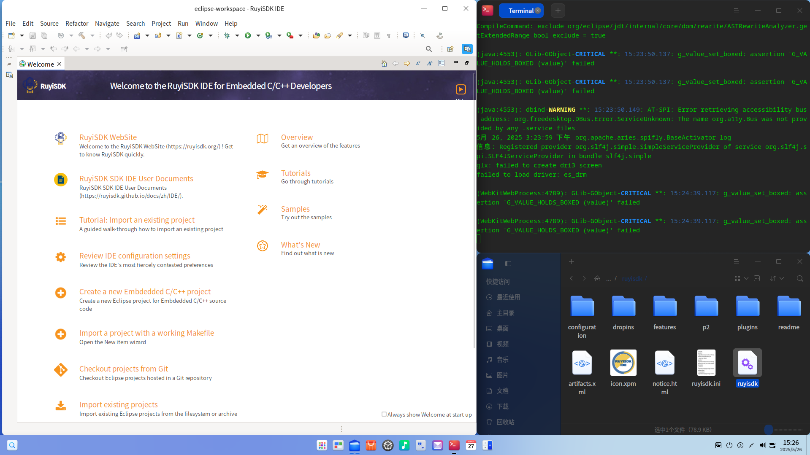

## 测试环境

### 系统信息

- 系统版本: Deepin 25-crimson-preview EIC7700 20250422
- 下载链接: https://deepin-community.github.io/sig-deepin-ports/images/riscv/download

### Hardware Information

- SiFive HiFive Premier P550
- 电源适配器
- Type-C 调试线一根
- USB-A 调试线一根

## 安装步骤

### 获取系统镜像

从 Deepin 官网下载系统镜像 Deepin 25-crimson-preview EIC7700 20250422 ：https://deepin-community.github.io/sig-deepin-ports/images/riscv/download

### 刷入镜像并启动

首先使用Type-C线将板子的UART接口与电脑连接，电脑将显示4个UART，其中第二大的端口号是用于连接终端/调试的UART，在本报告中为`/dev/tty.usbserial-102` (macOS) / `/dev/ttyUSB2`(Linux)。执行如下命令以建立串口通信：

macOS: `sudo screen -L /dev/tty.usbserial-102 115200`
Linux: `sudo screen -L /dev/ttyUSB2 115200`

随后以Boot-SPI（默认）模式启动板子。在u-boot menu阶段按下`Ctrl-C`进入u-boot命令行，执行`fastboot usb 0`。

确保本地电脑安装了`fastboot`，在一个新的终端执行如下命令：

``` shell
# fastboot flash boot deepin-eic7700-riscv64-25-desktop-installer.boot.ext4
# fastboot flash root deepin-eic7700-riscv64-25-desktop-installer.root.ext4
```

示意输出：

``` text
$ fastboot flash boot deepin-eic7700-riscv64-25-desktop-installer.boot.ext4
Sending sparse 'boot' 1/1 (107313 KB)              OKAY [  3.390s]
Writing 'boot'                                     OKAY [  5.965s]
Finished. Total time: 9.583s

$ fastboot flash root deepin-eic7700-riscv64-25-desktop-installer.root.ext4 
Sending sparse 'root' 1/38 (260442 KB)             OKAY [  8.067s]
Writing 'root'                                     OKAY [  2.739s]
Sending sparse 'root' 2/38 (234405 KB)             OKAY [  7.272s]
Writing 'root'                                     OKAY [  2.213s]
Sending sparse 'root' 3/38 (262141 KB)             OKAY [  8.129s]
Writing 'root'                                     OKAY [  2.435s]
Sending sparse 'root' 4/38 (261589 KB)             OKAY [  8.110s]
Writing 'root'                                     OKAY [  2.338s]
```

运行完毕后，回到UART终端，按下`Ctrl-C`退出fastboot，执行`boot`命令以进入启动列表。你将会看到新系统被列出。选择新系统，成功启动。

### 初始化系统

如果连接了显示器，则可以通过Deepin安装引导完成初始化；

同时也可以通过UART进行登录：

用户名: `root`
密码: `deepin`

## 预期结果

系统正常启动，能够通过板载串口登录。

## 实际结果

系统正常启动，成功通过板载串口登录。



## 测试判定标准

测试成功：实际结果与预期结果相符。

测试失败：实际结果与预期结果不符。

## 测试结论

测试成功。
