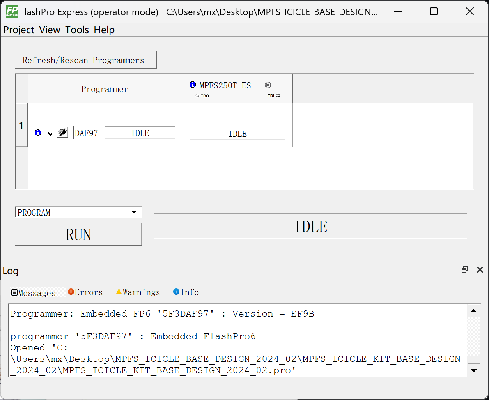
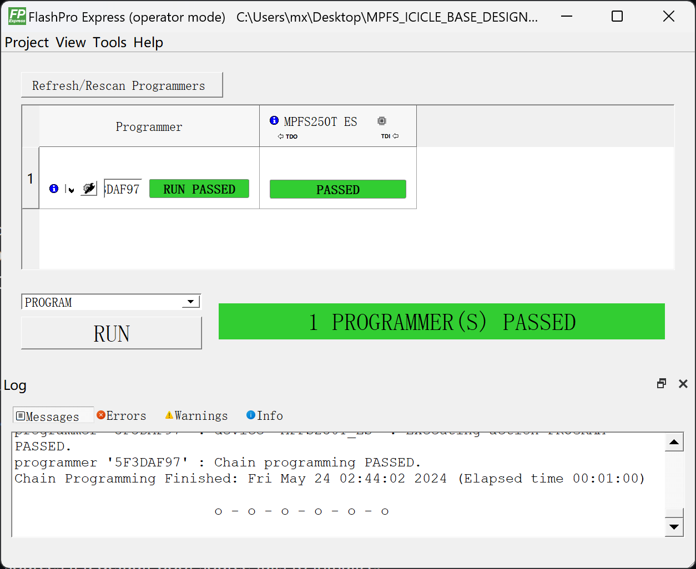

# Ubuntu on Microchip Polarfire SoC FPGA Icicle Kit

## 测试环境

### 硬件信息

- Microchip Polarfire SoC FPGA Icicle Kit 开发板
- 原装 12V 5A DC 5.5*2.1mm 电源适配器（原厂附带线材为美标插脚，在中国大陆使用需要转接器/更换国标线材）
- micro-USB to USB-A 线缆两条（出厂附带），用于连接 USB-UART、更新 FPGA/HSS 和烧录镜像至板载 eMMC
- （可选）SD 卡一张（不推荐使用 microSD + 卡套转接的方式，可能无法识别；此外请确保存储卡没有处于写保护状态）

### 操作系统信息

- Ubuntu 24.04
    - 下载链接：https://cdimage.ubuntu.com/releases/24.04/release/
        - TUNA 镜像源：https://mirror.tuna.tsinghua.edu.cn/ubuntu-cdimage/releases/noble/release/ubuntu-24.04-preinstalled-server-riscv64+icicle.img.xz
    - 参考安装文档：https://wiki.ubuntu.com/RISC-V/PolarFire%20SoC%20FPGA%20Icicle%20Kit

### 其他信息

- Icicle Kit Reference Design Release v2024.02
    - 下载链接：https://github.com/polarfire-soc/icicle-kit-reference-design/releases/tag/v2024.02
- FlashPro Express v2024.1（打包在 Programming and Debug Tools 内）
    - 下载链接（需要登录）：https://www.microchip.com/en-us/products/fpgas-and-plds/fpga-and-soc-design-tools/programming-and-debug/lab

## （可选，建议）更新 FPGA Design 和 Hart Software Services (HSS)

### 安装 FlashPro Express 工具

访问上面提到的下载链接，根据您所使用的操作系统下载。

> 注意，有登录墙，需要注册并登录后方可下载。
>
> 填写邮箱等信息后即可免费注册。

此工具支持的系统有：

- Windows 10/11
- RHEL/CentOS 7.x, RHEL/CentOS 8.0-8.2
- OpenSUSE Leap 42.3 (SLES 12.3)
- Ubuntu 18.04 LTS, 20.04.3 LTS, 以及 22.04.1 LTS

笔者使用的为 Windows 11 Home x64，尽管安装程序会提示不受支持的系统环境，但实测可正常安装。

下载后直接运行并按默认流程安装即可。Linux 环境下先 `chmod +x` 赋予可执行权限再执行。可能需要 `root` 权限。

### 更新 FPGA Design & HSS

Ubuntu 自 5.19 内核起依赖 Icicle Kit Reference Design v2022.10 或更新版本。

从 GitHub 下载最新版本：

https://github.com/polarfire-soc/icicle-kit-reference-design/releases

下载 `MPFS_ICICLE_BASE_DESIGN_yyyy_mm.zip` 文件解压备用。

使用 microUSB 线缆连接开发板和计算机。

开发板上共有两个 microUSB 接口，烧写 FPGA 时请连接至 `J33` 接口，即位于电源开关附近的 microUSB 接口，如下图所示。


打开 FlashPro Express，点击左上角菜单栏 `Project -> New Job Project`


选择先前解压的 `MPFS_ICICLE_BASE_DESIGN`，插上 12V 电源，给开发板上电，然后点击 OK：


此时应该已经识别到 FPGA 了。确保左侧下拉菜单选择的是 `PROGRAM`，点击 `RUN` 开始烧写 FPGA。



烧写成功会有绿色提示：



## 烧录镜像

Polarfire SoC FPGA Icicle Kit 支持从板载 eMMC 启动或 SD 卡启动。

默认优先 SD 卡。当 SD 卡不存在或 SD 卡启动失败时会从板载 eMMC 启动。

### 烧录镜像至 eMMC

连接 microUSB 线缆至 USB OTG 接口，位于 SD 卡槽附近，丝印 `J19`。

连接 USB UART，位于以太网接口一侧，丝印 `J11`。

计算机上会识别到一个 CP2108 USB 转 UART，如果这是您计算机上唯一一个 USB 转 UART，此时会识别到四个串口。

Windows 上会出现四个 COM 口，Linux 下会出现 /dev/ttyUSB{0,1,2,3}，如下图所示：


其中，`Interface 0` 为 `HSS` 输出，`Interface 1` 为 U-Boot 和 Linux 控制台输出。

在 Linux 系统下，分别对应第一个和第二个串口。

| 串口功能              | Windows     | Linux        |
|--------------------|-------------|--------------|
| HSS 控制台            | Interface 0 | /dev/ttyUSB0 |
| U-Boot & Linux 控制台 | Interface 1 | /dev/ttyUSB1 |

欲向 eMMC 烧录镜像，连接至 `HSS` 控制台，在启动时（提示 `Press a key to enter CLI, ESC to skip`）按任意键打断启动流程。

输入：`
```
mmc
usbdmsc
```
会提示 `Waiting for USB Host to connect`。

此时计算机一侧应该会出现一个 USB 大容量存储设备。至此可以使用 Win32DiskImager/Rufus/USBImager/dd 等工具直接向其中写入镜像了。

镜像烧写完成后，在 HSS 控制台按 Ctrl+C 退出 USB 存储模式。至此镜像烧录结束。

### 烧录镜像至 SD 卡

直接使用 Rufus/Win32DiskImager/dd 等工具写入镜像至 SD 卡即可。

```shell
xzcat ubuntu-24.04-preinstalled-server-riscv64+icicle.img.xz | sudo dd of=/dev/sdX bs=4M iflag=fullblock status=progress 
```

## 启动开发板

给开发板上电。在第二个串口会输出启动信息。

> Ubuntu 首次启动会调用 `cloud-init`，受限于开发板性能，启动速度可能较慢，从上电到能够登录可能要花费数分钟时间，这是预期结果。

用户名：`ubuntu`

密码：`ubuntu`

初次登录时会强制要求修改密码，按提示操作即可。

## 预期结果

系统正常启动，能够通过串口登录。

## 实际结果

系统正常启动，能够通过串口登录。

屏幕录像（从 eMMC 刷写到启动）：

[](https://asciinema.org/a/ECbt7b3ltAF29zFjDDgW9NUnU)


## 测试判定标准

测试成功：实际结果与预期结果相符。

测试失败：实际结果与预期结果不符。

## 测试结论

测试成功。

## 参考文档

- [PolarFire SoC Software Tool Flow](https://github.com/polarfire-soc/polarfire-soc-documentation/blob/master/knowledge-base/polarfire-soc-software-tool-flow_zh.md) 
- [MPFS Icicle Kit User Guide](https://github.com/polarfire-soc/polarfire-soc-documentation/blob/master/reference-designs-fpga-and-development-kits/icicle-kit-user-guide_zh.md)
- [Updating MPFS Kit](https://github.com/polarfire-soc/polarfire-soc-documentation/blob/master/reference-designs-fpga-and-development-kits/updating-mpfs-kit_zh.md)
- Under CC BY 4.0 license, by Microchip Technology Inc. and its subsidiaries