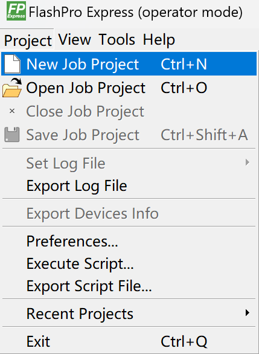
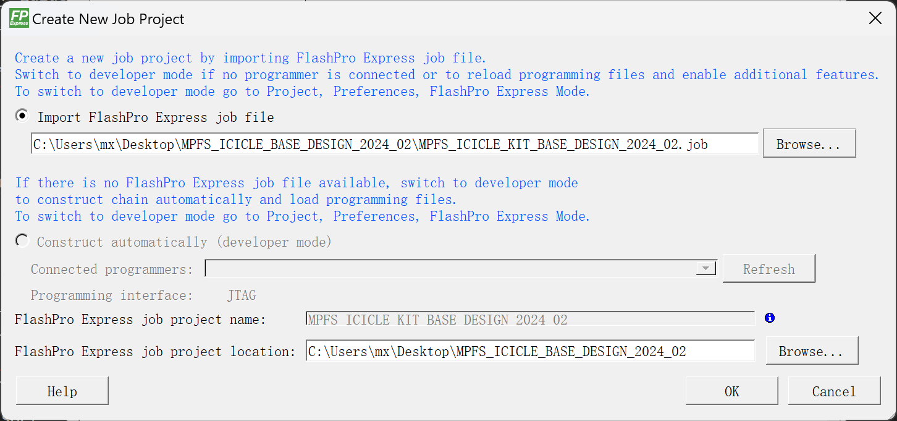
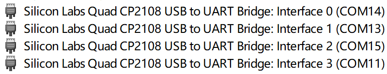

# Yocto PolarFire SoC Icicle Kit 测试报告

## 测试环境

### 操作系统信息

- 下载链接：https://github.com/polarfire-soc/meta-polarfire-soc-yocto-bsp/releases
- 参考安装文档：https://github.com/polarfire-soc/polarfire-soc-documentation/blob/master/reference-designs-fpga-and-development-kits/icicle-kit-user-guide_zh.md

### 硬件信息

- Microchip Polarfire SoC FPGA Icicle Kit 开发板
- 原装 12V 5A DC 5.5*2.1mm 电源适配器（原厂附带线材为美标插脚，在中国大陆使用需要转接器/更换国标线材）
- micro-USB to USB-A 线缆两条（出厂附带），用于连接 USB-UART、更新 FPGA/HSS 和烧录镜像至板载 eMMC
- （可选）SD 卡一张（不推荐使用 microSD + 卡套转接的方式，可能无法识别；此外请确保存储卡没有处于写保护状态）

### 其他信息

- Icicle Kit Reference Design Release v2024.02
    - 下载链接：https://github.com/polarfire-soc/icicle-kit-reference-design/releases/tag/v2024.02
- FlashPro Express v2024.1（打包在 Programming and Debug Tools 内）
    - 下载链接（需要登录）：https://www.microchip.com/en-us/products/fpgas-and-plds/fpga-and-soc-design-tools/programming-and-debug/lab

## 安装步骤

### （可选，建议）更新 FPGA Design 和 Hart Software Services (HSS)

#### 安装 FlashPro Express 工具

访问上面提到的下载链接，根据您所使用的操作系统下载。

> 注意，有登录墙，需要注册并登录后方可下载。
>
> 填写邮箱等信息后即可免费注册。

此工具支持的系统有：

- Windows 10/11
- RHEL/CentOS 7.x, RHEL/CentOS 8.0-8.2
- OpenSUSE Leap 42.3 (SLES 12.3)
- Ubuntu 18.04 LTS, 20.04.3 LTS, 以及 22.04.1 LTS

笔者使用的为 Windows 11 Home x64，尽管安装程序会提示不受支持的系统环境，但实测可正常安装。

下载后直接运行并按默认流程安装即可。Linux 环境下先 `chmod +x` 赋予可执行权限再执行。可能需要 `root` 权限。

#### 更新 FPGA Design & HSS

从 GitHub 下载最新版本：

https://github.com/polarfire-soc/icicle-kit-reference-design/releases

下载 `MPFS_ICICLE_BASE_DESIGN_yyyy_mm.zip` 文件解压备用。

使用 microUSB 线缆连接开发板和计算机。

开发板上共有两个 microUSB 接口，烧写 FPGA 时请连接至 `J33` 接口，即位于电源开关附近的 microUSB 接口，如下图所示。


打开 FlashPro Express，点击左上角菜单栏 `Project -> New Job Project`



选择先前解压的 `MPFS_ICICLE_BASE_DESIGN`，插上 12V 电源，给开发板上电，然后点击 OK：



此时应该已经识别到 FPGA 了。确保左侧下拉菜单选择的是 `PROGRAM`，点击 `RUN` 开始烧写 FPGA。


烧写成功会有绿色提示：


### 烧写镜像

Polarfire SoC FPGA Icicle Kit 支持从板载 eMMC 启动或 SD 卡启动。

默认优先 SD 卡。当 SD 卡不存在或 SD 卡启动失败时会从板载 eMMC 启动。

### 烧录镜像至 eMMC

连接 microUSB 线缆至 USB OTG 接口，位于 SD 卡槽附近，丝印 `J19`。

连接 USB UART，位于以太网接口一侧，丝印 `J11`。

计算机上会识别到一个 CP2108 USB 转 UART，如果这是您计算机上唯一一个 USB 转 UART，此时会识别到四个串口。

Windows 上会出现四个 COM 口，Linux 下会出现 /dev/ttyUSB{0,1,2,3}，如下图所示：



其中，`Interface 0` 为 `HSS` 输出，`Interface 1` 为 U-Boot 和 Linux 控制台输出。

在 Linux 系统下，分别对应第一个和第二个串口。

| 串口功能              | Windows     | Linux        |
|--------------------|-------------|--------------|
| HSS 控制台            | Interface 0 | /dev/ttyUSB0 |
| U-Boot & Linux 控制台 | Interface 1 | /dev/ttyUSB1 |

欲向 eMMC 烧录镜像，连接至 `HSS` 控制台，在启动时（提示 `Press a key to enter CLI, ESC to skip`）按任意键打断启动流程。

输入：
```
mmc
usbdmsc
```
会提示 `Waiting for USB Host to connect`。

此时计算机一侧应该会出现一个 USB 大容量存储设备。至此可以使用 Win32DiskImager/Rufus/USBImager/dd 等工具直接向其中写入镜像了。

镜像烧写完成后，在 HSS 控制台按 Ctrl+C 退出 USB 存储模式。至此镜像烧录结束。

### 烧录镜像至 SD 卡

直接使用 Rufus/Win32DiskImager/dd 等工具写入镜像至 SD 卡即可。

```shell
gzip -kd core-image-minimal-dev-icicle-kit-es-20240221160407.rootfs.wic.gz
sudo dd if=core-image-minimal-dev-icicle-kit-es-20240221160407.rootfs.wic of=/dev/sdX bs=1M status=progress
```

### 登录系统

通过串口登录系统。

默认用户名： `root`
默认密码：无密码

## 预期结果

系统正常启动，能够通过板载串口登录。

## 实际结果

系统正常启动，成功通过板载串口登录。

### 启动信息

屏幕录像（从刷写镜像到登录系统）：


```log
DDR training ... Passed ( 2775 ms)
[2.873679] DDR-Lo size is   32 MiB
[2.878358] DDR-Hi size is 1888 MiB

OpenSBI v1.2
   ____                    _____ ____ _____
  / __ \                  / ____|  _ \_   _|
 | |  | |_ __   ___ _ __ | (___ | |_) || |
 | |  | | '_ \ / _ \ '_ \ \___ \|  _ < | |
 | |__| | |_) |  __/ | | |____) | |_) || |_
  \____/| .__/ \___|_| |_|_____/|____/_____|
        | |
        |_|

Platform Name             : Microchip PolarFire(R) SoC
Platform Features         : medeleg
Platform HART Count       : 5
Platform IPI Device       : aclint-mswi
Platform Timer Device     : aclint-mtimer @ 1000000Hz
Platform Console Device   : mmuart
Platform HSM Device       : mpfs_hsm
Platform PMU Device       : ---
Platform Reboot Device    : mpfs_reset
Platform Shutdown Device  : mpfs_reset
Firmware Base             : 0xa000000
Firmware Size             : 151 KB
Runtime SBI Version       : 1.0

Domain0 Name              : root
Domain0 Boot HART         : 1
Domain0 HARTs             : 1,2,3,4
Domain0 Region00          : 0x0000000002008000-0x000000000200bfff (I)
Domain0 Region01          : 0x0000000002000000-0x0000000002007fff (I)
Domain0 Region02          : 0x000000000a000000-0x000000000a03ffff ()
Domain0 Region03          : 0x0000000000000000-0xffffffffffffffff (R,W,X)
Domain0 Next Address      : 0x0000000080200000
Domain0 Next Arg1         : 0x0000000000000000
Domain0 Next Mode         : S-mode
Domain0 SysReset          : yes

Domain1 Name              : u-boot.bin
Domain1 Boot HART         : 1
Domain1 HARTs             : 1*,2*,3*,4*
Domain1 Region00          : 0x000000000a000000-0x000000000a03ffff ()
Domain1 Region01          : 0x0000000000000000-0xffffffffffffffff (R,W,X)
Domain1 Next Address      : 0x0000000080200000
Domain1 Next Arg1         : 0x0000000000000000
Domain1 Next Mode         : S-mode
Domain1 SysReset          : yes

Boot HART ID              : 1
Boot HART Domain          : u-boot.bin
Boot HART Priv Version    : v1.10
Boot HART Base ISA        : rv64imafdc
Boot HART ISA Extensions  : none
Boot HART PMP Count       : 16
Boot HART PMP Granularity : 4
Boot HART PMP Address Bits: 36
Boot HART MHPM Count      : 2
Boot HART MIDELEG         : 0x0000000000000222
Boot HART MEDELEG         : 0x000000000000b109


U-Boot 2023.07.02-linux4microchip+fpga-2024.02 (Feb 21 2024 - 11:50:25 +0000)

CPU:   rv64imafdc
Model: Microchip PolarFire-SoC Icicle Kit
DRAM:  1 GiB (effective 2.8 GiB)
Core:  51 devices, 13 uclasses, devicetree: separate
MMC:   mmc@20008000: 0
Loading Environment from FAT... OK
In:    serial@20100000
Out:   serial@20100000
Err:   serial@20100000
Net:   eth0: ethernet@20112000
Hit any key to stop autoboot:  0
switch to partitions #0, OK
mmc0(part 0) is current device
Scanning mmc 0:1...
Found U-Boot script /boot.scr
493 bytes read in 26 ms (17.6 KiB/s)
## Executing script at 8e000000
5313944 bytes read in 91 ms (55.7 MiB/s)
## Loading kernel from FIT Image at 8e000000 ...
   Using 'conf-microchip_mpfs-icicle-kit.dtb' configuration
   Trying 'kernel-1' kernel subimage
     Description:  Linux kernel
     Type:         Kernel Image
     Compression:  gzip compressed
     Data Start:   0x8e0000fc
     Data Size:    5286950 Bytes = 5 MiB
     Architecture: RISC-V
     OS:           Linux
     Load Address: 0x80200000
     Entry Point:  0x80200000
     Hash algo:    sha256
     Hash value:   7460b498180d829fed310410fd4b89645304232208c2bffd8a34ec36cbd85f8a
   Verifying Hash Integrity ... sha256+ OK
## Loading fdt from FIT Image at 8e000000 ...
   Using 'conf-microchip_mpfs-icicle-kit.dtb' configuration
   Trying 'fdt-microchip_mpfs-icicle-kit.dtb' fdt subimage
     Description:  Flattened Device Tree blob
     Type:         Flat Device Tree
     Compression:  uncompressed
     Data Start:   0x8e50ae44
     Data Size:    21519 Bytes = 21 KiB
     Architecture: RISC-V
     Load Address: 0x8a000000
     Hash algo:    sha256
     Hash value:   e1e8d554b4b4658093f0209ad66f74b8a17cb374929fd1419a9f077f493329af
   Verifying Hash Integrity ... sha256+ OK
   Loading fdt from 0x8e50ae44 to 0x8a000000
   Booting using the fdt blob at 0x8a000000
Working FDT set to 8a000000
   Uncompressing Kernel Image
   Using Device Tree in place at 000000008a000000, end 000000008a00840e
Working FDT set to 8a000000

Starting kernel ...

[    0.000000] Linux version 6.1.74-linux4microchip+fpga-2024.02 (oe-user@oe-host) (riscv64-oe-linux-gcc (GCC) 11.4.0, GNU ld (GNU Binutils) 2.38.20220708) #1 SMP Wed Feb 21 12:18:06 UTC 2024
[    0.000000] OF: fdt: Ignoring memory range 0x80000000 - 0x80200000
[    0.000000] Machine model: Microchip PolarFire-SoC Icicle Kit
[    0.000000] efi: UEFI not found.
[    0.000000] Reserved memory: region for default DMA coherent area is redefined
[    0.000000] Reserved memory: created DMA memory pool at 0x0000001412000000, size 256 MiB
[    0.000000] OF: reserved mem: initialized node non-cached-high-buffer, compatible id shared-dma-pool
[    0.000000] Reserved memory: region for default DMA coherent area is redefined
[    0.000000] Reserved memory: created DMA memory pool at 0x00000000c4000000, size 64 MiB
[    0.000000] OF: reserved mem: initialized node non-cached-low-buffer, compatible id shared-dma-pool
[    0.000000] Reserved memory: created DMA memory pool at 0x0000000088000000, size 32 MiB
[    0.000000] OF: reserved mem: initialized node buffer@88000000, compatible id shared-dma-pool
[    0.000000] Reserved memory: created DMA memory pool at 0x00000000c8000000, size 32 MiB
[    0.000000] OF: reserved mem: initialized node buffer@c8000000, compatible id shared-dma-pool
[    0.000000] Reserved memory: created DMA memory pool at 0x00000000d8000000, size 32 MiB
[    0.000000] OF: reserved mem: initialized node buffer@d8000000, compatible id shared-dma-pool
[    0.000000] Reserved memory: created DMA memory pool at 0x000000103fc00000, size 4 MiB
[    0.000000] OF: reserved mem: initialized node hss-buffer@103fc00000, compatible id shared-dma-pool
[    0.000000] Zone ranges:
[    0.000000]   DMA32    [mem 0x0000000080200000-0x00000000ffffffff]
[    0.000000]   Normal   [mem 0x0000000100000000-0x0000001421ffffff]
[    0.000000] Movable zone start for each node
[    0.000000] Early memory node ranges
[    0.000000]   node   0: [mem 0x0000000080200000-0x0000000083ffffff]
[    0.000000]   node   0: [mem 0x000000008a000000-0x0000000091ffffff]
[    0.000000]   node   0: [mem 0x00000000c4000000-0x00000000c9ffffff]
[    0.000000]   node   0: [mem 0x0000001022000000-0x000000103fbfffff]
[    0.000000]   node   0: [mem 0x000000103fc00000-0x000000103fffffff]
[    0.000000]   node   0: [mem 0x0000001040000000-0x000000107fffffff]
[    0.000000]   node   0: [mem 0x0000001412000000-0x0000001421ffffff]
[    0.000000] Initmem setup node 0 [mem 0x0000000080200000-0x0000001421ffffff]
[    0.000000] On node 0, zone DMA32: 512 pages in unavailable ranges
[    0.000000] On node 0, zone DMA32: 24576 pages in unavailable ranges
[    0.000000] On node 0, zone DMA32: 40960 pages in unavailable ranges
[    0.000000] On node 0, zone Normal: 32768 pages in unavailable ranges
[    0.000000] On node 0, zone Normal: 8192 pages in unavailable ranges
[    0.000000] On node 0, zone Normal: 24576 pages in unavailable ranges
[    0.000000] SBI specification v1.0 detected
[    0.000000] SBI implementation ID=0x8 Version=0x10002
[    0.000000] SBI TIME extension detected
[    0.000000] SBI IPI extension detected
[    0.000000] SBI RFENCE extension detected
[    0.000000] SBI SRST extension detected
[    0.000000] SBI HSM extension detected
[    0.000000] CPU with hartid=0 is not available
[    0.000000] CPU with hartid=0 is not available
[    0.000000] CPU with hartid=0 is not available
[    0.000000] riscv: base ISA extensions acdfim
[    0.000000] riscv: ELF capabilities acdfim
[    0.000000] percpu: Embedded 17 pages/cpu s30632 r8192 d30808 u69632
[    0.000000] Built 1 zonelists, mobility grouping on.  Total pages: 516615
[    0.000000] Kernel command line: earlycon=sbi root=/dev/mmcblk0p3 rootwait uio_pdrv_genirq.of_id=generic-uio
[    0.000000] Dentry cache hash table entries: 262144 (order: 9, 2097152 bytes, linear)
[    0.000000] Inode-cache hash table entries: 131072 (order: 8, 1048576 bytes, linear)
[    0.000000] mem auto-init: stack:off, heap alloc:off, heap free:off
[    0.000000] software IO TLB: area num 4.
[    0.000000] software IO TLB: mapped [mem 0x000000008c500000-0x0000000090500000] (64MB)
[    0.000000] Memory: 1587956K/2095104K available (6252K kernel code, 4830K rwdata, 4096K rodata, 2144K init, 384K bss, 507148K reserved, 0K cma-reserved)
[    0.000000] SLUB: HWalign=64, Order=0-3, MinObjects=0, CPUs=4, Nodes=1
[    0.000000] rcu: Hierarchical RCU implementation.
[    0.000000] rcu:     RCU event tracing is enabled.
[    0.000000] rcu:     RCU restricting CPUs from NR_CPUS=64 to nr_cpu_ids=4.
[    0.000000]  Tracing variant of Tasks RCU enabled.
[    0.000000] rcu: RCU calculated value of scheduler-enlistment delay is 25 jiffies.
[    0.000000] rcu: Adjusting geometry for rcu_fanout_leaf=16, nr_cpu_ids=4
[    0.000000] NR_IRQS: 64, nr_irqs: 64, preallocated irqs: 0
[    0.000000] riscv-intc: 64 local interrupts mapped
[    0.000000] plic: interrupt-controller@c000000: mapped 186 interrupts with 4 handlers for 9 contexts.
[    0.000000] mpfs-irq-mux: mux configuration 0
[    0.000000] rcu: srcu_init: Setting srcu_struct sizes based on contention.
[    0.000000] riscv-timer: riscv_timer_init_dt: Registering clocksource cpuid [0] hartid [1]
[    0.000000] clocksource: riscv_clocksource: mask: 0xffffffffffffffff max_cycles: 0x1d854df40, max_idle_ns: 3526361616960 ns
[    0.000002] sched_clock: 64 bits at 1000kHz, resolution 1000ns, wraps every 2199023255500ns
[    0.000425] Console: colour dummy device 80x25
[    0.001968] printk: console [tty0] enabled
[    0.002097] Calibrating delay loop (skipped), value calculated using timer frequency.. 2.00 BogoMIPS (lpj=4000)
[    0.002164] pid_max: default: 32768 minimum: 301
[    0.002665] Mount-cache hash table entries: 4096 (order: 3, 32768 bytes, linear)
[    0.002870] Mountpoint-cache hash table entries: 4096 (order: 3, 32768 bytes, linear)
[    0.005295] CPU node for /cpus/cpu@0 exist but the possible cpu range is :0-3
[    0.007628] cblist_init_generic: Setting adjustable number of callback queues.
[    0.007682] cblist_init_generic: Setting shift to 2 and lim to 1.
[    0.007992] riscv: ELF compat mode unsupported
[    0.008012] ASID allocator disabled (0 bits)
[    0.008406] rcu: Hierarchical SRCU implementation.
[    0.008443] rcu:     Max phase no-delay instances is 1000.
[    0.009118] EFI services will not be available.
[    0.010467] smp: Bringing up secondary CPUs ...
[    0.016032] smp: Brought up 1 node, 4 CPUs
[    0.017311] devtmpfs: initialized
[    0.026221] DMA: default coherent area is set
[    0.026287] clocksource: jiffies: mask: 0xffffffff max_cycles: 0xffffffff, max_idle_ns: 7645041785100000 ns
[    0.026358] futex hash table entries: 1024 (order: 4, 65536 bytes, linear)
[    0.029110] NET: Registered PF_NETLINK/PF_ROUTE protocol family
[    0.029609] DMA: preallocated 256 KiB GFP_KERNEL pool for atomic allocations
[    0.029784] DMA: preallocated 256 KiB GFP_KERNEL|GFP_DMA32 pool for atomic allocations
[    0.031088] CCACHE: DataError @ 0x00000000.081DFFF8
[    0.031250] CCACHE: DataFail @ 0x00000000.081DFFE0
[    0.031451] CCACHE: 4 banks, 16 ways, sets/bank=512, bytes/block=64
[    0.031493] CCACHE: Index of the largest way enabled: 11
[    0.061750] SCSI subsystem initialized
[    0.062606] usbcore: registered new interface driver usbfs
[    0.062708] usbcore: registered new interface driver hub
[    0.062797] usbcore: registered new device driver usb
[    0.063114] pps_core: LinuxPPS API ver. 1 registered
[    0.063152] pps_core: Software ver. 5.3.6 - Copyright 2005-2007 Rodolfo Giometti <giometti@linux.it>
[    0.063220] PTP clock support registered
[    0.063544] FPGA manager framework
[    0.064973] vgaarb: loaded
[    0.065270] clocksource: Switched to clocksource riscv_clocksource
[    0.082361] NET: Registered PF_INET protocol family
[    0.083903] IP idents hash table entries: 32768 (order: 6, 262144 bytes, linear)
[    0.093303] tcp_listen_portaddr_hash hash table entries: 1024 (order: 2, 16384 bytes, linear)
[    0.093519] Table-perturb hash table entries: 65536 (order: 6, 262144 bytes, linear)
[    0.093588] TCP established hash table entries: 16384 (order: 5, 131072 bytes, linear)
[    0.094492] TCP bind hash table entries: 16384 (order: 7, 524288 bytes, linear)
[    0.097582] TCP: Hash tables configured (established 16384 bind 16384)
[    0.098389] UDP hash table entries: 1024 (order: 3, 32768 bytes, linear)
[    0.098664] UDP-Lite hash table entries: 1024 (order: 3, 32768 bytes, linear)
[    0.099266] NET: Registered PF_UNIX/PF_LOCAL protocol family
[    0.099390] PCI: CLS 0 bytes, default 64
[    0.102041] workingset: timestamp_bits=62 max_order=19 bucket_order=0
[    0.112592] Block layer SCSI generic (bsg) driver version 0.4 loaded (major 249)
[    0.112663] io scheduler mq-deadline registered
[    0.112696] io scheduler kyber registered
[    0.115038] irq: IRQ18: trimming hierarchy from :soc:interrupt-controller@c000000
[    0.115165] irq: IRQ19: trimming hierarchy from :soc:interrupt-controller@c000000
[    0.115294] irq: IRQ20: trimming hierarchy from :soc:interrupt-controller@c000000
[    0.115406] irq: IRQ21: trimming hierarchy from :soc:interrupt-controller@c000000
[    0.115517] irq: IRQ22: trimming hierarchy from :soc:interrupt-controller@c000000
[    0.115628] irq: IRQ23: trimming hierarchy from :soc:interrupt-controller@c000000
[    0.115762] irq: IRQ24: trimming hierarchy from :soc:interrupt-controller@c000000
[    0.115879] irq: IRQ25: trimming hierarchy from :soc:interrupt-controller@c000000
[    0.115989] irq: IRQ26: trimming hierarchy from :soc:interrupt-controller@c000000
[    0.116099] irq: IRQ27: trimming hierarchy from :soc:interrupt-controller@c000000
[    0.116225] irq: IRQ28: trimming hierarchy from :soc:interrupt-controller@c000000
[    0.116336] irq: IRQ29: trimming hierarchy from :soc:interrupt-controller@c000000
[    0.116446] irq: IRQ30: trimming hierarchy from :soc:interrupt-controller@c000000
[    0.116557] irq: IRQ31: trimming hierarchy from :soc:interrupt-controller@c000000
[    0.116680] irq: IRQ32: trimming hierarchy from :soc:interrupt-controller@c000000
[    0.116792] irq: IRQ33: trimming hierarchy from :soc:interrupt-controller@c000000
[    0.116905] irq: IRQ34: trimming hierarchy from :soc:interrupt-controller@c000000
[    0.117014] irq: IRQ35: trimming hierarchy from :soc:interrupt-controller@c000000
[    0.117138] irq: IRQ36: trimming hierarchy from :soc:interrupt-controller@c000000
[    0.117301] irq: IRQ37: trimming hierarchy from :soc:interrupt-controller@c000000
[    0.117421] irq: IRQ38: trimming hierarchy from :soc:interrupt-controller@c000000
[    0.117558] irq: IRQ39: trimming hierarchy from :soc:interrupt-controller@c000000
[    0.117695] irq: IRQ40: trimming hierarchy from :soc:interrupt-controller@c000000
[    0.117810] irq: IRQ41: trimming hierarchy from :soc:interrupt-controller@c000000
[    0.117919] irq: IRQ42: trimming hierarchy from :soc:interrupt-controller@c000000
[    0.118027] irq: IRQ43: trimming hierarchy from :soc:interrupt-controller@c000000
[    0.118150] irq: IRQ44: trimming hierarchy from :soc:interrupt-controller@c000000
[    0.118261] irq: IRQ45: trimming hierarchy from :soc:interrupt-controller@c000000
[    0.118370] irq: IRQ46: trimming hierarchy from :soc:interrupt-controller@c000000
[    0.118480] irq: IRQ47: trimming hierarchy from :soc:interrupt-controller@c000000
[    0.118603] irq: IRQ48: trimming hierarchy from :soc:interrupt-controller@c000000
[    0.118716] irq: IRQ49: trimming hierarchy from :soc:interrupt-controller@c000000
[    0.120604] microchip-pcie 3000000000.pcie: host bridge /fabric-pcie-bus@3000000000/pcie@3000000000 ranges:
[    0.120726] microchip-pcie 3000000000.pcie:      MEM 0x3009000000..0x3017ffffff -> 0x0009000000
[    0.120811] microchip-pcie 3000000000.pcie:       IO 0x3008000000..0x3008ffffff -> 0x0008000000
[    0.120884] microchip-pcie 3000000000.pcie:      MEM 0x3018000000..0x3087ffffff -> 0x0018000000
[    0.120976] microchip-pcie 3000000000.pcie:   IB MEM 0x0080000000..0x0083ffffff -> 0x0080000000
[    0.121076] microchip-pcie 3000000000.pcie:   IB MEM 0x00c4000000..0x00c9ffffff -> 0x0084000000
[    0.121164] microchip-pcie 3000000000.pcie:   IB MEM 0x008a000000..0x0091ffffff -> 0x008a000000
[    0.121303] microchip-pcie 3000000000.pcie:   IB MEM 0x1412000000..0x1421ffffff -> 0x0092000000
[    0.121382] microchip-pcie 3000000000.pcie:   IB MEM 0x1022000000..0x107fffffff -> 0x00a2000000
[    0.126960] microchip-pcie 3000000000.pcie: ECAM at [mem 0x3000000000-0x3007ffffff] for [bus 00-7f]
[    0.127239] microchip-pcie 3000000000.pcie: PCI host bridge to bus 0000:00
[    0.127288] pci_bus 0000:00: root bus resource [bus 00-7f]
[    0.127330] pci_bus 0000:00: root bus resource [mem 0x3009000000-0x3017ffffff pref] (bus address [0x09000000-0x17ffffff])
[    0.127388] pci_bus 0000:00: root bus resource [io  0x0000-0xffffff] (bus address [0x8000000-0x8ffffff])
[    0.127440] pci_bus 0000:00: root bus resource [mem 0x3018000000-0x3087ffffff] (bus address [0x18000000-0x87ffffff])
[    0.127552] pci 0000:00:00.0: [11aa:1556] type 01 class 0x000604
[    0.127612] pci 0000:00:00.0: reg 0x10: [mem 0x00000000-0x7fffffff 64bit pref]
[    0.127757] pci 0000:00:00.0: supports D1 D2
[    0.127794] pci 0000:00:00.0: PME# supported from D0 D1 D2 D3hot D3cold
[    0.130626] pci 0000:00:00.0: bridge configuration invalid ([bus 00-00]), reconfiguring
[    0.180760] pci_bus 0000:01: busn_res: [bus 01-7f] end is updated to 01
[    0.180853] pci 0000:00:00.0: BAR 0: no space for [mem size 0x80000000 64bit pref]
[    0.180905] pci 0000:00:00.0: BAR 0: failed to assign [mem size 0x80000000 64bit pref]
[    0.180957] pci 0000:00:00.0: BAR 8: assigned [mem 0x3018000000-0x30181fffff]
[    0.181002] pci 0000:00:00.0: BAR 9: assigned [mem 0x3009000000-0x30091fffff 64bit pref]
[    0.181051] pci 0000:00:00.0: BAR 7: assigned [io  0x1000-0x1fff]
[    0.181095] pci 0000:00:00.0: PCI bridge to [bus 01]
[    0.181132] pci 0000:00:00.0:   bridge window [io  0x1000-0x1fff]
[    0.181172] pci 0000:00:00.0:   bridge window [mem 0x3018000000-0x30181fffff]
[    0.181213] pci 0000:00:00.0:   bridge window [mem 0x3009000000-0x30091fffff 64bit pref]
[    0.283354] Serial: 8250/16550 driver, 4 ports, IRQ sharing disabled
[    0.286625] 20100000.serial: ttyS1 at MMIO 0x20100000 (irq = 79, base_baud = 9375000) is a 16550A
[    1.561220] printk: console [ttyS1] enabled
[    1.566945] 20102000.serial: ttyS2 at MMIO 0x20102000 (irq = 80, base_baud = 9375000) is a 16550A
[    1.577157] 20104000.serial: ttyS3 at MMIO 0x20104000 (irq = 81, base_baud = 9375000) is a 16550A
[    1.587338] 20106000.serial: ttyS0 at MMIO 0x20106000 (irq = 82, base_baud = 9375000) is a 16550A
[    1.612573] loop: module loaded
[    1.617148] mpfs_dma_proxy mpfs-dma-proxy: proxy dma 4 channels initialized
[    1.774818] u-dma-buf udmabuf-ddr-c0: driver version = 3.2.4
[    1.780655] u-dma-buf udmabuf-ddr-c0: major number   = 244
[    1.786219] u-dma-buf udmabuf-ddr-c0: minor number   = 0
[    1.791588] u-dma-buf udmabuf-ddr-c0: phys address   = 0x0000000088000000
[    1.798477] u-dma-buf udmabuf-ddr-c0: buffer size    = 33554432
[    1.804463] u-dma-buf udmabuf0: driver installed.
[    2.553957] u-dma-buf udmabuf-ddr-nc0: driver version = 3.2.4
[    2.559800] u-dma-buf udmabuf-ddr-nc0: major number   = 244
[    2.565442] u-dma-buf udmabuf-ddr-nc0: minor number   = 1
[    2.570910] u-dma-buf udmabuf-ddr-nc0: phys address   = 0x00000000c8000000
[    2.577853] u-dma-buf udmabuf-ddr-nc0: buffer size    = 33554432
[    2.583921] u-dma-buf udmabuf1: driver installed.
[    2.605858] u-dma-buf udmabuf-ddr-nc-wcb0: driver version = 3.2.4
[    2.612035] u-dma-buf udmabuf-ddr-nc-wcb0: major number   = 244
[    2.618010] u-dma-buf udmabuf-ddr-nc-wcb0: minor number   = 2
[    2.623810] u-dma-buf udmabuf-ddr-nc-wcb0: phys address   = 0x00000000d8000000
[    2.631097] u-dma-buf udmabuf-ddr-nc-wcb0: buffer size    = 33554432
[    2.637511] u-dma-buf udmabuf2: driver installed.
[    2.645828] microchip-corespi 20108000.spi: Registered SPI controller 0
[    2.653637] microchip-corespi 20109000.spi: Registered SPI controller 1
[    2.663243] CAN device driver interface
[    2.704413] macb 20110000.ethernet eth0: Cadence GEM rev 0x0107010c at 0x20110000 irq 88 (00:04:a3:ed:4d:91)
[    2.719911] macb 20112000.ethernet eth1: Cadence GEM rev 0x0107010c at 0x20112000 irq 92 (00:04:a3:ed:4d:90)
[    2.731662] mss-dma-uio 60010000.dma-controller: registered device as dma-controller@60010000
[    2.742723] musb-hdrc musb-hdrc.1.auto: MUSB HDRC host driver
[    2.748577] musb-hdrc musb-hdrc.1.auto: new USB bus registered, assigned bus number 1
[    2.757708] hub 1-0:1.0: USB hub found
[    2.761594] hub 1-0:1.0: 1 port detected
[    2.766133] mpfs-musb 20201000.usb: Registered MPFS MUSB driver
[    2.772976] mpfs_rtc 20124000.rtc: prescaler set to: 999999
[    2.779031] mpfs_rtc 20124000.rtc: registered as rtc0
[    2.784207] mpfs_rtc 20124000.rtc: setting system clock to 1970-01-01T00:00:00 UTC (0)
[    2.792365] i2c_dev: i2c /dev entries driver
[    2.797598] microchip-corei2c 2010a000.i2c: registered CoreI2C bus driver
[    2.805382] microchip-corei2c 2010b000.i2c: registered CoreI2C bus driver
[    2.812949] microchip-corei2c 40000200.i2c: registered CoreI2C bus driver
[    2.820316] sdhci: Secure Digital Host Controller Interface driver
[    2.826569] sdhci: Copyright(c) Pierre Ossman
[    2.831027] sdhci-pltfm: SDHCI platform and OF driver helper
[    2.837352] usbcore: registered new interface driver usbhid
[    2.843055] usbhid: USB HID core driver
[    2.847376] mpfs-mailbox 37020000.mailbox: Registered MPFS mailbox controller driver
[    2.857154] NET: Registered PF_INET6 protocol family
[    2.865337] Segment Routing with IPv6
[    2.869162] In-situ OAM (IOAM) with IPv6
[    2.869770] mmc0: SDHCI controller on 20008000.mmc [20008000.mmc] using ADMA 64-bit
[    2.873305] sit: IPv6, IPv4 and MPLS over IPv4 tunneling driver
[    2.887920] NET: Registered PF_PACKET protocol family
[    2.893064] can: controller area network core
[    2.897693] NET: Registered PF_CAN protocol family
[    2.902571] can: raw protocol
[    2.905607] can: broadcast manager protocol
[    2.909865] can: netlink gateway - max_hops=1
[    2.943276] mpfs-rng mpfs-rng: Registered MPFS hwrng
[    2.964129] mpfs-sys-controller syscontroller: Registered MPFS system controller
[    2.964232] random: crng init done
[    2.972255] of_cfs_init
[    2.977765] of_cfs_init: OK
[    2.982292] Waiting for root device /dev/mmcblk0p3...
[    3.011715] mmc0: new HS200 MMC card at address 0001
[    3.018973] mmcblk0: mmc0:0001 DG4008 7.28 GiB
[    3.032264]  mmcblk0: p1 p2 p3
[    3.037845] mmcblk0boot0: mmc0:0001 DG4008 4.00 MiB
[    3.048178] mmcblk0boot1: mmc0:0001 DG4008 4.00 MiB
[    3.057383] mmcblk0rpmb: mmc0:0001 DG4008 4.00 MiB, chardev (240:0)
[    3.076868] EXT4-fs (mmcblk0p3): mounted filesystem with ordered data mode. Quota mode: disabled.
[    3.085948] VFS: Mounted root (ext4 filesystem) readonly on device 179:3.
[    3.093555] devtmpfs: mounted
[    3.107171] Freeing unused kernel image (initmem) memory: 2144K
[    3.113390] Run /sbin/init as init process
[    3.326499] systemd[1]: System time before build time, advancing clock.
[    3.342544] systemd[1]: Failed to find module 'autofs4'
[    3.380751] systemd[1]: systemd 254.4^ running in system mode (+PAM -AUDIT -SELINUX -APPARMOR +IMA -SMACK +SECCOMP -GCRYPT -GNUTLS +OPENSSL +ACL +BLKID -CURL -ELFUTILS -FIDO2 -IDN2 -IDN -IPTC +KMOD -LIBCRYPTSETUP +LIBFDISK -PCRE2 -PWQUALITY -P11KIT -QRENCODE -TPM2 -BZIP2 -LZ4 -XZ -ZLIB +ZSTD -BPF_FRAMEWORK +XKBCOMMON +UTMP +SYSVINIT default-hierarchy=hybrid)
[    3.413062] systemd[1]: Detected architecture riscv64.

Welcome to OpenEmbedded nodistro.0!

[    3.443654] systemd[1]: Hostname set to <icicle-kit-es>.
[    3.454870] systemd[1]: Initializing machine ID from random generator.
[    3.461787] systemd[1]: Installed transient /etc/machine-id file.
[    4.500343] systemd[1]: Condition check resulted in Root Slice being skipped.
[    4.507770] systemd[1]: Condition check resulted in System Slice being skipped.
[    4.525358] systemd[1]: Queued start job for default target Multi-User System.
[    4.566277] systemd[1]: Created slice Slice /system/getty.
[  OK  ] Created slice Slice /system/getty.
[    4.591571] systemd[1]: Created slice Slice /system/modprobe.
[  OK  ] Created slice Slice /system/modprobe.
[    4.615412] systemd[1]: Created slice Slice /system/serial-getty.
[  OK  ] Created slice Slice /system/serial-getty.
[    4.638635] systemd[1]: Created slice User and Session Slice.
[  OK  ] Created slice User and Session Slice.
[    4.661942] systemd[1]: Started Dispatch Password Requests to Console Directory Watch.
[  OK  ] Started Dispatch Password Requests to Console Directory Watch.
[    4.689832] systemd[1]: Started Forward Password Requests to Wall Directory Watch.
[  OK  ] Started Forward Password Requests to Wall Directory Watch.
[    4.714080] systemd[1]: Reached target Path Units.
[  OK  ] Reached target Path Units.
[    4.733612] systemd[1]: Reached target Remote File Systems.
[  OK  ] Reached target Remote File Systems.
[    4.753610] systemd[1]: Reached target Slice Units.
[  OK  ] Reached target Slice Units.
[    4.773618] systemd[1]: Reached target Swaps.
[  OK  ] Reached target Swaps.
[    4.839821] systemd[1]: Listening on RPCbind Server Activation Socket.
[  OK  ] Listening on RPCbind Server Activation Socket.
[    4.869732] systemd[1]: Reached target RPC Port Mapper.
[  OK  ] Reached target RPC Port Mapper.
[    4.890165] systemd[1]: Listening on initctl Compatibility Named Pipe.
[  OK  ] Listening on initctl Compatibility Named Pipe.
[    4.921123] systemd[1]: Journal Audit Socket was skipped because of an unmet condition check (ConditionSecurity=audit).
[    4.933487] systemd[1]: Listening on Journal Socket (/dev/log).
[  OK  ] Listening on Journal Socket (/dev/log).
[    4.958652] systemd[1]: Listening on Journal Socket.
[  OK  ] Listening on Journal Socket.
[    4.978981] systemd[1]: Listening on Network Service Netlink Socket.
[  OK  ] Listening on Network Service Netlink Socket.
[    5.002751] systemd[1]: Listening on udev Control Socket.
[  OK  ] Listening on udev Control Socket.
[    5.026259] systemd[1]: Listening on udev Kernel Socket.
[  OK  ] Listening on udev Kernel Socket.
[    5.050307] systemd[1]: Listening on User Database Manager Socket.
[  OK  ] Listening on User Database Manager Socket.
[    5.074332] systemd[1]: Huge Pages File System was skipped because of an unmet condition check (ConditionPathExists=/sys/kernel/mm/hugepages).
[    5.110244] systemd[1]: Mounting POSIX Message Queue File System...
         Mounting POSIX Message Queue File System...
[    5.139717] systemd[1]: Mounting Kernel Debug File System...
         Mounting Kernel Debug File System...
[    5.162346] systemd[1]: Kernel Trace File System was skipped because of an unmet condition check (ConditionPathExists=/sys/kernel/tracing).
[    5.176244] systemd[1]: Create List of Static Device Nodes was skipped because of an unmet condition check (ConditionFileNotEmpty=/lib/modules/6.1.74-linux4microchip+fpga-2024.02/modules.devname).
[    5.201096] systemd[1]: Starting Load Kernel Module configfs...
         Starting Load Kernel Module configfs...
[    5.228549] systemd[1]: Starting Load Kernel Module dm_mod...
         Starting Load Kernel Module dm_mod...
[    5.256511] systemd[1]: Starting Load Kernel Module drm...
         Starting Load Kernel Module drm...
[    5.284616] systemd[1]: Starting Load Kernel Module fuse...
         Starting Load Kernel Module fuse...
[    5.312804] systemd[1]: Starting Load Kernel Module loop...
         Starting Load Kernel Module loop...
[    5.342424] systemd[1]: Starting RPC Bind...
         Starting RPC Bind...
[    5.368875] systemd[1]: Starting File System Check on Root Device...
         Starting File System Check on Root Device...
[    5.405608] systemd[1]: Starting Journal Service...
         Starting Journal Service...
[    5.430102] systemd[1]: Load Kernel Modules was skipped because no trigger condition checks were met.
[    5.447596] systemd[1]: Starting Generate network units from Kernel command line...
         Starting Generate network units from Kernel command line...
[    5.465527] systemd[1]: Starting Apply Kernel Variables...
         Starting Apply Kernel Variables...
[    5.486104] systemd[1]: Starting Create Static Device Nodes in /dev gracefully...
         Starting Create Static Device Nodes in /dev gracefully...
[    5.503737] systemd[1]: Starting Coldplug All udev Devices...
         Starting Coldplug All udev Devices...
[    5.534125] systemd[1]: Started RPC Bind.
[  OK  ] Started     5.540036] systemd[1]: Mounted POSIX Message Queue File System.
1;39mRPC Bind.
[  OK  ] Mounted POSIX Message Queue File System.
[    5.591536] systemd[1]: Mounted Kernel Debug File System.
[  OK  ] Mounted Kernel Debug File System.
[    5.607140] systemd-journald[126]: Collecting audit messages is disabled.
[    5.616864] systemd[1]: modprobe@configfs.service: Deactivated successfully.
[    5.625561] systemd[1]: Finished Load Kernel Module configfs.
[  OK  ] Finished Load Kernel Module configfs.
[    5.656953] systemd[1]: modprobe@dm_mod.service: Deactivated successfully.
[    5.665387] systemd[1]: Finished Load Kernel Module dm_mod.
[  OK  ] Finished Load Kernel Module dm_mod.
[    5.696584] systemd[1]: modprobe@drm.service: Deactivated successfully.
[    5.704505] systemd[1]: Finished Load Kernel Module drm.
[  OK  ] Finished Load Kernel Module drm.
[    5.732469] systemd[1]: modprobe@fuse.service: Deactivated successfully.
[    5.740479] systemd[1]: Finished Load Kernel Module fuse.
[  OK  ] Finished Load Kernel Module fuse.
[    5.768754] systemd[1]: modprobe@loop.service: Deactivated successfully.
[    5.776749] systemd[1]: Finished Load Kernel Module loop.
[  OK  ] Finished Load Kernel Module loop.
[    5.803210] systemd[1]: Started Journal Service.
[  OK  ] Started Journal Service.
[  OK  ] Finished File System Check on Root Device.
[  OK  ] Finished Generate network units from Kernel command line.
[  OK  ] Finished Apply Kernel Variables.
[  OK  ] Finished Create Static Device Nodes in /dev gracefully.
         Mounting Kernel Configuration File System...
         Starting Remount Root and Kernel File Systems...
         Starting Repartition Root Disk...
[  OK  ] Mounted Kernel Configuration File System.
[    6.093586] EXT4-fs (mmcblk0p3): re-mounted. Quota mode: disabled.
[  OK  ] Finished Remount Root and Kernel File Systems.
         Starting Flush Journal to Persistent Storage...
         Starting Create System Users...
[    6.206580] systemd-journald[126]: Received client request to flush runtime journal.
[  OK  ] Finished Repartition Root Disk.
[  OK  ] Finished Flush Journal to Persistent Storage.
         Starting Grow Root File System...
         Starting User Database Manager...
[    6.325367] EXT4-fs (mmcblk0p3): resizing filesystem from 236206 to 1889739 blocks
[    6.386114] EXT4-fs (mmcblk0p3): resized filesystem to 1889739
[  OK  ] Finished Grow Root File System.
[  OK  ] Started User Database Manager.
[  OK  ] Finished Create System Users.
         Starting Create Static Device Nodes in /dev...
[  OK  ] Finished Create Static Device Nodes in /dev.
[  OK  ] Reached target Preparation for Local File Systems.
         Mounting /var/volatile...
         Starting Rule-based Manager for Device Events and Files...
[  OK  ] Mounted /var/volatile.
         Starting Load/Save OS Random Seed...
[  OK  ] Reached target Local File Systems.
         Starting Rebuild Dynamic Linker Cache...
         Starting Create Volatile Files and Directories...
[  OK  ] Finished Load/Save OS Random Seed.
[  OK  ] Finished Coldplug All udev Devices.
         Starting Commit a transient machine-id on disk...
         Starting Wait for udev To Complete Device Initialization...
[  OK  ] Finished Create Volatile Files and Directories.
[  OK  ] Started Rule-based Manager for Device Events and Files.
[  OK  ] Finished Commit a transient machine-id on disk.
[    7.481050] macb 20112000.ethernet end0: renamed from eth1
[  OK  ] Finished Rebuild Dynamic Linker Cache.
[    8.591604] pac193x 1-0010: Chip revision: 0x03
[    8.636270] pac193x 1-0010: :pac193x_prep_iio_channels: Channel 0 active
[    8.643175] pac193x 1-0010: :pac193x_prep_iio_channels: Channel 1 active
[    8.650019] pac193x 1-0010: :pac193x_prep_iio_channels: Channel 2 active
[    8.656847] pac193x 1-0010: :pac193x_prep_iio_channels: Channel 3 active
[    8.663705] pac193x 1-0010: :pac193x_prep_iio_channels: Active chip channels: 25
[  OK  ] Finished Wait for udev To Complete Device Initialization.
[  OK  ] Started Hardware RNG Entropy Gatherer Daemon.
         Starting Rebuild Journal Catalog...
         Starting Network Name Resolution...
         Starting Network Time Synchronization...
         Starting Record System Boot/Shutdown in UTMP...
         Starting Virtual Console Setup...
[  OK  ] Finished Rebuild Journal Catalog.
[  OK  ] Finished Record System Boot/Shutdown in UTMP.
         Starting Update is Completed...
[  OK  ] Finished Update is Completed.
[  OK  ] Finished Virtual Console Setup.
[  OK  ] Started Network Name Resolution.
[  OK  ] Started Network Time Synchronization.
[  OK  ] Reached target Host and Network Name Lookups.
[  OK  ] Reached target System Initialization.
[  OK  ] Started Daily Cleanup of Temporary Directories.
[  OK  ] Reached target System Time Set.
[  OK  ] Reached target Timer Units.
[  OK  ] Listening on Avahi mDNS/DNS-SD Stack Activation Socket.
[  OK  ] Listening on D-Bus System Message Bus Socket.
         Starting sshd.socket...
[  OK  ] Listening on sshd.socket.
[  OK  ] Reached target Socket Units.
[  OK  ] Reached target Basic System.
         Starting Avahi mDNS/DNS-SD Stack...
         Starting D-Bus System Message Bus...
[  OK  ] Started A minimalistic network con…h DHCPv4, rdisc and DHCPv6 support.
         Starting IPv6 Packet Filtering Framework...
         Starting IPv4 Packet Filtering Framework...
         Starting User Login Management...
         Starting OpenSSH Key Generation...
[  OK  ] Started D-Bus System Message Bus.
[  OK  ] Finished IPv6 Packet Filtering Framework.
[  OK  ] Finished IPv4 Packet Filtering Framework.
[  OK  ] Reached target Preparation for Network.
         Starting Network Configuration...
[  OK  ] Started Avahi mDNS/DNS-SD Stack.
[  OK  ] Started User Login Management.
[  OK  ] Started Network Configuration.
[  OK  ] Reached target Network.
[   14.455575] macb 20110000.ethernet eth0: PHY [20112000.ethernet-ffffffff:08] driver [Generic PHY] (irq=POLL)
[   14.465647] macb 20110000.ethernet eth0: configuring for phy/sgmii link mode
[   14.478922] pps pps0: new PPS source ptp0
[   14.485216] macb 20110000.ethernet: gem-ptp-timer ptp clock registered.
[   14.504154] macb 20112000.ethernet end0: PHY [20112000.ethernet-ffffffff:09] driver [Generic PHY] (irq=POLL)
[   14.514274] macb 20112000.ethernet end0: configuring for phy/sgmii link mode
[   14.516143] pps pps1: new PPS source ptp1
         Starting Permit User Sessions...
[   14.533126] macb 20112000.ethernet: gem-ptp-timer ptp clock registered.
[  OK  ] Started Xinetd A Powerful Replacement For Inetd.
[  OK  ] Finished Permit User Sessions.
[  OK  ] Started Getty on tty1.
[  OK  ] Started Serial Getty on ttyS0.
[  OK  ] Started Serial Getty on ttyS1.
[  OK  ] Reached target Login Prompts.
[  OK  ] Reached target Multi-User System.
         Starting Record Runlevel Change in UTMP...
[   14.929323] mpfs_can 2010c000.can can0: bit-timing not yet defined
[   14.936786] mpfs_can 2010d000.can can1: bit-timing not yet defined
[  OK  ] Finished Record Runlevel Change in UTMP.

OpenEmbedded nodistro.0 icicle-kit-es ttyS1

icicle-kit-es login: root
This is version v2024.02 of the Polarfire SoC Yocto BSP.

Updated images and documentation are available at:
        https://github.com/polarfire-soc/
* FPGA reference design
        https://github.com/polarfire-soc/icicle-kit-reference-design/releases
* Yocto releases
        https://github.com/polarfire-soc/meta-polarfire-soc-yocto-bsp/releases
* Buildroot External
        https://github.com/linux4microchip/buildroot-external-microchip
root@icicle-kit-es:~# cat /etc/os-release
ID=nodistro
NAME="OpenEmbedded"
VERSION="nodistro.0"
VERSION_ID=nodistro.0
PRETTY_NAME="OpenEmbedded nodistro.0"
root@icicle-kit-es:~# cat /proc/cpuinfo
processor       : 0
hart            : 1
isa             : rv64imafdc
mmu             : sv39
uarch           : sifive,u54-mc
mvendorid       : 0x1cf
marchid         : 0x1
mimpid          : 0x0

processor       : 1
hart            : 2
isa             : rv64imafdc
mmu             : sv39
uarch           : sifive,u54-mc
mvendorid       : 0x1cf
marchid         : 0x1
mimpid          : 0x0

processor       : 2
hart            : 3
isa             : rv64imafdc
mmu             : sv39
uarch           : sifive,u54-mc
mvendorid       : 0x1cf
marchid         : 0x1
mimpid          : 0x0

processor       : 3
hart            : 4
isa             : rv64imafdc
mmu             : sv39
uarch           : sifive,u54-mc
mvendorid       : 0x1cf
marchid         : 0x1
mimpid          : 0x0

root@icicle-kit-es:~# uname -a
Linux icicle-kit-es 6.1.74-linux4microchip+fpga-2024.02 #1 SMP Wed Feb 21 12:18:06 UTC 2024 riscv64 riscv64 riscv64 GNU/Linux
root@icicle-kit-es:~#
```

屏幕录像：

[](https://asciinema.org/a/kDLq4sYhwK9bCzMyQm6xlSVpn)

## 测试判定标准

测试成功：实际结果与预期结果相符。

测试失败：实际结果与预期结果不符。

## 测试结论

测试成功。
