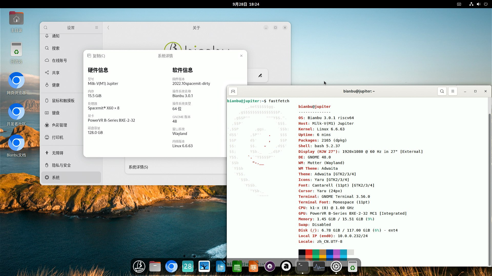

# Milk-V Jupiter Bianbu Test report

## Test Environment

### System Information

- Download Link: https://archive.spacemit.com/image/k1/version/bianbu/v3.0.1/
- Reference Install manual: https://milkv.io/docs/jupiter/getting-started/boot

### Hardware Information

- Milk-V Jupiter Board (Key Stone K1/M1, 4G/8G/16G)
    -  M1 + 16G is tested in this report
- DC 5.5*2.5mm 12V PSU / USB PD (12V required) / ATX PSU
    - 12V 3A is recommended for DC PSU, if more power is needed (e.g. using PCI-E peripherals) then ATX PSU is preferred
    - USB Type-C port isn't available when flashing using `titanflasher` or `fastboot`, external DC/ATX PSU is required
    - In this test report we're using a 12V 3A DC power supply
- A microSD card, or eMMC module, or NVMe SSD
    - Boot priority: `microSD > NVMe SSD > eMMC`
    - When booting from SD, the board won't go through SPI Flash
    - If either NVMe SSD or eMMC module is installed, `titanflasher` will only flash U-Boot to SPI Flash
    - In this test report we're using microSD, model: Samsung Pro Ultimate 128GB
- A USB to UART debugger
    - In this test report we're using CH343P
- USB Type-C cables (depends on your usage, at least one for flashing OS image)

## Installation Steps

### Flash Image (microSD Card)

**Please make sure to choose the file ending with `.img.zip`**

After downloading and extracting the image, use `dd` to flash the image to the microSD card.

```bash
unzip bianbu-25.04-desktop-k1-v3.0.1-release-20250815185656.img.zip
sudo dd if=/path/to/bianbu-25.04-desktop-k1-v3.0.1-release-20250815185656.img.zip of=/dev/your-device bs=1M status=progress
```

### Flash Image (eMMC/NVMe SSD)

**Please make sure to choose the zip file without `.img`**

Aside from microSD card, Jupiter also supports booting from eMMC or NVMe SSD.

If both are installed, `titanflasher` or `fastboot` by default will prefer flashing NVMe, and Jupiter and also boot from NVMe.

You may use either `titanflasher` or `fastboot` to flash the image, the latter requires unzipping.

On Windows `titanflasher` is recommended since driver install is needed.

#### Flash steps

1. Download `titanflasher` from [GitHub](https://github.com/milkv-jupiter/jupiter-tools/releases/tag/titanflasher).

In Windows, during the installation process, you'll be prompted to install fastboot/adb driver signed by `SpacemiT CA`.

You'll need to allow the driver installation.

2. Launch `titanflasher`，选择 `Dev Tools -> USB Download`。

3. Select the zip file you just downloaded. Or if you've unzipped it, you can also choose `Local Dir`.

4. Connect Jupiter with PC using USB Type-C cable.

5. Hold `RECOVERY` button (above the eMMC socket) or short `RECOVERY` pins (near the Wi-Fi IPEX socket), then plugin power for Jupiter.

6. Click `Scan Devices` in `titanflasher`. A `dfu-device` should show up.

7. Click `Start Flashing`. DO NOT poweroff or remove the USB cable.

8. Wait until it's done. If you ticked `Reboot after flashing` then Jupiter should auto reboot after the flashing process.

If not, disconnect the PSU and then reconnect it. Jupiter will automatically power on.

### Logging into the System

Logging into the system via the serial port or desktop environment. No non-root user by default. First boot desktop environment includes a setup wizard that requires setting a username and password. SSH is not enabled by default.

Default Username: `root`
Default Password: `bianbu`

## Actual Results

### Boot Log

[](https://asciinema.org/a/AYRdbtEF41f4Su8s5UkeZGmwq)

### Desktop Environment



## Test Conclusion

The system booted successfully and login through the onboard serial port as well as the GUI was successful.
