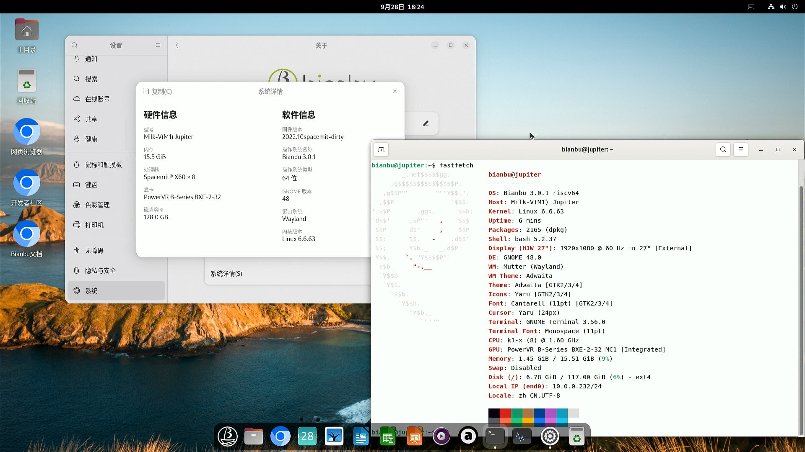

# Milk-V Jupiter 测试报告

## 测试环境

### 系统信息

- 下载链接：https://archive.spacemit.com/image/k1/version/bianbu/v3.0.1/
- 参考安装文档：https://milkv.io/zh/docs/jupiter/getting-started/boot

### 硬件信息

- Milk-V Jupiter (Key Stone K1/M1, 4G/8G/16G)
    - 本次测试的为 M1 + 16G 配置
- DC 12V 5.5*2.5mm 电源适配器，或 USB PD 电源（需要 12V 挡位），或 ATX 电源，任选其一
    - DC 电源推荐 12V 3A 或以上，如有 PCI-E 设备，供电需求较高时，建议使用 ATX 电源
    - 通过 `titanflasher` 或 `fastboot` 烧录时需要占用 USB Type-C 接口，此时 PD 供电不可用，需要 DC 或者 ATX 供电
    - 本次测试使用 DC 供电
- microSD 卡一张，或者 eMMC 模块，或者安装 NVMe SSD
    - 系统启动优先级为：`microSD > NVMe SSD > eMMC`
    - 从 SD 卡启动时不经过 SPI Flash
    - NVMe SSD 和 eMMC 都不存在时，`titanflasher` 工具只会烧录 U-Boot 等启动程序到 SPI Flash 中。
    - 本次测试使用 microSD 启动，型号为：Samsung Pro Ultimate 128GB
- USB to UART 调试器一个
    - 本次测试使用的调试器为 CH343P
- USB Type-C 线缆若干（取决于连接需求，至少预留一根用于烧录镜像）

## 安装步骤

### 刷写镜像（microSD 卡）

**请务必选择以 `.img.zip` 结尾的压缩包**

下载并解压镜像后，使用 `dd` 将镜像写入 microSD 卡。

```bash
unzip bianbu-25.04-minimal-k1-v3.0.1-release-20250815180414.img.zip
sudo dd if=/path/to/bianbu-25.04-minimal-k1-v3.0.1-release-20250815180414.img of=/dev/your-device bs=1M status=progress
```

### 刷写镜像（eMMC/NVMe SSD）

**请务必选择不带 `.img` 的 zip 压缩包**

除了 microSD 卡，Jupiter 亦支持从 eMMC 或 NVMe SSD 启动。

当同时安装有 eMMC 模块和 NVMe SSD 时，将优先烧录至 NVMe 并从 NVMe 启动。

系统镜像烧录到 SSD 或 eMMC 时，必须通过 Type-C 线连接到 PC 上进行烧录。

可以使用 `titanflasher` 工具烧录，或者解压后通过 `fastboot` 手动烧录，Windows 系统推荐前者。

#### 刷写步骤

1. 从 [GitHub](https://github.com/milkv-jupiter/jupiter-tools/releases/tag/titanflasher) 下载并安装 `titanflasher`。

Windows 下，安装途中会提示安装由 SpacemiT CA 签名的 fastboot/adb 驱动，允许安装即可。

2. 安装好后，启动 `titanflasher`，选择 `研发工具 -> 单机烧录`。

3. 使用 `titanflasher` 直接选择压缩包。若已经解压了镜像，也可以选择目录。

4. 使用 Type-C 线缆连接 Jupiter 的 Type-C 接口和 PC。

5. 按住 `RECOVERY` 按钮（位于 eMMC 座上方）或者短接 `RECOVERY` 排针（位于 Wi-Fi 天线座附近），然后给 Jupiter 上电。

6. 点击 `titanflasher` 中的扫描设备。此时应当能识别到 `dfu-device`。

7. 点击 `开始刷机`。刷写过程中请勿断电或拔插 USB 线。

8. 耐心等待刷写完成。若勾选了 `刷完自启动`，刷写完成后会自动开机。若未勾选，断电后重新上电，Jupiter 会自动启动。

### 登录系统

通过串口登录或图形界面系统,默认没有非 root 用户,图形界面初次启动有设置向导,需要设置用户名和密码,默认不启动 SSH.

默认用户名： `root`
默认密码： `bianbu`

## 实际结果

### 启动信息

[](https://asciinema.org/a/AYRdbtEF41f4Su8s5UkeZGmwq)

### 桌面环境



## 测试结论

系统正常启动，成功通过串口及图形界面登录。
