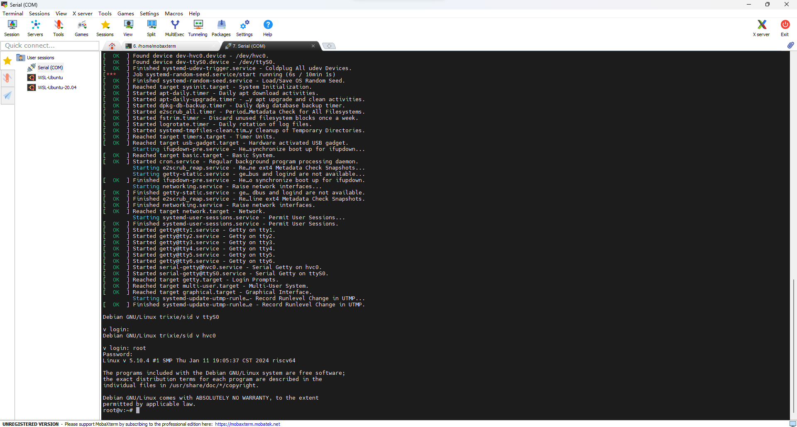

# Debian K230 Test Report

## Test Environment

### Operating System Information

- System Version: canmv_debian_sdcard_sdk_1.3
- Download Link: [https://kendryte-download.canaan-creative.com/developer/k230/canmv_debian_sdcard_sdk_1.3.img.gz](https://kendryte-download.canaan-creative.com/developer/k230/canmv_debian_sdcard_sdk_1.3.img.gz)
- Reference Installation Document: [https://developer.canaan-creative.com/k230/dev/zh/CanMV_K230_%E6%95%99%E7%A8%8B.html](https://developer.canaan-creative.com/k230/dev/zh/CanMV_K230_%E6%95%99%E7%A8%8B.html)

### Hardware Information

- Development Board: Canaan Kendryte K230

## Installation Steps

### Flashing the Image to the microSD Card

Use `dd` to flash the image to the microSD card. Assuming the microSD card device is `/dev/sdb`.

```bash
wget https://kendryte-download.canaan-creative.com/developer/k230/canmv_debian_sdcard_sdk_1.3.img.gz
gzip -d canmv_debian_sdcard_sdk_1.3.img.gz
sudo dd if=canmv_debian_sdcard_sdk_1.3.img of=/dev/sdb bs=1M status=progress oflag=sync
```

### Logging into the System

Logging into the system via the serial port.

Default Username: `root`
Default Password: `root`

## Expected Results

The system should boot normally and allow login via the onboard serial port.

## Actual Results

The system booted successfully and login via the onboard serial port was also successful.

### Boot Information



Screen recording (from flashing the image to login):

[](https://asciinema.org/a/WT2Nz2w7OubHlHaQMEpJZCD8x)

```log
Debian GNU/Linux trixie/sid v hvc0

v login: oto
Password: 

Login incorrect
v login: root
Password: 
Linux v 5.10.4 #1 SMP Thu Jan 11 19:05:37 CST 2024 riscv64

The programs included with the Debian GNU/Linux system are free software;
the exact distribution terms for each program are described in the
individual files in /usr/share/doc/*/copyright.

Debian GNU/Linux comes with ABSOLUTELY NO WARRANTY, to the extent
permitted by applicable law.
root@v:~# uname -a
Linux v 5.10.4 #1 SMP Thu Jan 11 19:05:37 CST 2024 riscv64 GNU/Linux
root@v:~# cat /etc/os-release 
PRETTY_NAME="Debian GNU/Linux trixie/sid"
NAME="Debian GNU/Linux"
VERSION_CODENAME=trixie
ID=debian
HOME_URL="https://www.debian.org/"
SUPPORT_URL="https://www.debian.org/support"
BUG_REPORT_URL="https://bugs.debian.org/"
root@v:~# 

```

## Test Criteria

Successful: The actual result matches the expected result.

Failed: The actual result does not match the expected result.

## Test Conclusion

Test successful.
