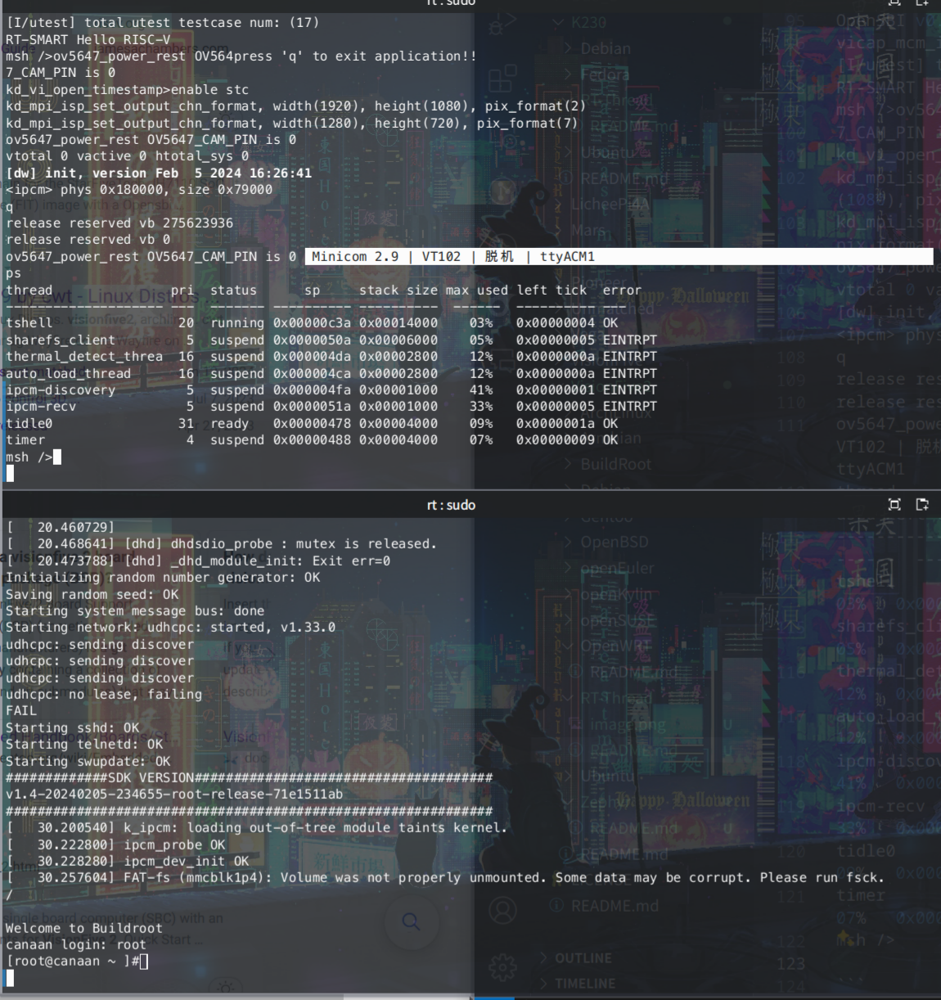

# RT-Thread K230 测试报告

## 测试环境

### 操作系统信息

官方预编译 SDK 已经含有了 RT-Smart。

- 下载链接：https://github.com/kendryte/k230_sdk/releases/tag/v1.4
- 参考安装文档：https://github.com/kendryte/k230_docs/blob/main/zh/01_software/board/K230_SDK_%E4%BD%BF%E7%94%A8%E8%AF%B4%E6%98%8E.md

### 硬件信息

- 开发板：Canaan Kendryte K230
- USB A to C / USB C to C 线缆

## 安装步骤

### 刷写镜像

使用 `unzstd` 解压镜像。
清空你的 sd 卡。
使用 `dd` 将镜像写入 microSD 卡。

```bash
gizp -d /path/to/k230.img.gz
sudo wipefs -a /dev/your_device
sudo dd if=/path/to/k230.img of=/dev/your_device bs=1M status=progress
```

### 登录系统

通过串口登录系统。

默认用户： `root`
无默认密码。

其中小核 tty 为 Linux，大核 tty 为 RT-Smart。

## 实际结果

```log
OpenSBI v0.9
vicap_mcm_init[I/utest] utest is initialize success.
[I/utest] total utest testcase num: (17)
RT-SMART Hello RISC-V
msh />ov5647_power_rest OV564press 'q' to exit application!!
7_CAM_PIN is 0 
kd_vi_open_timestamp>enable stc
kd_mpi_isp_set_output_chn_format, width(1920), height(1080), pix_format(2)
kd_mpi_isp_set_output_chn_format, width(1280), height(720), pix_format(7)
ov5647_power_rest OV5647_CAM_PIN is 0 
vtotal 0 vactive 0 htotal_sys 0
[dw] init, version Feb  5 2024 16:26:41
<ipcm> phys 0x180000, size 0x79000
q
release reserved vb 275623936
release reserved vb 0
ov5647_power_rest OV5647_CAM_PIN is 0                                    
ps
thread               pri  status      sp     stack size max used left tick  error
-------------------- ---  ------- ---------- ----------  ------  ---------- ---
tshell                20  running 0x00000c3a 0x00014000    03%   0x00000004 OK
sharefs_client         5  suspend 0x0000050a 0x00006000    05%   0x00000005 EINTRPT
thermal_detect_threa  16  suspend 0x000004da 0x00002800    12%   0x0000000a EINTRPT
auto_load_thread      16  suspend 0x000004ca 0x00002800    12%   0x0000000a EINTRPT
ipcm-discovery         5  suspend 0x000004fa 0x00001000    41%   0x00000001 EINTRPT
ipcm-recv              5  suspend 0x0000051a 0x00001000    33%   0x00000005 EINTRPT
tidle0                31  ready   0x00000478 0x00004000    09%   0x0000001a OK
timer                  4  suspend 0x00000488 0x00004000    07%   0x00000009 OK
msh />

```



## 测试判定标准

测试成功：实际结果与预期结果相符。

测试失败：实际结果与预期结果不符。

## 测试结论

测试成功。
