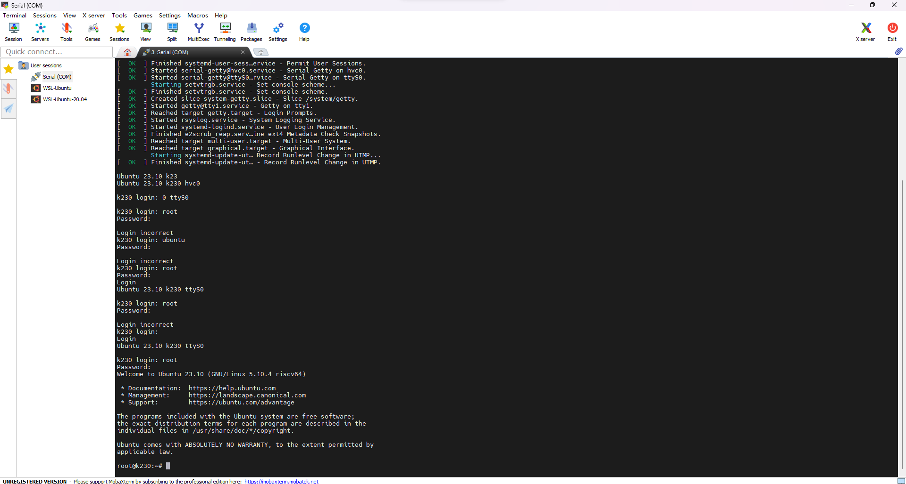

# Ubuntu K230 Test Report

## Test Environment

### Operating System Information

- System Version: canmv_ubuntu_sdcard_sdk_1.3
- Download Link: https://kendryte-download.canaan-creative.com/developer/k230/canmv_ubuntu_sdcard_1.3.img.gz
- Reference Installation Document: https://developer.canaan-creative.com/k230/dev/zh/CanMV_K230_%E6%95%99%E7%A8%8B.html

### Hardware Information

- Development Board: Canaan Kendryte K230

## Installation Steps

### Flashing the Image to the microSD Card

Use `dd` to flash the image to the microSD card. Assuming the microSD card device is `/dev/sdb`.

```bash
wget https://kendryte-download.canaan-creative.com/developer/k230/canmv_ubuntu_sdcard_1.3.img.gz
gzip -d canmv_ubuntu_sdcard_1.3.img.gz
sudo dd if=canmv_ubuntu_sdcard_1.3.img of=/dev/sdb bs=1M status=progress oflag=sync
```

### Logging into the System

Logging into the system via the serial port.

Default Username: `root`
Default Password: `root`

## Expected Results

The system should boot normally and allow login via the onboard serial port.

## Actual Results

The system booted successfully and login via the onboard serial port was also successful.

### Boot Information



Screen recording (From flashing the system to login):

[](https://asciinema.org/a/rFklZEOMyjSQCPaSjrS3OStOF)

```log
Ubuntu 23.10 k230 hvc0

k230 login: 
Ubuntu 23.10 k230 ttyS0

k230 login: root
Password: 
Welcome to Ubuntu 23.10 (GNU/Linux 5.10.4 riscv64)

 * Documentation:  https://help.ubuntu.com
 * Management:     https://landscape.canonical.com
 * Support:        https://ubuntu.com/advantage

The programs included with the Ubuntu system are free software;
the exact distribution terms for each program are described in the
individual files in /usr/share/doc/*/copyright.

Ubuntu comes with ABSOLUTELY NO WARRANTY, to the extent permitted by
applicable law.

root@k230:~# uname -a
Linux k230 5.10.4 #1 SMP Thu Jan 11 19:05:37 CST 2024 riscv64 riscv64 riscv64 GNU/Linux
root@k230:~# cat /etc/os-release 
PRETTY_NAME="Ubuntu 23.10"
NAME="Ubuntu"
VERSION_ID="23.10"
VERSION="23.10 (Mantic Minotaur)"
VERSION_CODENAME=mantic
ID=ubuntu
ID_LIKE=debian
HOME_URL="https://www.ubuntu.com/"
SUPPORT_URL="https://help.ubuntu.com/"
BUG_REPORT_URL="https://bugs.launchpad.net/ubuntu/"
PRIVACY_POLICY_URL="https://www.ubuntu.com/legal/terms-and-policies/privacy-policy"
UBUNTU_CODENAME=mantic
LOGO=ubuntu-logo
```

## Test Criteria

Successful: The actual result matches the expected result.

Failed: The actual result does not match the expected result.

## Test Conclusion

Test successful.
