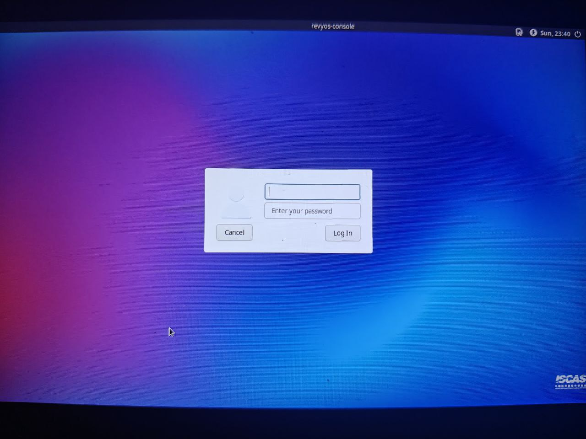

# RevyOS Lichee Console 4A 版本测试报告

## 测试环境

### 操作系统信息

- 系统版本：RevyOS
- 下载链接：https://wiki.sipeed.com/hardware/zh/lichee/th1520/lcon4a/3_images.html
- 参考安装文档：https://wiki.sipeed.com/hardware/zh/lichee/th1520/lcon4a/4_burn_image.html

### 硬件信息

- Lichee Cluster 4A 8G / 16G
- 随机电源
- USB A to C 线一根

## 安装步骤

### 进入 `fastboot` 环境

boot 按键与 rst 按键位于 nvme 硬盘仓内：

按住 boot 按键同时按动键盘上的电源键进入 fastboot，lsusb 应出现：
```
ID 2345:7654 T-HEAD USB download gadget
```

### 使用 `fastboot` 刷写镜像到板载 eMMC

使用 lz4 解压镜像：
```bash
lz4 -d path/to/boot.ext4.lz4
lz4 -d path/to/root.ext4.lz4
```

连接 USB 线至机身后端的 type-C 口，使用 `fastboot` 烧录。

```bash
fastboot flash ram u-boot-with-spl-console-ramsize.bin
fastboot reboot
fastboot flash uboot u-boot-with-spl-console-ramsize.bin
fastboot flash boot path/to/boot.ext4
fastboot flash root path/to/root.ext4
```

### 登录系统

通过串口或图形界面登录系统。

默认镜像的帐号密码配置如下：

账户：`sipeed`，密码：`licheepi`

账户：`debian`，密码：`debian`

root 账户默认没有设置密码。

## 预期结果

系统正常启动，能够正常登录。

## 实际结果

系统正常启动，能正常登录并进入系统。

### 启动信息

屏幕录像（刷写系统）：

[](https://asciinema.org/a/hZHlwXaPj9W1AQgADtrgYRB4m)

```log
debian@lpi4a:~$ cat /etc/os-release 
PRETTY_NAME="Debian GNU/Linux 12 (bookworm)"
NAME="Debian GNU/Linux"
VERSION_ID="12"
VERSION="12 (bookworm)"
VERSION_CODENAME=bookworm
ID=debian
HOME_URL="https://www.debian.org/"
SUPPORT_URL="https://www.debian.org/support"
BUG_REPORT_URL="https://bugs.debian.org/"
debian@lpi4a:~$ uname -a
Linux lpi4a 5.10.113-sipeed-20240312+ #10 SMP PREEMPT Tue Mar 12 14:33:06 HKT 2024 riscv64 GNU/Linux
debian@lpi4a:~$ cat /etc/revyos-release 
BUILD_ID=20240202_141632
BUILD_DATE=20240202
RELEASE_ID=20240202
COMMIT_ID=09f8aabe9ed5ca28639a4df84bad507e746118d3
RUNNER_ID=7757184473
debian@lpi4a:~$ 
```



## 测试判定标准

测试成功：实际结果与预期结果相符。

测试失败：实际结果与预期结果不符。

## 测试结论

测试成功。