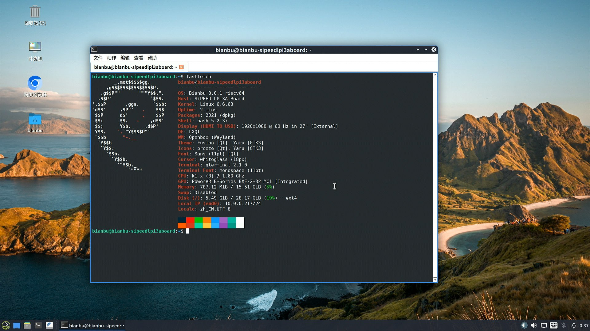

# Bianbu Lichee Pi 3A Test Report

## Test Environment

### System Information

- System version: v3.0.1 Desktop Lite
- Download Links: https://archive.spacemit.com/image/k1/version/bianbu/v3.0.1/
- Reference Installation Document: https://wiki.sipeed.com/hardware/en/lichee/K1/lpi3a/1_intro.html

### Hardware Information

- Lichee Pi 3A
- Power adapter
- A USB to UART Debugger
- A microSD Card (if flash to microSD)
- A Type-C cable for fastboot flash

## Installation Steps

### Flashing the Image (SD Card)

**Please make sure to choose the file ending with `.img.zip`**
After downloading and extracting the image, use `dd` to flash the image to the microSD card.

```bash
unzip bianbu-25.04-desktop-lite-k1-v3.0.1-release-20250815184229.img.zip
sudo dd if=/path/to/bianbu-25.04-desktop-lite-k1-v3.0.1-release-20250815184229.img of=/dev/your-device bs=1M status=progress
```

### Flashing the Image (eMMC)

**Please make sure to choose the file ending without `img`**
After downloading and extracting the image, use `fastboot` to flash the image to the eMMC.

```bash
unzip bianbu-25.04-desktop-lite-k1-v3.0.1-release-20250815184229.zip
```

Hold the BOOT button while powering on/RST, to enter the fastboot mode. You shall see the dfu-device in your system.

> Note: for the steps below, `sudo` might be needed.
> Otherwise `fastboot` might not pick up the board since it's default USB VID/PID is not in the default udev rules.

```log
❯ sudo fastboot devices
dfu-device       DFU download
```

```bash
fastboot stage factory/FSBL.bin
fastboot continue
# Wait for 1 sec
fastboot stage u-boot.itb
fastboot continue
# Wait for 1 sec
fastboot flash gpt partition_universal.json
fastboot flash bootinfo factory/bootinfo_emmc.bin
fastboot flash fsbl factory/FSBL.bin
fastboot flash env env.bin
fastboot flash opensbi fw_dynamic.itb
fastboot flash uboot u-boot.itb
fastboot flash bootfs bootfs.ext4
fastboot flash rootfs rootfs.ext4
```

### Logging into the System

Logging into the system via the serial port or desktop environment. No non-root user by default. First boot desktop environment includes a setup wizard that requires setting a username and password. SSH is not enabled by default.

Default Username: `root`
Default Password: `bianbu`

## Actual Results

### Boot Log

Screen recording:

[](https://asciinema.org/a/JfIdHXEZ7PGMhHDaaoj2r9Y0X)

### Desktop Environment



## Test Conclusion

The system booted successfully and login through the onboard serial port as well as the GUI was successful.
