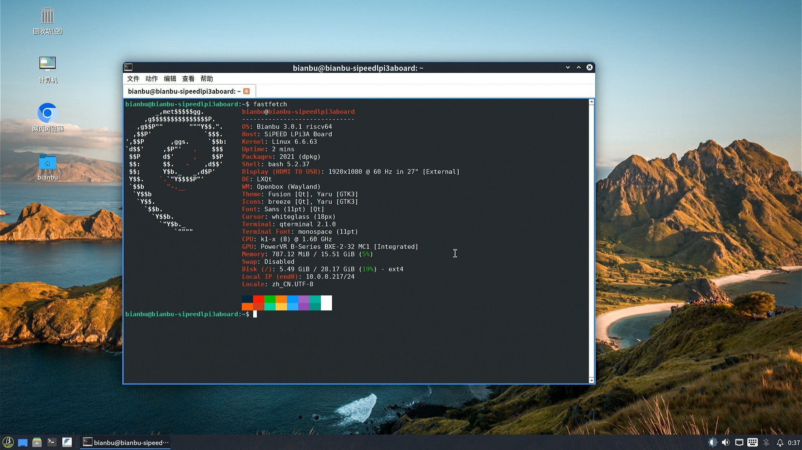

# Bianbu 荔枝派 Lichee Pi 3A 测试报告

## 测试环境

### 系统信息

- 系统版本：v3.0.1 Desktop Lite
- 下载链接：https://archive.spacemit.com/image/k1/version/bianbu/v3.0.1/
- 参考安装文档：https://wiki.sipeed.com/hardware/zh/lichee/K1/lpi3a/1_intro.html

### 硬件信息

- 荔枝派 Lichee Pi 3A
- 电源适配器
- USB to UART 调试器
- microSD 卡一张（如果刷写到 SD 卡）
- Type-C 数据线（用于 fastboot 刷写）

## 安装步骤

### 刷写镜像（SD 卡）

**请务必选择以 `.img.zip` 结尾的压缩包**
下载并解压镜像后，使用 `dd` 将镜像写入 microSD 卡。

```bash
unzip bianbu-25.04-desktop-lite-k1-v3.0.1-release-20250815184229.img.zip
sudo dd if=/path/to/bianbu-25.04-desktop-lite-k1-v3.0.1-release-20250815184229.img of=/dev/your-device bs=1M status=progress
```

### 刷写镜像（eMMC）

**请务必选择不包含 `img` 的压缩包**
下载并解压镜像后，使用 `fastboot` 将镜像刷写到 eMMC。

```bash
unzip bianbu-25.04-desktop-lite-k1-v3.0.1-release-20250815184229.zip
```

> 注意：下面的步骤可能需要使用 `sudo`。
> 否则 `fastboot` 可能不会正确识别设备，因为默认的 USB VID/PID 不在 udev 规则内。

```bash
❯ fastboot devices
dfu-device       DFU download
```

```bash
fastboot stage factory/FSBL.bin
fastboot continue
# Wait for 1 sec
fastboot stage u-boot.itb
fastboot continue
# Wait for 1 sec
fastboot flash gpt partition_universal.json
fastboot flash bootinfo factory/bootinfo_emmc.bin
fastboot flash fsbl factory/FSBL.bin
fastboot flash env env.bin
fastboot flash opensbi fw_dynamic.itb
fastboot flash uboot u-boot.itb
fastboot flash bootfs bootfs.ext4
fastboot flash rootfs rootfs.ext4
```

### 登录系统

通过串口登录或图形界面系统,默认没有非 root 用户,图形界面初次启动有设置向导,需要设置用户名和密码,默认不启动 SSH.

默认用户名： `root`
默认密码： `bianbu`

## 预期结果

系统正常启动，能够通过板载串口登录。

## 实际结果

### 启动信息

[](https://asciinema.org/a/JfIdHXEZ7PGMhHDaaoj2r9Y0X)

### 桌面环境



## 测试结论

系统正常启动，成功通过串口及图形界面登录。
