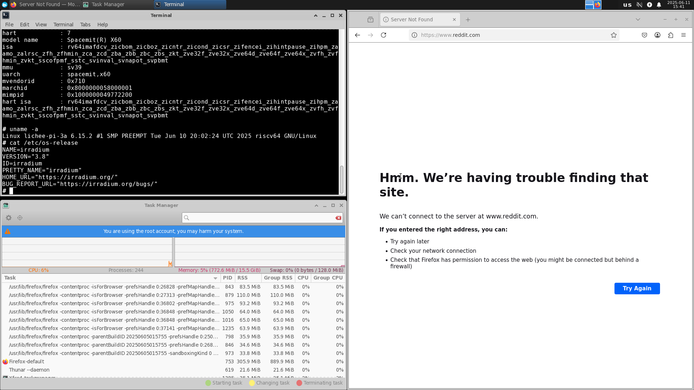

# irradium LicheePi 3A 测试报告

## 测试环境

### 系统信息
- 系统版本：[irradium 3.8](https://irradium.org/)
-  官方下载链接:
  - irradium-core: <https://dl.irradium.org/irradium/images/lichee_pi_3a/irradium-3.8-riscv64-core-lichee_pi_3a-6.16.0-build-20250801.img.zst>
  - irradium-xfce: <https://dl.irradium.org/irradium/images/lichee_pi_3a/irradium-3.8-riscv64-xfce-lichee_pi_3a-6.16.0-build-20250801.img.zst>
  - boot: <https://dl.irradium.org/irradium/images/lichee_pi_3a/boot-20250801.tar.xz>
- 更快的下载链接:
  - irradium-core: <https://mirrors.dotsrc.org/irradium/images/lichee_pi_3a/irradium-3.8-riscv64-core-lichee_pi_3a-6.15.2-build-20250611.img.zst>
  - irradium-xfce: <https://mirrors.dotsrc.org/irradium/images/lichee_pi_3a/irradium-3.8-riscv64-xfce-lichee_pi_3a-6.15.2-build-20250611.img.zst>
- 安装参考文档: <https://dl.irradium.org/irradium/images/lichee_pi_3a/README.TXT>

### 硬件信息
- Lichee Pi 3A
- 电源适配器
- USB to UART 调试器一个
- 杜邦线三根
- microSD 卡一张

## 安装步骤

### 下载并解压镜像与 u-boot
从[官方下载服务器](https://dl.irradium.org/irradium/images/lichee_pi_3a/)下载你所需镜像与 u-boot。
**解压相关文件**
```bash
zstd -d irradium-3.8-riscv64-core-lichee_pi_3a-6.15.2-build-20250611.img.zst
zstd -d irradium-3.8-riscv64-xfce-lichee_pi_3a-6.15.2-build-20250611.img.zst
```

**结果如下：**
```bash
❯ tree .
.
├── irradium-3.8-riscv64-core-lichee_pi_3a-6.15.2-build-20250510.img
├── irradium-3.8-riscv64-core-lichee_pi_3a-6.15.2-build-20250510.img.zst
├── irradium-3.8-riscv64-xfce-lichee_pi_3a-6.15.2-build-20250510.img
└── irradium-3.8-riscv64-xfce-lichee_pi_3a-6.15.2-build-20250510.img.zst
```

### 向 microSD 卡烧录系统镜像
可使用 `dd` 命令
```bash
sudo dd if=irradium-3.8-riscv64-core-lichee_pi_3a-6.15.2-build-20250510.img of=/dev/mmcblk0 bs=1M
```

### 登录系统
将 microSD 卡插入 LPi3A，重启。
通过串口登录系统，例如 `minicom` 工具。
```bash
minicom -D /dev/ttyACM0 -c on
```
默认用户名： `root`
启动后需要设置密码

## 预期结果
系统正常启动，能够通过板载串口登录。
若接入网络，可通过 SSH 登录。

## 实际结果
系统正常启动，成功通过板载串口登录。

```log
# uname -a
Linux lichee-pi-3a 6.15.2 #1 SMP PREEMPT Tue Jun 10 20:02:24 UTC 2025 riscv64 GNU/Linux
# cat /etc/os-release 
NAME=irradium
VERSION="3.8"
ID=irradium
PRETTY_NAME="irradium"
HOME_URL="https://irradium.org/"
BUG_REPORT_URL="https://irradium.org/bugs/"
```

## 桌面环境
官方提供了附带 **Xfce** 桌面环境的系统镜像，烧录进 microSD 卡即可使用。
```bash
sudo dd if=irradium-3.8-riscv64-xfce-lichee_pi_3a-6.15.2-build-20250510.img of=/dev/mmcblk0 bs=1M
```
桌面环境截图：



## 测试判定标准
测试成功：实际结果与预期结果相符。

测试失败：实际结果与预期结果不符。

## 测试结论
测试成功。