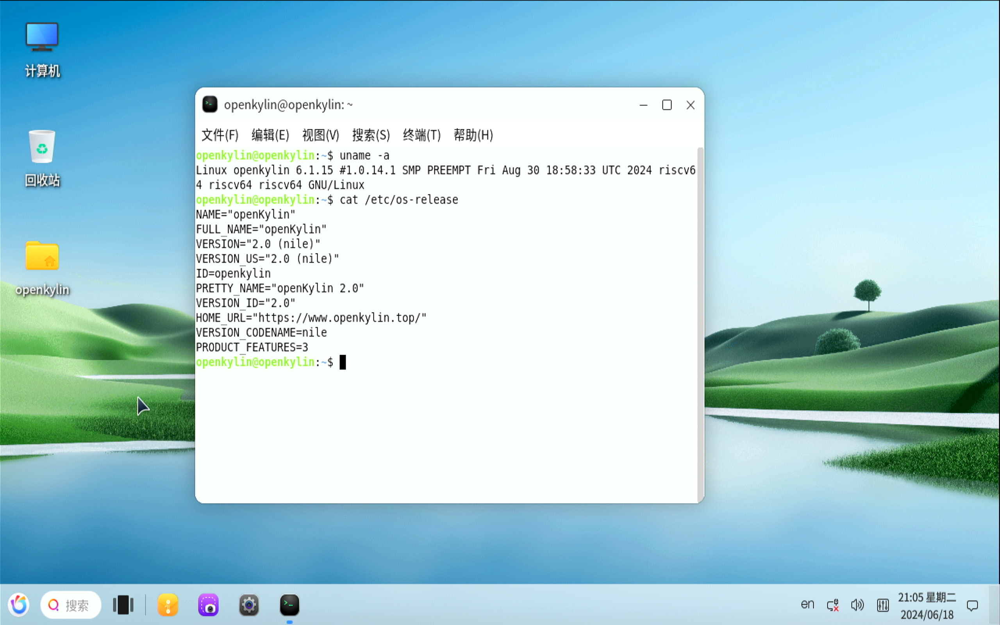

# openKylin v2.0 SP1 荔枝派 Lichee Pi 3A 测试报告

## 测试环境

### 系统信息

- 系统版本：openKylin v2.0-SP1
- 下载链接：[https://www.openkylin.top/downloads/index-cn.html](https://www.openkylin.top/downloads/index-cn.html) **选择 k1 镜像**
- 参考安装文档：[https://docs.openkylin.top/zh/01_%E5%AE%89%E8%A3%85%E5%8D%87%E7%BA%A7%E6%8C%87%E5%8D%97/%E5%9C%A8riscv%E4%B8%8A%E5%AE%89%E8%A3%85/%E5%9C%A8SpacemiT_K1%E4%B8%8A%E5%AE%89%E8%A3%85openKylin](https://docs.openkylin.top/zh/01_%E5%AE%89%E8%A3%85%E5%8D%87%E7%BA%A7%E6%8C%87%E5%8D%97/%E5%9C%A8riscv%E4%B8%8A%E5%AE%89%E8%A3%85/%E5%9C%A8SpacemiT_K1%E4%B8%8A%E5%AE%89%E8%A3%85openKylin)

### 硬件信息

- 荔枝派 Lichee Pi 3A
- 电源适配器
- USB 转 UART 调试器
- microSD 卡

## 安装步骤

### 使用 `dd` 将镜像写入 SD 卡

下载并解压镜像后，使用 `dd` 将镜像写入 microSD 卡。

```bash
xz -d openKylin-Embedded-V2.0-SP1-spacemit-k1-riscv64.img.xz
sudo dd if=openKylin-Embedded-V2.0-SP1-spacemit-k1-riscv64.img of=/dev/your-device bs=1M status=progress oflag=dsync
```

### 登录系统

通过串口登录系统。

默认用户名： `openkylin`
默认密码： `openkylin`

## 预期结果

系统正常启动，能够通过板载串口登录。可通过显示器访问桌面。

## 实际结果

系统正常启动，能够通过板载串口登录。可通过显示器访问桌面。

### 启动信息

屏幕录像（从刷写镜像到登录系统）：
[](https://asciinema.org/a/pST1HOrfsuWLalTtE47RzzoUO)

```log
openKylin 2.0 openkylin ttyS0

openkylin 用户名：openkylin
密码： 
Welcome to openKylin 2.0 (GNU/Linux 6.1.15 riscv64)

 * Support:        https://openkylin.top

The programs included with the openKylin system are free software;
the exact distribution terms for each program are described in the
individual files in /usr/share/doc/*/copyright.

openKylin comes with ABSOLUTELY NO WARRANTY, to the extent permitted by
applicable law.

You do not have any new mail.
load environment: QT_ACCESSIBILITY=1
load environment: PATH=/usr/local/sbin:/usr/local/bin:/usr/sbin:/usr/bin:/sbin:/bin:/usr/games:/usr/local/games:/snap/bin
load environment: COGL_DRIVER=gles2
load environment: GDK_GL=gles
load environment: XWAYLAND_NO_GLAMOR=1
load environment: SDL_VIDEODRIVER=wayland
load environment: MESA_LOADER_DRIVER_OVERRIDE=pvr
openkylin@openkylin:~$ uname -a
Linux openkylin 6.1.15 #1.0.14.1 SMP PREEMPT Fri Aug 30 18:58:33 UTC 2024 riscv64 riscv64 riscv64 GNU/Linux
openkylin@openkylin:~$ cat /etc/os-release 
NAME="openKylin"
FULL_NAME="openKylin"
VERSION="2.0 (nile)"
VERSION_US="2.0 (nile)"
ID=openkylin
PRETTY_NAME="openKylin 2.0"
VERSION_ID="2.0"
HOME_URL="https://www.openkylin.top/"
VERSION_CODENAME=nile
PRODUCT_FEATURES=3
openkylin@openkylin:~$ lscpu
架构：                riscv64
  字节序：            Little Endian
CPU:                  8
  在线 CPU 列表：     0-7
型号名称：            Spacemit(R) X60
  每个核的线程数：    1
  每个座的核数：      8
  座：                1
  CPU(s) scaling MHz: 100%
  CPU 最大 MHz：      1600.0000
  CPU 最小 MHz：      614.4000
Caches (sum of all):  
  L1d:                256 KiB (8 instances)
  L1i:                256 KiB (8 instances)
  L2:                 1 MiB (2 instances)
openkylin@openkylin:~$ 
```

登录界面 
桌面: 

## 测试判定标准

测试成功：实际结果与预期结果相符。

测试失败：实际结果与预期结果不符。

## 测试结论

成功
