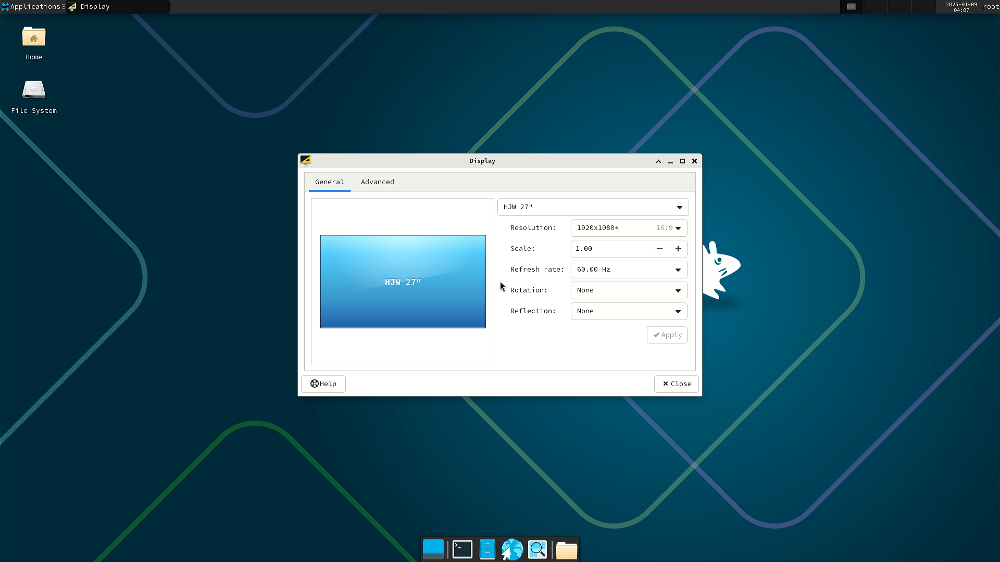

# Arch Linux LPi4A 测试报告

## 测试环境

### 系统信息

- 下载链接：[https://mirror.iscas.ac.cn/archriscv/images/](https://mirror.iscas.ac.cn/archriscv/images/)
- u-boot 与 boot 下载（采用 revyos 的）：[https://mirror.iscas.ac.cn/revyos/extra/images/lpi4a/20231210/](https://mirror.iscas.ac.cn/revyos/extra/images/lpi4a/)
- fastboot 下载：[https://gitee.com/thead-yocto/light_deploy_images](https://gitee.com/thead-yocto/light_deploy_images)
- 参考安装文档：
    - [ArchWiki](https://wiki.archlinux.org/title/General_recommendations)

### 硬件信息

- Lichee Pi 4A (8G RAM + 64G eMMC)
- 电源适配器
- USB to UART 调试器一个

## 安装步骤

### 创建 rootfs

由于 Arch Linux 提供的并非打包好的镜像，而是 rootfs，我们需要自行打包镜像。

- 创建块设备，并创建文件系统
```bash
sudo dd if=/dev/zero of=rootfs.ext4 bs=1M count=6144 # 创建 6g 的rootfs
sudo mkfs.ext4 rootfs.ext4
mkdir mnt
sudo mount ./rootfs.ext4 ./mnt
```

- 将 rootfs 解压到根目录中
```bash
sudo tar -I zstd -xvf archriscv-2023-12-13.tar.zst -C mnt/
```

- 获取该 fs 的 UUID
```bash
lsblk -o NAME,UUID
```

- 到 rootfs 中进行必要的更新，包安装与调整
```bash
sudo systemd-nspawn -D ./mnt --machine=archriscv

# 接下来是在 rootfs 中进行的
pacman -Syu
# 在此处安装你需要的包，如 vim 等。
echo "UUID=$UUID /  ext4  defaults  1  1 " >> /etc/fstab # 此处的 $UUID 是之前获得的
passwd # 请设置你的root密码！！
exit
```

- umount rootfs
```bash
sudo umount ./mnt
```

### 刷写 bootloader

解压安装套件。
刷入 u-boot 与 boot。

*根据你的硬件版本选择是否需要 16g*

```bash
zstd -d boot-lpi4a-20231210_134926.ext4.zst
sudo ./fastboot flash ram ./path/to/u-boot-with-spl-lpi4a.bin
sudo ./fastboot reboot
sudo ./fastboot flash uboot ./path/to/u-boot-with-spl-lpi4a.bin
sudo ./fastboot flash boot boot-lpi4a-20231210_134926.ext4
```

### 刷写镜像

将 root 分区刷入 eMMC 中。

```bash
sudo ./fastboot flash root rootfs.ext4
```

### 登录系统

通过串口登录系统。

默认用户名： `root`
默认密码：此处为你之前自行设置的密码。

## 预期结果

系统正常启动，能够通过板载串口登录。

## 实际结果

系统正常启动，成功通过板载串口登录。

### 启动信息



屏幕录像（从创建 rootfs 到登录系统）：

[](https://asciinema.org/a/7Ywwvlg1kdyAyTa9hiUOnv4yN)

```log
Arch Linux 5.10.113-yocto-standard (ttyS0)

archlinux login: root
Password: 
Last login: Sat Mar  9 10:04:36 on ttyS0
[root@archlinux ~]# neofetch 
                   -`                                                                                                           
                  .o+`                   -------------- 
                 `ooo/                   OS: Arch Linux riscv64 
                `+oooo:                  Host: T-HEAD Light Lichee Pi 4A configuration for 8GB DDR board 
               `+oooooo:                 Kernel: 5.10.113-lpi4a 
               -+oooooo+:                Uptime: 3 mins 
             `/:-:++oooo+:               Packages: 283 (pacman) 
            `/++++/+++++++:              Shell: bash 5.2.26 
           `/++++++++++++++:             Resolution: 1920x1080 
          `/+++ooooooooooooo/`           Terminal: /dev/ttyS0 
         ./ooosssso++osssssso+`          CPU: (4) @ 1.848GHz 
        .oossssso-````/ossssss+`         Memory: 84MiB / 7687MiB 
       -osssssso.      :ssssssso.
      :osssssss/        osssso+++.                               
     /ossssssss/        +ssssooo/-                               
   `/ossssso+/:-        -:/+osssso+-
  `+sso+:-`                 `.-/+oso:
 `++:.                           `-/+/
 .`                                 `/
```

## 测试判定标准

测试成功：实际结果与预期结果相符。

测试失败：实际结果与预期结果不符。

## 测试结论

测试成功。
