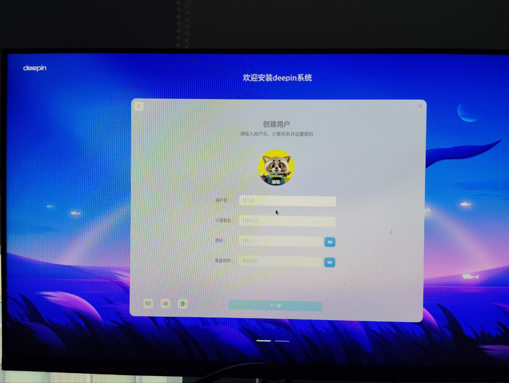

# Deepin preview LPi4A Test Report

## Test Environment

### System Information

- System Version: Deepin preview 20240603
- Download Link: https://cdimage.deepin.com/RISC-V/preview-20240613-riscv64/deepin-23-beige-preview-riscv64-lpi4a-20240613-122949.tar.xz
- Reference Installation Document: https://cdimage.deepin.com/RISC-V/preview-20240517-riscv64/README.md

### Hardware Information

- Lichee Pi 4A (8GB RAM + 32GB eMMC)
- Power Adapter
- A USB to UART Debugger

## Installation Steps

### Get uboot

The tar doesn't contain the u-boot bin, you need to get it on your own: https://cdimage.deepin.com/RISC-V/beta3-20240205-riscv64/lpi4a/index.html

Choose whether you need the 16g version based on your ram size.

### Flashing the Bootloader

Extract the installation suite.
Flash the u-boot and boot.

```bash
tar -xvf deepin-23-beige-preview-riscv64-lpi4a-20240613-122949.tar.xz
sudo fastboot flash ram u-boot-with-spl.bin
sudo fastboot reboot
sudo fastboot flash uboot u-boot-with-spl.bin
sudo fastboot flash boot deepin-lpi4a-riscv64-stable-desktop-installer.boot.ext4
```

### Flashing the Image

Flash the root partition into the eMMC.

```bash
sudo fastboot flash root deepin-lpi4a-riscv64-stable-desktop-installer.root.ext4
```

### Logging into the System

Reboot the system, then a installization guide will pop out.

## Expected Results

The system should boot successfully, allowing login via the onboard serial console.

## Actual Results

The system booted up correctly, and login via the onboard serial console was successful.

### Boot Log

Screen recording (system login):
[](https://asciinema.org/a/8EfjIFC3FLJBBwgOG8nZod4q7)



## Test Criteria

Successful: The actual result matches the expected result.

Failed: The actual result does not match the expected result.

## Test Conclusion

Test Successful.
