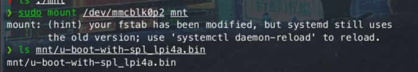

# Fedora 38 LPi4A Official Test Report

## Test Environment

### System Information

- System Version: Fedora 38
- Download Link: [https://openkoji.iscas.ac.cn/pub/dl/riscv/T-Head/th1520_light/images/](https://openkoji.iscas.ac.cn/pub/dl/riscv/T-Head/th1520_light/images/)
- Reference Installation Document: [https://fedoraproject.org/wiki/Architectures/RISC-V/T-Head](https://fedoraproject.org/wiki/Architectures/RISC-V/T-Head)
- fastboot Links:
    - [https://pan.baidu.com/e/1xH56ZlewB6UOMlke5BrKWQ](https://pan.baidu.com/e/1xH56ZlewB6UOMlke5BrKWQ)
    - [https://mega.nz/folder/phoQlBTZ#cZeQ3qZ__pDvP94PT3_bGA](https://mega.nz/folder/phoQlBTZ#cZeQ3qZ__pDvP94PT3_bGA)

### Hardware Information

- Lichee Pi 4A (8GB RAM + 64GB eMMC)
- Power Adapter
- One microSD Card
- One USB to UART Debugger

## Installation Steps

### Flashing Image

Use `unxz` to extract the image.
Use `dd` to flash the image to the microSD card.

```bash
unxz /path/to/fedora.raw.xz
sudo dd if=/path/to/fedora.raw of=/dev/your_device bs=1M status=progress
```

### Flashing Bootloader

**Note: The Fedora's u-boot is in the image. After dd in the previous step, extract from the boot partition on the SD card!**


Enter fastboot.
- Make sure the boot switch on the production version is set to eMMC.
- Press BOOT while powering on.
- (Refer to official tutorials)
Use fastboot command to flash u-boot.

```bash
sudo ./fastboot flash ram ./path/to/your/u-boot-with-spl_lpi4a.bin
sudo ./fastboot reboot
sleep 10
sudo ./fastboot flash uboot ./path/to/your/u-boot-with-spl_lpi4a.bin
```

### Logging into the System

Logging into the System via serial port.

Default Username: `root`
Default Password: `riscv`

## Expected Results

The system boots up correctly and can be accessed via the onboard serial port.

## Actual Results

The system boots up correctly, successfully logged in via the onboard serial port, and can access the desktop.

### Boot Log

Screen recording (from flashing the image to logging into the system):

[](https://asciinema.org/a/h2waHR5bazhEOeMYYxbbWUxBm)

```log
Welcome to the Fedora RISC-V disk image
https://openkoji.iscas.ac.cn/koji/

Build date: Mon May 15 18:37:47 UTC 2023

Kernel 5.10.113 on an riscv64 (ttyS0)

The root password is 'riscv'.
root password logins are disabled in SSH starting Fedora.

If DNS isn’t working, try editing ‘/etc/yum.repos.d/fedora-riscv.repo’.

For updates and latest information read:
https://fedoraproject.org/wiki/Architectures/RISC-V

Fedora RISC-V
-------------
fedora-riscv login: root
Password: 
Last login: Wed May 10 20:03:42 on ttyS0
[root@fedora-riscv ~]# neofetch
             .',;::::;,'.                                                                                                       
         .';:cccccccccccc:;,.            ----------------- 
      .;cccccccccccccccccccccc;.         OS: Fedora Linux 38 (Xfce) riscv64 
    .:cccccccccccccccccccccccccc:.       Host: T-HEAD Light Lichee Pi 4A configuration for 8GB DDR board 
  .;ccccccccccccc;.:dddl:.;ccccccc;.     Kernel: 5.10.113 
 .:ccccccccccccc;OWMKOOXMWd;ccccccc:.    Uptime: 5 mins 
.:ccccccccccccc;KMMc;cc;xMMc:ccccccc:.   Packages: 2070 (rpm) 
,cccccccccccccc;MMM.;cc;;WW::cccccccc,   Shell: bash 5.2.15 
:cccccccccccccc;MMM.;cccccccccccccccc:   Resolution: 1920x1080 
:ccccccc;oxOOOo;MMM0OOk.;cccccccccccc:   Terminal: /dev/ttyS0 
cccccc:0MMKxdd:;MMMkddc.;cccccccccccc;   CPU: (4) 
ccccc:XM0';cccc;MMM.;cccccccccccccccc'   Memory: 217MiB / 7803MiB 
ccccc;MMo;ccccc;MMW.;ccccccccccccccc;
ccccc;0MNc.ccc.xMMd:ccccccccccccccc;                             
cccccc;dNMWXXXWM0::cccccccccccccc:,                              
cccccccc;.:odl:.;cccccccccccccc:,.
:cccccccccccccccccccccccccccc:'.
.:cccccccccccccccccccccc:;,..
  '::cccccccccccccc::;,.

```

## Test Criteria

Successful: The actual result matches the expected result.

Failed: The actual result does not match the expected result.

## Test Conclusion

Test successful.

