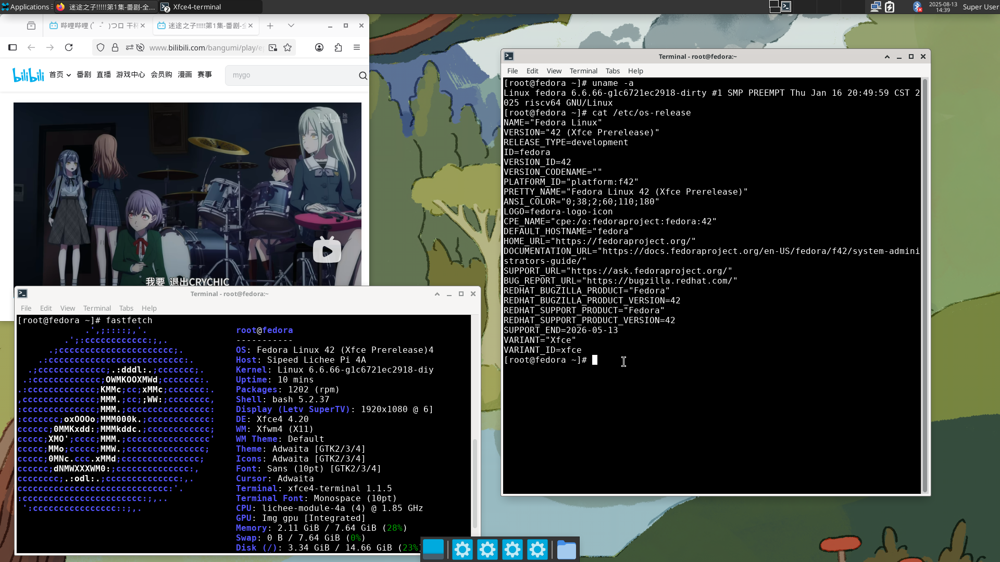

# Fedora 42 LicheePi 4A Test Report

## Test Environment

### Operating System Information
- OS Version: [Fedora 42 (Fedora-V Force)](https://www.fedoravforce.org/)
- Download Links:
  - Fedora Minimal 42: <https://mirror.iscas.ac.cn/fedora-riscv/releases/42/Spins/riscv64/images/Xuantie-TH1520/Sipeed-Lichee-Pi-4A/Fedora-Minimal-42-20250730014843.riscv64.Xuantie-TH1520.Sipeed-Lichee-Pi-4A.raw.gz>
  - Fedora Xfce 42: <https://mirror.iscas.ac.cn/fedora-riscv/releases/42/Spins/riscv64/images/Xuantie-TH1520/Sipeed-Lichee-Pi-4A/Fedora-Xfce-42-20250730015659.riscv64.Xuantie-TH1520.Sipeed-Lichee-Pi-4A.raw.gz>
  - U-Boot: <https://mirror.iscas.ac.cn/fedora-riscv/dl/Sipeed/LicheePi4A/fw/u-boot-with-spl.bin>
- Installation Reference: <https://images.fedoravforce.org/LicheePi%204A>

### Hardware Information
- Lichee Pi 4A (16GB RAM + 128GB eMMC)
- USB to UART debugger
- Three DuPont wires
- microSD card

## Installation Steps

### Download and Extract Image & U-Boot
Download the images from the [download page](https://images.fedoravforce.org/LicheePi%204A).
**Extract files:**
```bash
gzip -dc Fedora-Minimal-42-20250730014843.riscv64.Xuantie-TH1520.Sipeed-Lichee-Pi-4A.raw.gz > Fedora-Minimal-42-20250730014843.riscv64.Xuantie-TH1520.Sipeed-Lichee-Pi-4A.raw
❯gzip -dc Fedora-Xfce-42-20250730015659.riscv64.Xuantie-TH1520.Sipeed-Lichee-Pi-4A.raw.gz > Fedora-Xfce-42-20250730015659.riscv64.Xuantie-TH1520.Sipeed-Lichee-Pi-4A.raw 
```

Download U-Boot from the <https://mirror.iscas.ac.cn/fedora-riscv/dl/Sipeed/LicheePi4A/fw/u-boot-with-spl.bin>.

### Flashing u-boot using fastboot
Connect LPi4A via USB, hold the BOOT button and press reset (next to Type-C port) to enter USB burning mode.

```bash
sudo ./fastboot flash ram u-boot-with-spl.bin
sudo ./fastboot reboot
# Wait a few seconds for the board to reboot.
sudo ./fastboot flash uboot u-boot-with-spl.bin
```

log:
```bash
Projects/riscv/Burn
❯ sudo ./fastboot flash ram u-boot-with-spl.bin
Sending 'ram' (1069 KB)                            OKAY [  0.286s]
Writing 'ram'                                      OKAY [  0.002s]
Finished. Total time: 0.294s

Projects/riscv/Burn
❯ sudo ./fastboot reboot
Rebooting                                          OKAY [  0.001s]
Finished. Total time: 0.352s

Projects/riscv/Burn
❯ sudo ./fastboot flash uboot u-boot-with-spl.bin
Sending 'uboot' (1069 KB)                          OKAY [  0.049s]
Writing 'uboot'                                    OKAY [  0.022s]
Finished. Total time: 0.103s
```

### Writing System Image to microSD Card
You can use the `dd` command or other flash tools like [balenaEtcher](https://etcher.balena.io/).
```bash
sudo dd if=Fedora-Minimal-42-20250730014843.riscv64.Xuantie-TH1520.Sipeed-Lichee-Pi-4A.raw of=/dev/mmcblk0 bs=1M
```

## Logging into the System
Insert the microSD card into LPi4A and reboot.
Use a serial connection to log in; e.g. `minicom`.
```bash
minicom -D /dev/ttyACM0 -c on
```
Default username: `root`
Default password: `riscv` 

## Expected Results
System boots normally and allows login via onboard serial port.
If network is connected, SSH login should also work.

## Actual Results
System booted successfully and allowed login via serial.

```log
Welcome to the Fedora-V Force disk image
https://www.fedoravforce.org

Build date: Wed Jul 30 02:02:24 UTC 2025

Kernel 6.6.66-g1c6721ec2918-dirty on an riscv64 (ttyS0)

The root password is 'riscv'.
root password logins are disabled in SSH starting Fedora.

If DNS isn’t working, try editing ‘/etc/resolv.conf’ or using 'resolvctl'.

For updates and latest information read:
https://images.fedoravforce.org

Fedora RISC-V
-------------
fedora login: root
Password:

Last failed login: Fri Jun 27 00:06:46 UTC 2025 from 192.168.1.106 on ssh:notty
There were 4 failed login attempts since the last successful login.
Last login: Fri Jun 27 00:02:13 on tty1
[root@fedora ~]# uname -a
Linux fedora 6.6.66-g1c6721ec2918-dirty #1 SMP PREEMPT Thu Jan 16 20:49:59 CST 2025 riscv64 GNU/Linux
[root@fedora ~]# cat /etc/os-release
NAME="Fedora Linux"
VERSION="42 (Adams Prerelease)"
RELEASE_TYPE=development
ID=fedora
VERSION_ID=42
VERSION_CODENAME=""
PLATFORM_ID="platform:f42"
PRETTY_NAME="Fedora Linux 42 (Adams Prerelease)"
ANSI_COLOR="0;38;2;60;110;180"
LOGO=fedora-logo-icon
CPE_NAME="cpe:/o:fedoraproject:fedora:42"
DEFAULT_HOSTNAME="fedora"
HOME_URL="https://fedoraproject.org/"
DOCUMENTATION_URL="https://docs.fedoraproject.org/en-US/fedora/f42/system-administrators-guide/"
SUPPORT_URL="https://ask.fedoraproject.org/"
BUG_REPORT_URL="https://bugzilla.redhat.com/"
REDHAT_BUGZILLA_PRODUCT="Fedora"
REDHAT_BUGZILLA_PRODUCT_VERSION=42
REDHAT_SUPPORT_PRODUCT="Fedora"
REDHAT_SUPPORT_PRODUCT_VERSION=42
SUPPORT_END=2026-05-13
[root@fedora ~]# cat /proc/cpuinfo
processor       : 0
hart            : 0
isa             : rv64imafdc_zicntr_zicsr_zifencei_zihpm_xtheadvector
mmu             : sv39
uarch           : thead,c910
mvendorid       : 0x5b7
marchid         : 0x0
mimpid          : 0x0

processor       : 1
hart            : 1
isa             : rv64imafdc_zicntr_zicsr_zifencei_zihpm_xtheadvector
mmu             : sv39
uarch           : thead,c910
mvendorid       : 0x5b7
marchid         : 0x0
mimpid          : 0x0

processor       : 2
hart            : 2
isa             : rv64imafdc_zicntr_zicsr_zifencei_zihpm_xtheadvector
mmu             : sv39
uarch           : thead,c910
mvendorid       : 0x5b7
marchid         : 0x0
mimpid          : 0x0

processor       : 3
hart            : 3
isa             : rv64imafdc_zicntr_zicsr_zifencei_zihpm_xtheadvector
mmu             : sv39
uarch           : thead,c910
mvendorid       : 0x5b7
marchid         : 0x0
mimpid          : 0x0
```

## Desktop Environment
The Fedora-V Force Images release includes an **Xfce** desktop image. Simply write it to the microSD card to use it.
```bash
sudo dd if=Fedora-Xfce-42-20250730015659.riscv64.Xuantie-TH1520.Sipeed-Lichee-Pi-4A.raw of=/dev/mmcblk0 bs=1M
```
Screenshots of Xfce desktop:


## Test Criteria
Successful: The actual result matches the expected result.

Failed: The actual result does not match the expected result.

## Test Conclusion
Test successful.