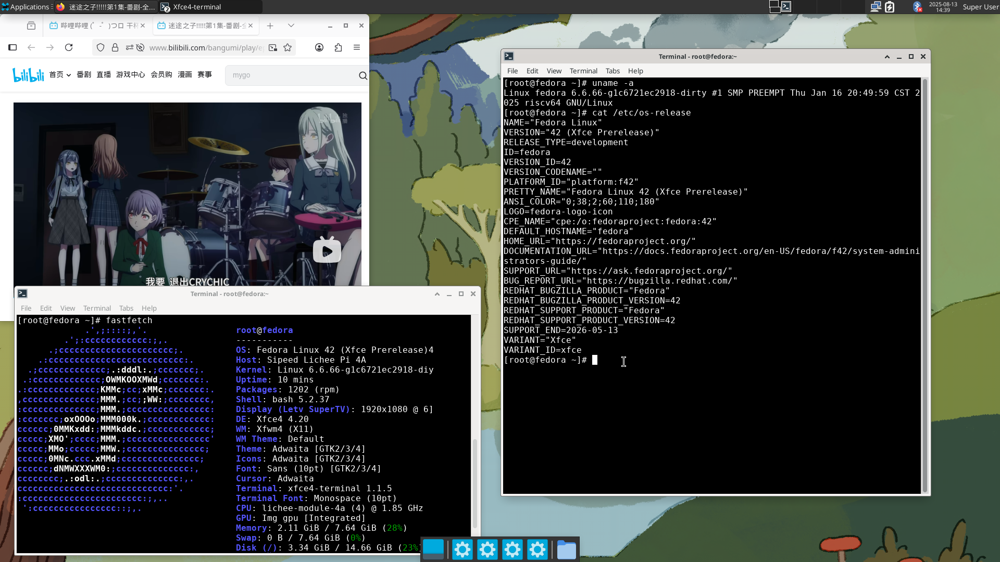

# Fedora 42 LicheePi 4A 测试报告

## 测试环境

### 系统信息
- 系统版本：[Fedora 42 (Fedora-V Force)](https://www.fedoravforce.org/)
- Download Links:
- 下载链接：
  - Fedora Minimal 42: <https://mirror.iscas.ac.cn/fedora-riscv/releases/42/Spins/riscv64/images/Xuantie-TH1520/Sipeed-Lichee-Pi-4A/Fedora-Minimal-42-20250730014843.riscv64.Xuantie-TH1520.Sipeed-Lichee-Pi-4A.raw.gz>
  - Fedora Xfce 42: <https://mirror.iscas.ac.cn/fedora-riscv/releases/42/Spins/riscv64/images/Xuantie-TH1520/Sipeed-Lichee-Pi-4A/Fedora-Xfce-42-20250730015659.riscv64.Xuantie-TH1520.Sipeed-Lichee-Pi-4A.raw.gz>
  - U-Boot: <https://mirror.iscas.ac.cn/fedora-riscv/dl/Sipeed/LicheePi4A/fw/u-boot-with-spl.bin>
- 参考安装文档：<https://images.fedoravforce.org/LicheePi%204A>

### 硬件信息
- Lichee Pi 4A (16G RAM + 128G eMMC)
- USB to UART 调试器一个
- 杜邦线三根
- microSD 卡一张

## 安装步骤

### 下载并解压镜像与 U-Boot
从[下载页面](https://images.fedoravforce.org/LicheePi%204A)下载镜像。
**解压相关文件**
```bash
gzip -dc Fedora-Minimal-42-20250730014843.riscv64.Xuantie-TH1520.Sipeed-Lichee-Pi-4A.raw.gz > Fedora-Minimal-42-20250730014843.riscv64.Xuantie-TH1520.Sipeed-Lichee-Pi-4A.raw
gzip -dc Fedora-Xfce-42-20250730015659.riscv64.Xuantie-TH1520.Sipeed-Lichee-Pi-4A.raw.gz > Fedora-Xfce-42-20250730015659.riscv64.Xuantie-TH1520.Sipeed-Lichee-Pi-4A.raw 
```

从 <https://mirror.iscas.ac.cn/fedora-riscv/dl/Sipeed/LicheePi4A/fw/u-boot-with-spl.bin> 下载 U-Boot。

### 使用 fastboot 工具刷写 U-Boot
用 USB 线连接 LPi4A，按住板上的 **BOOT** 按键不放，然后点按 **reset** 按键（Type-C 口旁边），即可进入 USB 烧录模式。

```bash
sudo fastboot flash ram u-boot-with-spl.bin
sudo fastboot reboot
# 稍等几秒，等待开发板重启。
sudo fastboot flash uboot u-boot-with-spl.bin
```
Log:
```bash
Projects/riscv/Burn
❯ sudo fastboot flash ram u-boot-with-spl.bin
Sending 'ram' (1069 KB)                            OKAY [  0.286s]
Writing 'ram'                                      OKAY [  0.002s]
Finished. Total time: 0.294s

Projects/riscv/Burn
❯ sudo fastboot reboot
Rebooting                                          OKAY [  0.001s]
Finished. Total time: 0.352s

Projects/riscv/Burn
❯ sudo fastboot flash uboot u-boot-with-spl.bin
Sending 'uboot' (1069 KB)                          OKAY [  0.049s]
Writing 'uboot'                                    OKAY [  0.022s]
Finished. Total time: 0.103s
```

### 向 microSD 卡烧录系统镜像
可使用 `dd` 命令或其他烧录工具如 [balenaEtcher](https://etcher.balena.io/)。
```bash
sudo dd if=Fedora-Minimal-42-20250730014843.riscv64.Xuantie-TH1520.Sipeed-Lichee-Pi-4A.raw of=/dev/mmcblkX bs=1M
```

### 登录系统
将 microSD 卡插入 LPi4A，重启。
通过串口登录系统，例如 `minicom` 工具。
```bash
minicom -D /dev/ttyACM0 -c on
```
默认用户名： `root`
默认密码: `riscv`

## 预期结果
系统正常启动，能够通过板载串口登录。
若接入网络，可通过 SSH 登录。

## 实际结果
系统正常启动，成功通过板载串口登录。

```log
Welcome to the Fedora-V Force disk image
https://www.fedoravforce.org

Build date: Wed Jul 30 02:02:24 UTC 2025

Kernel 6.6.66-g1c6721ec2918-dirty on an riscv64 (ttyS0)

The root password is 'riscv'.
root password logins are disabled in SSH starting Fedora.

If DNS isn’t working, try editing ‘/etc/resolv.conf’ or using 'resolvctl'.

For updates and latest information read:
https://images.fedoravforce.org

Fedora RISC-V
-------------
fedora login: root
Password:

Last failed login: Fri Jun 27 00:06:46 UTC 2025 from 192.168.1.106 on ssh:notty
There were 4 failed login attempts since the last successful login.
Last login: Fri Jun 27 00:02:13 on tty1
[root@fedora ~]# uname -a
Linux fedora 6.6.66-g1c6721ec2918-dirty #1 SMP PREEMPT Thu Jan 16 20:49:59 CST 2025 riscv64 GNU/Linux
[root@fedora ~]# cat /etc/os-release
NAME="Fedora Linux"
VERSION="42 (Adams Prerelease)"
RELEASE_TYPE=development
ID=fedora
VERSION_ID=42
VERSION_CODENAME=""
PLATFORM_ID="platform:f42"
PRETTY_NAME="Fedora Linux 42 (Adams Prerelease)"
ANSI_COLOR="0;38;2;60;110;180"
LOGO=fedora-logo-icon
CPE_NAME="cpe:/o:fedoraproject:fedora:42"
DEFAULT_HOSTNAME="fedora"
HOME_URL="https://fedoraproject.org/"
DOCUMENTATION_URL="https://docs.fedoraproject.org/en-US/fedora/f42/system-administrators-guide/"
SUPPORT_URL="https://ask.fedoraproject.org/"
BUG_REPORT_URL="https://bugzilla.redhat.com/"
REDHAT_BUGZILLA_PRODUCT="Fedora"
REDHAT_BUGZILLA_PRODUCT_VERSION=42
REDHAT_SUPPORT_PRODUCT="Fedora"
REDHAT_SUPPORT_PRODUCT_VERSION=42
SUPPORT_END=2026-05-13
[root@fedora ~]# cat /proc/cpuinfo
processor       : 0
hart            : 0
isa             : rv64imafdc_zicntr_zicsr_zifencei_zihpm_xtheadvector
mmu             : sv39
uarch           : thead,c910
mvendorid       : 0x5b7
marchid         : 0x0
mimpid          : 0x0

processor       : 1
hart            : 1
isa             : rv64imafdc_zicntr_zicsr_zifencei_zihpm_xtheadvector
mmu             : sv39
uarch           : thead,c910
mvendorid       : 0x5b7
marchid         : 0x0
mimpid          : 0x0

processor       : 2
hart            : 2
isa             : rv64imafdc_zicntr_zicsr_zifencei_zihpm_xtheadvector
mmu             : sv39
uarch           : thead,c910
mvendorid       : 0x5b7
marchid         : 0x0
mimpid          : 0x0

processor       : 3
hart            : 3
isa             : rv64imafdc_zicntr_zicsr_zifencei_zihpm_xtheadvector
mmu             : sv39
uarch           : thead,c910
mvendorid       : 0x5b7
marchid         : 0x0
mimpid          : 0x0
```

## 桌面环境
Fedora-V Force 提供了附带 **Xfce** 桌面环境的系统镜像，烧录进 microSD 卡即可使用。
```bash
sudo dd if=Fedora-Xfce-42-20250730015659.riscv64.Xuantie-TH1520.Sipeed-Lichee-Pi-4A.raw of=/dev/mmcblkX bs=1M
```
桌面环境截图：


## 测试判定标准
测试成功：实际结果与预期结果相符。

测试失败：实际结果与预期结果不符。

## 测试结论
测试成功。