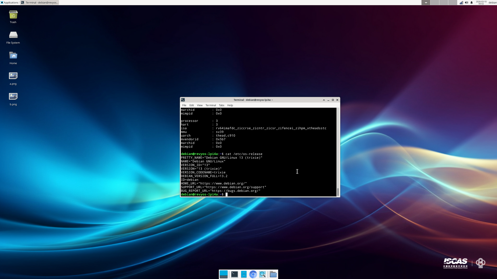

# RevyOS LPi4A Test Report

## Test Environment

### Operating System Information

- System version: RevyOS 20251226
- Distribution: Debian GNU/Linux trixie/sid (riscv64)
- Kernel version: 6.6.119-th1520
- Download link: [Nginx Directory](https://fast-mirror.isrc.ac.cn/revyos/extra/images/lpi4a/20251226/)
- Installation docs: https://revyos.github.io/docs/

### Hardware Information

- Lichee Pi 4A (16G RAM + 128G eMMC)
- USB-C power adapter / DC power supply
- HDMI display
- USB keyboard and mouse

## Installation Steps

### Download and Extract Image

Download the image and decompress with `zstd` (replace `XXX` with the actual filename from the 20251226 directory):

```shell
wget https://fast-mirror.isrc.ac.cn/revyos/extra/images/lpi4a/20251226/u-boot-with-spl-lpi4a-16g-main.bin
wget https://fast-mirror.isrc.ac.cn/revyos/extra/images/lpi4a/20251226/boot-lpi4a-20251226_XXX.ext4.zst
wget https://fast-mirror.isrc.ac.cn/revyos/extra/images/lpi4a/20251226/root-lpi4a-20251226_XXX.ext4.zst

zstd -d boot-lpi4a-20251226_XXX.ext4.zst
zstd -d root-lpi4a-20251226_XXX.ext4.zst
```

### Flash to Onboard eMMC via `fastboot`

#### Enter fastboot mode using the BOOT button

Hold the **BOOT** button, then connect the USB-C cable (to your PC) to enter USB flashing mode.

Use the following commands to flash (adjust filenames according to your actual files):

```shell
sudo fastboot devices
sudo fastboot flash ram u-boot-with-spl-lpi4a-16g-main.bin
sudo fastboot reboot
sudo fastboot flash uboot u-boot-with-spl-lpi4a-16g-main.bin
sudo fastboot flash boot boot-lpi4a-20251226_XXX.ext4
sudo fastboot flash root root-lpi4a-20251226_XXX.ext4
```

### Login

This test used **display + keyboard + mouse** for graphical login. Serial port was not used.

- Default username: `debian`
- Default password: `debian`

Login steps:

1. Power on and wait for the graphical login screen.
2. Enter username `debian` and password `debian` at the login screen.
3. Successfully reach the desktop environment.

## Expected Result

System boots normally and can log in to the desktop environment via the graphical interface.

## Actual Result

System boots normally and successfully logs in to the desktop environment via the graphical interface.

### Boot Information

Boot and desktop screenshot:


## Test Criteria

- Test passed: Actual result matches expected result.
- Test failed: Actual result does not match expected result.

## Test Conclusion

Test passed.
