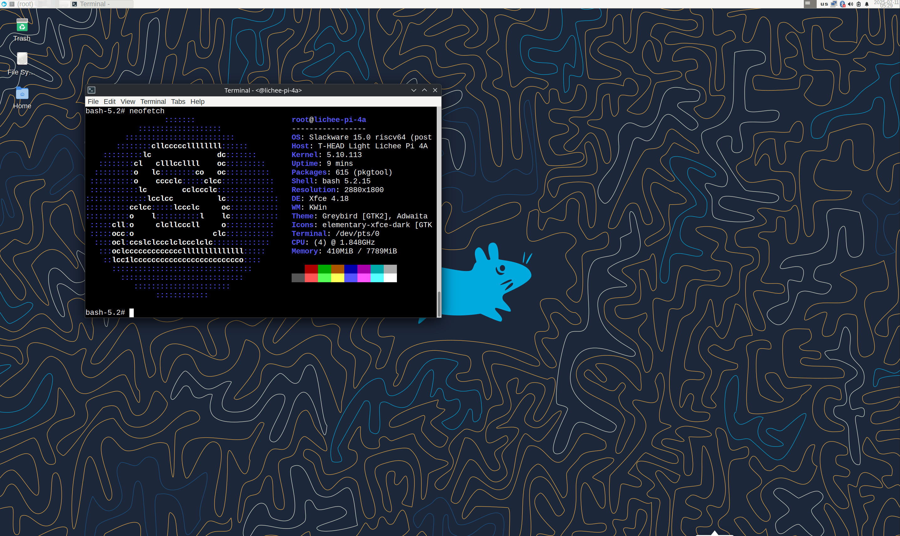

# Slackware LPi4A 测试报告

## 测试环境

### 系统信息

- 系统版本：Slackware 15
  - 下载链接：http://dl.slarm64.org/slackware/images/lichee_pi_4a/
  - 参考安装文档：http://dl.slarm64.org/slackware/images/lichee_pi_4a/README.TXT

### 硬件信息

- Lichee Pi 4A (8G RAM + 32G eMMC)
- 电源适配器
- USB to UART 调试器一个

## 安装步骤


### 刷写 bootloader

进入 fastboot。

- 按动 BOOT 同时上电。
- （详见官方教程）
  使用 fastboot 按命令烧录 u-boot。

```bash
sudo fastboot flash ram boot/u-boot-with-spl.bin
sudo fastboot reboot
sleep 10
sudo fastboot flash uboot boot/u-boot-with-spl.bin
```

### 刷写镜像

使用 `zstd` 解压镜像。
使用 `dd` 将镜像写入 microSD 卡。

```bash
zstd -d slarm64-current-riscv64-xfce-lichee_pi_4a-5.10.113-build-20230704.img.zst
dd if=slarm64-current-riscv64-xfce-lichee_pi_4a-5.10.113-build-20230704.img of=/path/to/device bs=1M
```

### 登录系统

通过串口登录系统。

初次启动会要求设置用户以及 root 密码。

将系统从 SD 卡转移到 EMMC，运行脚本：transfer-to-disk

### 桌面环境

镜像包含了 `xfce4` 相关的软件包，在终端中执行：
```bash
root@lichee-pi-4a:~# startxfce4
```

来启动 xfce 桌面环境。



## 预期结果

系统正常启动，能够通过板载串口登录。

## 实际结果

系统正常启动，成功通过板载串口登录。

### 启动信息

屏幕录像：

[](https://asciinema.org/a/iSlSrgyFL8MhRKQ5Hb4oSuvnU)

```log
[    2.934986] light_dwmac_eth ffe7060000.ethernet: User ID: 0x10, Synopsys ID: 0x37
[    2.942595] light_dwmac_eth ffe7060000.ethernet:     DWMAC1000
[    2.948226] light_dwmac_eth ffe7060000.ethernet: DMA HW capability register supported
[    2.956165] light_dwmac_eth ffe7060000.ethernet: RX Checksum Offload Engine supported
[    2.964067] light_dwmac_eth ffe7060000.ethernet: COE Type 2
[    2.969688] light_dwmac_eth ffe7060000.ethernet: TX Checksum insertion supported
[    2.977148] light_dwmac_eth ffe7060000.ethernet: Enhanced/Alternate descriptors
[    2.984516] light_dwmac_eth ffe7060000.ethernet: Enabled extended descriptors
[    2.991696] light_dwmac_eth ffe7060000.ethernet: Ring mode enabled
[    2.997924] light_dwmac_eth ffe7060000.ethernet: Enable RX Mitigation via HW Watchdog Timer
[    3.037959] succeed to create power domain debugfs direntry
[    3.045405] soc_vdd_3v3_en GPIO handle specifies active low - ignored
[    3.052698] soc_lcd0_vdd33_en GPIO handle specifies active low - ignored
[    3.060542] soc_lcd0_vdd18_en GPIO handle specifies active low - ignored
[    3.068371] soc_vdd5v_se_en GPIO handle specifies active low - ignored
[    3.075770] soc_wcn33_en GPIO handle specifies active low - ignored
[    3.083054] soc_vbus_en GPIO handle specifies active low - ignored
[    3.090237] soc_avdd28_rgb GPIO handle specifies active low - ignored
[    3.098117] soc_dovdd18_rgb GPIO handle specifies active low - ignored
[    3.105898] soc_dvdd12_rgb GPIO handle specifies active low - ignored
[    3.113595] soc_avdd25_ir GPIO handle specifies active low - ignored
[    3.121192] soc_dovdd18_ir GPIO handle specifies active low - ignored
[    3.128892] soc_dvdd12_ir GPIO handle specifies active low - ignored
[    3.136551] soc_cam2_avdd25_ir GPIO handle specifies active low - ignored
[    3.144587] soc_cam2_dovdd18_ir GPIO handle specifies active low - ignored
[    3.152745] soc_cam2_dvdd12_ir GPIO handle specifies active low - ignored
[    3.186470] cpufreq: cpufreq_online: CPU0: Running at unlisted initial frequency: 750000 KHz, changing to: 800000 KHz
[    3.197593] cpu cpu0: finish to register cpufreq driver
[    3.203613] thead,light-aon-test aon:light-aon-test: Successfully registered
[    3.258053] debugfs: File 'SDOUT' in directory 'dapm' already present!
[    3.264819] debugfs: File 'Playback' in directory 'dapm' already present!
[    3.271654] debugfs: File 'Capture' in directory 'dapm' already present!
[    3.278379] debugfs: File 'Playback' in directory 'dapm' already present!
[    3.285205] debugfs: File 'Capture' in directory 'dapm' already present!
[    3.295052] [light_wdt_probe,327] register power off callback
[    3.300888] succeed to register light pmic watchdog
[    3.307826] input: gpio-keys as /devices/platform/gpio-keys/input/input0
[    3.315217] aw87519_pa 5-0058: aw87519_parse_dt: no reset gpio provided failed
[    3.322500] aw87519_pa 5-0058: aw87519_i2c_probe: failed to parse device tree node
[    3.330186] aw87519_pa: probe of 5-0058 failed with error -1
[    3.336067] cfg80211: Loading compiled-in X.509 certificates for regulatory database
[    3.345201] cfg80211: Loaded X.509 cert 'sforshee: 00b28ddf47aef9cea7'
[    3.351907] platform regulatory.0: Direct firmware load for regulatory.db failed with error -2
[    3.354167] clk: Not disabling unused clocks
[    3.360559] cfg80211: failed to load regulatory.db
[    3.364873] ALSA device list:
[    3.372630]   #0: Light-Sound-Card
[    3.381352] EXT4-fs (mmcblk1p2): mounted filesystem without journal. Opts: (null)
[    3.388937] VFS: Mounted root (ext4 filesystem) readonly on device 179:2.
[    3.397956] devtmpfs: mounted
[    3.401097] Freeing unused kernel memory: 304K
[    3.422416] Run /sbin/init as init process
[    3.714325] NOHZ tick-stop error: Non-RCU local softirq work is pending, handler #280!!!
[    3.722456] NOHZ tick-stop error: Non-RCU local softirq work is pending, handler #280!!!
[    4.071252] random: udevd: uninitialized urandom read (16 bytes read)
[    4.078352] NOHZ tick-stop error: Non-RCU local softirq work is pending, handler #280!!!
[    4.086469] NOHZ tick-stop error: Non-RCU local softirq work is pending, handler #280!!!
[    4.095012] random: udevd: uninitialized urandom read (16 bytes read)
[    4.101685] random: udevd: uninitialized urandom read (16 bytes read)
[    4.194222] NOHZ tick-stop error: Non-RCU local softirq work is pending, handler #280!!!
[    4.202349] NOHZ tick-stop error: Non-RCU local softirq work is pending, handler #280!!!
[    4.207483] udevd[300]: starting eudev-3.2.12
[    4.210605] NOHZ tick-stop error: Non-RCU local softirq work is pending, handler #280!!!
[    4.223009] NOHZ tick-stop error: Non-RCU local softirq work is pending, handler #280!!!
[    4.223114] NOHZ tick-stop error: Non-RCU local softirq work is pending, handler #280!!!
[    4.239317] NOHZ tick-stop error: Non-RCU local softirq work is pending, handler #280!!!
[    4.609775] dwc3-thead soc:usb@ffec03f000: light dwc3 probe ok!
[    5.186746] Galcore version 6.4.6.9.354872
[    5.210213] [drm] Initialized vivante 1.0.0 20170808 for ffecc80000.gc620 on minor 1
[    5.387058] xhci-hcd xhci-hcd.3.auto: xHCI Host Controller
[    5.392609] xhci-hcd xhci-hcd.3.auto: new USB bus registered, assigned bus number 1
[    5.400848] xhci-hcd xhci-hcd.3.auto: hcc params 0x0220fe65 hci version 0x110 quirks 0x0000000000010810
[    5.410349] xhci-hcd xhci-hcd.3.auto: irq 74, io mem 0xffe7040000
[    5.417220] hub 1-0:1.0: USB hub found
[    5.421061] hub 1-0:1.0: 1 port detected
[    5.425335] xhci-hcd xhci-hcd.3.auto: xHCI Host Controller
[    5.430863] xhci-hcd xhci-hcd.3.auto: new USB bus registered, assigned bus number 2
[    5.438557] xhci-hcd xhci-hcd.3.auto: Host supports USB 3.0 SuperSpeed
[    5.445701] hub 2-0:1.0: USB hub found
[    5.449581] hub 2-0:1.0: 1 port detected
[    5.686224] usb 1-1: new high-speed USB device number 2 using xhci-hcd
[    5.893334] hub 1-1:1.0: USB hub found
[    5.897371] hub 1-1:1.0: 5 ports detected
[    5.988088] usb 2-1: new SuperSpeed Gen 1 USB device number 2 using xhci-hcd
[    6.165390] hub 2-1:1.0: USB hub found
[    6.169499] hub 2-1:1.0: 4 ports detected
[    6.660476] EXT4-fs (mmcblk1p2): Remounting file system with no journal so ignoring journalled data option
[    6.662234] usb 1-1.5: new high-speed USB device number 3 using xhci-hcd
[    6.677084] EXT4-fs (mmcblk1p2): re-mounted. Opts: data=writeback,errors=remount-ro
[    6.855657] EXT4-fs (mmcblk1p1): mounted filesystem with ordered data mode. Opts: (null)
[    6.898251] Adding 131068k swap on /swap.  Priority:5 extents:2 across:139260k SS
[    7.021372] random: crng init done
[    7.024893] random: 5 urandom warning(s) missed due to ratelimiting


=======================================================================

if you want to transfer the system to SDcard to internal memory (eMMC or NAND),
follow transfer-to-disk

=======================================================================

slarm64 GNU/Linux (ttyS0)
Kernel 5.10.113 (riscv64)

lichee-pi-4a login: root
Password:
Last login: Fri Jul 11 05:26:39 from 192.168.101.44
      _                   ___  ___
 ___ | | ___  ___  _____ |  _|| | |
|_ -|| || .'||  _||     || . ||_  |
|___||_||__,||_|  |_|_|_||___|  |_|
 _  _       _                     _    ___
| ||_| ___ | |_  ___  ___    ___ |_|  | | | ___
| || ||  _||   || -_|| -_|  | . || |  |_  || .'|
|_||_||___||_|_||___||___|  |  _||_|    |_||__,|
                            |_|

root@lichee-pi-4a:~# neofetch
                  :::::::                      root@lichee-pi-4a
            :::::::::::::::::::                -----------------
         :::::::::::::::::::::::::             OS: Slackware 15.0 riscv64 (post 15.0 -current) riscv64
       ::::::::cllcccccllllllll::::::          Host: T-HEAD Light Lichee Pi 4A configuration for 8GB DDR board
    :::::::::lc               dc:::::::        Kernel: 5.10.113
   ::::::::cl   clllccllll    oc:::::::::      Uptime: 38 secs
  :::::::::o   lc::::::::co   oc::::::::::     Packages: 615 (pkgtool)
 ::::::::::o    cccclc:::::clcc::::::::::::    Shell: bash 5.2.15
 :::::::::::lc        cclccclc:::::::::::::    Terminal: /dev/ttyS0
::::::::::::::lcclcc          lc::::::::::::   CPU: (4) @ 1.848GHz
::::::::::cclcc:::::lccclc     oc:::::::::::   Memory: 185MiB / 7789MiB
::::::::::o    l::::::::::l    lc:::::::::::
 :::::cll:o     clcllcccll     o:::::::::::
 :::::occ:o                  clc:::::::::::
  ::::ocl:ccslclccclclccclclc:::::::::::::
   :::oclcccccccccccccllllllllllllll:::::
    ::lcc1lcccccccccccccccccccccccco::::
      ::::::::::::::::::::::::::::::::
        ::::::::::::::::::::::::::::
           ::::::::::::::::::::::
                ::::::::::::

root@lichee-pi-4a:~#

```

## 测试判定标准

测试成功：实际结果与预期结果相符。

测试失败：实际结果与预期结果不符。

## 测试结论

测试成功。
