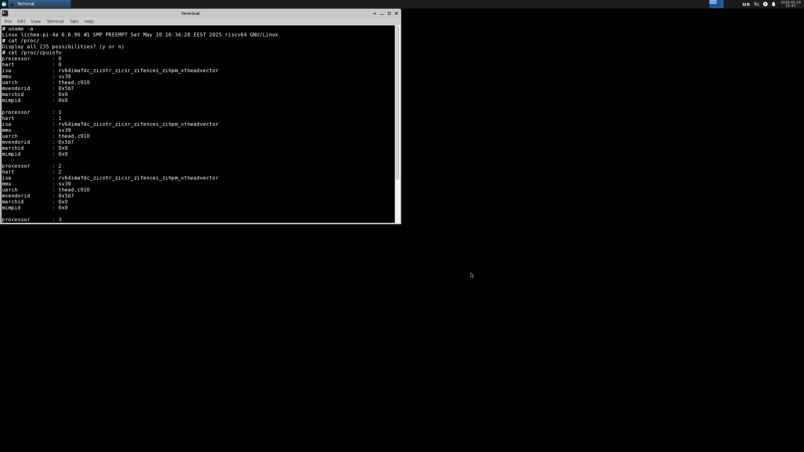

# irradium LicheePi 4A Test Report

## Test Environment

### Operating System Information
- OS Version: irradium 3.8
- Download Links:
  - irradium-core: <https://dl.irradium.org/irradium/images/lichee_pi_4a/irradium-3.8-riscv64-core-lichee_pi_4a-6.6.90-build-20250510.img.zst>
  - irradium-xfce: <https://dl.irradium.org/irradium/images/lichee_pi_4a/irradium-3.8-riscv64-xfce-lichee_pi_4a-6.6.90-build-20250510.img.zst>
  - U=Boot: <https://dl.irradium.org/irradium/images/lichee_pi_4a/boot-20250510.tar.xz>
- Installation Reference: <https://dl.irradium.org/irradium/images/lichee_pi_4a/README.TXT>

### Hardware Information
- Lichee Pi 4A (16GB RAM + 128GB eMMC)
- Power adapter
- USB to UART debugger
- Three DuPont wires
- microSD card

## Installation Steps

### Download and Extract Image & U-Boot
Download the desired image and U-Boot from the [official download server](https://dl.irradium.org/irradium/images/lichee_pi_4a/).
**Extract files:**
```bash
zstd -d irradium-3.8-riscv64-core-lichee_pi_4a-6.6.90-build-20250510.img.zst 
zstd -d irradium-3.8-riscv64-xfce-lichee_pi_4a-6.6.90-build-20250510.img.zst 
tar -xvf boot-20250510.tar.xz
```
**Result:**
```bash
❯ tree .
.
├── boot
│   ├── fw_dynamic.bin
│   └── u-boot-with-spl.bin
├── boot-20250510.tar.xz
├── irradium-3.8-riscv64-core-lichee_pi_4a-6.6.90-build-20250510.img
├── irradium-3.8-riscv64-core-lichee_pi_4a-6.6.90-build-20250510.img.zst
├── irradium-3.8-riscv64-xfce-lichee_pi_4a-6.6.90-build-20250510.img
└── irradium-3.8-riscv64-xfce-lichee_pi_4a-6.6.90-build-20250510.img.zst

2 directories, 7 files
```

### Flashing U-Boot using fastboot
Connect LPi4A via USB, hold the BOOT button and press reset (next to Type-C port) to enter USB burning mode.

```bash
sudo fastboot flash ram ./images/boot/u-boot-with-spl.bin
sudo fastboot reboot
# Wait a few seconds for the board to reboot.
sudo fastboot flash uboot ./images/boot/u-boot-with-spl.bin
```
Log:
```log
❯ sudo fastboot flash ram ./images/boot/u-boot-with-spl.bin
Sending 'ram' (1009 KB)                            OKAY [  0.267s]
Writing 'ram'                                      OKAY [  0.002s]
Finished. Total time: 0.278s

❯ sudo fastboot reboot
Rebooting                                          OKAY [  0.001s]
Finished. Total time: 0.553s

❯ sudo fastboot flash uboot ./images/boot/u-boot-with-spl.bin
Sending 'uboot' (1009 KB)                          OKAY [  0.050s]
Writing 'uboot'                                    OKAY [  0.021s]
Finished. Total time: 0.104s
```

### Writing System Image to microSD Card
You can used the `dd` command:
```bash
sudo dd if=images/irradium-3.8-riscv64-core-lichee_pi_4a-6.6.90-build-20250510.img of=/dev/mmcblkX bs=1M
```
Log:
```log
输入了 5819+0 块记录
输出了 5819+0 块记录
6101663744 字节 (6.1 GB, 5.7 GiB) 已复制，204.449 s，29.8 MB/s
```

## Logging into the System
Insert the microSD card into LPi4A and reboot.
Use a serial connection to log in; e.g. `minicom`.
```bash
minicom -D /dev/ttyACM0 -c on
```
Default username: `root`
Password needs to be set after boot.

Boot logs are in **bootLog.txt** in the same folder.

## Expected Results
System boots normally and allows login via onboard serial port.
If network is connected, SSH login should also work.

## Actual Results
System booted successfully and allowed login via serial.

### Boot Log
```log
lichee-pi-4a login: root
Password: 
Last login: Thu Jan  1 00:00:26 UTC 1970 on ttyS0
 _                   _  _             
|_| ___  ___  ___  _| ||_| _ _  _____ 
| ||  _||  _|| .'|| . || || | ||     |
|_||_|  |_|  |__,||___||_||___||_|_|_|
 _  _       _                     _    ___      
| ||_| ___ | |_  ___  ___    ___ |_|  | | | ___ 
| || ||  _||   || -_|| -_|  | . || |  |_  || .'|
|_||_||___||_|_||___||___|  |  _||_|    |_||__,|
                            |_|                 

# uname -a
Linux lichee-pi-4a 6.6.90 #1 SMP PREEMPT Sat May 10 16:34:28 EEST 2025 riscv64 GNU/Linux
# cat /proc/cpuinfo 
processor       : 0
hart            : 0
isa             : rv64imafdc_zicntr_zicsr_zifencei_zihpm_xtheadvector
mmu             : sv39
uarch           : thead,c910
mvendorid       : 0x5b7
marchid         : 0x0
mimpid          : 0x0

processor       : 1
hart            : 1
isa             : rv64imafdc_zicntr_zicsr_zifencei_zihpm_xtheadvector
mmu             : sv39
uarch           : thead,c910
mvendorid       : 0x5b7
marchid         : 0x0
mimpid          : 0x0

processor       : 2
hart            : 2
isa             : rv64imafdc_zicntr_zicsr_zifencei_zihpm_xtheadvector
mmu             : sv39
uarch           : thead,c910
mvendorid       : 0x5b7
marchid         : 0x0
mimpid          : 0x0

processor       : 3
hart            : 3
isa             : rv64imafdc_zicntr_zicsr_zifencei_zihpm_xtheadvector
mmu             : sv39
uarch           : thead,c910
mvendorid       : 0x5b7
marchid         : 0x0
mimpid          : 0x0

# cat /proc/version 
Linux version 6.6.90 (root@firefly-rk3399) (riscv64-unknown-linux-gnu-gcc (g2ee5e430018) 12.2.0, G5
# cat /etc/os-release
NAME=irradium
VERSION="3.8"
ID=irradium
PRETTY_NAME="irradium"
HOME_URL="https://irradium.org/"
BUG_REPORT_URL="https://irradium.org/bugs/"
# 
```

## Desktop Environment
The official release includes an **Xfce** desktop image. Simply write it to the microSD card to use it.
```bash
sudo dd if=images/irradium-3.8-riscv64-xfce-lichee_pi_4a-6.6.90-build-20250510.img of=/dev/mmcblkX bs=1M
```
Screenshots of XFCE desktop:



## Test Criteria
Successful: The actual result matches the expected result.

Failed: The actual result does not match the expected result.

## Test Conclusion
Test successful.
