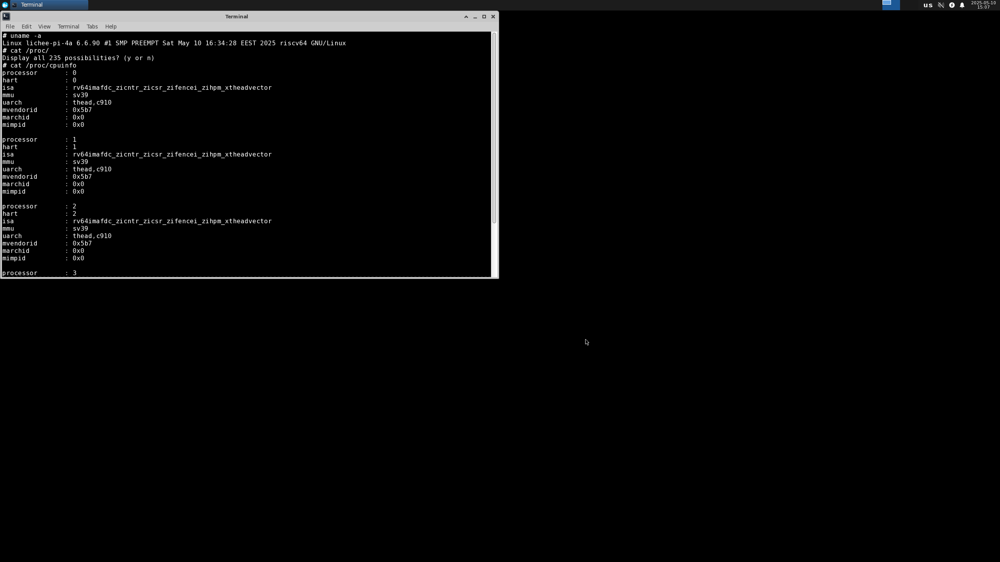
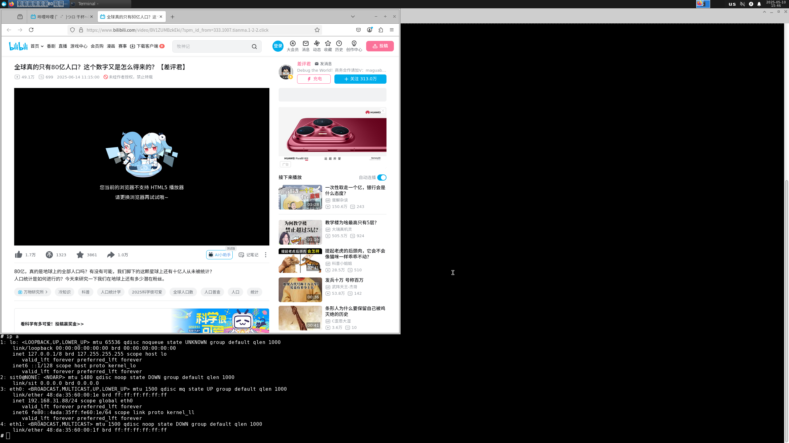

# irradium LicheePi 4A 测试报告

## 测试环境

### 系统信息
- 系统版本：[irradium 3.8](https://slarm64.org/)
- 下载链接：
  - irradium-core: <https://dl.irradium.org/irradium/images/lichee_pi_4a/irradium-3.8-riscv64-core-lichee_pi_4a-6.6.90-build-20250510.img.zst>
  - irradium-xfce: <https://dl.irradium.org/irradium/images/lichee_pi_4a/irradium-3.8-riscv64-xfce-lichee_pi_4a-6.6.90-build-20250510.img.zst>
  - boot: <https://dl.irradium.org/irradium/images/lichee_pi_4a/boot-20250510.tar.xz>
- 参考安装文档：<https://dl.irradium.org/irradium/images/lichee_pi_4a/README.TXT>

### 硬件信息
- Lichee Pi 4A (16G RAM + 128G eMMC)
- 电源适配器
- USB to UART 调试器一个
- 杜邦线三根
- MicroSD 卡一张

## 安装步骤

### 下载并解压镜像与 u-boot
从[官方下载服务器](https://dl.irradium.org/irradium/images/lichee_pi_4a/)下载你所需镜像与 u-boot。
**解压相关文件**
```bash
zstd -d irradium-3.8-riscv64-core-lichee_pi_4a-6.6.90-build-20250510.img.zst 
zstd -d irradium-3.8-riscv64-xfce-lichee_pi_4a-6.6.90-build-20250510.img.zst 
tar -xvf boot-20250510.tar.xz
```
**结果如下：**
```bash
❯ tree .
.
├── boot
│   ├── fw_dynamic.bin
│   └── u-boot-with-spl.bin
├── boot-20250510.tar.xz
├── irradium-3.8-riscv64-core-lichee_pi_4a-6.6.90-build-20250510.img
├── irradium-3.8-riscv64-core-lichee_pi_4a-6.6.90-build-20250510.img.zst
├── irradium-3.8-riscv64-xfce-lichee_pi_4a-6.6.90-build-20250510.img
└── irradium-3.8-riscv64-xfce-lichee_pi_4a-6.6.90-build-20250510.img.zst

2 directories, 7 files
```

### 使用 fastboot 工具刷写 u-boot
用 USB 线连接 LPi4A，按住板上的 **BOOT** 按键不放，然后点按 **reset** 按键（Type-C 口旁边），即可进入 USB 烧录模式。

```bash
sudo ./fastboot flash ram ./images/boot/u-boot-with-spl.bin
sudo ./fastboot reboot
# 稍等几秒，等待开发板重启。
sudo ./fastboot flash uboot ./images/boot/u-boot-with-spl.bin
```
Log:
```log
❯ sudo ./fastboot flash ram ./images/boot/u-boot-with-spl.bin
Sending 'ram' (1009 KB)                            OKAY [  0.267s]
Writing 'ram'                                      OKAY [  0.002s]
Finished. Total time: 0.278s

❯ sudo ./fastboot reboot
Rebooting                                          OKAY [  0.001s]
Finished. Total time: 0.553s

❯ sudo ./fastboot flash uboot ./images/boot/u-boot-with-spl.bin
Sending 'uboot' (1009 KB)                          OKAY [  0.050s]
Writing 'uboot'                                    OKAY [  0.021s]
Finished. Total time: 0.104s
```

### 向 MicroSD 卡烧录系统镜像
笔者使用了 `dd` 命令
```bash
sudo dd if=images/irradium-3.8-riscv64-core-lichee_pi_4a-6.6.90-build-20250510.img of=/dev/mmcblk0 bs=1M
```
Log:
```log
输入了 5819+0 块记录
输出了 5819+0 块记录
6101663744 字节 (6.1 GB, 5.7 GiB) 已复制，204.449 s，29.8 MB/s
```

### 登录系统
将 MicroSD 卡插入 LPi4A，重启。
通过串口登录系统，笔者使用了 `minicom` 工具。
```bash
minicom -D /dev/ttyACM0 -c on
```
默认用户名： `root`
启动后需要设置密码

Log 见 同文件夹下 **bootLog.txt**

## 预期结果
系统正常启动，能够通过板载串口登录。
若接入网络，可通过 SSH 登录。

## 实际结果
系统正常启动，成功通过板载串口登录。

### 启动信息
```log
lichee-pi-4a login: root
Password: 
Last login: Thu Jan  1 00:00:26 UTC 1970 on ttyS0
 _                   _  _             
|_| ___  ___  ___  _| ||_| _ _  _____ 
| ||  _||  _|| .'|| . || || | ||     |
|_||_|  |_|  |__,||___||_||___||_|_|_|
 _  _       _                     _    ___      
| ||_| ___ | |_  ___  ___    ___ |_|  | | | ___ 
| || ||  _||   || -_|| -_|  | . || |  |_  || .'|
|_||_||___||_|_||___||___|  |  _||_|    |_||__,|
                            |_|                 

# uname -a
Linux lichee-pi-4a 6.6.90 #1 SMP PREEMPT Sat May 10 16:34:28 EEST 2025 riscv64 GNU/Linux
# cat /proc/cpuinfo 
processor       : 0
hart            : 0
isa             : rv64imafdc_zicntr_zicsr_zifencei_zihpm_xtheadvector
mmu             : sv39
uarch           : thead,c910
mvendorid       : 0x5b7
marchid         : 0x0
mimpid          : 0x0

processor       : 1
hart            : 1
isa             : rv64imafdc_zicntr_zicsr_zifencei_zihpm_xtheadvector
mmu             : sv39
uarch           : thead,c910
mvendorid       : 0x5b7
marchid         : 0x0
mimpid          : 0x0

processor       : 2
hart            : 2
isa             : rv64imafdc_zicntr_zicsr_zifencei_zihpm_xtheadvector
mmu             : sv39
uarch           : thead,c910
mvendorid       : 0x5b7
marchid         : 0x0
mimpid          : 0x0

processor       : 3
hart            : 3
isa             : rv64imafdc_zicntr_zicsr_zifencei_zihpm_xtheadvector
mmu             : sv39
uarch           : thead,c910
mvendorid       : 0x5b7
marchid         : 0x0
mimpid          : 0x0

# cat /proc/version 
Linux version 6.6.90 (root@firefly-rk3399) (riscv64-unknown-linux-gnu-gcc (g2ee5e430018) 12.2.0, G5
# cat /etc/os-release
NAME=irradium
VERSION="3.8"
ID=irradium
PRETTY_NAME="irradium"
HOME_URL="https://irradium.org/"
BUG_REPORT_URL="https://irradium.org/bugs/"
# 
```
## 桌面环境
官方提供了附带 **XFCE** 桌面环境的系统镜像，烧录进 MicroSD 卡即可使用。
```bash
sudo dd if=images/irradium-3.8-riscv64-xfce-lichee_pi_4a-6.6.90-build-20250510.img of=/dev/mmcblk0 bs=1
```
桌面环境截图：



## 测试判定标准
测试成功：实际结果与预期结果相符。

测试失败：实际结果与预期结果不符。

## 测试结论
测试成功。