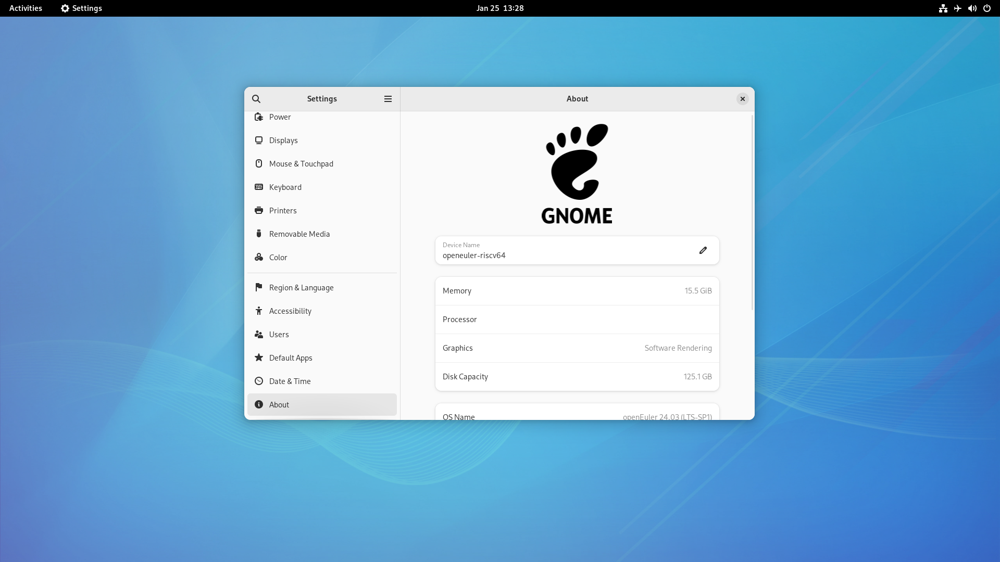

# openEuler RISC-V 24.03 LTS-SP1 LPi4A Test Report

The mainline version does not provide a pre-installed image with a desktop environment, so manual installation is required;

Display output works, but lacks GPU acceleration, so the desktop rendered by software will be a little bit laggy.

Browser performance is poor due to the lack of GPU acceleration, and the lack of hardware decoding results in poor online and local video playback.

## Test Environment

### System Information

- System Version: openEuler 24.03 RISC-V LTS-SP1
- Download Link: https://www.openeuler.org/zh/download/#openEuler%2024.03%20LTS%20SP1
- Reference Installation Document: https://docs.openeuler.org/zh/docs/24.03_LTS/docs/Installation/RISC-V-LicheePi4A.html

### Hardware Information

- Lichee Pi 4A (16G RAM + 128G eMMC)
- USB-C Power Adapter / DC Power Supply
- A USB-UART Debugger

## Installation Steps

### Download and decompress image

Download the image from official website: https://www.openeuler.org/en/download/#openEuler%2024.03%20LTS%20SP1

Choose `RISC-V -> Embedded -> lpi4a`.

```shell
zstd -d openEuler-24.03-LTS-SP1-riscv64-lpi4a-base-boot.ext4.zst
zstd -d openEuler-24.03-LTS-SP1-riscv64-lpi4a-base-root.ext4.zst
```

### Flash to onboard eMMC via `fastboot`

By default the USB VID/PID of LPi4A are't in the udev rules, you might need to use `sudo` while using `fastboot`.

Hold the **BOOT** button, then connect the USB-C cable (to your PC on the other side) to enter USB burning mode.

In Windows using device manager, you'll see a device named `USB download gadget`.

In Linux using `lsusb` you'll see a device like: `ID 2345:7654 T-HEAD USB download gadget`.

Use the following commands to flash the image.


```shell
sudo fastboot devices
sudo fastboot flash ram u-boot-with-spl-lpi4a-16g.bin
sudo fastboot reboot
# Wait a few seconds until the board reboots and reconnects to your PC

sudo fastboot flash uboot u-boot-with-spl-lpi4a-16g.bin
sudo fastboot flash boot openEuler-24.03-LTS-SP1-riscv64-lpi4a-base-boot.ext4
sudo fastboot flash root openEuler-24.03-LTS-SP1-riscv64-lpi4a-base-root.ext4

```

### Logging into the System

Logging into the system via serial console.

Default username: `openeuler` or `root`
Default password: `openEuler12#$`

#### Install UI

Until testing, the manual UI installation is required. GNOME was used as an example in this test, the other desktop environment installation can be found in [openEuler Official Documentation](https://docs.openeuler.org/zh/docs/24.03_LTS_SP1/docs/desktop/).

```bash
sudo dnf update
sudo dnf install dejavu-fonts liberation-fonts gnu-*-fonts google-*-fonts  -y
sudo dnf install xorg-* -y
sudo dnf install adwaita-icon-theme atk atkmm at-spi2-atk at-spi2-core baobab \
 abattis-cantarell-fonts cheese clutter clutter-gst3 clutter-gtk cogl dconf \
 dconf-editor devhelp eog epiphany evince evolution-data-server file-roller folks \
 gcab gcr gdk-pixbuf2 gdm gedit geocode-glib gfbgraph gjs glib2 glibmm24 \
 glib-networking gmime30 gnome-autoar gnome-backgrounds gnome-bluetooth \
 gnome-boxes gnome-builder gnome-calculator gnome-calendar gnome-characters \
 gnome-clocks gnome-color-manager gnome-contacts gnome-control-center \
 gnome-desktop3 gnome-disk-utility gnome-font-viewer gnome-getting-started-docs \
 gnome-initial-setup gnome-keyring gnome-logs gnome-menus gnome-music \
 gnome-online-accounts gnome-online-miners gnome-photos gnome-remote-desktop \
 gnome-screenshot gnome-session gnome-settings-daemon gnome-shell \
 gnome-shell-extensions gnome-software gnome-system-monitor gnome-terminal \
 gnome-tour gnome-user-docs gnome-user-share gnome-video-effects \
 gnome-weather gobject-introspection gom grilo grilo-plugins \
 gsettings-desktop-schemas gsound gspell gssdp gtk3 gtk4 gtk-doc gtkmm30 \
 gtksourceview4 gtk-vnc2 gupnp gupnp-av gupnp-dlna gvfs json-glib libchamplain \
 libdazzle libgdata libgee libgnomekbd libgsf libgtop2 libgweather libgxps libhandy \
 libmediaart libnma libnotify libpeas librsvg2 libsecret libsigc++20 libsoup \
 mm-common mutter nautilus orca pango pangomm libphodav python3-pyatspi \
 python3-gobject rest rygel simple-scan sushi sysprof tepl totem totem-pl-parser \
 tracker3 tracker3-miners vala vte291 yelp yelp-tools \
 yelp-xsl zenity -y
```

Enable display manager, and set login to UI as default:

```bash
sudo systemctl enable gdm
sudo systemctl set-default graphical.target

```

## Expected Results

The system boots up successfully and allows login via the serial console.

If connected to a network, SSH login should be possible.

## Actual Results

The system boots up without issues, and both serial console and SSH login are successful.

### Boot Log


```log
openeuler-riscv64 login: openeuler
Password:

Authorized users only. All activities may be monitored and reported.


Welcome to 6.6.0-72.0.0.76.oe2403sp1.riscv64

System information as of time:  Thu Jan  1 08:01:24 AM CST 1970

System load:    1.13
Memory used:    2.5%
Swap used:      0.0%
Usage On:       8%
Users online:   1
To run a command as administrator(user "root"),use "sudo <command>".
[openeuler@openeuler-riscv64 ~]$ uname -a
Linux openeuler-riscv64 6.6.0-72.0.0.76.oe2403sp1.riscv64 #1 SMP PREEMPT Sun Dec 29 15:11:05 UTC 2024 riscv64 riscv64 riscv64 GNU/Linux
[openeuler@openeuler-riscv64 ~]$ cat /etc/os-release
NAME="openEuler"
VERSION="24.03 (LTS-SP1)"
ID="openEuler"
VERSION_ID="24.03"
PRETTY_NAME="openEuler 24.03 (LTS-SP1)"
ANSI_COLOR="0;31"

[openeuler@openeuler-riscv64 ~]$ cat /proc/cpuinfo
processor       : 0
hart            : 0
isa             : rv64imafdc_zicntr_zicsr_zifencei_zihpm
mmu             : sv39
uarch           : thead,c910
mvendorid       : 0x5b7
marchid         : 0x0
mimpid          : 0x0

processor       : 1
hart            : 1
isa             : rv64imafdc_zicntr_zicsr_zifencei_zihpm
mmu             : sv39
uarch           : thead,c910
mvendorid       : 0x5b7
marchid         : 0x0
mimpid          : 0x0

processor       : 2
hart            : 2
isa             : rv64imafdc_zicntr_zicsr_zifencei_zihpm
mmu             : sv39
uarch           : thead,c910
mvendorid       : 0x5b7
marchid         : 0x0
mimpid          : 0x0

processor       : 3
hart            : 3
isa             : rv64imafdc_zicntr_zicsr_zifencei_zihpm
mmu             : sv39
uarch           : thead,c910
mvendorid       : 0x5b7
marchid         : 0x0
mimpid          : 0x0
```

Desktop Environment


## Test Criteria

Successful: The actual result matches the expected result.

Failed: The actual result does not match the expected result.

## Test Conclusion

Test successful.
