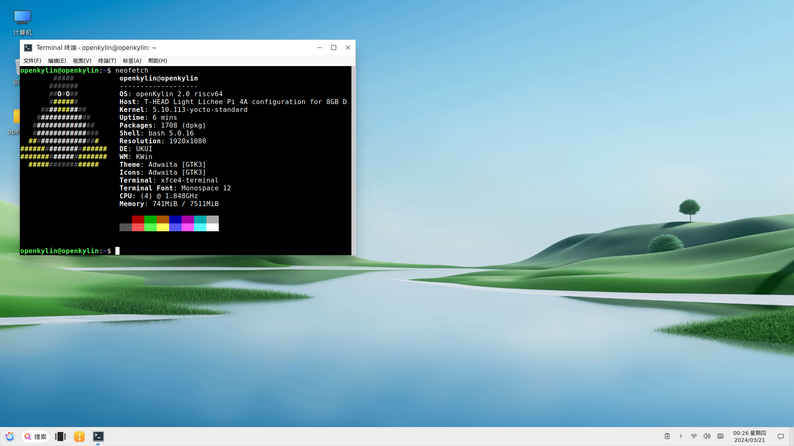

# openKylin 2.0 Alpha LPi4A Test Report

## Test Environment

### System Information

- System Version: openKylin 2.0 Alpha
- Download Link: [https://www.openkylin.top/downloads/index-cn.html](https://www.openkylin.top/downloads/index-cn.html)
- Reference Installation Document: [https://docs.openkylin.top/zh/%E7%A4%BE%E5%8C%BA%E5%BC%80%E5%8F%91%E6%8C%87%E5%8D%97/riscv%E4%B8%8A%E5%AE%89%E8%A3%85openKylin](https://docs.openkylin.top/zh/%E7%A4%BE%E5%8C%BA%E5%BC%80%E5%8F%91%E6%8C%87%E5%8D%97/riscv%E4%B8%8A%E5%AE%89%E8%A3%85openKylin)

### Hardware Information

- Lichee Pi 4A (8GB RAM + 64GB eMMC)
- Power Adapter
- One USB to UART Debugger

## Installation Steps

### Flashing the Bootloader

Extract the installation suite.
Navigate to the fastboot tool directory.
Flash the u-boot and boot.

```bash
tar -xvf openKylin-2.0-alpha-licheepi4a.tar.xz
cd openkylin-2.0-alpha-licheepi4a/fastboot/linux
sudo ./fastboot flash ram ../../images/$(ram_size)/u-boot-nonsec-2020.10-r0-noswap.bin
sudo ./fastboot reboot
sudo ./fastboot flash uboot ../../images/$(ram_size)/u-boot-nonsec-2020.10-r0-noswap.bin
sudo ./fastboot flash boot ../../images/$(ram_size)/boot.ext4
```

### Flashing the Image

Flash the root partition into the eMMC.

```bash
sudo ./fastboot flash root ../../images/openkylin-2.0-alpha-licheepi4a-riscv64.ext4
```

### Logging into the System

Logging into the system via serial console.

Default username: `openkylin`
Default password: `openkylin`

## Expected Results

The system should boot successfully, allowing login via the onboard serial console.

## Actual Results

The system booted up correctly, and login via the onboard serial console was successful.

### Boot Log

Screen recording (from flashing the image to system login):

[](https://asciinema.org/a/ewHfNb9rFIHqHfqznJgiDHapM)

```log
openKylin 2.0 openkylin ttyS0

openkylin login: openkylin
输入密码
Welcome to openKylin 2.0 (GNU/Linux 5.10.113-yocto-standard riscv64)

 * Support:        https://openkylin.top

The programs included with the openKylin system are free software;
the exact distribution terms for each program are described in the
individual files in /usr/share/doc/*/copyright.

openKylin comes with ABSOLUTELY NO WARRANTY, to the extent permitted by
applicable law.

openkylin@openkylin:~$ uname -a
Linux openkylin 5.10.113-yocto-standard #1 SMP PREEMPT Tue Dec 26 12:49:40 UTC 2023 riscv64 riscv64 riscv64 GNU/Linux
openkylin@openkylin:~$ cat /etc/os-release 
NAME="openKylin"
FULL_NAME="openKylin"
VERSION="2.0 (nile)"
VERSION_US="2.0 (nile)"
ID=openkylin
PRETTY_NAME="openKylin 2.0"
VERSION_ID="2.0"
HOME_URL="https://www.openkylin.top/"
VERSION_CODENAME=nile
PRODUCT_FEATURES=3
openkylin@openkylin:~$ 

```



### Common Issue

In case of desktop freeze, try switching from wayland.

## Test Criteria

Successful: The actual result matches the expected result.

Failed: The actual result does not match the expected result.

## Test Conclusion

Test Successful.
