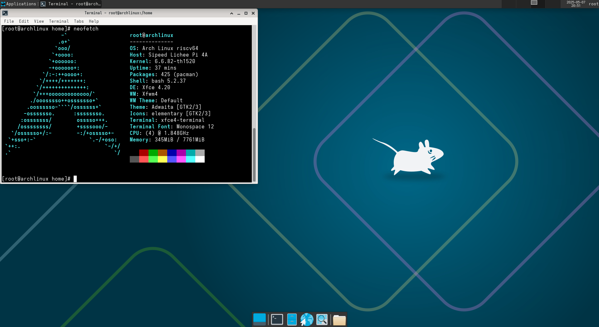

# Arch Linux LPi4A 测试报告

## 测试环境

### 系统信息

- 下载链接：https://mirror.iscas.ac.cn/archriscv/images/
- u-boot 与 boot 下载（采用 revyos 的）：https://mirror.iscas.ac.cn/revyos/extra/images/lpi4a/

### 硬件信息

- Lichee Pi 4A (8G RAM + 32G eMMC)
- USB 电源适配器一个
- USB-A to C 或 C to C 线缆一条
- USB to UART 调试器一个（如：CH340, CH341, FT2232 等）
- 杜邦线三根

## 安装步骤

### 创建 rootfs

由于 Arch Linux 提供的并非打包好的镜像，而是 rootfs，我们需要自行打包镜像。

- 创建块设备，并创建文件系统
```bash
sudo dd if=/dev/zero of=rootfs.ext4 bs=1M count=6144 # 创建 6GB rootfs
sudo mkfs.ext4 rootfs.ext4
mkdir mnt
sudo mount ./rootfs.ext4 ./mnt
```

- 将 rootfs 解压到根目录中
```bash
sudo tar -I zstd -xvf archriscv-2024-09-22.tar.zst -C mnt/
```

- 获取该 fs 的 UUID
```bash
lsblk -o NAME,UUID
```

- 到 rootfs 中进行必要的更新，包安装与调整
```bash
sudo systemd-nspawn -D ./mnt --machine=archriscv

# 接下来是在 rootfs 中进行的
pacman -Syu
# 在此处安装你需要的包，如 vim 等。
echo "UUID=<UUID> /  ext4  defaults  1  1 " >> /etc/fstab # 此处的 <UUID> 是之前获得的
passwd # 请设置你的 root 密码！
exit
```

- umount rootfs
```bash
sudo umount ./mnt
```

### 刷写 bootloader

解压安装套件。
刷入 u-boot 与 boot。

*根据你的硬件版本选择是否需要 8g u-boot*

```bash
zstd -d boot-lpi4a-20250420_084701.ext4.zst
sudo fastboot flash ram u-boot-with-spl-lpi4a-main_8gemmc.bin
sudo fastboot reboot
sudo fastboot flash uboot u-boot-with-spl-lpi4a-main_8gemmc.bin
sudo fastboot flash boot boot-lpi4a-20250420_084701.ext4
```

### 刷写镜像

将 root 分区刷入 eMMC 中。

```bash
sudo fastboot flash root rootfs.ext4
```

### 登录系统

通过串口登录系统。

默认用户名： `root`
默认密码：此处为你之前自行设置的密码或使用默认密码 `archriscv`。

### 安装图形环境

以 xfce 为例:

```
pacman -S xorg xfce4 ligthdm lightdm-gtk-greeter xfce4-goodies
systemctl enable --now ligthdm
```


## 预期结果

系统正常启动，能够通过板载串口登录。

## 实际结果

系统正常启动，成功通过板载串口登录。

### 启动信息



屏幕录像：

[](https://asciinema.org/a/7IKTyi434wlxfqY9sv0vfaZyt)

```log
[  OK  ] Reached target Socket Units.
         Starting D-Bus System Message Bus...
[  OK  ] Started D-Bus System Message Bus.
[  OK  ] Reached target Basic System.
         Starting User Login Management...
         Starting Permit User Sessions...
[  OK  ] Finished Permit User Sessions.
[  OK  ] Started Getty on tty1.
[  OK  ] Started Serial Getty on ttyS0.
[  OK  ] Reached target Login Prompts.
[  OK  ] Started User Login Management.
[  OK  ] Reached target Multi-User System.
[  OK  ] Reached target Graphical Interface.

Arch Linux 6.6.82-th1520 (ttyS0)

archlinux login: root
Password: [   16.537320] platform pwm-backlight@0: deferred probe pending

[root@archlinux ~]# ls
Desktop
[root@archlinux ~]# neofetch
                   -`                    root@archlinux
                  .o+`                   --------------
                 `ooo/                   OS: Arch Linux riscv64
                `+oooo:                  Host: Sipeed Lichee Pi 4A
               `+oooooo:                 Kernel: 6.6.82-th1520
               -+oooooo+:                Uptime: 25 secs
             `/:-:++oooo+:               Packages: 425 (pacman)
            `/++++/+++++++:              Shell: bash 5.2.37
           `/++++++++++++++:             Terminal: /dev/ttyS0
          `/+++ooooooooooooo/`           CPU: (4) @ 1.848GHz
         ./ooosssso++osssssso+`          Memory: 90MiB / 7761MiB
        .oossssso-````/ossssss+`
       -osssssso.      :ssssssso.
      :osssssss/        osssso+++.
     /ossssssss/        +ssssooo/-
   `/ossssso+/:-        -:/+osssso+-
  `+sso+:-`                 `.-/+oso:
 `++:.                           `-/+/
 .`                                 `/

[root@archlinux ~]#
```

## 测试判定标准

测试成功：实际结果与预期结果相符。

测试失败：实际结果与预期结果不符。

## 测试结论

测试成功。
