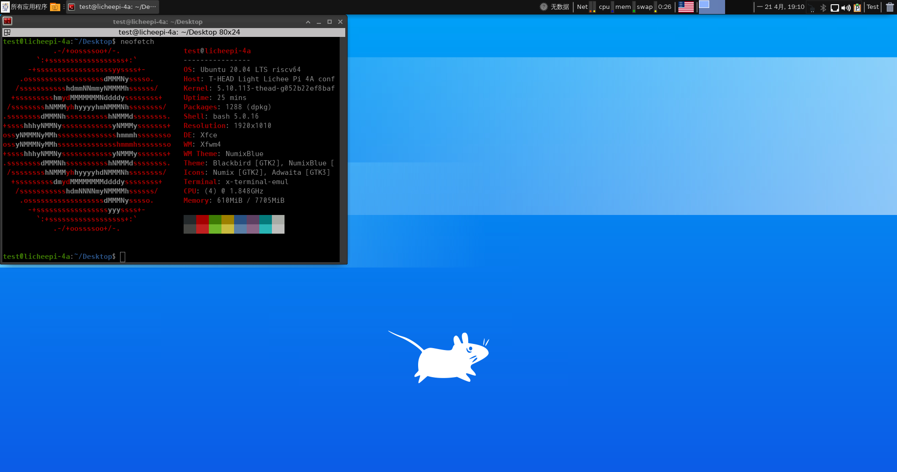

# Armbian LPi4A 测试报告

## 测试环境

### 系统信息

- 系统版本：23.09.15
- 下载链接：[Releases · chainsx/armbian-riscv-build](https://github.com/chainsx/armbian-riscv-build/releases)
  - u-boot: [Releases · chainsx/armbian-riscv-build](https://github.com/chainsx/armbian-riscv-build/releases)
- 参考安装文档：[LicheePi 4A Install Guide](https://github.com/chainsx/armbian-riscv-build/blob/main/doc/licheepi-4a-install-guide.md)

### 硬件信息

- Lichee Pi 4A (8G RAM + 32G eMMC)
- 电源适配器
- USB to UART 调试器一个

## 安装步骤


### 刷写 bootloader

进入 fastboot。

- 按动 BOOT 同时上电。
- （详见官方教程）
  使用 fastboot 按命令烧录 u-boot。

```bash
sudo ./fastboot flash ram ./path/to/your/lpi4a-8gb-u-boot-with-spl.bin
sudo ./fastboot reboot
sleep 1
sudo ./fastboot flash uboot ./path/to/your/lpi4a-8gb-u-boot-with-spl.bin
```

### 刷写镜像

使用 `unxz` 解压镜像。
使用 `dd` 将镜像写入 microSD 卡。

```bash
unxz /path/to/Armbian-riscv_23.09.15-riscv_Licheepi-4a_focal_current_5.10.113_xfce_desktop.img.xz
// 使用串口在 u-boot 倒计时读秒时使用 `Ctrl^C` 中断以进入 u-boot 命令行，然后输入以下指令：
Light LPI4A# ums 0 mmc 0
// 然后 EMMC 将会以 USB Mass Storage 设备映射在电脑上。
sudo dd if=/path/to/Armbian-riscv_23.09.15-riscv_Licheepi-4a_focal_current_5.10.113_xfce_desktop.img of=/path/to/device bs=1M status=progress
```

### 登录系统

通过串口登录系统。

初次启动会要求设置用户以及时区。

### 桌面环境

桌面环境会自动启动。

## 预期结果

系统正常启动，能够通过板载串口登录。

## 实际结果

系统正常启动，成功通过板载串口登录。

### 启动信息



屏幕录像：

[](https://asciinema.org/a/yoqY7oCXaEcRB8bGwc7GmQyEc)

```log
Now starting desktop environment...

root@licheepi-4a:~# neofetch
            .-/+oossssoo+/-.               root@licheepi-4a
        `:+ssssssssssssssssss+:`           ----------------
      -+ssssssssssssssssssyyssss+-         OS: Ubuntu 20.04 LTS riscv64
    .ossssssssssssssssssdMMMNysssso.       Host: T-HEAD Light Lichee Pi 4A configuration for 8GB DDR board
   /ssssssssssshdmmNNmmyNMMMMhssssss/      Kernel: 5.10.113-thead-g052b22ef8baf
  +ssssssssshmydMMMMMMMNddddyssssssss+     Uptime: 2 mins
 /sssssssshNMMMyhhyyyyhmNMMMNhssssssss/    Packages: 1283 (dpkg)
.ssssssssdMMMNhsssssssssshNMMMdssssssss.   Shell: bash 5.0.16
+sssshhhyNMMNyssssssssssssyNMMMysssssss+   Terminal: /dev/ttyS0
ossyNMMMNyMMhsssssssssssssshmmmhssssssso   CPU: (4) @ 1.848GHz
ossyNMMMNyMMhsssssssssssssshmmmhssssssso   Memory: 161MiB / 7705MiB
+sssshhhyNMMNyssssssssssssyNMMMysssssss+
.ssssssssdMMMNhsssssssssshNMMMdssssssss.
 /sssssssshNMMMyhhyyyyhdNMMMNhssssssss/
  +sssssssssdmydMMMMMMMMddddyssssssss+
   /ssssssssssshdmNNNNmyNMMMMhssssss/
    .ossssssssssssssssssdMMMNysssso.
      -+sssssssssssssssssyyyssss+-
        `:+ssssssssssssssssss+:`
            .-/+oossssoo+/-.


```

## 测试判定标准

测试成功：实际结果与预期结果相符。

测试失败：实际结果与预期结果不符。

## 测试结论

测试成功。
