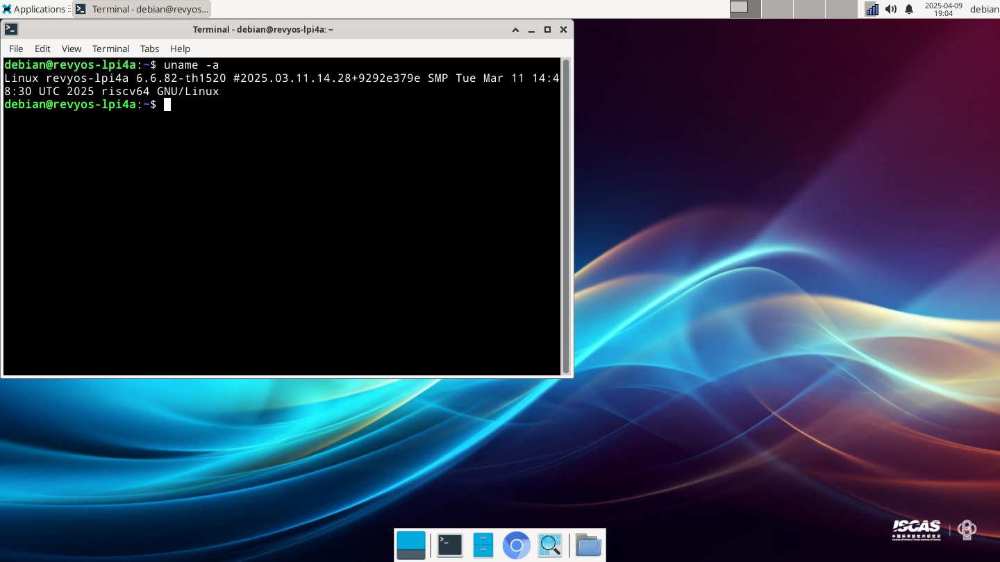

# RevyOS LPi4A 版本测试报告

## 测试环境

### 操作系统信息

- 系统版本：RevyOS 20250323
- 下载链接：[Nginx Directory](https://fast-mirror.isrc.ac.cn/revyos/extra/images/lpi4a/20250323/)
- 参考安装文档：https://revyos.github.io/docs/

### 硬件信息

- Lichee Pi 4A (8G RAM + 32G eMMC)
- USB-C 电源适配器 / DC 电源一个
- USB-UART 调试器一个

## 安装步骤

### 下载并解压镜像

下载镜像，使用 `zstd` 解压镜像：
```shell
wget https://fast-mirror.isrc.ac.cn/revyos/extra/images/lpi4a/20250323/u-boot-with-spl-lpi4a-main.bin
wget https://fast-mirror.isrc.ac.cn/revyos/extra/images/lpi4a/20250323/boot-lpi4a-20250323_154524.ext4.zst
wget https://fast-mirror.isrc.ac.cn/revyos/extra/images/lpi4a/20250323/root-lpi4a-20250323_154524.ext4.zst
zstd -d boot-lpi4a-20250323_154524.ext4.zst
zstd -d root-lpi4a-20250323_154524.ext4.zst
```

### 通过 `fastboot` 刷写到板载 eMMC

#### 使用 boot 按钮进入 fastboot 模式

按住 **BOOT** 按钮，然后连接 USB-C 线（另一端连接 PC）进入 USB 烧录模式。

使用以下命令刷写镜像。

```shell
sudo fastboot devices
sudo fastboot flash ram u-boot-with-spl-lpi4a-main.bin
sudo fastboot reboot
sudo fastboot flash uboot u-boot-with-spl-lpi4a-main.bin
sudo fastboot flash boot boot-lpi4a-20250323_154524.ext4.zst
sudo fastboot flash root root-lpi4a-20250323_154524.ext4.zst
```

### 登录系统

通过串口或图形界面登录系统。

默认用户名：`debian`
默认密码：`debian`

## 预期结果

系统正常启动，能够通过串口登录。

## 实际结果

系统正常启动，成功通过串口登录。

### 启动信息

屏幕录制（从刷写镜像到登录系统）：
[](https://asciinema.org/a/YuuaIBZ7nTgzrTlWs0ircfOeD)



```shell

   ____              _ ____  ____  _  __
  |  _ \ _   _ _   _(_) ___||  _ \| |/ /
  | |_) | | | | | | | \___ \| | | | ' /
  |  _ <| |_| | |_| | |___) | |_| | . \
  |_| \_\\__,_|\__, |_|____/|____/|_|\_\
               |___/
                   -- Presented by ISCAS

  Debian GNU/Linux trixie/sid (kernel 6.6.82-th1520)

Linux revyos-lpi4a 6.6.82-th1520 #2025.03.11.14.28+9292e379e SMP Tue Mar 11 14:48:30 UTC 2025 riscv64

The programs included with the Debian GNU/Linux system are free software;
the exact distribution terms for each program are described in the
individual files in /usr/share/doc/*/copyright.

Debian GNU/Linux comes with ABSOLUTELY NO WARRANTY, to the extent
permitted by applicable law.
Last login: Mon Sep  2 05:03:43 CST 2024 on ttyS0
```

## 测试判定标准

测试成功：实际结果与预期结果相符。

测试失败：实际结果与预期结果不符。

## 测试结论

测试成功。
