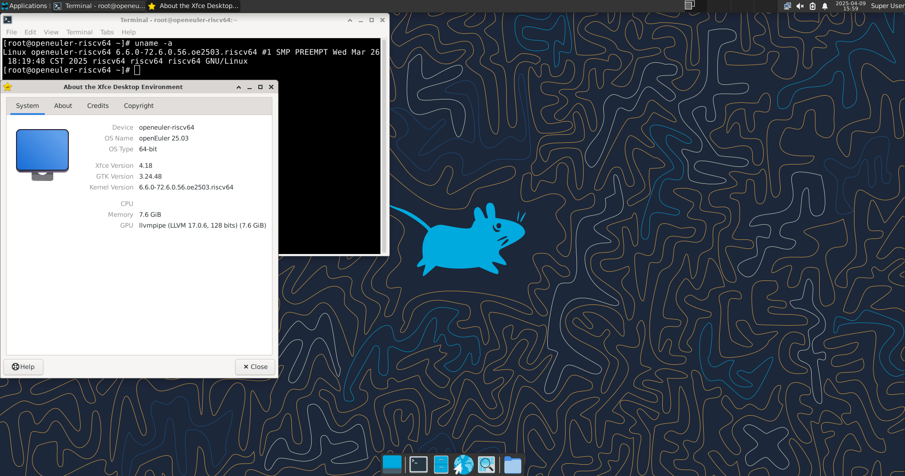

# openEuler RISC-V 25.03 LPi4A 版本测试报告

## 测试环境

### 操作系统信息

- 系统版本：openEuler 25.03
- 下载链接：https://repo.openeuler.org/openEuler-25.03/embedded_img/riscv64/lpi4a/
- 参考安装文档：https://docs.openeuler.org/zh/docs/24.03_LTS/docs/Installation/RISC-V-LicheePi4A.html

### 硬件信息

- Lichee Pi 4A (8G RAM + 32G eMMC)
- USB-C 电源适配器 / DC 电源一个
- USB-UART 调试器一个

## 安装步骤

### 下载并解压镜像

```shell
zstd -d openEuler-25.03-riscv64-lpi4a-base-boot.ext4.zst
zstd -d openEuler-25.03-riscv64-lpi4a-base-root.ext4.zst
```

### 使用 `fastboot` 刷写镜像到板载 eMMC

由于 LPi4A 默认的 USB VID/PID 通常不在默认 udev 规则内，在 Linux 下烧写时可能需要在 `fastboot` 前添加 `sudo`。

按住板上的 **BOOT** 按键不放，然后插入 USB-C 线缆上电（线缆另一头接 PC），即可进入 USB 烧录模式。

在 Windows 下使用设备管理器查看，会出现 `USB download gadget` 设备。

在 Linux 下，使用 `lsusb` 查看设备，会显示以下设备：`ID 2345:7654 T-HEAD USB download gadget`。

使用如下指令刷写镜像。

```shell
sudo fastboot devices
sudo fastboot flash ram u-boot-with-spl-lpi4a.bin
sudo fastboot reboot
# Wait a few seconds until the board reboots and reconnects to your PC

sudo fastboot flash uboot u-boot-with-spl-lpi4a.bin
sudo fastboot flash boot openEuler-25.03-riscv64-lpi4a-base-boot.ext4
sudo fastboot flash root openEuler-25.03-riscv64-lpi4a-base-root.ext4
```

### 登录系统

通过串口登录系统。

默认用户名：`openeuler` 或 `root`
默认密码：`openEuler12#$`

## 预期结果

系统正常启动，能够通过串口登录。

## 实际结果

系统正常启动，成功通过串口登录。

### 启动信息

```log
[  OK  ] Started Network Manager.
[  OK  ] Reached target Network.
         Starting Network Manager Wait Online...
         Starting GSSAPI Proxy Daemon...
         Starting /etc/rc.d/rc.local Compatibility...
         Starting OpenSSH server daemon...
         Starting Dynamic System Tuning Daemon...
[  OK  ] Started Locale Service.
[  OK  ] Started OpenSSH server daemon.
[  OK  ] Started GSSAPI Proxy Daemon.
[  OK  ] Started /etc/rc.d/rc.local Compatibility.
         Starting Authorization Manager...
[  OK  ] Reached target NFS client services.
[  OK  ] Reached target Preparation for Remote File Systems.
[  OK  ] Reached target Remote File Systems.
         Starting Permit User Sessions...
[  OK  ] Finished Permit User Sessions.
[  OK  ] Started Deferred execution scheduler.
[  OK  ] Started Command Scheduler.
         Starting Hold until boot process finishes up...
         Starting Terminate Plymouth Boot Screen...
[   28.403427][  T865] fbcon: Taking over console

openEuler 25.03
Kernel 6.6.0-72.6.0.56.oe2503.riscv64 on an riscv64

openeuler-riscv64 login: [   38.074226][  T293] soc_dovdd18_scan: disabling
[   38.078981][  T293] soc_dvdd12_scan: disabling
[   38.083649][  T293] soc_avdd28_scan_en: disabling

openeuler-riscv64 login: openeuler
Password:

Authorized users only. All activities may be monitored and reported.


Welcome to 6.6.0-72.6.0.56.oe2503.riscv64

System information as of time:  Thu Jan  1 08:01:06 AM CST 1970

System load:    1.27
Memory used:    2.3%
Swap used:      0%
Usage On:       9%
Users online:   1
To run a command as administrator(user "root"),use "sudo <command>".
[openeuler@openeuler-riscv64 ~]$ uname -a
Linux openeuler-riscv64 6.6.0-72.6.0.56.oe2503.riscv64 #1 SMP PREEMPT Wed Mar 26 18:19:48 CST 2025 riscv64 riscv64 riscv64 GNU/Linux
[root@openeuler-riscv64 ~]# cat /etc/os-release
NAME="openEuler"
VERSION="25.03"
ID="openEuler"
VERSION_ID="25.03"
PRETTY_NAME="openEuler 25.03"
ANSI_COLOR="0;31"
```

[](https://asciinema.org/a/Nn4LhNaZh1dkBpYnvgF6rD3La)


### 安装图形界面

以安装 xfce 为例

```
sudo dnf update
sudo dnf install dejavu-fonts liberation-fonts gnu-*-fonts google-*-fonts
sudo dnf install xorg-*
sudo dnf install xfwm4 xfdesktop xfce4-* xfce4-*-plugin network-manager-applet *fonts
sudo dnf install lightdm lightdm-gtk
echo 'user-session=xfce' >> /etc/lightdm/lightdm.conf.d/60-lightdm-gtk-greeter.conf
```

启用显示管理器，并配置默认图形界面登录方式

```
sudo systemctl start lightdm

sudo systemctl enable lightdm
sudo systemctl set-default graphical.target
```



## 测试判定标准

测试成功：实际结果与预期结果相符。

测试失败：实际结果与预期结果不符。

## 测试结论

测试成功。
