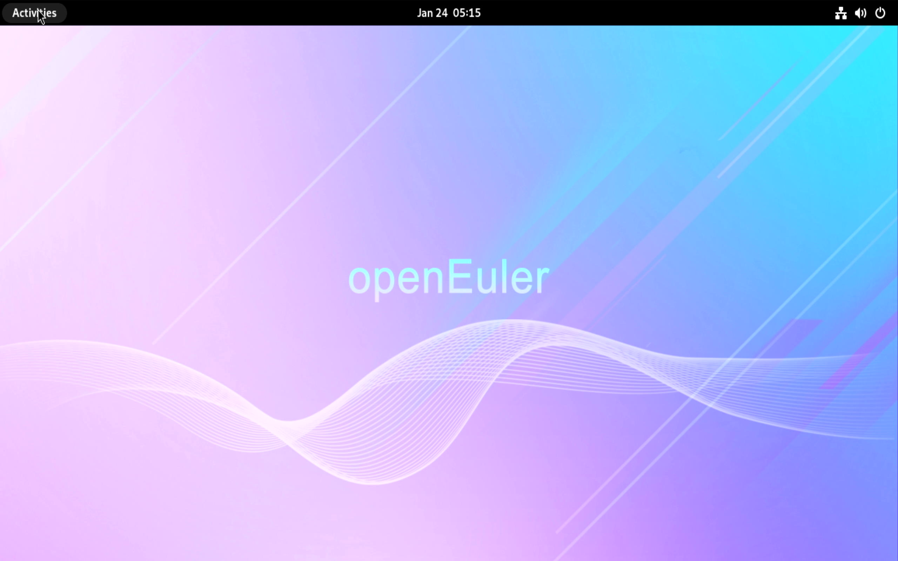

# openEuler 24.03 LTS SP1 LicheePi 4A 测试报告

与 16GB 版本基本一致。

## 测试环境

### 系统信息

- 系统版本：openEuler 24.03 LTS SP1
- 下载链接：https://mirrors.tuna.tsinghua.edu.cn/openeuler/openEuler-24.03-LTS-SP1/embedded_img/riscv64/lpi4a/
- 参考安装文档：https://docs.openeuler.org/zh/docs/24.03_LTS_SP1/docs/Installation/RISC-V-LicheePi4A.html
- 桌面环境: GNOME（需要自行安装）

### 硬件信息

- Lichee Pi 4A (8G RAM + 32GB eMMC)
- 电源适配器
- Type-C 数据线一个

## 安装步骤

### 获取镜像

下载安装镜像并解压。

```bash
wget https://mirrors.tuna.tsinghua.edu.cn/openeuler/openEuler-24.03-LTS-SP1/embedded_img/riscv64/lpi4a/u-boot-with-spl-lpi4a.bin
wget https://mirrors.tuna.tsinghua.edu.cn/openeuler/openEuler-24.03-LTS-SP1/embedded_img/riscv64/lpi4a/openEuler-24.03-LTS-SP1-riscv64-lpi4a-base-boot.ext4.zst
wget https://mirrors.tuna.tsinghua.edu.cn/openeuler/openEuler-24.03-LTS-SP1/embedded_img/riscv64/lpi4a/openEuler-24.03-LTS-SP1-riscv64-lpi4a-base-root.ext4.zst

zstd -d openEuler-24.03-LTS-SP1-riscv64-lpi4a-base-boot.ext4.zst
zstd -d openEuler-24.03-LTS-SP1-riscv64-lpi4a-base-root.ext4.zst
```

### 烧录镜像

使用 `fastboot` 烧录镜像。

```bash
sudo fastboot flash ram u-boot-with-spl-lpi4a.bin
sudo fastboot reboot
fastboot flash uboot u-boot-with-spl-lpi4a.bin
fastboot flash boot openEuler-24.03-LTS-SP1-riscv64-lpi4a-base-boot.ext4
fastboot flash root openEuler-24.03-LTS-SP1-riscv64-lpi4a-base-root.ext4
```

### 登录系统

默认用户名：`openeuler`
密码：`openEuler12#$`

## 预期结果

系统正常启动，能够通过串口登录。

若接入网络，可通过 SSH 登录。

## 实际结果

系统正常启动，成功通过串口或 SSH 登录。

### 启动信息

```log
openeuler-riscv64 login: openeuler
Password: 

Authorized users only. All activities may be monitored and reported.


Welcome to 6.6.0-72.0.0.76.oe2403sp1.riscv64

System information as of time:  Thu Jan  1 08:00:46 AM CST 1970

System load:    2.87
Memory used:    2.5%
Swap used:      0.0%
Usage On:       8%
Users online:   1
To run a command as administrator(user "root"),use "sudo <command>".
[openeuler@openeuler-riscv64 ~]$ cat /etc/os-release 
NAME="openEuler"
VERSION="24.03 (LTS-SP1)"
ID="openEuler"
VERSION_ID="24.03"
PRETTY_NAME="openEuler 24.03 (LTS-SP1)"
ANSI_COLOR="0;31"

[openeuler@openeuler-riscv64 ~]$ uname -a
Linux openeuler-riscv64 6.6.0-72.0.0.76.oe2403sp1.riscv64 #1 SMP PREEMPT Sun Dec 29 15:11:05 UTC 2024 riscv64 riscv64 riscv64 GNU/Linux
[openeuler@openeuler-riscv64 ~]$ lscpu 
Architecture:          riscv64
  Byte Order:          Little Endian
CPU(s):                4
  On-line CPU(s) list: 0-3
NUMA:                  
  NUMA node(s):        1
  NUMA node0 CPU(s):   0-3
```

### 安装UI界面

截止测试时，UI界面需要手动安装。此次测试中以 GNOME 为例，其余桌面环境安装可见[openEuler官方文档](https://docs.openeuler.org/zh/docs/24.03_LTS_SP1/docs/desktop/)。

```bash
sudo dnf update
sudo dnf install dejavu-fonts liberation-fonts gnu-*-fonts google-*-fonts  -y
sudo dnf install xorg-* -y
sudo dnf install adwaita-icon-theme atk atkmm at-spi2-atk at-spi2-core baobab \
 abattis-cantarell-fonts cheese clutter clutter-gst3 clutter-gtk cogl dconf \
 dconf-editor devhelp eog epiphany evince evolution-data-server file-roller folks \
 gcab gcr gdk-pixbuf2 gdm gedit geocode-glib gfbgraph gjs glib2 glibmm24 \
 glib-networking gmime30 gnome-autoar gnome-backgrounds gnome-bluetooth \
 gnome-boxes gnome-builder gnome-calculator gnome-calendar gnome-characters \
 gnome-clocks gnome-color-manager gnome-contacts gnome-control-center \
 gnome-desktop3 gnome-disk-utility gnome-font-viewer gnome-getting-started-docs \
 gnome-initial-setup gnome-keyring gnome-logs gnome-menus gnome-music \
 gnome-online-accounts gnome-online-miners gnome-photos gnome-remote-desktop \
 gnome-screenshot gnome-session gnome-settings-daemon gnome-shell \
 gnome-shell-extensions gnome-software gnome-system-monitor gnome-terminal \
 gnome-tour gnome-user-docs gnome-user-share gnome-video-effects \
 gnome-weather gobject-introspection gom grilo grilo-plugins \
 gsettings-desktop-schemas gsound gspell gssdp gtk3 gtk4 gtk-doc gtkmm30 \
 gtksourceview4 gtk-vnc2 gupnp gupnp-av gupnp-dlna gvfs json-glib libchamplain \
 libdazzle libgdata libgee libgnomekbd libgsf libgtop2 libgweather libgxps libhandy \
 libmediaart libnma libnotify libpeas librsvg2 libsecret libsigc++20 libsoup \
 mm-common mutter nautilus orca pango pangomm libphodav python3-pyatspi \
 python3-gobject rest rygel simple-scan sushi sysprof tepl totem totem-pl-parser \
 tracker3 tracker3-miners vala vte291 yelp yelp-tools \
 yelp-xsl zenity -y
```

启用显示管理器，并默认图形界面登录：

```bash
sudo systemctl enable gdm
sudo systemctl set-default graphical.target

```

安装后重启系统。

桌面环境


## 测试判定标准

测试成功：实际结果与预期结果相符。

测试失败：实际结果与预期结果不符。

## 测试结论

测试成功。