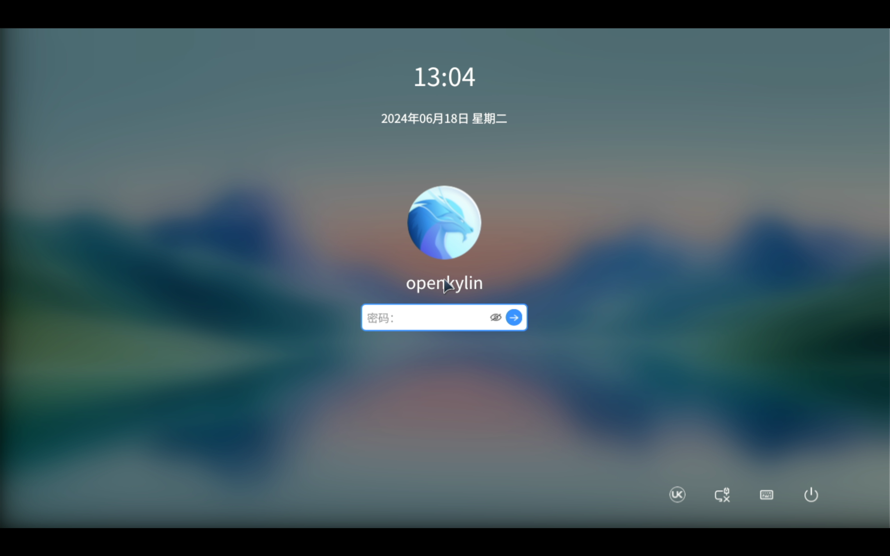

# openKylin v2.0 SP1 LicheePi 4A 测试报告

## 测试环境

### 系统信息

- 系统版本：openKylin v2.0 SP1
- 下载链接：https://www.openkylin.top/downloads/download-smp.php?id=86
- 参考安装文档：https://docs.openkylin.top/zh/01_%E5%AE%89%E8%A3%85%E5%8D%87%E7%BA%A7%E6%8C%87%E5%8D%97/%E5%9C%A8riscv%E4%B8%8A%E5%AE%89%E8%A3%85/%E5%9C%A8LicheePi4A%E4%B8%8A%E5%AE%89%E8%A3%85openKylin
- 桌面环境: UKUI（系统已预装）

### 硬件信息

- Lichee Pi 4A (8G RAM + 32GB eMMC)
- 电源适配器
- Type-C 数据线一个

## 安装步骤

### 安装镜像

解压安装套件并进入目录。

```bash
tar -xvf openKylin-Embedded-V2.0-SP1-licheepi4a-riscv64.tar.xz
cd openKylin-Embedded-V2.0-SP1-licheepi4a-riscv64/
```

目录中应当已经包含了 `fastboot` 应用和 `thead-image-linux.sh` 脚本文件。该脚本文件中包含了刷写镜像的命令。

将 LicheePi 4A 使用 Type-C 接口连接到电脑上，同时上电时按住 `boot` 键，进入 fastboot 模式。而后运行脚本文件。

```bash
sudo ./thead-image-linux.sh
```

### 登录系统

重启系统后可见安装界面。

默认用户名：`openkylin`
密码：`openkylin`

### 扩大分区

扩大 root 分区，使其占满整个 eMMC。

```bash
sudo resize2fs /dev/mmcblk0p4
```

## 预期结果

系统正常启动，能够通过板载串口登录。

## 实际结果

系统正常启动，成功通过板载串口登录。但测试过程中遇到多次kernel panic。

### 启动信息

```log
openKylin 2.0 SP1 openkylin ttyS0

openkylin login: openkylin
密码： 
Welcome to openKylin 2.0 SP1 (GNU/Linux 5.10.113-th1520 riscv64)

 * Support:        https://openkylin.top

The programs included with the openKylin system are free software;
the exact distribution terms for each program are described in the
individual files in /usr/share/doc/*/copyright.

openKylin comes with ABSOLUTELY NO WARRANTY, to the extent permitted by
applicable law.

load environment: QT_ACCESSIBILITY=1
load environment: PATH=/usr/local/sbin:/usr/local/bin:/usr/sbin:/usr/bin:/sbin:/bin:/usr/games:/usr/local/games
openkylin@openkylin:~$ uname -a
Linux openkylin 5.10.113-th1520 #2024.07.20.13.28+d8f77de53 SMP PREEMPT Sat Jul 20 13:29:42 UTC  riscv64 riscv64 riscv64 GNU/Linux
openkylin@openkylin:~$ cat /etc/os-release 
NAME="openKylin"
FULL_NAME="openKylin"
VERSION="2.0 SP1 (nile)"
VERSION_US="2.0 SP1 (nile)"
ID=openkylin
PRETTY_NAME="openKylin 2.0 SP1"
VERSION_ID="2.0"
HOME_URL="https://www.openkylin.top/"
VERSION_CODENAME=nile
PRODUCT_FEATURES=3
openkylin@openkylin:~$ lscpu 
架构：            riscv64
  字节序：        Little Endian
CPU:              4
  在线 CPU 列表： 0-3
openkylin@openkylin:~$ 
```

登录界面：

### 启动信息

屏幕录像（从刷写镜像到登录系统）：


[](https://asciinema.org/a/W0w4KbFDEjvuvPLGIyEYHtFdS)
```log
openKylin 2.0 SP1 openkylin ttyS0

openkylin login: openkylin
密码： 
Welcome to openKylin 2.0 SP1 (GNU/Linux 5.10.113-th1520 riscv64)

 * Support:        https://openkylin.top

The programs included with the openKylin system are free software;
the exact distribution terms for each program are described in the
individual files in /usr/share/doc/*/copyright.

openKylin comes with ABSOLUTELY NO WARRANTY, to the extent permitted by
applicable law.

load environment: QT_ACCESSIBILITY=1
load environment: PATH=/usr/local/sbin:/usr/local/bin:/usr/sbin:/usr/bin:/sbin:/bin:/usr/games:/usr/local/games
openkylin@openkylin:~$ uname -a
Linux openkylin 5.10.113-th1520 #2024.07.20.13.28+d8f77de53 SMP PREEMPT Sat Jul 20 13:29:42 UTC  riscv64 riscv64 riscv64 GNU/Linux
openkylin@openkylin:~$ cat /etc/os-release
NAME="openKylin"
FULL_NAME="openKylin"
VERSION="2.0 SP1 (nile)"
VERSION_US="2.0 SP1 (nile)"
ID=openkylin
PRETTY_NAME="openKylin 2.0 SP1"
VERSION_ID="2.0"
HOME_URL="https://www.openkylin.top/"
VERSION_CODENAME=nile
PRODUCT_FEATURES=3
openkylin@openkylin:~$ cat /proc/cpuinfo 
processor       : 0
hart            : 0
isa             : rv64imafdcvsu
mmu             : sv39
cpu-freq        : 1.848Ghz
cpu-icache      : 64KB
cpu-dcache      : 64KB
cpu-l2cache     : 1MB
cpu-tlb         : 1024 4-ways
cpu-cacheline   : 64Bytes
cpu-vector      : 0.7.1

processor       : 1
hart            : 1
isa             : rv64imafdcvsu
mmu             : sv39
cpu-freq        : 1.848Ghz
cpu-icache      : 64KB
cpu-dcache      : 64KB
cpu-l2cache     : 1MB
cpu-tlb         : 1024 4-ways
cpu-cacheline   : 64Bytes
cpu-vector      : 0.7.1

processor       : 2
hart            : 2
isa             : rv64imafdcvsu
mmu             : sv39
cpu-freq        : 1.848Ghz
cpu-icache      : 64KB
cpu-dcache      : 64KB
cpu-l2cache     : 1MB
cpu-tlb         : 1024 4-ways
cpu-cacheline   : 64Bytes
cpu-vector      : 0.7.1

processor       : 3
hart            : 3
isa             : rv64imafdcvsu
mmu             : sv39
cpu-freq        : 1.848Ghz
cpu-icache      : 64KB
cpu-dcache      : 64KB
cpu-l2cache     : 1MB
cpu-tlb         : 1024 4-ways
cpu-cacheline   : 64Bytes
cpu-vector      : 0.7.1

openkylin@openkylin:~$ 
 ```


## 测试判定标准

测试成功：实际结果与预期结果相符。

测试失败：实际结果与预期结果不符。

## 测试结论

测试成功。
