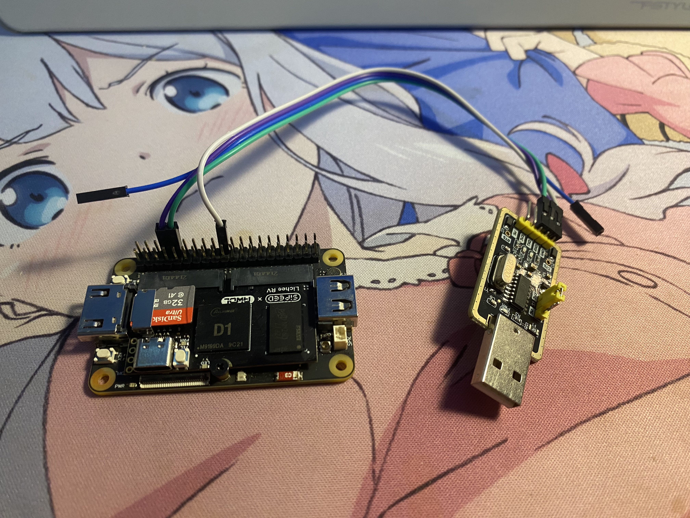
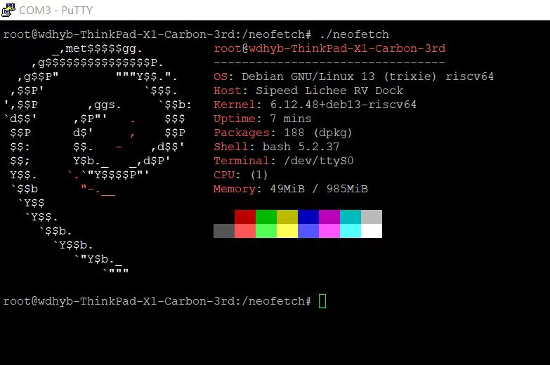

# Debian 13 D1 测试报告

## 测试环境

### 操作系统信息

- 系统版本：Debian 13 Trixie
- 来源：

通过

`sudo debootstrap --arch=riscv64 trixie rootfs http://deb.debian.org/debian`

创建一个 rootfs

烧录到内存卡

### 涉及的仓库

* https://github.com/riscv-software-src/opensbi.git
* https://github.com/smaeul/u-boot.git
* https://github.com/jamesgraves/licheerv-debian-linux/blob/main/licheerv_linux_defconfig

### 硬件信息

- Sipeed Lichee RV Dock 一块
- 电源适配器一个
- MicroSD 卡一张(推荐大于 8 GB)
- CH340 一个(tx 接 rx 需要接通 GND)

### 所需前置内容

软件包：

* riscv64-linux-gnu-gcc
* debootstrap
* 磁盘操作工具(任意)
* screen(可选)

## 测试判定标准

测试成功：实际结果与预期结果相符。

正常启动 Debian 并正常运行 shell

测试失败：实际结果与预期结果不符。

串口无输出 无法启动

## 预期结果

正常刷写与启动。

## 实际结果

正常刷写与启动。

## 测试结论

正常启动。

## 实现步骤

### OpenSBI

从 github 克隆一份源码

```
git clone https://github.com/riscv-software-src/opensbi.git
```

编译

```
make CROSS_COMPILE=riscv64-linux-gnu- PLATFORM=generic FW_PIC=y -j$(nproc)
```

注：生成文件路径为 build/platform/generic/firmware/fw_dynamic.bin

### U-Boot

从下面这个仓库克隆 d1-wip 分支里的源码

```
git clone https://github.com/smaeul/u-boot.git -b d1-wip
```

配置后进行编译

```
make lichee_rv_dock_defconfig

make CROSS_COMPILE=riscv64-linux-gnu- OPENSBI=../opensbi/build/platform/generic/firmware/fw_dynamic.bin -j$(nproc)
```

编译结束会生成一份 u-boot-sunxi-with-spl.bin 文件

之后要烧录到内存卡

### Linux Kernel

首先从此仓库的 d1/all 分支克隆一份内核的源码

从此仓库下载 config

```
git clone https://github.com/smaeul/linux.git -b d1/all

从这里搞一个 rv dock 的 config 文件：https://github.com/jamesgraves/licheerv-debian-linux/blob/main/licheerv_linux_defconfig
```

配置并编译

编译后生成的文件在 arch/riscv/boot/Image

```
make ARCH=riscv licheerv_linux_defconfig

make ARCH=riscv CROSS_COMPILE=riscv64-linux-gnu- KCFLAGS='-fno-asynchronous-unwind-tables -fno-unwind-tables' -j$(nproc)

```

### extlinux.conf

注：这份文件内包含启动参数

rootfs 的位置请按需修改

```
Label Debian
	LINUX /Image
	APPEND root=/dev/mmcblk0p2 rw rootwait console=ttyS0,115200 earlycon=sbi
```

### rootfs

这部分是烧录 rootfs 的步骤

开头也有提到

```
mkdir rootfs

sudo debootstrap --arch=riscv64 trixie rootfs http://deb.debian.org/debian
```

然后 chroot 进去设置个密码 装点需要的软件包

```
sudo chroot rootfs 

passwd 

apt update 

apt install ...

exit
```

### rootfs 镜像

关于 rootfs 镜像

首先建立一个 1 GB 的镜像

然后挂载并把 rootfs 复制到镜像中

```
dd if=/dev/zero of=rootfs.img bs=1G count=1

sudo mkfs.ext4 rootfs.img

mkdir rootfs_mount

sudo mount rootfs.img rootfs_mount

sudo cp -rfp rootfs/* rootfs_mount

sudo umount rootfs_mount

rm -r rootfs_mount

sudo e2fsck -f rootfs.img

sudo resize2fs -M rootfs.img
```

### 烧录

注：写在前面，需要先确定 sd 卡的设备路径 `sudo lsblk` 

1. 规划一下内存卡的分区 此处分了一个 boot 和 rootfs

```
sudo sgdisk /dev/sdb -o 

sudo sgdisk /dev/sdb --new=1:4096:69631 --change-name=1:boot 

sudo sgdisk /dev/sdb --new=2:69632: --change-name=2:rootfs 

sudo sgdisk /dev/sdb -p
```

2. 写入引导文件

```
sudo mkfs.vfat /dev/sdb1

sudo dd if=./u-boot/u-boot-sunxi-with-spl.bin of=/dev/sdb seek=256

sync
```

3. 拷贝内核和 extlinux.conf

```
sudo mount /dev/sdb1 /mnt

sudo mkdir /mnt/extlinux

sudo cp ./linux/arch/riscv/boot/Image /mnt/

sudo cp ./extlinux.conf /mnt/extlinux/

sync

sudo umount /mnt
```

4. 写入 rootfs

```
sudo dd if=./rootfs.img of=/dev/sdb2 bs=4096

sync
```

### 启动测试

1. SD 卡插进卡槽
2. 连接串口
3. 连接电源

注：此处使用了 screen 进行调试 成功启动的话就可以进入 shell 进行操作了




### 验证系统信息

1. 登录进入 root 用户

* `uname -a` 
* `cat /etc/os-release`
* `cat /proc/cpuinfo`

### neofetch

如下



## 基本信息

### 以下是收集的 log

```
root@wdhyb-ThinkPad-X1-Carbon-3rd:~# uname -a
Linux wdhyb-ThinkPad-X1-Carbon-3rd 6.1.0-rc3-443875-gb466df90d48f #1 PREEMPT Sat Oct  4 20:28:29 CST 2025 riscv64 GNU/Linux
root@wdhyb-ThinkPad-X1-Carbon-3rd:~# cat /etc/os-release
PRETTY_NAME="Debian GNU/Linux 13 (trixie)"
NAME="Debian GNU/Linux"
VERSION_ID="13"
VERSION="13 (trixie)"
VERSION_CODENAME=trixie
DEBIAN_VERSION_FULL=13.1
ID=debian
HOME_URL="https://www.debian.org/"
SUPPORT_URL="https://www.debian.org/support"
BUG_REPORT_URL="https://bugs.debian.org/"
root@wdhyb-ThinkPad-X1-Carbon-3rd:~# cat /proc/cpuinfo
processor       : 0
hart            : 0
isa             : rv64imafdc
mmu             : sv39
uarch           : thead,c906
mvendorid       : 0x5b7
marchid         : 0x0
mimpid          : 0x0
```


