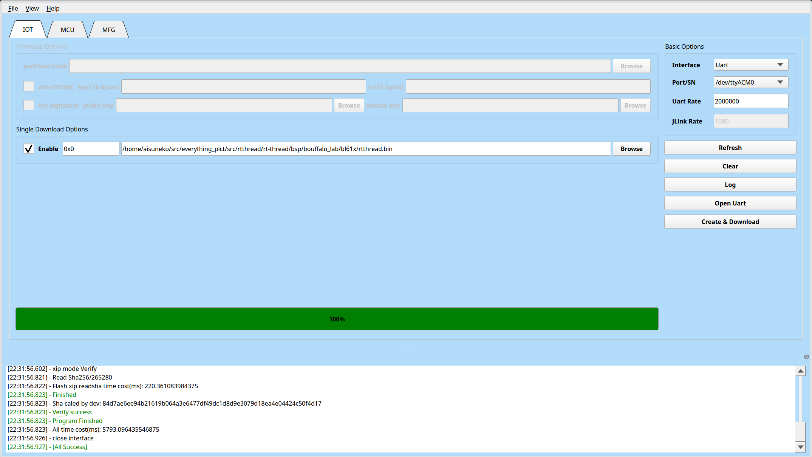

# RT-Thread M0P Dock Test Report

## Test Environment

### Operating System Information
- Source Code Link: https://github.com/RT-Thread/rt-thread
- Reference Installation Document: https://github.com/RT-Thread/rt-thread/blob/master/bsp/bouffalo_lab/README.md
- Flashing tool: https://openbouffalo.org/static-assets/bldevcube/BouffaloLabDevCube-v1.8.3.zip
- Toolchain: https://occ-oss-prod.oss-cn-hangzhou.aliyuncs.com/resource//1705395512373/Xuantie-900-gcc-elf-newlib-x86_64-V2.8.1-20240115.tar.gz

### Hardware Information

- Sipeed M0P Dock (BL618)
- A USB to UART debugger
- A C to C cable

## Installation Steps

The following steps are tested on Arch Linux, but should be applicable to all major Linux distributions.

### Preparing the System Environment

Install the required packages:

```shell
sudo apt install -y scons libncurses5-dev device-tree-compiler
# or on Arch Linux: sudo pacman -S scons dtc ncurses
```

Get the toolchain:

```shell
wget https://occ-oss-prod.oss-cn-hangzhou.aliyuncs.com/resource//1705395512373/Xuantie-900-gcc-elf-newlib-x86_64-V2.8.1-20240115.tar.gz

tar -xzvf Xuantie-900-gcc-elf-newlib-x86_64-V2.8.1-20240115.tar.gz
```

Update the following paths as needed:
```bash
export RTT_CC_PREFIX=riscv64-unknown-elf-
export RTT_EXEC_PATH=/opt/Xuantie-900-gcc-elf-newlib-x86_64-V2.8.1/bin
```

### Fetching the Source Code and Compiling the Firmware

```shell
git clone --depth=1 https://github.com/RT-Thread/rt-thread
cd rt-thread/bsp/bouffalo_lab/bl61x
scons --menuconfig
source ~/.env/env.sh
pkgs --update
scons -j$(nproc) --verbose
```

Please select `M0P Module` under the `Choose Module` option in menuconfig.

The generated firmware file is at `./rtthread.bin`.

### Flash firmware

Press and hold the BOOT button and power it on to enter flashing mode.

Download the flashing tool and use the appropriate version for your system to flash the firmware. Make sure your BLDevCube binary is of version 1.8.3.

Enter the IOT tab and set the parameters as shown below:

Enable "Single Download", set address to `0x0` and choose `rtthread.bin` from the above archive.

Choose your UART port correspondingly and set the "Uart Rate" to 2000000. Click "Create & Download" and wait for it to complete.




### Logging into the System

Connect Pin 21, 22 to the RX, TX ports of your UART debugger, respectively.

## Expected Results

The system should boot normally and allow login through the serial port.

## Actual Results

The system booted successfully, and login through the serial port was successful.

### Boot Log

```log

 \ | /
- RT -     Thread Operating System
 / | \     5.2.1 build Jun 20 2025 22:31:12
 2006 - 2024 Copyright by RT-Thread team
Hello, RISC-V!
msh />ps
thread   pri  status      sp     stack size max used left tick   error  tcb addr
-------- ---  ------- ---------- ----------  ------  ---------- ------- ----------
tshell    20  running 0x00000250 0x00001000    25%   0x00000007 OK      0x62fe4160
mmcsd_de  22  suspend 0x00000220 0x00000800    26%   0x00000013 EINTRPT 0x62fe113c
tidle0    31  ready   0x00000130 0x00000800    22%   0x00000004 OK      0x62fe1b18
timer      4  suspend 0x00000210 0x00000800    25%   0x00000006 EINTRPT 0x62fe2600
msh />

```

## Test Criteria

Successful: The actual result matches the expected result.

Failed: The actual result does not match the expected result.

## Test Conclusion

Test successful.
