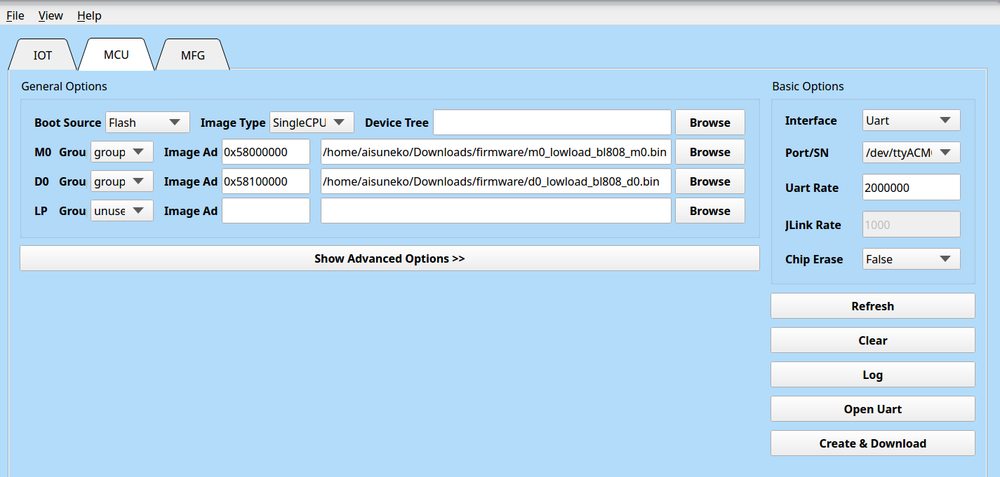
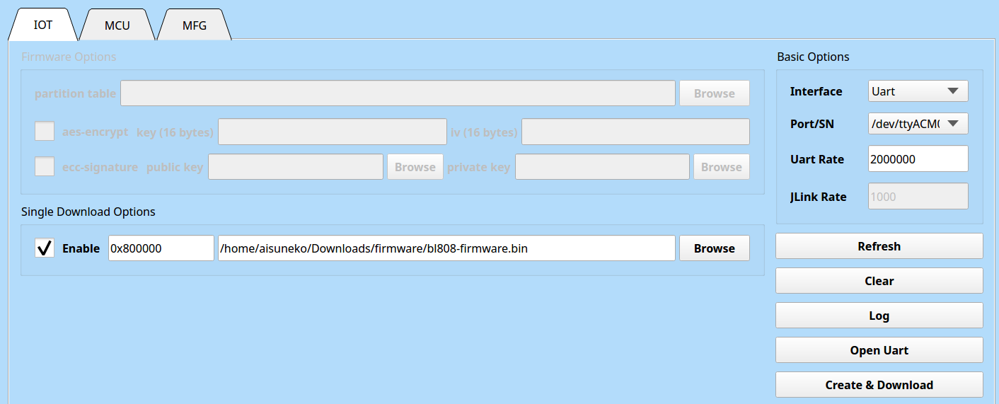

# postmarketOS Sipeed M1s Dock 测试报告

## 测试环境

### 操作系统信息

- 下载链接：https://github.com/openbouffalo/buildroot_bouffalo/releases/download/v1.0.1/bl808-linux-pine64_ox64_full_defconfig.tar.gz
  - SDK：https://github.com/bouffalolab/bl_mcu_sdk
  - 烧录工具：https://openbouffalo.org/static-assets/bldevcube/BouffaloLabDevCube-v1.8.3.zip
  - pmbootstrap: https://wiki.postmarketos.org/wiki/Pmbootstrap
- 参考安装文档：https://wiki.postmarketos.org/wiki/Sipeed_M1s_DOCK_(sipeed-m1sdock)

### 硬件信息

- Sipeed M1s Dock
- Type-C 线一根

## 安装步骤

### 获取镜像

下载并解压预编译镜像和固件：
```bash
wget https://github.com/openbouffalo/buildroot_bouffalo/releases/download/v1.0.1/bl808-linux-pine64_ox64_full_defconfig.tar.gz
tar -xvf bl808-linux-pine64_ox64_full_defconfig.tar.gz
cd bl808-linux-pine64_ox64_full_defconfig/firmware
```

### 串口方式刷写程序

按住 BOOT 按钮的同时通过 Type-C UART 接口上电。

下载烧录工具后使用对应系统的工具烧录。请确保所使用的 BLDevCube 版本为 1.8.3 **或更早**。

进入 MCU 页面，按如下所示设置参数：

M0: Group: group0, Image Addr: `0x58000000`, 选择 `m0_lowload_bl808_m0.bin`

M0: Group: group0, Image Addr: `0x58100000`, 选择 `d0_lowload_bl808_d0.bin`

选择两个写有 "(PROG)" 后缀的 UART 接口中设备号**较大的**，波特率 2000000。点击 "Create & Download" 进行刷写。



然后进入 IOT 页面，按如下所示设置参数：

选中 "Single Download", 地址 `0x800000`， 选择 `bl808-firmware.bin`。点击 "Create & Download" 进行刷写。



### 通过 `pmbootstrap` 安装系统至 SD 卡

安装 `pmbootstrap` ，如在 Arch Linux 下：
```bash
pacman -S pmbootstrap
```

使用 `pmbootstrap` 安装和刷写镜像：
```bash
pmbootstrap init
pmbootstrap install --sdcard=/dev/sdX
pmbootstrap shutdown
```
安装过程中同时会进行系统配置，请选择 target vendor 为 `sipeed`, target board 为 `m1sdock`。

### 启动系统

插入 SD 卡，通过 Type-C UART 接口上电。

## 预期结果

系统正常启动，能够看到串口输出。

## 实际结果

U-Boot 无法识别 SD 卡，无法启动系统。

### 启动信息

```log
[I][]
[I][]   ____                   ____               __  __      _
[I][]  / __ \                 |  _ \             / _|/ _|    | |
[I][] | |  | |_ __   ___ _ __ | |_) | ___  _   _| |_| |_ __ _| | ___
[I][] | |  | | '_ \ / _ \ '_ \|  _ < / _ \| | | |  _|  _/ _` | |/ _ \
[I][] | |__| | |_) |  __/ | | | |_) | (_) | |_| | | | || (_| | | (_) |
[I][]  \____/| .__/ \___|_| |_|____/ \___/ \__,_|_| |_| \__,_|_|\___/
[I][]        | |
[I][]        |_|
[I][]
[I][] Powered by BouffaloLab
[I][] Build:11:52:04,Mar  6 2023
[I][] Copyright (c) 2023 OpenBouffalo team
[I][] Copyright (c) 2022 Bouffalolab team
[I][] dynamic memory init success,heap s[I][LowLoad] D0 start...
[I][LowLoad] low_load start...
[I][LowLoad] Header at 0x5d5ff000
[I][LowLoad] Section dtb(1) - Start 0x5d5ff100, Size 14314
[I][LowLoad] Copying DTB to 0x51ff8000...0x51ffb7ea
[I][LowLoad] Done!
[I][LowLoad] Section OpenSBI(2) - Start 0x5d60f100, Size 109864
[I][LowLoad] Copying OpenSBI to 0x3ef80000...0x3ef9ad28
[I][LowLoad] Done!
[I][LowLoad] Section Kernel(3) - Start 0x5d62f100, Size 315597
[I][LowLoad] Uncompressing Kernel to 0x50000000...
[I][LowLoad] Done!
[I][LowLoad] CRC: 00000000
[I][LowLoad] load time: 61310 us
[I][LowLoad] Setting PMP
[I][LowLoad] Booting OpenSBI at 0x000000003ef80000 with DTB at 0x51ff8000

OpenSBI v1.2
   ____                    _____ ____ _____
  / __ \                  / ____|  _ \_   _|
 | |  | |_ __   ___ _ __ | (___ | |_) || |
 | |  | | '_ \ / _ \ '_ \ \___ \|  _ < | |
 | |__| | |_) |  __/ | | |____) | |_) || |_
  \____/| .__/ \___|_| |_|_____/|____/_____|
        | |
        |_|

Platform Name             : Pine64 Ox64 (D0)
Platform Features         : medeleg
Platform HART Count       : 1
Platform IPI Device       : aclint-mswi
Platform Timer Device     : aclint-mtimer @ 1000000Hz
Platform Console Device   : bflb_uart
Platform HSM Device       : ---
Platform PMU Device       : ---
Platform Reboot Device    : ---
Platform Shutdown Device  : ---
Firmware Base             : 0x3ef80000
Firmware Size             : 200 KB
Runtime SBI Version       : 1.0

Domain0 Name              : root
Domain0 Boot HART         : 0
Domain0 HARTs             : 0*
Domain0 Region00          : 0x00000000e4008000-0x00000000e400bfff (I)
Domain0 Region01          : 0x00000000e4000000-0x00000000e4007fff (I)
Domain0 Region02          : 0x000000003ef80000-0x000000003efbffff ()
Domain0 Region03          : 0x0000000000000000-0xffffffffffffffff (R,W,X)
Domain0 Next Address      : 0x0000000050000000
Domain0 Next Arg1         : 0x0000000051ff8000
Domain0 Next Mode         : S-mode
Domain0 SysReset          : yes

Boot HART ID              : 0
Boot HART Domain          : root
Boot HART Priv Version    : v1.11
Boot HART Base ISA        : rv64imafdcvx
Boot HART ISA Extensions  : time
Boot HART PMP Count       : 8
Boot HART PMP Granularity : 4096
Boot HART PMP Address Bits: 38
Boot HART MHPM Count      : 8
Boot HART MIDELEG         : 0x0000000000000222
Boot HART MEDELEG         : 0x000000000000b109


U-Boot 2023.04-rc2 (Mar 06 2023 - 11:48:40 +0000)

DRAM:  64 MiB
Core:  36 devices, 17 uclasses, devicetree: board
MMC:   mmc@20060000: 0
Loading Environment from FAT... Card did not respond to voltage select! : -110
** Bad device specification mmc 0 **
Loading Environment from nowhere... OK
In:    serial@30002000
Out:   serial@30002000
Err:   serial@30002000
Net:
Warning: emac@20070000 (eth0) using random MAC address - da:20:0d:12:b7:5e
eth0: emac@20070000
Hit any key to stop autoboot:  0
Card did not respond to voltage select! : -110
Card did not respond to voltage select! : -110
Card did not respond to voltage select! : -110
BOOTP broadcast 1
BOOTP broadcast 2


```

## 测试判定标准

测试成功：实际结果与预期结果相符。

测试失败：实际结果与预期结果不符。

## 测试结论

测试成功。