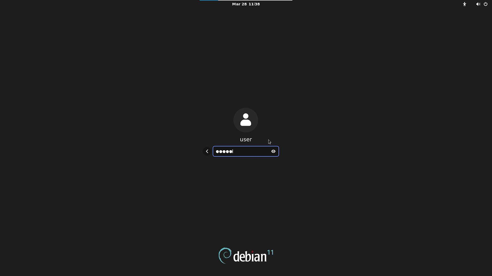

# Debian Milk-V Mars Test Report

## Test Environment

### Operating System Information

- System Version: Debian 12 (bookworm/sid, Milk-V official custom version)
- Download Link: <https://github.com/milkv-mars/mars-buildroot-sdk/releases/> (Official Debian image is provided by Milk-V)
- Reference Installation Document: <https://milkv.io/zh/docs/mars/getting-started/boot>

### Hardware Information

- Milk-V Mars (8GB RAM)
- A USB power adapter and A USB-A to C or C to C cable
- A microSD card
- A USB to UART debugger (e.g., CH340, CH341, FT2232, etc.)
- A HDMI cable, A USB Mouse and A USB Keyboard

## Installation Steps

### Flashing the Image

- Use `unzip` to decompress the image,  and then use `dd` command or `balenaEtcher` software to flash the image to the microSD card. (Assuming `/dev/sdc` is the microSD card device)

  ```bash
  unzip mars_debian-desktop_sdk-v3.6.1_sdcard_v1.0.6.img.zip

  sudo dd if=mars_debian-desktop_sdk-v3.6.1_sdcard_v1.0.6.img of=/dev/sdX bs=1M status=progress

  sync
  ```

### Logging into the System

Logging into the system via the serial port.

Default username: `user`

Default password: `milkv`

## Expected Results

The system should boot up normally and allow login via the serial port. After connect HDMI to the display screen can normally display the login image, and supports USB mouse and USB keyboard.

## Actual Results

The system starts normally and the output is successfully viewed through the serial port. After connect HDMI to the display screen can normally display the login image, and supports USB mouse and USB keyboard.

### Boot Information

```log
Debian GNU/Linux bookworm/sid milkv hvc0

milkv login: Debian GNU/Linux bookworm/sid milkv ttyS0

milkv login: user
Password:
Linux milkv 5.15.0 #1 SMP Mon Nov 13 18:56:24 CST 2023 riscv64

The programs included with the Debian GNU/Linux system are free software;
the exact distribution terms for each program are described in the
individual files in /usr/share/doc/*/copyright.

Debian GNU/Linux comes with ABSOLUTELY NO WARRANTY, to the extent
permitted by applicable law.
Last login: Fri Mar 28 11:01:22 UTC 2025 on ttyS0
user@milkv:~$ cat /etc/os-release
PRETTY_NAME="Debian GNU/Linux bookworm/sid"
NAME="Debian GNU/Linux"
VERSION_CODENAME=bookworm
ID=debian
HOME_URL="https://www.debian.org/"
SUPPORT_URL="https://www.debian.org/support"
BUG_REPORT_URL="https://bugs.debian.org/"
BUILD_ID=40
user@milkv:~$ cat /etc/debian_version
bookworm/sid
user@milkv:~$ cat /proc/cpuinfo
processor       : 0
hart            : 1
isa             : rv64imafdc
mmu             : sv39
isa-ext         :
uarch           : sifive,u74-mc

processor       : 1
hart            : 2
isa             : rv64imafdc
mmu             : sv39
isa-ext         :
uarch           : sifive,u74-mc

processor       : 2
hart            : 3
isa             : rv64imafdc
mmu             : sv39
isa-ext         :
uarch           : sifive,u74-mc

processor       : 3
hart            : 4
isa             : rv64imafdc
mmu             : sv39
isa-ext         :
uarch           : sifive,u74-mc

user@milkv:~$ uname -a
Linux milkv 5.15.0 #1 SMP Mon Nov 13 18:56:24 CST 2023 riscv64 GNU/Linux
user@milkv:~$
```

GUI for login:



> [!Note]
> Since the image is Milk-V's official custom system, the login screen here shows `Debian 11`, not `Debian 12`.

GUI for desktop:


## Test Criteria

Successful: The actual result matches the expected result.

Failed: The actual result does not match the expected result.

## Test Conclusion

Test successful.
